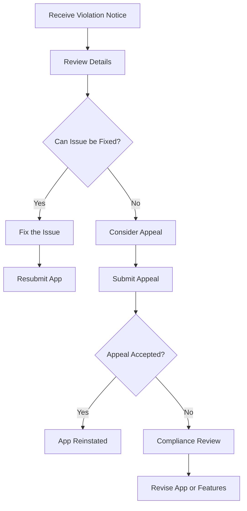

## 9.4.4 Handling Policy Violations

Publishing your Flutter app on the Google Play Store is an exciting milestone, but it also comes with the responsibility of adhering to Google's policies. Policy violations can lead to warnings, suspensions, or even the removal of your app from the store. This section will guide you through understanding, responding to, and preventing policy violations, ensuring your app remains compliant and available to users.

### Understanding Policy Violation Notices

When Google Play detects a policy violation in your app, they will send you a notice detailing the issue. Understanding the types of violations and their severity is crucial for an appropriate response.

#### Types of Violations

1. **Content Issues**: These include inappropriate content, such as adult material, hate speech, or violence, that violates Google's content guidelines.
2. **Metadata Problems**: Errors in your app's title, description, or promotional images that mislead users or violate branding policies.
3. **User Data Handling Breaches**: Mishandling user data, such as collecting sensitive information without consent, can lead to serious violations.

#### Severity Levels

- **Warnings**: Indicate minor issues that need correction but do not immediately affect your app's availability.
- **Suspensions**: Temporarily remove your app from the store until the issue is resolved.
- **Terminations**: Permanent removal of your app, often due to severe or repeated violations.

### Immediate Actions

Upon receiving a policy violation notice, swift and informed action is essential.

#### Reviewing the Notice

Carefully read the communication from Google to understand the specific violation. The notice will typically include:

- The nature of the violation.
- The section of the policy that was breached.
- Steps you need to take to rectify the issue.

#### Assessing the Impact

Determine the immediate impact on your app:

- **Is the app still available on the store?**
- **Is there a deadline for compliance?**
- **What are the potential consequences if the issue is not addressed?**

### Responding to Violations

Once you understand the violation, it's time to take corrective action.

#### Correcting the Issue

1. **Identify and Fix the Problem**: Analyze the issue and implement the necessary changes to comply with Google's policies.
2. **Update the App**: Ensure your app is updated to reflect these changes. This may involve modifying code, updating content, or changing metadata.

#### Submitting an Update

After making the necessary corrections, upload the updated app through the Google Play Console. Ensure that all changes are thoroughly tested to prevent further violations.

#### Providing an Explanation (if required)

In some cases, Google may require an explanation of the actions taken. Use the appeal form or contact options provided in the notice to:

- Clearly explain the steps you have taken to address the issue.
- Provide evidence of compliance, such as screenshots or documentation.

### Preventing Future Violations

Proactively preventing policy violations is key to maintaining a successful app on Google Play.

#### Staying Informed

Regularly review Google's policy updates. Subscribe to developer newsletters or forums to stay informed about changes that may affect your app.

#### Implementing Compliance Checks

Integrate policy compliance into your development and QA processes:

- **Automated Checks**: Use tools and scripts to automatically check for compliance issues during development.
- **Manual Reviews**: Conduct regular manual reviews of your app's content, metadata, and data handling practices.

#### Educating the Team

Ensure all team members understand the importance of compliance and are familiar with Google's policies. Conduct training sessions and provide resources for ongoing education.

### Appealing Decisions

If you believe a violation notice was issued in error, or if you have rectified the issue and seek reinstatement, you may need to appeal the decision.

#### Understanding the Appeals Process

The appeals process allows you to contest a violation notice. Here's how to navigate it:

- **When to Appeal**: Consider appealing if you believe the notice was incorrect or if you have evidence of compliance.
- **How to Appeal**: Use the appeal form provided in the violation notice. Be concise and factual in your submission.

#### Providing Clear Information

When submitting an appeal:

- **Be Factual**: Provide clear, factual information about the issue and the steps taken to resolve it.
- **Include Evidence**: Attach evidence of compliance, such as updated app versions, screenshots, or logs.

#### Respectful Communication

Maintain professionalism in all interactions with Google. Respectful communication can facilitate a more favorable outcome.

### Visual Aids

To help visualize the process of handling a policy violation, refer to the following flowchart:

### Writing Tips

- **Encourage Proactivity**: Emphasize the importance of proactive compliance to prevent violations.
- **Cooperation with Google**: Remind readers that cooperation with Google is essential for a successful app presence.
- **Seek Legal Advice**: For complex compliance issues, consider seeking legal advice to ensure your app adheres to all applicable laws and regulations.

By understanding and effectively managing policy violations, you can ensure your Flutter app remains compliant and available to users on the Google Play Store. This proactive approach not only protects your app but also enhances its reputation and user trust.

## Quiz Time!



### What are the three main types of policy violations on Google Play?

- [x] Content issues, metadata problems, user data handling breaches
- [ ] Security issues, performance problems, user interface glitches
- [ ] Advertising errors, payment issues, localization problems
- [ ] Network connectivity, battery usage, storage management

> **Explanation:** The main types of policy violations include content issues, metadata problems, and user data handling breaches, as these directly relate to Google's policies.

### What is the first step you should take upon receiving a policy violation notice?

- [x] Review the notice to understand the violation
- [ ] Immediately submit an appeal
- [ ] Contact Google support for clarification
- [ ] Remove the app from the store

> **Explanation:** The first step is to review the notice to understand the specific violation and the actions required to address it.

### Which of the following is a severity level for policy violations?

- [x] Warnings
- [ ] Notifications
- [ ] Alerts
- [ ] Reminders

> **Explanation:** Warnings are a severity level for policy violations, indicating minor issues that need correction.

### What should you do if you believe a violation notice was issued in error?

- [x] Submit an appeal with factual information and evidence
- [ ] Ignore the notice and continue as usual
- [ ] Remove the app from the store
- [ ] Contact a lawyer immediately

> **Explanation:** If you believe a notice was issued in error, you should submit an appeal with factual information and evidence to contest the decision.

### How can you prevent future policy violations?

- [x] Regularly review policy updates and implement compliance checks
- [ ] Only update your app when notified by Google
- [x] Educate your team about policy compliance
- [ ] Avoid making any changes to the app

> **Explanation:** Preventing future violations involves staying informed about policy updates, implementing compliance checks, and educating your team.

### What is the purpose of the Google Play Console in handling policy violations?

- [x] To submit updated apps and track compliance status
- [ ] To directly communicate with Google support
- [ ] To manage user reviews and feedback
- [ ] To analyze app performance metrics

> **Explanation:** The Google Play Console is used to submit updated apps and track compliance status, ensuring that violations are addressed.

### What should be included in an appeal submission?

- [x] Factual information and evidence of compliance
- [ ] Personal opinions and assumptions
- [x] Screenshots or documentation supporting your case
- [ ] A request for immediate app reinstatement

> **Explanation:** An appeal should include factual information, evidence of compliance, and supporting documentation to strengthen your case.

### Why is respectful communication important when dealing with Google?

- [x] It facilitates a more favorable outcome
- [ ] It guarantees immediate resolution
- [ ] It allows for informal negotiations
- [ ] It reduces the need for compliance

> **Explanation:** Respectful communication is important as it facilitates a more favorable outcome and maintains professionalism.

### What is a common pitfall when addressing policy violations?

- [x] Failing to thoroughly review the violation notice
- [ ] Immediately removing the app from the store
- [ ] Submitting multiple appeals simultaneously
- [ ] Ignoring the violation notice

> **Explanation:** A common pitfall is failing to thoroughly review the violation notice, which can lead to misunderstandings and inadequate responses.

### True or False: Legal advice is unnecessary for handling complex compliance issues.

- [ ] True
- [x] False

> **Explanation:** False. Legal advice can be crucial for handling complex compliance issues to ensure adherence to laws and regulations.


