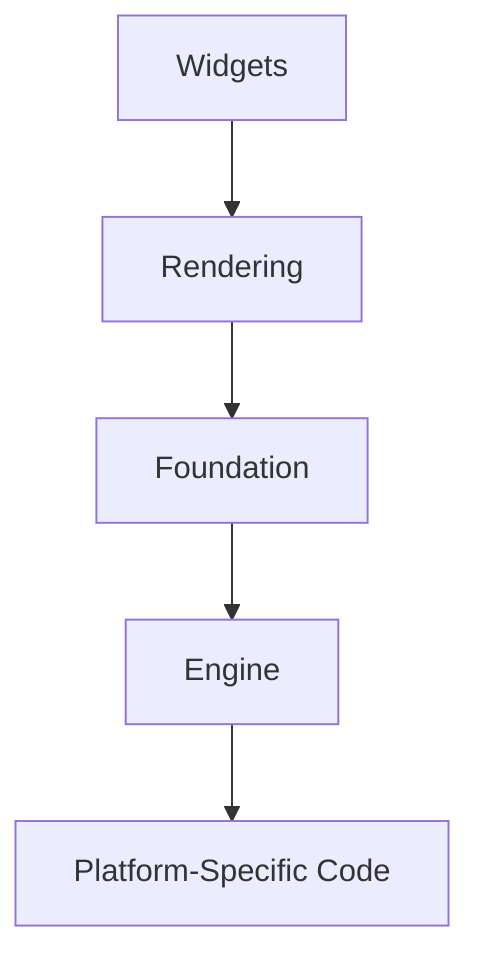

## 1.1.1 What is Flutter

### Introduction to Flutter

Flutter is an open-source UI software development kit (SDK) created by Google. It empowers developers to build natively compiled applications for mobile, web, and desktop from a single codebase. This capability is a game-changer in the realm of cross-platform development, significantly reducing the time-to-market for applications and simplifying the development process.

Imagine being able to write your application once and have it run seamlessly on both iOS and Android devices, as well as on web browsers and desktop environments. This is the promise of Flutter, which has rapidly gained popularity among developers for its efficiency and flexibility.

### Widget-Based Architecture

At the heart of Flutter is its widget-based architecture. In Flutter, everything is a widget. This includes not only UI controls like buttons and text fields but also layout models and even the app itself. Widgets are the building blocks of a Flutter application, and they are used to construct the entire user interface.

#### Visual Example of Widgets

Consider the following simple widget tree for a basic Flutter app:

```dart
import 'package:flutter/material.dart';

void main() => runApp(MyApp());

class MyApp extends StatelessWidget {
  @override
  Widget build(BuildContext context) {
    return MaterialApp(
      home: Scaffold(
        appBar: AppBar(
          title: Text('Hello, Flutter!'),
        ),
        body: Center(
          child: Text('Welcome to Flutter'),
        ),
      ),
    );
  }
}
```

In this example, `MyApp` is a widget that builds a `MaterialApp`, which in turn contains a `Scaffold` widget. The `Scaffold` provides a structure for the app, including an `AppBar` and a `Center` widget that centers its child, a `Text` widget.

#### Widget Immutability and Rendering

Widgets in Flutter are immutable, meaning once they are created, they cannot change. Instead, when the UI needs to be updated, Flutter creates a new widget tree. This might sound inefficient, but Flutter's rendering engine is optimized to handle these changes efficiently, ensuring smooth performance.

### High Performance and Rendering Engine

Flutter achieves high performance through its Skia rendering engine. Skia is a powerful 2D graphics library that allows Flutter to render animations and transitions smoothly at 60 frames per second (fps) and above. This is crucial for creating responsive and visually appealing applications.

Moreover, Flutter compiles directly to native ARM code, which enhances app startup times and overall performance. This native compilation is one of the reasons why Flutter apps feel fast and responsive.

### Hot Reload Feature

One of Flutter's standout features is Hot Reload. This feature allows developers to see the results of code changes instantly without restarting the app. It significantly speeds up the development process by enabling quick iterations and experimentation.

#### Illustration of Hot Reload

Imagine you are tweaking the color scheme of your app. With Hot Reload, you can change the color in your code and immediately see the effect in the running app. This instant feedback loop is invaluable for developers, allowing for rapid prototyping and debugging.

### Use of Dart Programming Language

Flutter uses the Dart programming language, which is also developed by Google. Dart is designed for building high-performance applications and offers features like ahead-of-time (AOT) compilation and just-in-time (JIT) compilation. These features contribute to the fast startup times and smooth performance of Flutter apps.

Dart's syntax is easy to learn, especially for developers familiar with JavaScript or Java, making it an accessible choice for building Flutter applications.

### Visual Aids and Diagrams

To better understand Flutter's architecture, consider the following Mermaid.js diagram that outlines the framework layers:



- **Widgets**: The building blocks of the UI, as discussed earlier.
- **Rendering**: Handles the rendering of widgets onto the screen.
- **Foundation**: Provides basic building blocks for the app, such as animation and gestures.
- **Engine**: The core of Flutter, including the Skia rendering engine and Dart runtime.
- **Platform-Specific Code**: Interfaces with the underlying platform (iOS, Android, web, desktop).

### Engaging the Reader

As you explore Flutter, consider how its features could benefit your own projects. Imagine building an app that runs smoothly on both iOS and Android with a single codebase. How would that impact your development process? What new possibilities could it unlock for your team or business?

Flutter's ability to streamline cross-platform development, combined with its high performance and ease of use, makes it an attractive choice for developers looking to create beautiful, responsive applications.

### Conclusion

Flutter is more than just a tool; it's a comprehensive framework that empowers developers to build high-quality applications efficiently. Its widget-based architecture, high-performance rendering engine, and innovative features like Hot Reload make it a powerful choice for cross-platform development.

As you continue your journey with Flutter, you'll discover its potential to transform the way you approach app development, enabling you to bring your ideas to life with speed and precision.

## Quiz Time!



### What is Flutter primarily used for?

- [x] Building natively compiled applications for mobile, web, and desktop from a single codebase
- [ ] Creating server-side applications
- [ ] Developing operating systems
- [ ] Designing databases

> **Explanation:** Flutter is an open-source UI toolkit for building natively compiled applications across mobile, web, and desktop from a single codebase.

### What is the core architectural concept of Flutter?

- [x] Widget-based architecture
- [ ] Model-View-Controller (MVC)
- [ ] Event-driven programming
- [ ] Service-oriented architecture

> **Explanation:** Flutter uses a widget-based architecture where everything is a widget, including layout models and UI controls.

### Which rendering engine does Flutter use to achieve high performance?

- [x] Skia
- [ ] WebKit
- [ ] Blink
- [ ] Gecko

> **Explanation:** Flutter uses the Skia rendering engine to achieve high performance and smooth animations.

### What feature allows Flutter developers to see code changes instantly without restarting the app?

- [x] Hot Reload
- [ ] Cold Restart
- [ ] Live Update
- [ ] Quick Refresh

> **Explanation:** Hot Reload allows developers to see the results of code changes instantly without restarting the app.

### Which programming language is used with Flutter?

- [x] Dart
- [ ] JavaScript
- [ ] Python
- [ ] Swift

> **Explanation:** Flutter uses the Dart programming language, which is developed by Google.

### How does Flutter compile its applications for better performance?

- [x] Directly to native ARM code
- [ ] Into Java bytecode
- [ ] Into JavaScript
- [ ] Into Python bytecode

> **Explanation:** Flutter compiles directly to native ARM code, which improves app startup times and overall performance.

### What is the benefit of Flutter's widget immutability?

- [x] Efficient rendering of changes
- [ ] Easier debugging
- [ ] Faster network requests
- [ ] Simplified database management

> **Explanation:** Widgets in Flutter are immutable, and the framework efficiently renders changes, ensuring smooth performance.

### What does the Flutter framework layer "Engine" include?

- [x] Skia rendering engine and Dart runtime
- [ ] Database management tools
- [ ] Network communication protocols
- [ ] User authentication services

> **Explanation:** The "Engine" layer includes the Skia rendering engine and Dart runtime, which are core components of Flutter.

### True or False: Flutter can only be used for mobile app development.

- [ ] True
- [x] False

> **Explanation:** False. Flutter can be used to build applications for mobile, web, and desktop platforms.

### What is one of the key advantages of using Flutter for cross-platform development?

- [x] Reducing time-to-market by using a single codebase
- [ ] Increasing hardware requirements
- [ ] Limiting app functionality
- [ ] Complicating the development process

> **Explanation:** One of the key advantages of Flutter is reducing time-to-market by allowing developers to use a single codebase for multiple platforms.


