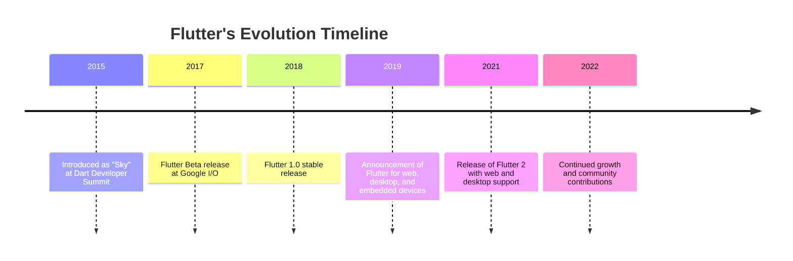

## 1.1.2 History of Flutter

Flutter, a revolutionary UI toolkit developed by Google, has transformed the landscape of cross-platform app development. Its journey from inception to becoming a preferred choice for developers worldwide is marked by significant milestones and innovations. This section delves into the chronological timeline of Flutter's development, its evolution, community adoption, and its impact on the industry.

### Chronological Timeline

#### 2015: The Birth of "Sky"

Flutter's journey began in 2015 when it was introduced as "Sky" at the Dart Developer Summit. The primary motivation behind its creation was to provide a high-performance, cross-platform framework that could render consistently at 120 frames per second. The initial version of Sky demonstrated the potential of running apps on Android with the same codebase.

#### 2017: Flutter Beta Release at Google I/O

In 2017, Flutter made its public debut at Google I/O as a beta release. This marked a significant step forward, as developers could now experiment with building native interfaces for both iOS and Android using a single codebase. The beta release included a rich set of pre-designed widgets, enabling developers to create visually appealing apps with ease.

#### December 2018: Flutter 1.0 Stable Release

The release of Flutter 1.0 in December 2018 was a pivotal moment. It signaled Flutter's readiness for production use, offering a stable platform for developers to build and deploy apps. This release was celebrated with a dedicated event, "Flutter Live," where Google showcased the framework's capabilities and announced partnerships with major companies.

#### 2019: Expansion to Web, Desktop, and Embedded Devices

In 2019, Google announced its ambitious plans to extend Flutter beyond mobile platforms. This included support for web, desktop, and embedded devices, positioning Flutter as a truly universal framework. This expansion was driven by the desire to provide a seamless development experience across all platforms, leveraging Flutter's rendering engine and Dart's flexibility.

#### March 2021: Flutter 2 and the Dawn of Multi-Platform Support

Flutter 2, released in March 2021, marked a new era for the framework. It introduced stable support for web and desktop applications, allowing developers to target six platforms from a single codebase: iOS, Android, web, Windows, macOS, and Linux. This release emphasized Flutter's commitment to providing a comprehensive solution for cross-platform development.

#### Continued Growth and Adoption

Since the release of Flutter 2, the framework has continued to evolve with regular updates, community contributions, and growing adoption by major companies. Flutter's ecosystem has expanded with a plethora of plugins, packages, and tools that enhance its capabilities and streamline the development process.

### Visual Timeline

To better understand Flutter's progression, let's visualize its history using a Mermaid.js diagram:

### Evolution and Motivation

The motivation behind Flutter's creation was rooted in the need for a fast, efficient, and cross-platform development tool. Traditional frameworks often faced challenges such as inconsistent performance across platforms, limited customization, and complex development processes. Flutter aimed to address these issues by offering:

- **High Performance**: Flutter's architecture is designed to provide smooth animations and transitions, achieving native performance levels.
- **Customizable Widgets**: With a rich set of widgets, Flutter allows developers to create highly customized UIs that adhere to platform-specific design guidelines.
- **Single Codebase**: By enabling developers to write once and deploy everywhere, Flutter significantly reduces development time and costs.

### Community and Industry Adoption

Flutter's adoption has been remarkable, with a vibrant community and widespread industry use. Some notable apps built with Flutter include:

- **Google Ads**: A robust app for managing ad campaigns, showcasing Flutter's capability to handle complex business logic.
- **Alibaba**: The e-commerce giant uses Flutter for its Xianyu app, highlighting Flutter's scalability and performance.
- **Reflectly**: A popular journaling app that leverages Flutter's rich UI capabilities to provide an engaging user experience.
- **Birch Finance**: A financial management app that benefits from Flutter's cross-platform support to reach a broader audience.

The Flutter community is active and supportive, with numerous conferences, meetups, and online resources available for developers. This collaborative environment fosters innovation and continuous improvement of the framework.

### Quotes and Anecdotes

Flutter has received praise from industry leaders and developers alike. Tim Sneath, Product Manager for Flutter, once stated, "Flutter is not just a framework; it's a revolution in how we build apps." This sentiment is echoed by many who have experienced the framework's transformative impact on app development.

Success stories abound, such as the case of Reflectly, which saw a significant increase in user engagement and retention after switching to Flutter. These anecdotes underscore Flutter's potential to enhance app quality and developer productivity.

### Setting the Context

In the modern app development landscape, Flutter stands out as a versatile and powerful tool. Its ability to deliver high-quality, cross-platform apps with a single codebase makes it an attractive choice for developers and businesses alike. As technology continues to evolve, staying updated with frameworks like Flutter is crucial for maintaining a competitive edge.

Flutter's history is a testament to its innovation and adaptability. By understanding its evolution, developers can appreciate the framework's strengths and leverage them to create exceptional applications.

## Quiz Time!



### When was Flutter first introduced as "Sky"?

- [x] 2015
- [ ] 2016
- [ ] 2017
- [ ] 2018

> **Explanation:** Flutter was introduced as "Sky" at the Dart Developer Summit in 2015.

### What was the significant feature of Flutter 2 released in March 2021?

- [x] Multi-platform support including web and desktop
- [ ] Introduction of Flutter for embedded devices
- [ ] First stable release of Flutter
- [ ] Support for only Android and iOS

> **Explanation:** Flutter 2 introduced stable support for web and desktop applications, allowing developers to target multiple platforms from a single codebase.

### Which company uses Flutter for its Xianyu app?

- [x] Alibaba
- [ ] Google
- [ ] Reflectly
- [ ] Birch Finance

> **Explanation:** Alibaba uses Flutter for its Xianyu app, showcasing Flutter's scalability and performance.

### What was the original name of Flutter?

- [x] Sky
- [ ] Cloud
- [ ] Dart UI
- [ ] Flutter UI

> **Explanation:** Flutter was originally introduced as "Sky" at the Dart Developer Summit in 2015.

### Which of the following is NOT a feature of Flutter?

- [ ] High performance
- [ ] Customizable widgets
- [x] Requires separate codebases for iOS and Android
- [ ] Single codebase for multiple platforms

> **Explanation:** Flutter allows developers to use a single codebase for multiple platforms, which is one of its key features.

### What event marked the public debut of Flutter as a beta release?

- [x] Google I/O 2017
- [ ] Dart Developer Summit 2015
- [ ] Flutter Live 2018
- [ ] Google I/O 2018

> **Explanation:** Flutter made its public debut as a beta release at Google I/O in 2017.

### Which app is NOT mentioned as being built with Flutter?

- [ ] Google Ads
- [ ] Reflectly
- [x] Instagram
- [ ] Birch Finance

> **Explanation:** Instagram is not mentioned as being built with Flutter in this section.

### What is a key motivation behind Flutter's creation?

- [x] To provide a fast, efficient, and cross-platform development tool
- [ ] To replace all existing mobile frameworks
- [ ] To focus solely on Android development
- [ ] To create a new programming language

> **Explanation:** Flutter was created to provide a fast, efficient, and cross-platform development tool, addressing limitations of previous frameworks.

### What is the significance of the Flutter Live event in December 2018?

- [x] It marked the release of Flutter 1.0 stable version
- [ ] It was the first introduction of Flutter
- [ ] It announced Flutter's support for web
- [ ] It was a conference for Dart developers

> **Explanation:** The Flutter Live event in December 2018 marked the release of Flutter 1.0, the stable version ready for production use.

### True or False: Flutter's community is inactive and lacks resources.

- [ ] True
- [x] False

> **Explanation:** Flutter's community is active and supportive, with numerous conferences, meetups, and online resources available for developers.


