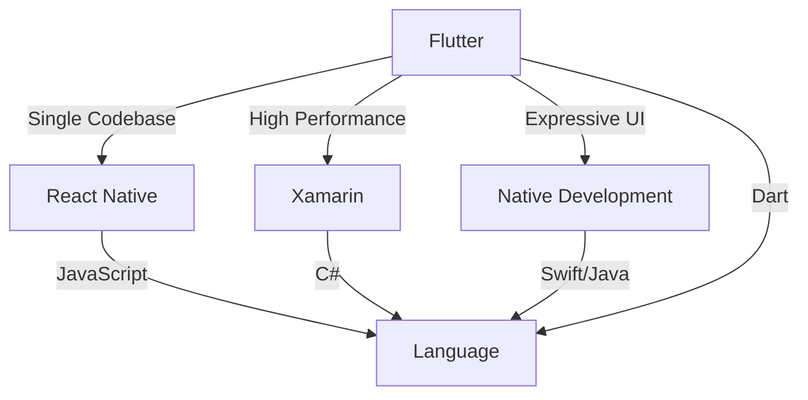

## 1.1.3 Why Choose Flutter

In the rapidly evolving world of mobile app development, choosing the right framework can significantly impact your project's success. Flutter, Google's open-source UI toolkit, has emerged as a leading choice for developers aiming to create high-quality, cross-platform applications. This section delves into the compelling reasons to choose Flutter, highlighting its key advantages, comparative strengths, real-world applications, and addressing common concerns.

### Key Advantages of Flutter

#### Single Codebase for Multiple Platforms

One of Flutter's most significant advantages is its ability to use a single codebase to deploy applications across multiple platforms, including iOS, Android, web, and desktop. This capability drastically reduces development time and costs, allowing developers to focus on creating features rather than managing multiple codebases.

- **Efficiency**: By writing code once, developers can deploy it on various platforms without the need for platform-specific adjustments. This not only speeds up the development process but also simplifies maintenance and updates.
- **Consistency**: A single codebase ensures that the app behaves consistently across all platforms, providing a uniform user experience.

#### High Performance

Flutter's high performance is attributed to its native compilation and the use of the Skia rendering engine. This combination allows Flutter apps to run smoothly and efficiently, delivering a native-like experience.

- **Native Compilation**: Flutter compiles to native ARM code, which means it can leverage the full power of the device's hardware, resulting in faster execution and reduced load times.
- **Skia Rendering Engine**: Skia is a powerful 2D graphics library that enables Flutter to render complex UIs at high speeds. This ensures smooth animations and transitions, enhancing the overall user experience.

#### Expressive and Customizable UI

Flutter offers a rich set of pre-designed widgets that can be customized to match any design specification. This flexibility allows developers to create visually appealing and highly interactive user interfaces.

- **Rich Widget Library**: Flutter's widget library includes a wide range of UI components, from simple buttons to complex layouts, all of which can be easily customized.
- **Customizability**: Developers can create custom widgets to meet specific design requirements, ensuring that the app's UI aligns with the brand's identity.

#### Hot Reload for Faster Development

Flutter's Hot Reload feature is a game-changer for developers, allowing them to see changes in real-time without restarting the application. This makes the development process more interactive and efficient.

- **Instant Feedback**: With Hot Reload, developers can instantly view the effects of their code changes, making it easier to experiment with different designs and features.
- **Reduced Downtime**: By eliminating the need to restart the app, Hot Reload significantly reduces downtime, allowing developers to focus on coding and testing.

#### Strong Community and Ecosystem

Flutter boasts a vibrant community and a robust ecosystem, providing developers with a wealth of resources and support.

- **Extensive Libraries and Packages**: The Flutter ecosystem includes a vast array of libraries and packages available through [pub.dev](https://pub.dev/), enabling developers to add functionality to their apps quickly.
- **Community Support**: An active community of developers contributes to Flutter's growth, offering support through forums, tutorials, and open-source projects.

### Comparative Advantages

To better understand Flutter's strengths, let's compare it with other popular frameworks like React Native, Xamarin, and native development.

#### Infographic: Flutter vs. Other Frameworks

#### Feature Comparison Table

| Feature                    | Flutter         | React Native   | Xamarin        | Native Development |
|----------------------------|-----------------|----------------|----------------|--------------------|
| Language                   | Dart            | JavaScript     | C#             | Swift/Java         |
| Single Codebase            | Yes             | Yes            | Yes            | No                 |
| Performance                | High            | Moderate       | Moderate       | High               |
| UI Customization           | High            | Moderate       | Moderate       | High               |
| Hot Reload                 | Yes             | Yes            | No             | No                 |
| Community Support          | Strong          | Strong         | Moderate       | Strong             |
| Access to Native Features  | Yes (via plugins)| Yes (via bridges)| Yes (via bindings)| Full Access        |

### Real-World Applications

Flutter has been successfully adopted by numerous companies, demonstrating its effectiveness in real-world scenarios. Here are a few examples:

- **Google Ads**: Google Ads uses Flutter to deliver a seamless experience across platforms, benefiting from Flutter's high performance and expressive UI capabilities.
- **Alibaba**: The e-commerce giant Alibaba uses Flutter to power parts of its app, leveraging Flutter's ability to create a consistent user experience across different devices.
- **Reflectly**: This popular mindfulness app uses Flutter to provide a visually stunning and interactive user interface, enhancing user engagement and satisfaction.

These companies have reported improvements in development speed, app performance, and user satisfaction, showcasing Flutter's impact on their development processes.

### Addressing Common Concerns

Despite its advantages, some developers may have concerns about adopting Flutter. Let's address a few common ones:

#### Learning Curve

While Dart, the language used by Flutter, may be new to some developers, it is designed to be easy to learn, especially for those familiar with object-oriented languages like Java or C#. Dart's syntax is clean and intuitive, making it accessible for beginners and experienced developers alike.

#### Ecosystem Maturity

Flutter's ecosystem has grown significantly since its inception, with a wide range of libraries and tools available to support development. It is now considered production-ready, with many successful apps built using Flutter.

#### Platform-Specific Features

Flutter provides access to platform-specific APIs and native code through plugins, allowing developers to implement features unique to each platform. This flexibility ensures that Flutter apps can take full advantage of device capabilities.

### Engagement

Consider how reducing development time by half could affect your project's budget and timeline. With Flutter, you can achieve faster development cycles, allowing you to allocate resources more efficiently and bring your product to market sooner.

### Conclusion

Flutter offers a compelling solution for cross-platform app development, combining a single codebase, high performance, expressive UI, and strong community support. By choosing Flutter, developers can create high-quality applications that deliver a consistent user experience across platforms, all while saving time and resources.

## Quiz Time!



### What is one of the key advantages of using Flutter for app development?

- [x] Single codebase for multiple platforms
- [ ] Requires separate codebases for each platform
- [ ] Limited to Android development only
- [ ] No support for web applications

> **Explanation:** Flutter allows developers to write a single codebase that can be deployed across multiple platforms, including iOS, Android, web, and desktop.

### How does Flutter achieve high performance in its applications?

- [x] Native compilation and Skia rendering engine
- [ ] Using JavaScript for faster execution
- [ ] Relying on web technologies for rendering
- [ ] Compiling to bytecode for virtual machines

> **Explanation:** Flutter compiles to native ARM code and uses the Skia rendering engine, which allows it to run smoothly and efficiently on devices.

### What feature of Flutter allows developers to see changes in real-time without restarting the app?

- [x] Hot Reload
- [ ] Cold Restart
- [ ] Live Update
- [ ] Instant Preview

> **Explanation:** Hot Reload allows developers to see changes in real-time, making the development process more interactive and efficient.

### Which of the following is a benefit of Flutter's rich widget library?

- [x] Customizable UI components
- [ ] Limited design options
- [ ] Only supports basic UI elements
- [ ] Requires third-party libraries for UI

> **Explanation:** Flutter's rich widget library includes a wide range of customizable UI components, allowing developers to create visually appealing interfaces.

### How does Flutter's community and ecosystem benefit developers?

- [x] Provides extensive libraries and active community support
- [ ] Limits access to third-party tools
- [ ] Offers minimal documentation
- [ ] Requires proprietary software for development

> **Explanation:** Flutter's community and ecosystem provide developers with a wealth of resources, including extensive libraries and active community support.

### Which language is used for Flutter development?

- [x] Dart
- [ ] JavaScript
- [ ] C#
- [ ] Swift

> **Explanation:** Flutter uses Dart as its programming language, which is designed to be easy to learn and use.

### What is a common concern about Flutter that is addressed by its ecosystem maturity?

- [x] Ecosystem maturity and production readiness
- [ ] Lack of community support
- [ ] Inability to access native features
- [ ] High learning curve

> **Explanation:** Flutter's ecosystem has grown significantly, with a wide range of libraries and tools available, making it production-ready.

### How can Flutter access platform-specific features?

- [x] Through plugins and native code
- [ ] By using JavaScript bridges
- [ ] Only through third-party libraries
- [ ] It cannot access platform-specific features

> **Explanation:** Flutter can access platform-specific features through plugins and native code, allowing developers to implement unique platform capabilities.

### Which of the following companies has successfully implemented Flutter in their development process?

- [x] Google Ads
- [ ] Facebook
- [ ] Microsoft Office
- [ ] Amazon Kindle

> **Explanation:** Google Ads is one of the companies that have successfully implemented Flutter, benefiting from its high performance and expressive UI capabilities.

### True or False: Flutter requires separate codebases for iOS and Android development.

- [ ] True
- [x] False

> **Explanation:** False. Flutter allows developers to use a single codebase for both iOS and Android development, streamlining the development process.


