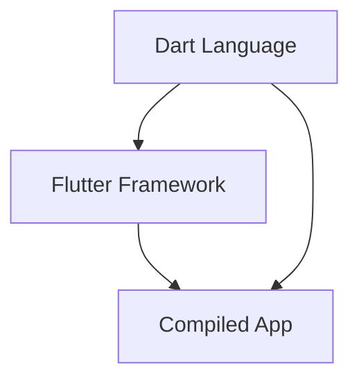

## 1.2.1 Introduction to Dart

Dart is a versatile and powerful programming language developed by Google, designed to build fast, high-quality applications across various platforms. As the backbone of the Flutter framework, Dart plays a crucial role in enabling developers to create visually appealing and performant apps. In this section, we will delve into what makes Dart an excellent choice for modern app development, explore its key features, and understand how it integrates seamlessly with Flutter.

### What is Dart?

Dart is a client-optimized programming language that emphasizes performance, productivity, and ease of use. It was developed by Google to address the needs of modern app development, particularly for building user interfaces. Dart's primary goal is to provide a language that can compile to native code for fast execution and startup, making it ideal for mobile, web, and desktop applications.

#### Key Features of Dart

Dart offers several features that make it stand out as a language for UI development:

- **Optimal for UI Development**: Dart's expressive syntax and rich set of features are tailored for creating high-quality user interfaces. Its language constructs allow developers to write concise and readable code, which is crucial for building complex UIs.

- **Ahead-of-Time (AOT) Compilation**: Dart supports AOT compilation, which translates Dart code into native machine code before execution. This results in fast startup times and efficient runtime performance, making it suitable for resource-constrained environments like mobile devices.

- **Just-in-Time (JIT) Compilation**: During development, Dart uses JIT compilation to enable features like Hot Reload. This allows developers to see changes in their code instantly without restarting the application, significantly speeding up the development process.

- **Garbage Collection**: Dart includes an efficient garbage collector that manages memory allocation and deallocation automatically. This helps maintain smooth app performance by minimizing memory leaks and optimizing resource usage.

### Dart's Syntax Familiarity

One of Dart's strengths is its familiar syntax, which resembles other popular object-oriented languages such as Java, C#, and JavaScript. This familiarity makes it easier for developers with experience in these languages to pick up Dart quickly. Dart's syntax includes:

- **Variable Declarations**: Dart supports both explicit and inferred typing, allowing developers to declare variables with or without specifying their types.

- **Functions**: Dart functions are first-class objects, meaning they can be assigned to variables, passed as arguments, and returned from other functions.

- **Classes and Objects**: Dart is a fully object-oriented language, supporting classes, inheritance, and polymorphism, which are essential for building structured and reusable code.

### Integration with Flutter

Dart and Flutter are tightly integrated, providing a seamless development experience. Flutter uses Dart as its primary language, leveraging Dart's features to build reactive and performant UIs. The integration between Dart and Flutter allows developers to write code that is both expressive and efficient, enabling the creation of complex applications with minimal effort.

Below is a Mermaid.js diagram illustrating the interaction between the Dart language, the Flutter framework, and the compiled app:



### Code Examples

Let's explore some basic Dart code snippets to understand its syntax and how it is used in Flutter development.

#### Variable Declarations

Dart allows you to declare variables using the `var` keyword for inferred typing or by specifying the type explicitly:

```dart
// Inferred typing
var name = 'Flutter';

// Explicit typing
String language = 'Dart';
int version = 2;
```

#### Functions

Dart functions can be defined with or without return types. Here's a simple function example:

```dart
// Function with a return type
int add(int a, int b) {
  return a + b;
}

// Function without a return type
void printMessage(String message) {
  print(message);
}
```

#### Classes and Objects

Dart's object-oriented nature allows you to define classes and create objects:

```dart
class Car {
  String make;
  String model;

  Car(this.make, this.model);

  void displayInfo() {
    print('Car: $make $model');
  }
}

void main() {
  Car myCar = Car('Toyota', 'Corolla');
  myCar.displayInfo();
}
```

### Practical Examples and Real-World Scenarios

To ground these concepts in real-world scenarios, consider how Dart's features can be applied in Flutter development:

- **UI Development**: Dart's expressive syntax and AOT compilation make it ideal for building responsive and visually appealing UIs in Flutter. Developers can leverage Dart's language features to create custom widgets and animations that enhance the user experience.

- **Performance Optimization**: Dart's AOT compilation and efficient garbage collection contribute to the performance of Flutter apps. By compiling to native code, Dart ensures that apps run smoothly on various platforms, providing a consistent user experience.

- **Rapid Development**: The combination of Dart's JIT compilation and Flutter's Hot Reload feature allows developers to iterate quickly, making changes to the UI and logic without restarting the app. This speeds up the development process and reduces downtime.

### Best Practices and Common Pitfalls

When working with Dart, it's essential to follow best practices to ensure code quality and maintainability:

- **Consistent Naming Conventions**: Use clear and consistent naming conventions for variables, functions, and classes to improve code readability.

- **Code Organization**: Structure your code into modules and packages to keep it organized and manageable, especially in large projects.

- **Error Handling**: Implement robust error handling to manage exceptions and prevent crashes, ensuring a smooth user experience.

- **Testing**: Write unit and integration tests to validate your code and catch bugs early in the development process.

### Additional Resources

To further explore Dart and its integration with Flutter, consider the following resources:

- [Dart Official Documentation](https://dart.dev/guides)
- [Flutter Official Documentation](https://flutter.dev/docs)
- [Dart Language Tour](https://dart.dev/guides/language/language-tour)
- [Flutter & Dart: The Complete Guide (Udemy Course)](https://www.udemy.com/course/flutter-dart-the-complete-guide/)

These resources provide in-depth information and tutorials to help you master Dart and Flutter development.

### Summary

In this section, we've introduced Dart as a client-optimized programming language developed by Google, designed for building fast and high-quality apps across platforms. We've explored Dart's key features, syntax familiarity, and integration with Flutter, providing code examples and practical insights. By understanding Dart's capabilities, developers can leverage its strengths to create performant and visually appealing applications.

## Quiz Time!



### What is Dart primarily designed for?

- [x] Building fast apps on any platform
- [ ] Server-side scripting
- [ ] Game development
- [ ] Data analysis

> **Explanation:** Dart is a client-optimized language developed by Google, designed for building fast apps on any platform, particularly for UI development with Flutter.

### Which compilation method allows Dart to compile into native code for fast startup?

- [x] Ahead-of-Time (AOT) Compilation
- [ ] Just-in-Time (JIT) Compilation
- [ ] Bytecode Compilation
- [ ] Dynamic Compilation

> **Explanation:** AOT compilation translates Dart code into native machine code before execution, resulting in fast startup times and efficient runtime performance.

### What feature of Dart enables the Hot Reload functionality during development?

- [ ] Ahead-of-Time (AOT) Compilation
- [x] Just-in-Time (JIT) Compilation
- [ ] Garbage Collection
- [ ] Static Typing

> **Explanation:** JIT compilation allows Dart to support Hot Reload, enabling developers to see code changes instantly without restarting the application.

### How does Dart manage memory efficiently?

- [ ] Manual Memory Management
- [ ] Reference Counting
- [x] Garbage Collection
- [ ] Memory Pools

> **Explanation:** Dart includes an efficient garbage collector that automatically manages memory allocation and deallocation, helping maintain smooth app performance.

### Dart's syntax is similar to which of the following languages?

- [x] Java
- [x] C#
- [x] JavaScript
- [ ] Python

> **Explanation:** Dart's syntax is similar to other object-oriented languages like Java, C#, and JavaScript, making it approachable for many developers.

### What is the primary language used by the Flutter framework?

- [x] Dart
- [ ] JavaScript
- [ ] Kotlin
- [ ] Swift

> **Explanation:** Flutter uses Dart as its primary language, leveraging Dart's features to build reactive and performant UIs.

### Which of the following is a key feature of Dart for UI development?

- [x] Expressive Syntax
- [ ] Low-Level Memory Access
- [ ] Inline Assembly
- [ ] Direct Hardware Control

> **Explanation:** Dart's expressive syntax and rich set of features are tailored for creating high-quality user interfaces, making it optimal for UI development.

### What does the Mermaid.js diagram illustrate in the context of Dart and Flutter?

- [x] Interaction between Dart, Flutter, and the compiled app
- [ ] The lifecycle of a Flutter widget
- [ ] The architecture of a Dart server
- [ ] The process of garbage collection in Dart

> **Explanation:** The Mermaid.js diagram illustrates the interaction between the Dart language, the Flutter framework, and the compiled app, showing how they work together.

### Which of the following is a benefit of Dart's AOT compilation?

- [x] Fast startup times
- [ ] Real-time debugging
- [ ] Dynamic typing
- [ ] Inline code execution

> **Explanation:** AOT compilation translates Dart code into native machine code before execution, resulting in fast startup times and efficient runtime performance.

### True or False: Dart is only used for mobile app development.

- [ ] True
- [x] False

> **Explanation:** False. Dart is designed for building fast apps on any platform, including mobile, web, and desktop applications.


