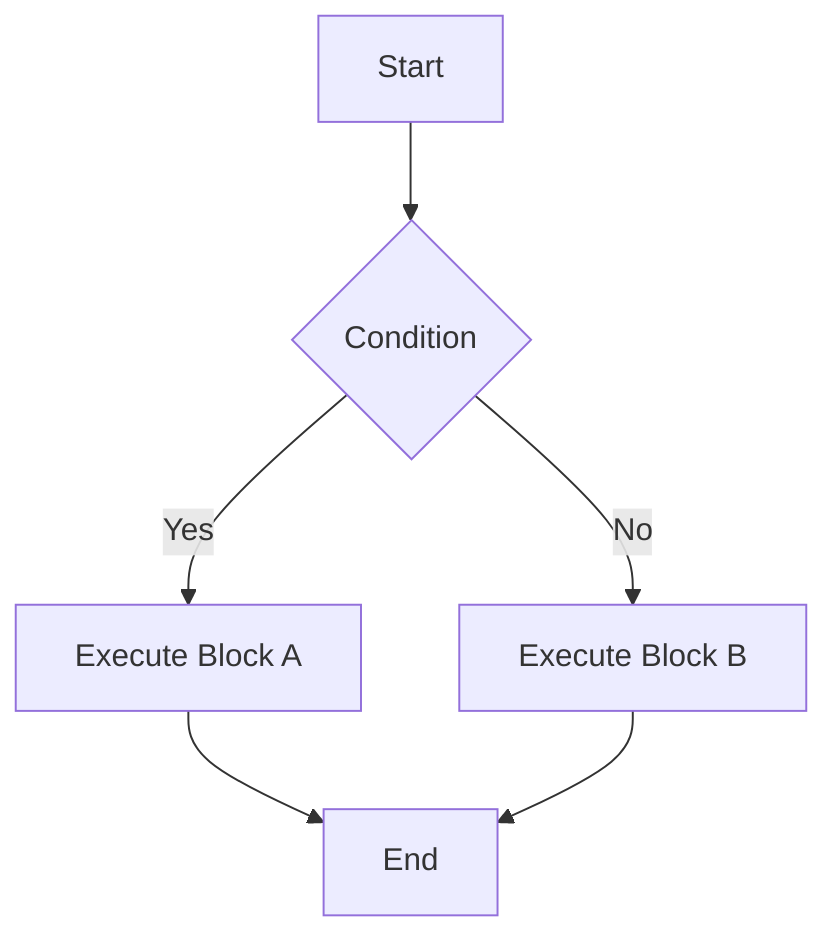

---

linkTitle: "1.2.2 Dart Syntax and Semantics"
title: "Dart Syntax and Semantics: Mastering the Basics for Flutter Development"
description: "Explore Dart's syntax and semantics, including variables, data types, operators, control flow, functions, null safety, and exception handling, to build robust Flutter applications."
categories:
- Flutter Development
- Dart Programming
- Mobile App Development
tags:
- Dart Syntax
- Dart Semantics
- Flutter
- Programming Basics
- Mobile Development
date: 2024-10-25
type: docs
nav_weight: 1220

canonical: "https://fluttermasterylibrary.com/3/1/2/2"
license: "© 2023 Tokenizer Inc. CC BY-NC-SA 4.0"
---

## 1.2.2 Dart Syntax and Semantics

Dart is the programming language behind Flutter, offering a robust set of features that make it ideal for building cross-platform applications. Understanding Dart's syntax and semantics is crucial for any developer looking to harness the full potential of Flutter. In this section, we'll delve into the core aspects of Dart, from variables and data types to control flow, functions, null safety, and exception handling. We'll provide practical examples and visual aids to solidify your understanding and help you apply these concepts in real-world scenarios.

### Variables and Data Types

Variables in Dart are used to store data that can be manipulated throughout your program. Dart supports various data types, each serving a specific purpose.

#### Variable Declaration

Dart offers three primary ways to declare variables: `var`, `final`, and `const`.

- **`var`**: Used for variables whose type can be inferred by the compiler. The type is determined at compile time and cannot change.

  ```dart
  var name = 'Flutter'; // Inferred as String
  var age = 5;          // Inferred as int
  ```

- **`final`**: Used for variables that are initialized once and cannot be reassigned. The value is determined at runtime.

  ```dart
  final city = 'San Francisco';
  ```

- **`const`**: Used for compile-time constants. The value must be known at compile time.

  ```dart
  const pi = 3.14159;
  ```

#### Built-in Data Types

Dart provides several built-in data types, including `int`, `double`, `String`, `bool`, and collections like `List`, `Map`, and `Set`.

- **`int`**: Represents integer values.

  ```dart
  int year = 2024;
  ```

- **`double`**: Represents floating-point numbers.

  ```dart
  double temperature = 98.6;
  ```

- **`String`**: Represents a sequence of characters.

  ```dart
  String greeting = 'Hello, Dart!';
  ```

- **`bool`**: Represents Boolean values (`true` or `false`).

  ```dart
  bool isFlutterAwesome = true;
  ```

- **`List`**: An ordered collection of items.

  ```dart
  List<String> fruits = ['Apple', 'Banana', 'Cherry'];
  ```

- **`Map`**: A collection of key-value pairs.

  ```dart
  Map<String, int> scores = {'Alice': 90, 'Bob': 85};
  ```

- **`Set`**: An unordered collection of unique items.

  ```dart
  Set<int> uniqueNumbers = {1, 2, 3, 4};
  ```

### Operators and Expressions

Operators in Dart are symbols that perform operations on variables and values. They are categorized into arithmetic, comparison, logical, and assignment operators.

#### Arithmetic Operators

Arithmetic operators are used to perform basic mathematical operations.

- Addition (`+`), Subtraction (`-`), Multiplication (`*`), Division (`/`), Modulus (`%`).

  ```dart
  int sum = 5 + 3; // 8
  int difference = 5 - 3; // 2
  int product = 5 * 3; // 15
  double quotient = 5 / 3; // 1.6667
  int remainder = 5 % 3; // 2
  ```

#### Comparison Operators

Comparison operators are used to compare two values.

- Equal (`==`), Not equal (`!=`), Greater than (`>`), Less than (`<`), Greater than or equal to (`>=`), Less than or equal to (`<=`).

  ```dart
  bool isEqual = (5 == 3); // false
  bool isNotEqual = (5 != 3); // true
  ```

#### Logical Operators

Logical operators are used to combine multiple Boolean expressions.

- AND (`&&`), OR (`||`), NOT (`!`).

  ```dart
  bool result = (5 > 3) && (3 < 5); // true
  ```

#### Assignment Operators

Assignment operators are used to assign values to variables.

- Simple assignment (`=`), Compound assignment (`+=`, `-=`, `*=`, `/=`, `%=`).

  ```dart
  int a = 5;
  a += 3; // a = a + 3; a becomes 8
  ```

### Control Flow Statements

Control flow statements determine the order in which code is executed. Dart provides several control flow constructs.

#### Conditional Statements

Conditional statements allow you to execute code based on certain conditions.

- **`if`, `else if`, `else`**: Used for conditional branching.

  ```dart
  int score = 85;
  if (score >= 90) {
    print('A');
  } else if (score >= 80) {
    print('B');
  } else {
    print('C');
  }
  ```

  ```mermaid
  graph TD;
    A[Start] --> B{Score >= 90?};
    B -- Yes --> C[Print "A"];
    B -- No --> D{Score >= 80?};
    D -- Yes --> E[Print "B"];
    D -- No --> F[Print "C"];
  ```

- **`switch`**: Used for selecting one of many code blocks to execute.

  ```dart
  String grade = 'B';
  switch (grade) {
    case 'A':
      print('Excellent');
      break;
    case 'B':
      print('Good');
      break;
    default:
      print('Needs Improvement');
  }
  ```

#### Loops

Loops allow you to execute a block of code multiple times.

- **`for`**: Used for iterating over a range or collection.

  ```dart
  for (int i = 0; i < 5; i++) {
    print(i);
  }
  ```

  ```mermaid
  graph TD;
    A[Start] --> B[Initialize i = 0];
    B --> C{Condition i < 5};
    C -- Yes --> D[Print i];
    D --> E[Increment i];
    E --> C;
    C -- No --> F[End];
  ```

- **`while`**: Repeats a block of code while a condition is true.

  ```dart
  int i = 0;
  while (i < 5) {
    print(i);
    i++;
  }
  ```

- **`do-while`**: Similar to `while`, but checks the condition after executing the loop body.

  ```dart
  int i = 0;
  do {
    print(i);
    i++;
  } while (i < 5);
  ```

### Functions

Functions are reusable blocks of code that perform a specific task. They help in organizing code and avoiding repetition.

#### Defining and Calling Functions

Functions in Dart are defined using the `void` keyword for functions that do not return a value, or a return type for functions that do.

```dart
void greet() {
  print('Hello, World!');
}

int add(int a, int b) {
  return a + b;
}

greet(); // Calls the greet function
int sum = add(5, 3); // Calls the add function
```

#### Parameters and Return Types

Dart supports both positional and named parameters, as well as default parameter values.

- **Positional Parameters**: Parameters that are required and must be passed in order.

  ```dart
  int multiply(int a, int b) {
    return a * b;
  }
  ```

- **Named Parameters**: Parameters that are optional and can be passed in any order.

  ```dart
  void printInfo({String name = 'Anonymous', int age = 0}) {
    print('Name: $name, Age: $age');
  }

  printInfo(name: 'Alice', age: 30);
  ```

- **Arrow Syntax**: A shorthand for functions with a single expression.

  ```dart
  int square(int x) => x * x;
  ```

#### Anonymous Functions

Anonymous functions, or lambda functions, are functions without a name. They are often used as arguments to other functions.

```dart
var numbers = [1, 2, 3];
numbers.forEach((number) {
  print(number);
});
```

### Null Safety

Null safety is a feature in Dart that helps prevent null reference errors, a common source of runtime exceptions.

#### Nullable and Non-nullable Types

In Dart, variables are non-nullable by default, meaning they cannot contain a `null` value unless explicitly declared as nullable.

- **Non-nullable**: Cannot be `null`.

  ```dart
  int number = 42;
  ```

- **Nullable**: Can be `null`, denoted by a question mark (`?`).

  ```dart
  int? nullableNumber;
  ```

#### Null-aware Operators

Dart provides several operators to work with nullable types safely.

- **`??`**: Default value operator.

  ```dart
  int? a;
  int b = a ?? 0; // b becomes 0 if a is null
  ```

- **`?.`**: Conditional member access.

  ```dart
  String? name;
  print(name?.length); // Prints null if name is null
  ```

- **`??=`**: Assigns a value if the variable is null.

  ```dart
  int? c;
  c ??= 10; // c becomes 10 if it was null
  ```

### Exception Handling

Exception handling in Dart is done using `try-catch` blocks, allowing you to gracefully handle errors and maintain application stability.

#### Try-Catch Blocks

The `try-catch` block is used to catch exceptions and handle them appropriately.

```dart
try {
  int result = 10 ~/ 0; // Division by zero
} catch (e) {
  print('Error: $e');
}
```

#### Throwing Exceptions

You can throw exceptions using the `throw` keyword.

```dart
void checkAge(int age) {
  if (age < 18) {
    throw Exception('Age must be at least 18');
  }
}
```

#### Custom Exceptions

Dart allows you to define custom exceptions for more specific error handling.

```dart
class AgeException implements Exception {
  String cause;
  AgeException(this.cause);
}

void verifyAge(int age) {
  if (age < 18) {
    throw AgeException('Age is below 18');
  }
}
```

### Visual Aids

To enhance your understanding, let's incorporate some visual aids and interactive examples.

#### Code Snippets with Syntax Highlighting

```dart
// Example of a simple Dart function
int add(int a, int b) {
  return a + b;
}
```

#### Diagrams

To visualize control flow, consider the following flowchart for a simple `if-else` statement:



### Best Practices and Common Pitfalls

- **Best Practices**:
  - Use `final` and `const` where possible to ensure immutability.
  - Leverage null safety features to avoid null reference errors.
  - Write clear and concise functions with meaningful names.

- **Common Pitfalls**:
  - Forgetting to handle null values can lead to runtime exceptions.
  - Overusing `var` can make code less readable; prefer explicit types when clarity is needed.
  - Ignoring exception handling can result in unhandled errors and application crashes.

### Additional Resources

For further exploration of Dart syntax and semantics, consider the following resources:

- [Dart Language Tour](https://dart.dev/guides/language/language-tour)
- [Effective Dart](https://dart.dev/guides/language/effective-dart)
- [Dart API Documentation](https://api.dart.dev/)

These resources provide in-depth information and examples to deepen your understanding of Dart.

---

## Quiz Time!



### What keyword is used to declare a variable that cannot be reassigned in Dart?

- [ ] var
- [x] final
- [ ] let
- [ ] const

> **Explanation:** The `final` keyword is used to declare a variable that can be initialized once and cannot be reassigned.

### Which of the following is a built-in data type in Dart?

- [x] int
- [ ] char
- [ ] byte
- [ ] float

> **Explanation:** `int` is a built-in data type in Dart, used to represent integer values.

### What operator is used to check if two values are equal in Dart?

- [ ] =
- [x] ==
- [ ] !=
- [ ] ===

> **Explanation:** The `==` operator is used to check if two values are equal in Dart.

### Which loop will execute at least once, even if the condition is false?

- [ ] for
- [ ] while
- [x] do-while
- [ ] foreach

> **Explanation:** The `do-while` loop executes the block of code once before checking the condition.

### How do you define a function with a single expression in Dart?

- [ ] function
- [ ] lambda
- [x] =>
- [ ] arrow

> **Explanation:** The `=>` syntax is used to define a function with a single expression in Dart.

### What is the purpose of null safety in Dart?

- [ ] To allow null values everywhere
- [x] To prevent null reference errors
- [ ] To make all variables nullable
- [ ] To eliminate the need for error handling

> **Explanation:** Null safety in Dart helps prevent null reference errors by ensuring variables are non-nullable by default.

### Which operator provides a default value if the left operand is null?

- [ ] ?.
- [ ] ??
- [x] ??=
- [ ] !?

> **Explanation:** The `??` operator provides a default value if the left operand is null.

### How do you handle exceptions in Dart?

- [ ] try-catch
- [ ] if-else
- [ ] switch-case
- [x] try-catch

> **Explanation:** Exceptions in Dart are handled using `try-catch` blocks.

### What is the result of the expression `5 ~/ 2` in Dart?

- [x] 2
- [ ] 2.5
- [ ] 3
- [ ] 1

> **Explanation:** The `~/` operator performs integer division, so `5 ~/ 2` results in `2`.

### True or False: In Dart, variables are non-nullable by default.

- [x] True
- [ ] False

> **Explanation:** In Dart, variables are non-nullable by default, meaning they cannot contain a `null` value unless explicitly declared as nullable.



---

By mastering Dart's syntax and semantics, you'll be well-equipped to develop robust and efficient Flutter applications. Remember to practice regularly and explore additional resources to deepen your understanding. Happy coding!
