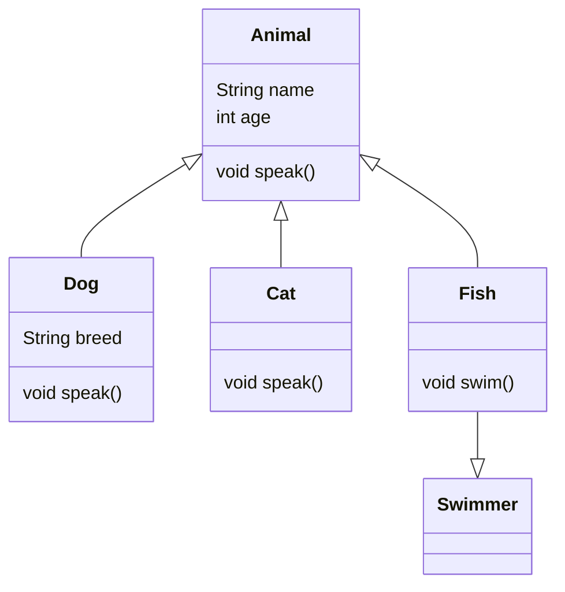

## 1.2.3 Object-Oriented Programming in Dart

Object-Oriented Programming (OOP) is a paradigm that uses "objects" to design applications and computer programs. It simplifies complex software design by modeling real-world entities. Dart, the language behind Flutter, is a robust, object-oriented language that supports all the core principles of OOP, including classes, inheritance, encapsulation, polymorphism, and more. In this section, we will explore these concepts in detail, providing you with a solid foundation to build sophisticated applications.

### Classes and Objects

In Dart, a class is a blueprint for creating objects (a particular data structure), providing initial values for state (member variables or fields), and implementations of behavior (member functions or methods). Let's break down the components of a class:

#### Defining Classes

A class in Dart is defined using the `class` keyword. It can contain fields, methods, and constructors.

```dart
class Animal {
  String name;
  int age;

  // Constructor
  Animal(this.name, this.age);

  // Method
  void speak() {
    print('$name makes a sound.');
  }
}
```

In the above example, `Animal` is a class with two fields: `name` and `age`. It also has a constructor and a method `speak`.

#### Constructors

Constructors are special methods used to initialize objects. Dart provides several types of constructors:

- **Default Constructor**: Automatically provided if no other constructor is defined.
- **Named Constructor**: Allows you to create multiple constructors with different names.
- **Factory Constructor**: Used when you need more control over the object creation process.

```dart
class Vehicle {
  String type;
  int wheels;

  // Default constructor
  Vehicle(this.type, this.wheels);

  // Named constructor
  Vehicle.bike() : this('Bike', 2);

  // Factory constructor
  factory Vehicle.fromJson(Map<String, dynamic> json) {
    return Vehicle(json['type'], json['wheels']);
  }
}
```

#### Creating Objects

To create an object, you use the `new` keyword, although it's optional in Dart.

```dart
void main() {
  var dog = Animal('Dog', 3);
  dog.speak(); // Output: Dog makes a sound.

  var bike = Vehicle.bike();
  print('Vehicle type: ${bike.type}, Wheels: ${bike.wheels}'); // Output: Vehicle type: Bike, Wheels: 2
}
```

### Inheritance

Inheritance is a mechanism where a new class is derived from an existing class. The derived class, known as a subclass, inherits all the properties and methods of the superclass.

#### Using the `extends` Keyword

In Dart, you use the `extends` keyword to inherit from another class.

```dart
class Dog extends Animal {
  String breed;

  Dog(String name, int age, this.breed) : super(name, age);

  @override
  void speak() {
    print('$name barks.');
  }
}
```

In this example, `Dog` is a subclass of `Animal`. It inherits the `name` and `age` fields and the `speak` method, which it overrides to provide specific behavior.

#### Method Overriding and `super`

Method overriding allows a subclass to provide a specific implementation of a method that is already defined in its superclass. The `super` keyword is used to refer to the superclass.

```dart
class Cat extends Animal {
  Cat(String name, int age) : super(name, age);

  @override
  void speak() {
    super.speak(); // Calls the superclass method
    print('$name meows.');
  }
}
```

### Mixins

Mixins are a way of reusing a class's code in multiple class hierarchies. They are used to add functionality to classes without using inheritance.

#### Using the `with` Keyword

To use a mixin, you apply the `with` keyword followed by the mixin name.

```dart
mixin Swimmer {
  void swim() {
    print('Swimming...');
  }
}

class Fish extends Animal with Swimmer {
  Fish(String name, int age) : super(name, age);
}

void main() {
  var nemo = Fish('Nemo', 2);
  nemo.swim(); // Output: Swimming...
}
```

### Abstract Classes and Interfaces

Abstract classes are classes that cannot be instantiated. They are used to define methods that must be implemented in derived classes.

#### Defining Abstract Classes

```dart
abstract class Shape {
  void draw(); // Abstract method
}

class Circle extends Shape {
  @override
  void draw() {
    print('Drawing a circle.');
  }
}
```

#### Interfaces in Dart

Every class in Dart implicitly defines an interface. You can implement multiple interfaces using the `implements` keyword.

```dart
class Printer {
  void printData() {
    print('Printing data...');
  }
}

class Scanner {
  void scanData() {
    print('Scanning data...');
  }
}

class AllInOnePrinter implements Printer, Scanner {
  @override
  void printData() {
    print('All-in-one printer printing...');
  }

  @override
  void scanData() {
    print('All-in-one printer scanning...');
  }
}
```

### Encapsulation

Encapsulation is the bundling of data and methods that operate on that data within one unit, e.g., a class. It restricts direct access to some of an object's components and can prevent the accidental modification of data.

#### Access Control

In Dart, you use an underscore `_` to mark a member as private.

```dart
class BankAccount {
  String _accountNumber;
  double _balance;

  BankAccount(this._accountNumber, this._balance);

  void deposit(double amount) {
    _balance += amount;
  }

  double get balance => _balance;
}
```

### Polymorphism

Polymorphism allows objects of different classes to be treated as objects of a common superclass. It is achieved through method overriding and interfaces.

#### Dynamic Behavior

```dart
void makeAnimalSpeak(Animal animal) {
  animal.speak();
}

void main() {
  var dog = Dog('Buddy', 4, 'Golden Retriever');
  var cat = Cat('Whiskers', 2);

  makeAnimalSpeak(dog); // Output: Buddy barks.
  makeAnimalSpeak(cat); // Output: Whiskers makes a sound. Whiskers meows.
}
```

### Visual Tools

To better understand the relationships and hierarchies in OOP, we can use UML class diagrams. Here is a simple diagram illustrating the class hierarchy we discussed:



### Exercises and Practice

To solidify your understanding of OOP in Dart, try the following exercises:

- **Exercise 1**: Create a class hierarchy for a library system with classes like `Book`, `Author`, and `LibraryMember`. Implement methods to borrow and return books.
- **Exercise 2**: Design a class structure for a simple game with classes like `Player`, `Enemy`, and `Weapon`. Use inheritance and polymorphism to manage different types of players and enemies.
- **Exercise 3**: Implement a mixin for logging actions in a class and apply it to multiple classes in your hierarchy.

### Conclusion

Understanding Object-Oriented Programming in Dart is crucial for building scalable and maintainable applications. By mastering classes, inheritance, mixins, encapsulation, and polymorphism, you can create robust and flexible software solutions. Remember to practice these concepts through exercises and real-world applications to deepen your understanding.

## Quiz Time!



### What is the purpose of a constructor in Dart?

- [x] To initialize an object when it is created
- [ ] To define the behavior of an object
- [ ] To inherit properties from another class
- [ ] To implement interfaces

> **Explanation:** Constructors are special methods used to initialize objects when they are created, setting initial values for fields.

### Which keyword is used to inherit from a superclass in Dart?

- [ ] with
- [x] extends
- [ ] implements
- [ ] super

> **Explanation:** The `extends` keyword is used to create a subclass that inherits from a superclass in Dart.

### How do you mark a member as private in Dart?

- [ ] Using the `private` keyword
- [ ] Using the `protected` keyword
- [x] Using an underscore `_` before the member name
- [ ] Using the `internal` keyword

> **Explanation:** In Dart, an underscore `_` before a member name makes it private to its library.

### What is a mixin in Dart?

- [ ] A class that cannot be instantiated
- [x] A way to share code between classes without using inheritance
- [ ] A method that overrides another method
- [ ] A constructor that initializes objects

> **Explanation:** Mixins allow code sharing between classes without using inheritance, providing a way to add functionality to classes.

### Which keyword is used to implement multiple interfaces in Dart?

- [ ] extends
- [ ] with
- [x] implements
- [ ] interface

> **Explanation:** The `implements` keyword is used to implement multiple interfaces in Dart.

### What is polymorphism in Dart?

- [ ] The ability to create multiple constructors
- [x] The ability to treat objects of different classes as objects of a common superclass
- [ ] The ability to define multiple methods with the same name
- [ ] The ability to inherit from multiple classes

> **Explanation:** Polymorphism allows objects of different classes to be treated as objects of a common superclass, enabling dynamic behavior.

### How do you override a method in Dart?

- [ ] By using the `override` keyword
- [x] By using the `@override` annotation
- [ ] By using the `super` keyword
- [ ] By using the `extends` keyword

> **Explanation:** The `@override` annotation is used to indicate that a method is overriding a method in a superclass.

### What is the role of the `super` keyword in Dart?

- [ ] To create a new instance of a class
- [x] To refer to the superclass of the current object
- [ ] To define a mixin
- [ ] To implement an interface

> **Explanation:** The `super` keyword is used to refer to the superclass of the current object, often used to call superclass methods.

### What is an abstract class in Dart?

- [ ] A class that can be instantiated
- [x] A class that cannot be instantiated and is used to define methods that must be implemented in derived classes
- [ ] A class that implements multiple interfaces
- [ ] A class that extends another class

> **Explanation:** An abstract class cannot be instantiated and is used to define methods that must be implemented in derived classes.

### True or False: Every class in Dart implicitly defines an interface.

- [x] True
- [ ] False

> **Explanation:** True. In Dart, every class implicitly defines an interface, which can be implemented by other classes.


