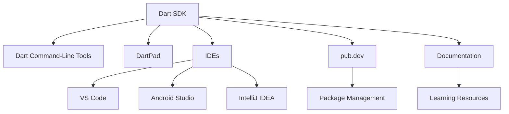

## 1.2.4 Dart Tools and Resources

In this section, we delve into the essential tools and resources that empower developers to harness the full potential of Dart, the programming language that underpins Flutter. Whether you're a beginner or an experienced developer, understanding these tools will enhance your productivity and streamline your development workflow.

### Dart SDK and Command-Line Tools

The Dart Software Development Kit (SDK) is the foundation of Dart development. It includes the Dart VM, core libraries, and a suite of command-line tools that facilitate various development tasks.

#### Installing the Dart SDK

To get started with Dart, you need to install the Dart SDK. While Flutter comes bundled with the Dart SDK, there might be scenarios where you want to install Dart separately, especially if you're working on server-side Dart applications or command-line tools.

**Installation Steps:**

- **Windows**: Download the Dart SDK installer from the [official Dart website](https://dart.dev/get-dart) and follow the installation instructions.
- **macOS**: Use Homebrew to install Dart by running the command: `brew tap dart-lang/dart && brew install dart`.
- **Linux**: Add the Dart repository to your package manager and install it using `apt-get` or `yum`, depending on your distribution.

Once installed, verify the installation by running `dart --version` in your terminal. This command should display the installed Dart version.

#### Command-Line Tools

Dart provides several command-line tools that are integral to the development process:

- **`dart`**: The primary tool for running Dart scripts. You can execute a Dart file by running `dart <filename>.dart`.
  
- **`dartfmt`**: A tool for formatting Dart code. Consistent code formatting is crucial for readability and maintenance. Run `dartfmt -w <filename>.dart` to format a file in place.

- **`dartdoc`**: Generates documentation for your Dart code. Well-documented code is easier to understand and maintain. Use `dartdoc` to create HTML documentation from your Dart source files.

These tools are essential for maintaining code quality and consistency across your projects.

### DartPad

DartPad is an online tool that allows you to write and run Dart code directly in your browser. It's an excellent resource for experimenting with Dart features without setting up a local development environment.

#### Using DartPad

To access DartPad, visit [dartpad.dev](https://dartpad.dev). The interface is straightforward, with a code editor on the left and an output console on the right. You can write Dart code in the editor and execute it by clicking the "Run" button.

**Example Code in DartPad:**

```dart
void main() {
  print('Hello, Dart!');
}
```

This simple program prints "Hello, Dart!" to the console. DartPad is particularly useful for testing small code snippets and sharing them with others.


### Integrated Development Environments (IDEs)

While DartPad is great for quick experiments, a full-fledged IDE is essential for serious development work. Let's explore some popular IDEs that support Dart development.

#### Visual Studio Code

Visual Studio Code (VS Code) is a lightweight, open-source editor with robust support for Dart through the Dart extension.

**Setting Up VS Code for Dart:**

1. **Install VS Code**: Download and install VS Code from [code.visualstudio.com](https://code.visualstudio.com/).
2. **Install the Dart Extension**: Open the Extensions view (Ctrl+Shift+X) and search for "Dart". Install the Dart extension by Dart Code.
3. **Configure the Dart SDK**: Ensure that the Dart SDK path is correctly set in your VS Code settings. This is usually configured automatically, but you can verify it in the settings under `dart.sdkPath`.

VS Code offers features like IntelliSense, debugging, and integrated terminal, making it a powerful tool for Dart development.

#### Android Studio and IntelliJ IDEA

Android Studio and IntelliJ IDEA are comprehensive IDEs that provide excellent support for Dart and Flutter development.

**Setting Up Android Studio for Dart:**

1. **Install Android Studio**: Download and install Android Studio from [developer.android.com/studio](https://developer.android.com/studio).
2. **Install the Dart Plugin**: Go to `File > Settings > Plugins`, search for "Dart", and install the plugin.
3. **Configure the Dart SDK**: Set the Dart SDK path in `File > Settings > Languages & Frameworks > Dart`.

These IDEs offer advanced features like code refactoring, version control integration, and a rich set of plugins to enhance your development experience.

### Package Manager (pub.dev)

Dart uses `pub.dev` as its package repository, similar to npm for JavaScript or Maven for Java. It hosts a wide range of packages that extend the functionality of Dart applications.

#### Adding Dependencies

To use a package from `pub.dev`, you need to add it to your project's `pubspec.yaml` file. Here's an example of adding the `http` package for making network requests:

```yaml
dependencies:
  http: ^0.13.3
```

After updating `pubspec.yaml`, run `dart pub get` to install the package.

#### Useful Dart Packages

- **`http`**: For making HTTP requests.
- **`provider`**: A popular state management solution.
- **`json_serializable`**: For JSON serialization and deserialization.

These packages can significantly enhance your development workflow by providing pre-built solutions to common problems.

### Documentation and Learning Resources

To deepen your understanding of Dart, it's crucial to leverage official documentation and community resources.

#### Official Documentation

The [Dart documentation](https://dart.dev/guides) is comprehensive and covers everything from language fundamentals to advanced topics. It's an invaluable resource for both beginners and experienced developers.

#### Online Tutorials and Courses

- **Udemy**: Offers courses on Dart and Flutter development.
- **Coursera**: Provides structured learning paths for mobile development with Flutter.
- **YouTube**: Channels like The Net Ninja and Academind offer free tutorials on Dart and Flutter.

#### Community Forums and Events

Engaging with the community is a great way to learn and stay updated. Participate in forums like [Stack Overflow](https://stackoverflow.com/questions/tagged/dart) and attend local Dart and Flutter meetups.

### Visual Aids

To better understand how these tools fit into the development workflow, consider the following diagram:



This diagram illustrates the interconnectedness of Dart tools and resources, highlighting how they collectively support the development process.

### Best Practices and Common Pitfalls

- **Keep Your SDK Updated**: Regularly update the Dart SDK to benefit from the latest features and improvements.
- **Consistent Code Formatting**: Use `dartfmt` to maintain consistent code style across your projects.
- **Leverage Community Packages**: Explore `pub.dev` for packages that can save you time and effort.
- **Engage with the Community**: Participate in forums and events to learn from others and share your knowledge.

### Conclusion

Understanding and utilizing Dart tools and resources is crucial for efficient and effective development. By mastering these tools, you can streamline your workflow, write better code, and ultimately create more robust applications. Remember to explore the official documentation and engage with the community to continuously improve your skills.

## Quiz Time!



### What is the primary tool for running Dart scripts?

- [x] `dart`
- [ ] `dartfmt`
- [ ] `dartdoc`
- [ ] `pub`

> **Explanation:** The `dart` command is used to run Dart scripts.

### Which command-line tool is used for formatting Dart code?

- [ ] `dart`
- [x] `dartfmt`
- [ ] `dartdoc`
- [ ] `pub`

> **Explanation:** `dartfmt` is the tool used for formatting Dart code.

### What is DartPad?

- [x] An online tool for writing and running Dart code
- [ ] A command-line tool for formatting Dart code
- [ ] An IDE for Dart development
- [ ] A package manager for Dart

> **Explanation:** DartPad is an online tool that allows you to write and run Dart code directly in your browser.

### Which IDE requires a Dart plugin for Dart development?

- [ ] Visual Studio Code
- [x] Android Studio
- [ ] DartPad
- [ ] Sublime Text

> **Explanation:** Android Studio requires a Dart plugin for Dart development.

### How do you add a package from pub.dev to your Dart project?

- [x] By adding it to the `pubspec.yaml` file
- [ ] By installing it through the Dart command-line tool
- [ ] By downloading it manually
- [ ] By using the `dartdoc` tool

> **Explanation:** Packages are added to a Dart project by specifying them in the `pubspec.yaml` file.

### What is the purpose of `dartdoc`?

- [ ] Running Dart scripts
- [ ] Formatting Dart code
- [x] Generating documentation
- [ ] Managing packages

> **Explanation:** `dartdoc` is used to generate documentation for Dart code.

### Which of the following is a popular state management package for Dart?

- [ ] `http`
- [x] `provider`
- [ ] `json_serializable`
- [ ] `dartdoc`

> **Explanation:** `provider` is a popular state management package for Dart.

### Where can you find official Dart documentation?

- [x] dart.dev/guides
- [ ] pub.dev
- [ ] stackoverflow.com
- [ ] github.com

> **Explanation:** The official Dart documentation can be found at dart.dev/guides.

### True or False: DartPad requires installation on your local machine.

- [ ] True
- [x] False

> **Explanation:** DartPad is an online tool and does not require installation on your local machine.

### Which command is used to verify the Dart SDK installation?

- [x] `dart --version`
- [ ] `dartfmt --version`
- [ ] `dartdoc --version`
- [ ] `pub --version`

> **Explanation:** `dart --version` is used to verify the Dart SDK installation.


