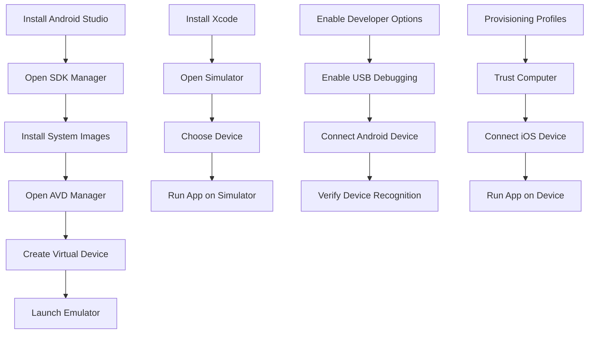

## 1.3.3 Configuring Emulators and Simulators

Setting up emulators and simulators is a crucial step in Flutter development, allowing you to test your applications on virtual devices that mimic real-world hardware. This section will guide you through configuring Android emulators and iOS simulators, as well as setting up physical devices for testing. We will also cover common troubleshooting steps to ensure a smooth development experience.

### Setting Up Android Emulators

Android emulators are virtual devices that run on your computer, simulating the behavior of Android devices. They are essential for testing your Flutter applications across different Android versions and device configurations.

#### Installing the Android SDK and System Images

Before you can create an Android emulator, you need to install the Android SDK and the necessary system images. Follow these steps:

1. **Install Android Studio**: Download and install Android Studio from the [official website](https://developer.android.com/studio). Android Studio includes the Android SDK, which is required for creating emulators.

2. **Open the SDK Manager**: Launch Android Studio and navigate to `Tools > SDK Manager`. This tool allows you to manage the SDK components.

3. **Install System Images**: In the SDK Manager, go to the `SDK Platforms` tab. Select the Android versions you want to test against and ensure the `Intel x86 Atom_64 System Image` or `Google APIs Intel x86 Atom_64 System Image` is installed for each version.

4. **Install SDK Tools**: Switch to the `SDK Tools` tab and ensure the following are installed:
   - Android SDK Build-Tools
   - Android Emulator
   - Android SDK Platform-Tools
   - Intel x86 Emulator Accelerator (HAXM installer)

#### Creating a Virtual Device with AVD Manager

Once the SDK and system images are installed, you can create a virtual device using the AVD Manager:

1. **Open AVD Manager**: In Android Studio, go to `Tools > AVD Manager`.

2. **Create a New Virtual Device**: Click on `Create Virtual Device`. Choose a device type from the list (e.g., Pixel 4) and click `Next`.

3. **Select a System Image**: Choose a system image that matches the Android version you want to test. Click `Next`.

4. **Configure the Device**: You can customize the device's hardware profile, such as RAM, storage, and screen resolution. Click `Finish` to create the emulator.

5. **Launch the Emulator**: Once created, you can start the emulator by clicking the `Play` button next to your virtual device in the AVD Manager.

#### Configuration Options

- **Device Type**: Choose from a range of device types, such as phones, tablets, and wearables, to simulate different screen sizes and resolutions.
- **Android Version**: Test your app on various Android versions to ensure compatibility.
- **Hardware Profile**: Customize RAM, storage, and other hardware settings to match your target devices.

### Setting Up iOS Simulators (macOS Only)

iOS simulators are available only on macOS and require Xcode, Apple's integrated development environment. They allow you to test your Flutter applications on virtual iOS devices.

#### Installing Xcode

1. **Download Xcode**: Install Xcode from the [Mac App Store](https://apps.apple.com/us/app/xcode/id497799835?mt=12).

2. **Agree to License Terms**: Open Xcode and agree to the license terms. This step is necessary to use the Xcode command-line tools.

#### Using Xcode's Simulator App

1. **Open Simulator**: Launch the Simulator app from Xcode by going to `Xcode > Open Developer Tool > Simulator`.

2. **Choose a Device**: In the Simulator app, go to `Hardware > Device` and select the iOS device you want to simulate (e.g., iPhone 14, iPad Pro).

3. **Run Your App**: Use the `flutter run` command in your terminal to deploy your Flutter app to the selected simulator.

### Configuring Physical Devices

Testing on physical devices provides the most accurate representation of how your app will perform in real-world scenarios. Here's how to set up Android and iOS devices for development.

#### Android Devices

1. **Enable Developer Options**: On your Android device, go to `Settings > About phone` and tap `Build number` seven times to enable Developer Options.

2. **Enable USB Debugging**: In `Settings > Developer Options`, enable `USB Debugging`.

3. **Install USB Drivers (Windows)**: If you're using Windows, you may need to install USB drivers for your device. Visit the manufacturer's website for the appropriate drivers.

4. **Connect the Device**: Connect your Android device to your computer via USB. Use the `flutter devices` command to verify that your device is recognized.

#### iOS Devices

1. **Provisioning Profiles and Certificates**: To deploy apps on an iOS device, you need a provisioning profile and a developer certificate. These are managed through your Apple Developer account.

2. **Trust the Computer**: Connect your iOS device to your Mac. When prompted, trust the computer on your device.

3. **Run Your App**: Use Xcode or the `flutter run` command to deploy your app to the connected iOS device.

### Troubleshooting

Even with careful setup, you may encounter issues when configuring emulators, simulators, or physical devices. Here are some common problems and their solutions:

- **Emulator Not Starting**: Ensure that the Intel HAXM is installed and enabled. Check your computer's BIOS settings to verify that virtualization is enabled.

- **Device Not Recognized**: For Android, ensure USB Debugging is enabled and the correct drivers are installed. For iOS, ensure the device is trusted and the provisioning profile is correct.

- **Slow Emulator Performance**: Increase the allocated RAM and CPU cores for the emulator in the AVD Manager settings.

- **Xcode Errors**: Ensure Xcode and its command-line tools are up to date. Run `xcode-select --install` in the terminal to install any missing components.

### Visual Guides

To assist you further, here are some visual guides to help you through the setup process:

### Conclusion

Configuring emulators and simulators is a foundational step in Flutter development, enabling you to test your applications across a variety of virtual and physical devices. By following the steps outlined in this guide, you can ensure that your development environment is set up correctly, allowing for efficient testing and debugging. Remember to troubleshoot common issues as they arise and refer to the visual guides for additional support.

For further reading and resources, consider exploring the [official Flutter documentation](https://flutter.dev/docs), [Android Developer guides](https://developer.android.com/docs), and [Apple's developer resources](https://developer.apple.com/documentation/).

## Quiz Time!



### What is the primary purpose of setting up emulators and simulators in Flutter development?

- [x] To test applications on virtual devices that mimic real-world hardware
- [ ] To compile Flutter applications faster
- [ ] To automatically generate app documentation
- [ ] To deploy apps directly to app stores

> **Explanation:** Emulators and simulators allow developers to test applications on virtual devices, providing a controlled environment that mimics real-world hardware.

### Which tool is used to manage Android SDK components?

- [x] SDK Manager
- [ ] AVD Manager
- [ ] Xcode
- [ ] Android Studio Terminal

> **Explanation:** The SDK Manager is used to manage Android SDK components, including system images and SDK tools.

### What is required to run iOS simulators?

- [x] Xcode
- [ ] Android Studio
- [ ] Visual Studio Code
- [ ] Windows OS

> **Explanation:** iOS simulators require Xcode, which is available only on macOS.

### How can you enable Developer Options on an Android device?

- [x] Tap "Build number" seven times in the "About phone" section
- [ ] Install a special app from the Play Store
- [ ] Connect the device to a computer
- [ ] Enable it from the Google Play Developer Console

> **Explanation:** Developer Options can be enabled by tapping "Build number" seven times in the "About phone" section of the device settings.

### What should you do if an Android emulator is not starting?

- [x] Ensure Intel HAXM is installed and enabled
- [ ] Reinstall Android Studio
- [ ] Update the Android version on the emulator
- [ ] Change the emulator's screen resolution

> **Explanation:** If an Android emulator is not starting, ensure that Intel HAXM is installed and enabled, as it is necessary for running emulators efficiently.

### What is a provisioning profile used for in iOS development?

- [x] To authorize an app to run on a physical iOS device
- [ ] To increase app performance
- [ ] To manage app updates
- [ ] To configure app icons

> **Explanation:** A provisioning profile is used to authorize an app to run on a physical iOS device, linking the app to a developer's account.

### Which command can you use to verify connected devices in Flutter?

- [x] flutter devices
- [ ] flutter run
- [ ] flutter doctor
- [ ] flutter build

> **Explanation:** The `flutter devices` command lists all connected devices recognized by Flutter.

### What is a common solution for a device not being recognized by Flutter?

- [x] Ensure USB Debugging is enabled
- [ ] Restart the computer
- [ ] Reinstall Flutter
- [ ] Update the device's operating system

> **Explanation:** Ensuring that USB Debugging is enabled on the device is a common solution for recognition issues.

### What is the role of the AVD Manager?

- [x] To create and manage Android virtual devices
- [ ] To compile Flutter applications
- [ ] To manage app store submissions
- [ ] To configure app permissions

> **Explanation:** The AVD Manager is used to create and manage Android virtual devices (emulators).

### True or False: You can run iOS simulators on Windows.

- [ ] True
- [x] False

> **Explanation:** iOS simulators require Xcode, which is only available on macOS, making it impossible to run them on Windows.


