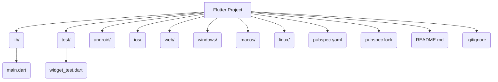

## 1.4.2 Understanding the Flutter Project Structure

When you create a new Flutter project, it generates a set of directories and files that form the backbone of your application. Understanding this structure is crucial for efficient development and maintenance of your Flutter apps. In this section, we will delve into each component of the Flutter project structure, explaining its purpose and how you can utilize it effectively.

### Overview of Directories and Files

A typical Flutter project consists of several directories and files, each serving a specific role. Let's explore these components in detail:

#### `lib/`

The `lib/` directory is the heart of your Flutter application. It contains all the Dart code that defines the behavior and UI of your app. This is where you will spend most of your time as a Flutter developer.

- **`main.dart`**: This file is the entry point of your Flutter application. It contains the `main()` function, which is the starting point for execution. Typically, this file initializes the app and calls the `runApp()` function with your root widget.

```dart
// main.dart
import 'package:flutter/material.dart';

void main() {
  runApp(MyApp());
}

class MyApp extends StatelessWidget {
  @override
  Widget build(BuildContext context) {
    return MaterialApp(
      home: Scaffold(
        appBar: AppBar(
          title: Text('Welcome to Flutter'),
        ),
        body: Center(
          child: Text('Hello, world!'),
        ),
      ),
    );
  }
}
```

#### `test/`

The `test/` directory is where you place your automated test scripts. Testing is a crucial part of software development, and Flutter provides robust support for unit, widget, and integration tests.

- **Purpose**: To ensure that your code behaves as expected and to catch bugs early in the development process.
- **Example**: You might have a `widget_test.dart` file here to test the UI components of your app.

```dart
// test/widget_test.dart
import 'package:flutter/material.dart';
import 'package:flutter_test/flutter_test.dart';
import 'package:my_app/main.dart';

void main() {
  testWidgets('Counter increments smoke test', (WidgetTester tester) async {
    await tester.pumpWidget(MyApp());

    expect(find.text('0'), findsOneWidget);
    expect(find.text('1'), findsNothing);

    await tester.tap(find.byIcon(Icons.add));
    await tester.pump();

    expect(find.text('0'), findsNothing);
    expect(find.text('1'), findsOneWidget);
  });
}
```

#### `android/` and `ios/`

These directories contain platform-specific code for Android and iOS, respectively. While Flutter handles most of the platform-specific details automatically, you may need to customize these files for advanced configurations, such as integrating native code or modifying app permissions.

- **`android/`**: Contains files like `AndroidManifest.xml` for Android-specific configurations.
- **`ios/`**: Contains files like `Info.plist` for iOS-specific settings.

#### `web/`, `windows/`, `macos/`, `linux/`

If you have enabled support for web or desktop platforms, these directories will be present. They contain platform-specific code and configurations for running your Flutter app on web browsers or desktop environments.

- **Purpose**: To allow your Flutter app to run on multiple platforms with minimal changes to the core codebase.

#### `pubspec.yaml`

The `pubspec.yaml` file is a critical configuration file for your Flutter project. It defines the project's dependencies, assets, and metadata.

- **Dependencies**: Lists the packages your app depends on. You can add new packages by specifying them here.
- **Assets**: Define images, fonts, and other resources used in your app.
- **Metadata**: Includes information like the app's name, version, and description.

```yaml
name: my_app
description: A new Flutter project.

dependencies:
  flutter:
    sdk: flutter
  cupertino_icons: ^1.0.2

flutter:
  assets:
    - assets/images/
  fonts:
    - family: Roboto
      fonts:
        - asset: fonts/Roboto-Regular.ttf
```

### Detailed Breakdown

Beyond the main directories and files, a Flutter project includes several other components that play important roles:

- **`pubspec.lock`**: This file locks the versions of dependencies used in your project, ensuring consistency across different environments.
- **`README.md`**: A markdown file where you can provide an overview of your project, instructions for setup, and other relevant information.
- **Hidden Files**:
  - **`.gitignore`**: Specifies files and directories that should be ignored by version control systems like Git.
  - **`.metadata`**: Contains metadata about the Flutter project, such as the Flutter SDK version.

#### Adding Assets

Assets such as images and fonts are essential for creating visually appealing apps. You can add them to your project by placing them in the `assets/` directory and referencing them in `pubspec.yaml`.

- **Images**: Place image files in `assets/images/` and reference them in your Dart code.

```dart
// Using an image asset
Image.asset('assets/images/logo.png')
```

- **Fonts**: Define custom fonts in `pubspec.yaml` and use them in your app's text styles.

```dart
// Using a custom font
Text(
  'Hello, Flutter!',
  style: TextStyle(fontFamily: 'Roboto'),
)
```

### Visual Diagrams

To better understand the project structure, let's visualize it using a directory tree diagram created with Mermaid.js:



- **lib/**: Contains the main Dart code, including `main.dart`.
- **test/**: Houses test scripts for automated testing.
- **android/** and **ios/**: Platform-specific directories for Android and iOS.
- **web/**, **windows/**, **macos/**, **linux/**: Optional directories for web and desktop support.
- **pubspec.yaml**: Configuration file for dependencies and assets.
- **pubspec.lock**: Locks dependency versions.
- **README.md**: Documentation file for project overview.
- **.gitignore**: Specifies files to ignore in version control.

### Clarifying Common Confusions

Understanding where to write code and how Flutter organizes projects can be confusing for beginners. Here are some common misconceptions and clarifications:

- **Misconception**: All code should be written in `main.dart`.
  - **Clarification**: While `main.dart` is the entry point, it's best practice to organize your code into multiple files and directories within `lib/` for better maintainability and readability.

- **Misconception**: Platform-specific directories need constant modification.
  - **Clarification**: Flutter abstracts most platform-specific details. You only need to modify these directories for advanced configurations or native integrations.

- **Misconception**: Assets can be placed anywhere in the project.
  - **Clarification**: Assets should be organized in a dedicated directory (e.g., `assets/`) and referenced in `pubspec.yaml` for proper inclusion in the app.

### Best Practices and Tips

- **Organize Code**: Break down your code into smaller, manageable files and directories within `lib/`. Consider using a feature-based or layer-based structure.
- **Version Control**: Use `.gitignore` to exclude unnecessary files from version control, keeping your repository clean.
- **Documentation**: Keep `README.md` updated with relevant information about your project, including setup instructions and usage guidelines.
- **Asset Management**: Clearly organize and reference assets in `pubspec.yaml` to avoid runtime errors.

### References and Further Reading

- [Flutter Documentation](https://flutter.dev/docs)
- [Dart Language Tour](https://dart.dev/guides/language/language-tour)
- [Effective Dart](https://dart.dev/guides/language/effective-dart)
- [Flutter Testing](https://flutter.dev/docs/testing)

By understanding the structure of a Flutter project, you can navigate and manage your codebase more effectively, leading to more efficient development and easier maintenance. As you continue to build Flutter apps, keep these principles in mind to ensure your projects are well-organized and scalable.

## Quiz Time!



### What is the primary purpose of the `lib/` directory in a Flutter project?

- [x] To contain all the Dart code for the app
- [ ] To store platform-specific code
- [ ] To hold configuration files
- [ ] To manage assets like images and fonts

> **Explanation:** The `lib/` directory is where all the Dart code for the Flutter application resides, including the main entry point file, `main.dart`.

### Which file in a Flutter project is the entry point for the application?

- [x] main.dart
- [ ] pubspec.yaml
- [ ] README.md
- [ ] widget_test.dart

> **Explanation:** The `main.dart` file contains the `main()` function, which is the entry point for the Flutter application.

### What is the purpose of the `pubspec.yaml` file?

- [x] To manage project dependencies, assets, and metadata
- [ ] To store test scripts
- [ ] To contain platform-specific code
- [ ] To hold the main Dart code

> **Explanation:** The `pubspec.yaml` file is used to define the project's dependencies, assets, and metadata, such as the app's name and version.

### Where should you place automated test scripts in a Flutter project?

- [x] test/
- [ ] lib/
- [ ] android/
- [ ] ios/

> **Explanation:** Automated test scripts should be placed in the `test/` directory, which is specifically designated for testing purposes.

### Which directories contain platform-specific code for Android and iOS?

- [x] android/ and ios/
- [ ] lib/ and test/
- [ ] web/ and windows/
- [ ] pubspec.yaml and pubspec.lock

> **Explanation:** The `android/` and `ios/` directories contain platform-specific code and configurations for Android and iOS, respectively.

### What is the role of the `pubspec.lock` file?

- [x] To lock the versions of dependencies used in the project
- [ ] To store the main Dart code
- [ ] To manage assets like images and fonts
- [ ] To contain platform-specific code

> **Explanation:** The `pubspec.lock` file locks the versions of dependencies used in the project to ensure consistency across different environments.

### How should assets like images and fonts be referenced in a Flutter project?

- [x] By defining them in the pubspec.yaml file
- [ ] By placing them in the lib/ directory
- [ ] By adding them to the main.dart file
- [ ] By storing them in the test/ directory

> **Explanation:** Assets should be defined in the `pubspec.yaml` file to be properly included and referenced in the Flutter application.

### Which file is used to ignore certain files and directories in version control systems like Git?

- [x] .gitignore
- [ ] README.md
- [ ] pubspec.yaml
- [ ] main.dart

> **Explanation:** The `.gitignore` file specifies which files and directories should be ignored by version control systems like Git.

### What is the purpose of the `README.md` file in a Flutter project?

- [x] To provide an overview and setup instructions for the project
- [ ] To manage project dependencies
- [ ] To contain automated test scripts
- [ ] To store platform-specific code

> **Explanation:** The `README.md` file is used to provide an overview of the project, including setup instructions and other relevant information.

### True or False: The `web/`, `windows/`, `macos/`, and `linux/` directories are always present in a Flutter project.

- [ ] True
- [x] False

> **Explanation:** These directories are only present if you have enabled support for web or desktop platforms in your Flutter project.


