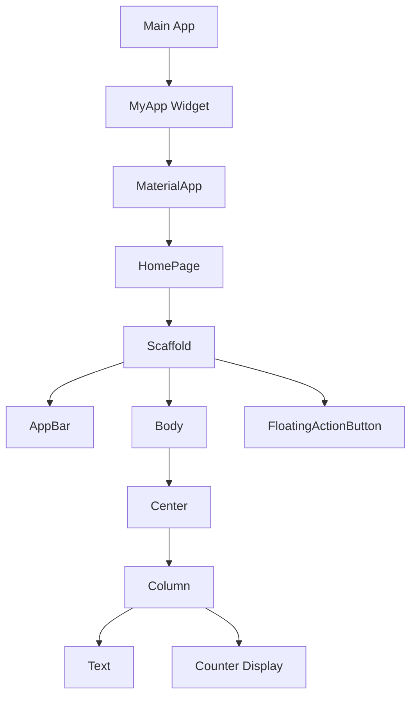

## 1.4.3 Running Your First Flutter App

Embarking on your journey with Flutter begins with running your first app. This section will guide you through the process of launching a Flutter application, exploring its default functionality, understanding console outputs, and making simple modifications to see immediate results. By the end of this guide, you'll have a solid foundation for experimenting with Flutter's powerful features.

### Running the App

Running a Flutter app can be done through the command line or an Integrated Development Environment (IDE). Both methods offer unique advantages, and understanding them will enhance your development workflow.

#### From the Command Line

The command line is a powerful tool for developers, offering a direct way to interact with your Flutter project. To run your app from the command line, follow these steps:

1. **Open Terminal or Command Prompt**:
   - Navigate to the root directory of your Flutter project. This is where your `pubspec.yaml` file is located.

2. **Run the App**:
   - Execute the following command:
     ```bash
     flutter run
     ```
   - This command compiles your Flutter app and launches it on the connected device or emulator.

3. **Select a Device**:
   - If multiple devices are connected, Flutter will prompt you to select one. Use the arrow keys to navigate and press Enter to choose.

#### From the IDE

Using an IDE like Visual Studio Code or Android Studio provides a more visual approach to running your app, with additional debugging tools.

1. **Open Your Project**:
   - Launch your IDE and open your Flutter project.

2. **Run or Debug Option**:
   - Locate the Run or Debug button, typically found in the toolbar. In Visual Studio Code, this is often a green triangle icon, while in Android Studio, it's a green play button.

3. **Select a Device**:
   - Ensure your desired device or emulator is selected from the device dropdown menu. This menu is usually located in the bottom right corner of the IDE.

4. **Launch the App**:
   - Click the Run or Debug button to compile and run your app.

### Selecting a Device

Flutter supports running apps on various devices, including physical devices and emulators. Here's how to choose the right one:

- **Physical Devices**:
  - Connect your device via USB and ensure USB debugging is enabled. Your device should appear in the list of available devices.

- **Emulators**:
  - Use Android Virtual Device (AVD) Manager in Android Studio or iOS Simulator on macOS to create and manage emulators. These virtual devices mimic real hardware, allowing you to test your app in different environments.

### Exploring the Default App

When you create a new Flutter project, it generates a default app—a simple counter application. This app serves as a great starting point for understanding Flutter's structure and capabilities.

#### Functionality of the Default Counter App

- **User Interface**:
  - The app displays a centered text showing the number of times a button has been pressed.

- **Interactivity**:
  - A floating action button at the bottom right corner increments the counter each time it's pressed.

- **State Management**:
  - The app uses a `StatefulWidget` to manage the counter's state, demonstrating how Flutter handles dynamic content.

#### Interacting with the App

- **Press the Button**:
  - Tap the floating action button to increase the counter. Observe how the displayed number updates instantly.

- **Explore the Code**:
  - Open `lib/main.dart` to see the code behind this functionality. Notice how the `setState` method updates the UI.

### Understanding the Console Output

Running your app generates logs in the terminal or IDE console. These logs provide valuable insights into your app's behavior.

#### Logs and Debug Messages

- **Startup Logs**:
  - When the app launches, you'll see logs detailing the build process and device information.

- **Debug Messages**:
  - Use `print` statements in your code to output custom messages. These appear in the console, aiding in debugging.

- **Error Messages**:
  - If your app encounters issues, error messages will appear here. Understanding these messages is crucial for troubleshooting.

### Making Simple Changes

Experimenting with code changes is a great way to learn. Let's make a small modification to the default app and observe the results.

#### Changing the Text

1. **Open `lib/main.dart`**:
   - Locate the line where the text is defined, typically within a `Text` widget.

2. **Modify the Text**:
   - Change the displayed text from "You have pushed the button this many times:" to something else, like "Button pressed count:".

3. **Save and Hot Reload**:
   - Save your changes and use Flutter's Hot Reload feature to see the update instantly. In the IDE, this is often a lightning bolt icon or can be triggered with `Ctrl + S` (Windows/Linux) or `Cmd + S` (macOS).

#### Introducing Hot Reload

- **What is Hot Reload?**:
  - Hot Reload allows you to apply code changes without restarting the app, preserving the current state. This feature significantly speeds up the development process.

- **How to Use Hot Reload**:
  - After making changes, simply save the file. The app will update automatically, reflecting your modifications.

### Visual Aids

To enhance your understanding, let's visualize the app's structure and its corresponding code elements.

#### App Structure Diagram



- **Explanation**:
  - This diagram illustrates the widget hierarchy of the default Flutter app. Each node represents a widget, showing how they nest within each other.

#### Code Highlighting

- **Highlighted Code**:
  - In `lib/main.dart`, the `Text` widget displays the counter message. Modify this widget to change the displayed text.

```dart
// Original Text Widget
Text(
  'You have pushed the button this many times:',
),

// Modified Text Widget
Text(
  'Button pressed count:',
),
```

### Best Practices and Common Pitfalls

- **Best Practices**:
  - Regularly use Hot Reload to test changes quickly.
  - Keep an eye on console logs for errors and warnings.
  - Experiment with small changes to understand their impact.

- **Common Pitfalls**:
  - Forgetting to save changes before Hot Reload.
  - Overlooking error messages in the console.
  - Not selecting the correct device for running the app.

### Additional Resources

- **Official Documentation**:
  - [Flutter Documentation](https://flutter.dev/docs)
  - [Dart Language Tour](https://dart.dev/guides/language/language-tour)

- **Books and Courses**:
  - "Flutter for Beginners" by Alessandro Biessek
  - "Dart Apprentice" by Jonathan Sande and Matt Galloway

- **Online Tutorials**:
  - [Flutter & Dart - The Complete Guide](https://www.udemy.com/course/learn-flutter-dart-to-build-ios-android-apps/)

### Summary

Running your first Flutter app is an exciting milestone. By mastering both command line and IDE methods, exploring the default app, and making simple changes, you lay the groundwork for more complex projects. Remember to leverage Hot Reload for efficient development and keep experimenting to deepen your understanding.

## Quiz Time!



### What command is used to run a Flutter app from the command line?

- [x] flutter run
- [ ] flutter start
- [ ] flutter execute
- [ ] flutter launch

> **Explanation:** The `flutter run` command is used to compile and run a Flutter app from the command line.

### Which IDE feature allows you to run a Flutter app?

- [x] Run or Debug button
- [ ] Build button
- [ ] Compile button
- [ ] Execute button

> **Explanation:** The Run or Debug button in an IDE like Visual Studio Code or Android Studio is used to launch a Flutter app.

### How can you select a device to run your Flutter app on?

- [x] Use the device dropdown menu in the IDE
- [ ] Use the `flutter select` command
- [ ] Use the `flutter device` command
- [ ] Use the `flutter choose` command

> **Explanation:** The device dropdown menu in the IDE allows you to select the device or emulator to run your app on.

### What is the purpose of the default counter app in Flutter?

- [x] To demonstrate basic Flutter functionality and state management
- [ ] To showcase advanced animations
- [ ] To provide a template for e-commerce apps
- [ ] To illustrate complex networking

> **Explanation:** The default counter app demonstrates basic Flutter functionality and state management using a simple counter.

### What does the Hot Reload feature do?

- [x] Applies code changes without restarting the app
- [ ] Restarts the app with changes
- [ ] Compiles the app from scratch
- [ ] Deletes the app cache

> **Explanation:** Hot Reload applies code changes instantly without restarting the app, preserving the current state.

### How do you trigger Hot Reload in most IDEs?

- [x] Save the file
- [ ] Press the Run button
- [ ] Use the `flutter reload` command
- [ ] Restart the IDE

> **Explanation:** Saving the file triggers Hot Reload in most IDEs, applying changes immediately.

### What is a common pitfall when using Hot Reload?

- [x] Forgetting to save changes before reloading
- [ ] Using the wrong IDE
- [ ] Running the app on a physical device
- [ ] Using the command line

> **Explanation:** A common pitfall is forgetting to save changes before triggering Hot Reload, which prevents updates from being applied.

### What type of widget is used to manage the counter's state in the default app?

- [x] StatefulWidget
- [ ] StatelessWidget
- [ ] InheritedWidget
- [ ] ProviderWidget

> **Explanation:** A `StatefulWidget` is used to manage the counter's state, allowing the UI to update dynamically.

### How can you view error messages when running a Flutter app?

- [x] Check the console output
- [ ] Look at the app screen
- [ ] Use the `flutter errors` command
- [ ] Check the device settings

> **Explanation:** Error messages are displayed in the console output, providing insights into issues during app execution.

### True or False: The default Flutter app uses a `StatelessWidget` to manage the counter.

- [ ] True
- [x] False

> **Explanation:** False. The default Flutter app uses a `StatefulWidget` to manage the counter, allowing it to update the UI dynamically.


