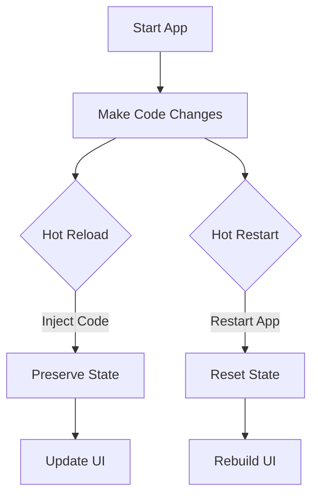

## 1.4.4 Exploring Hot Reload and Hot Restart

In the world of mobile app development, efficiency and speed are crucial. Flutter, Google's UI toolkit for building natively compiled applications, offers two powerful features—Hot Reload and Hot Restart—that significantly enhance the development experience. These features allow developers to see the effects of their code changes almost instantaneously, making the development process more interactive and less time-consuming. In this section, we will delve into the intricacies of Hot Reload and Hot Restart, exploring how they work, when to use them, and their limitations.

### Understanding Hot Reload

Hot Reload is one of Flutter's most celebrated features. It allows developers to inject updated source code files into the running Dart Virtual Machine (VM) without restarting the entire application. This process is incredibly fast and efficient, preserving the current state of the app. As a result, developers can make UI tweaks and small changes without losing the app's state, which is particularly useful during the iterative development process.

#### How Hot Reload Works

When you perform a Hot Reload, Flutter takes the updated code and injects it into the Dart VM. The framework then rebuilds the widget tree, reflecting the changes in the UI. This process is quick because it doesn't require a full restart of the app, allowing you to see the results of your changes almost instantly.

Here's a simple analogy: imagine you're painting a picture. Hot Reload is like adding a few brush strokes to your painting without having to start over. You can see the effect of your new strokes immediately, allowing you to adjust and refine your work as needed.

#### Demonstration: Using Hot Reload

Let's walk through a practical example to see Hot Reload in action. Suppose you have a simple Flutter app with a text widget displaying "Hello, Flutter!" and you want to change the text color.

1. **Initial Setup**: Start with a basic Flutter app. Your `main.dart` file might look like this:

    ```dart
    import 'package:flutter/material.dart';

    void main() => runApp(MyApp());

    class MyApp extends StatelessWidget {
      @override
      Widget build(BuildContext context) {
        return MaterialApp(
          home: Scaffold(
            appBar: AppBar(title: Text('Hot Reload Example')),
            body: Center(
              child: Text(
                'Hello, Flutter!',
                style: TextStyle(fontSize: 24),
              ),
            ),
          ),
        );
      }
    }
    ```

2. **Running the App**: Launch the app on an emulator or a physical device. You should see "Hello, Flutter!" displayed in the center of the screen.

3. **Making Changes**: Now, let's change the text color to blue. Modify the `TextStyle` in the `Text` widget:

    ```dart
    child: Text(
      'Hello, Flutter!',
      style: TextStyle(fontSize: 24, color: Colors.blue),
    ),
    ```

4. **Performing Hot Reload**: Save the changes and perform a Hot Reload. In most IDEs like Visual Studio Code or Android Studio, you can do this by pressing `r` in the terminal where your app is running or by clicking the Hot Reload button.

5. **Observing the Effect**: Instantly, you should see the text color change to blue without losing the app's state.

This immediate feedback loop is what makes Hot Reload an invaluable tool for developers, especially when making UI adjustments or small code changes.

### Understanding Hot Restart

While Hot Reload is excellent for quick changes, there are times when you need to restart the entire application. This is where Hot Restart comes into play. Unlike Hot Reload, Hot Restart restarts the app and rebuilds the state from scratch. It reloads the app's main method and initializes the app as if it were being launched for the first time.

#### Differences Between Hot Reload and Hot Restart

- **State Preservation**: Hot Reload preserves the app's state, making it ideal for UI tweaks and small changes. Hot Restart, on the other hand, resets the state, which is useful when you need to clear the app's memory or when changes affect the app's initialization logic.
- **Speed**: Hot Reload is faster because it doesn't restart the entire app. Hot Restart takes a bit longer as it involves restarting the app and rebuilding the state.

#### When to Use Each

- **Hot Reload**: Use Hot Reload for minor changes, UI adjustments, and during active development when you want to see the effects of your changes immediately without losing the current state.
- **Hot Restart**: Use Hot Restart when you need to reset the global state, after changes to the app's main method, or when you encounter issues that require a full restart to resolve.

### Visual Guides

To better understand the differences and see these features in action, let's visualize the process using diagrams.



In this diagram:
- **Hot Reload**: Injects code, preserves state, and updates the UI.
- **Hot Restart**: Restarts the app, resets the state, and rebuilds the UI.

### Limitations and Tips

While Hot Reload and Hot Restart are powerful tools, they have some limitations:

- **Hot Reload Limitations**: It won't work for changes in certain files, such as those affecting native code or the app's main method. For these changes, a Hot Restart or a full restart is necessary.
- **Hot Restart Limitations**: Although it resets the state, it doesn't clear the app's memory completely. For a complete reset, you may need to stop and restart the app manually.

#### Tips for Efficient Use

- **Frequent Hot Reloads**: Use Hot Reload frequently during development to see changes instantly and maintain your workflow.
- **Strategic Hot Restarts**: Use Hot Restart strategically when you need to reset the state or after significant changes to the app's structure.
- **IDE Shortcuts**: Familiarize yourself with IDE shortcuts for Hot Reload and Hot Restart to streamline your development process.

### Summary and Key Takeaways

- **Hot Reload** is ideal for quick UI changes and small code modifications, preserving the app's state and providing immediate feedback.
- **Hot Restart** is necessary when you need to reset the app's state or after changes that affect the app's initialization.
- Both features enhance productivity by reducing the time spent on recompiling and restarting the app.
- Understanding when and how to use each feature can significantly improve your development workflow.

By mastering Hot Reload and Hot Restart, you can make your Flutter development process more efficient and enjoyable. Experiment with these features in your projects to fully appreciate their benefits and integrate them into your daily workflow.

## Quiz Time!



### What is the primary benefit of using Hot Reload in Flutter?

- [x] It allows developers to see changes instantly without losing the app's state.
- [ ] It restarts the app and clears all data.
- [ ] It is used for deploying apps to production.
- [ ] It only works for native code changes.

> **Explanation:** Hot Reload injects updated code into the running app, preserving the state and allowing developers to see changes immediately.

### When should you use Hot Restart instead of Hot Reload?

- [x] When you need to reset the global state or after changes to the app's main method.
- [ ] For minor UI tweaks and small code changes.
- [ ] Only when deploying the app to a device.
- [ ] When you want to preserve the app's state.

> **Explanation:** Hot Restart is used to reset the app's state and is necessary after changes that affect the app's initialization logic.

### Which of the following is a limitation of Hot Reload?

- [x] It does not work for changes in native code or the app's main method.
- [ ] It takes longer than Hot Restart.
- [ ] It clears the app's state.
- [ ] It requires a full app restart.

> **Explanation:** Hot Reload cannot apply changes to native code or the app's main method, requiring a Hot Restart or full restart for such changes.

### What happens to the app's state during a Hot Restart?

- [x] The app's state is reset, and the app is reinitialized.
- [ ] The app's state is preserved, and only the UI is updated.
- [ ] The app's state is saved to a file.
- [ ] The app's state is duplicated.

> **Explanation:** Hot Restart resets the app's state and reinitializes the app, unlike Hot Reload, which preserves the state.

### How does Hot Reload affect the widget tree?

- [x] It rebuilds the widget tree with the updated code.
- [ ] It deletes the widget tree and starts over.
- [ ] It saves the widget tree to a database.
- [ ] It does not affect the widget tree.

> **Explanation:** Hot Reload injects updated code and rebuilds the widget tree to reflect changes in the UI.

### Which IDE shortcut is commonly used for Hot Reload?

- [x] Pressing `r` in the terminal where the app is running.
- [ ] Pressing `Ctrl + Alt + Delete`.
- [ ] Clicking the "Stop" button.
- [ ] Pressing `Shift + F5`.

> **Explanation:** In most IDEs, pressing `r` in the terminal where the app is running triggers a Hot Reload.

### What is the main difference between Hot Reload and Hot Restart?

- [x] Hot Reload preserves the state, while Hot Restart resets it.
- [ ] Hot Reload is slower than Hot Restart.
- [ ] Hot Restart preserves the state, while Hot Reload resets it.
- [ ] There is no difference between them.

> **Explanation:** Hot Reload preserves the app's state, making it ideal for quick changes, while Hot Restart resets the state and reinitializes the app.

### Can Hot Reload be used for changes in the app's main method?

- [ ] Yes, it can apply changes to the main method.
- [x] No, changes to the main method require a Hot Restart.
- [ ] Yes, but only for minor changes.
- [ ] No, it requires a full app rebuild.

> **Explanation:** Changes to the app's main method require a Hot Restart, as Hot Reload cannot apply these changes.

### What is a common use case for Hot Restart?

- [x] Resetting the app's state after significant changes.
- [ ] Making quick UI adjustments.
- [ ] Deploying the app to production.
- [ ] Testing native code changes.

> **Explanation:** Hot Restart is commonly used to reset the app's state after significant changes or when the app's initialization logic is affected.

### True or False: Hot Reload is faster than Hot Restart because it doesn't restart the entire app.

- [x] True
- [ ] False

> **Explanation:** Hot Reload is faster because it injects updated code without restarting the entire app, preserving the state and providing immediate feedback.


