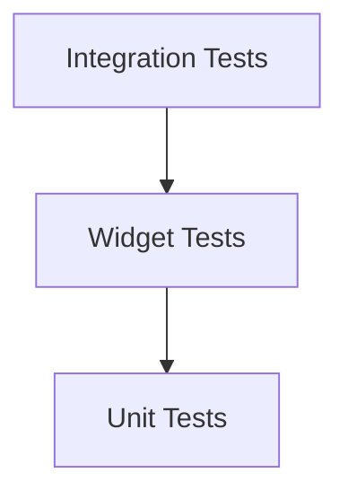

## 10.1.2 Types of Tests

Testing is a crucial aspect of software development, ensuring that applications function correctly and reliably. In Flutter, testing is divided into three main types: unit tests, widget tests, and integration tests. Each type serves a distinct purpose and contributes to the overall quality and stability of the application. In this section, we will explore these test types in detail, providing insights, code examples, and best practices to help you implement effective testing strategies in your Flutter projects.

### Detailed Explanation of Test Types

#### Unit Tests

Unit tests are the foundation of any testing strategy. They focus on verifying the smallest parts of an application, such as individual functions or classes. The primary goal of unit tests is to ensure that each unit of code performs as expected in isolation. 

- **Definition and Purpose:**
  - Unit tests are designed to test a single "unit" of code, typically a function or a class method, to ensure it behaves as intended.
  - They should be fast to execute and not depend on external systems like databases or network services.

- **Characteristics:**
  - **Isolation:** Unit tests should isolate the code being tested from external dependencies. This is often achieved using mocking or stubbing techniques.
  - **Speed:** Since unit tests do not interact with external systems, they are generally quick to run, allowing for rapid feedback during development.
  - **Reliability:** By focusing on small units of code, unit tests can quickly identify defects and ensure that individual components work correctly.

- **Example Scenario:**
  - Testing a function that calculates the sum of two numbers. This function can be tested independently without any external dependencies.

- **Code Example:**

  ```dart
  import 'package:test/test.dart';

  // Function to be tested
  int add(int a, int b) {
    return a + b;
  }

  void main() {
    test('add function should return the sum of two numbers', () {
      expect(add(2, 3), equals(5));
      expect(add(-1, 1), equals(0));
    });
  }
  ```

#### Widget Tests

Widget tests, also known as component tests, verify the UI components in isolation. They ensure that widgets render correctly and respond to user interactions as expected.

- **Definition and Purpose:**
  - Widget tests focus on testing the UI components of an application. They ensure that widgets display correctly and handle user interactions properly.
  - These tests are more comprehensive than unit tests as they involve rendering widgets and simulating user actions.

- **Characteristics:**
  - **UI Focused:** Widget tests validate the appearance and behavior of UI components.
  - **Interaction Testing:** They simulate user interactions, such as taps and gestures, to verify that the UI responds correctly.
  - **Isolation:** While widget tests involve more components than unit tests, they still aim to isolate the widget being tested from the rest of the application.

- **Example Scenario:**
  - Testing a button widget to ensure it displays the correct label and triggers the expected action when tapped.

- **Code Example:**

  ```dart
  import 'package:flutter_test/flutter_test.dart';
  import 'package:flutter/material.dart';

  void main() {
    testWidgets('Button displays correct label and responds to tap', (WidgetTester tester) async {
      // Define the widget to be tested
      final testWidget = MaterialApp(
        home: Scaffold(
          body: ElevatedButton(
            onPressed: () {},
            child: Text('Tap me'),
          ),
        ),
      );

      // Build the widget
      await tester.pumpWidget(testWidget);

      // Verify the button displays the correct label
      expect(find.text('Tap me'), findsOneWidget);

      // Simulate a tap on the button
      await tester.tap(find.byType(ElevatedButton));
      await tester.pump();

      // Additional assertions can be made here to verify the button's behavior
    });
  }
  ```

#### Integration Tests

Integration tests validate the interactions between different parts of the app. They simulate real user behavior, including gestures, animations, and network requests, to ensure that the application works as a cohesive whole.

- **Definition and Purpose:**
  - Integration tests test the complete application or a significant part of it, ensuring that all components work together as expected.
  - They are designed to simulate real-world user scenarios and interactions.

- **Characteristics:**
  - **Comprehensive:** Integration tests cover multiple components and their interactions, providing a broader scope than unit or widget tests.
  - **Realistic Scenarios:** They simulate real user actions, such as navigating through screens and making network requests.
  - **Complexity:** Due to their comprehensive nature, integration tests can be more complex and time-consuming to write and execute.

- **Example Scenario:**
  - Testing a login flow that involves entering credentials, submitting the form, and verifying the successful navigation to the home screen.

- **Code Example:**

  ```dart
  import 'package:flutter_test/flutter_test.dart';
  import 'package:integration_test/integration_test.dart';
  import 'package:my_app/main.dart' as app;

  void main() {
    IntegrationTestWidgetsFlutterBinding.ensureInitialized();

    testWidgets('Login flow test', (WidgetTester tester) async {
      app.main();
      await tester.pumpAndSettle();

      // Enter username and password
      await tester.enterText(find.byKey(Key('usernameField')), 'testuser');
      await tester.enterText(find.byKey(Key('passwordField')), 'password123');

      // Tap the login button
      await tester.tap(find.byKey(Key('loginButton')));
      await tester.pumpAndSettle();

      // Verify navigation to the home screen
      expect(find.text('Welcome, testuser!'), findsOneWidget);
    });
  }
  ```

### Visual Diagrams

To better understand the relationship between these test types, consider the following layered diagram:



This diagram illustrates how unit tests form the base layer, providing a foundation for testing individual components. Widget tests build on top of unit tests, focusing on UI components and interactions. Finally, integration tests encompass the full application, validating the interactions between different parts of the app.

### Importance of Each Test Type

Each test type serves a different purpose and is essential for comprehensive test coverage:

- **Unit Tests:**
  - Ideal for testing individual functions or methods.
  - Provide fast feedback and help identify defects early in the development process.

- **Widget Tests:**
  - Ensure that UI components render correctly and respond to user interactions.
  - Useful for testing the visual and interactive aspects of the application.

- **Integration Tests:**
  - Validate the overall functionality and user experience of the application.
  - Simulate real-world scenarios to ensure that all components work together seamlessly.

By utilizing all three test types, developers can achieve a balanced testing strategy that covers all aspects of the application, from individual units to the complete user experience.

### Best Practices

To maximize the effectiveness of your testing strategy, consider the following best practices:

- **Balanced Testing Approach:**
  - Employ a mix of unit, widget, and integration tests to cover different aspects of your application.
  - The testing pyramid concept suggests having more unit tests than widget tests, and more widget tests than integration tests, to ensure efficient and comprehensive coverage.

- **Testing Pyramid:**
  - The testing pyramid is a widely accepted concept that emphasizes the importance of having a solid foundation of unit tests, supported by fewer widget tests and even fewer integration tests.
  - This approach helps maintain a balance between test coverage and execution time.

- **Continuous Testing:**
  - Integrate testing into your continuous integration (CI) pipeline to ensure that tests are run automatically with every code change.
  - This practice helps catch defects early and maintain the quality of the application over time.

- **Mocking and Stubbing:**
  - Use mocking and stubbing techniques to isolate the code under test and eliminate dependencies on external systems.
  - This approach ensures that tests are reliable and can be executed quickly.

- **Regular Test Maintenance:**
  - Regularly review and update your tests to ensure they remain relevant and effective as the application evolves.
  - Remove obsolete tests and add new ones as needed to maintain comprehensive coverage.

By following these best practices, you can create a robust testing strategy that ensures the reliability and quality of your Flutter applications.

### Conclusion

Testing is an integral part of the software development process, and understanding the different types of tests is crucial for building reliable and high-quality applications. Unit tests, widget tests, and integration tests each play a unique role in verifying the functionality and performance of your application. By employing a balanced testing approach and adhering to best practices, you can ensure that your Flutter applications are robust, reliable, and ready for production.

## Quiz Time!



### What is the primary focus of unit tests in Flutter?

- [x] Verifying the smallest parts of an application, such as functions or classes
- [ ] Testing the entire application as a whole
- [ ] Ensuring UI components render correctly
- [ ] Simulating real user behavior

> **Explanation:** Unit tests focus on verifying individual functions or classes, ensuring they work correctly in isolation.

### Which test type is best suited for testing UI components in isolation?

- [ ] Unit Tests
- [x] Widget Tests
- [ ] Integration Tests
- [ ] System Tests

> **Explanation:** Widget tests are designed to verify UI components in isolation, ensuring they render correctly and respond to user interactions.

### What do integration tests validate in a Flutter application?

- [ ] Individual functions or methods
- [ ] UI components in isolation
- [x] Interactions between different parts of the app
- [ ] Code syntax and style

> **Explanation:** Integration tests validate the interactions between different parts of the app, simulating real user behavior and ensuring the application works as a cohesive whole.

### Which of the following is a characteristic of unit tests?

- [x] They should be fast and not depend on external systems.
- [ ] They simulate real user interactions.
- [ ] They involve rendering widgets.
- [ ] They test the entire application.

> **Explanation:** Unit tests are designed to be fast and independent of external systems, focusing on individual units of code.

### What is the purpose of the testing pyramid concept?

- [x] To emphasize having more unit tests than widget tests, and more widget tests than integration tests
- [ ] To ensure all tests are of equal importance
- [ ] To prioritize integration tests over other test types
- [ ] To eliminate the need for unit tests

> **Explanation:** The testing pyramid concept emphasizes having a solid foundation of unit tests, supported by fewer widget tests and even fewer integration tests, to ensure efficient and comprehensive coverage.

### Which test type is most comprehensive and simulates real-world user scenarios?

- [ ] Unit Tests
- [ ] Widget Tests
- [x] Integration Tests
- [ ] Smoke Tests

> **Explanation:** Integration tests are the most comprehensive, simulating real-world user scenarios and interactions to ensure the application works as a cohesive whole.

### What is a common practice to isolate code in unit tests?

- [x] Using mocking and stubbing techniques
- [ ] Running tests in a production environment
- [ ] Testing the entire application at once
- [ ] Ignoring external dependencies

> **Explanation:** Mocking and stubbing techniques are commonly used to isolate code in unit tests, eliminating dependencies on external systems.

### How do widget tests differ from unit tests?

- [ ] They are faster and more isolated.
- [x] They focus on UI components and interactions.
- [ ] They validate the entire application.
- [ ] They are only used for backend testing.

> **Explanation:** Widget tests focus on UI components and interactions, ensuring that widgets render correctly and respond to user actions.

### What is the main advantage of continuous testing in a CI pipeline?

- [x] It helps catch defects early and maintain application quality.
- [ ] It eliminates the need for manual testing.
- [ ] It reduces the number of tests needed.
- [ ] It focuses only on integration tests.

> **Explanation:** Continuous testing in a CI pipeline helps catch defects early and maintain application quality by automatically running tests with every code change.

### True or False: Integration tests are typically faster to execute than unit tests.

- [ ] True
- [x] False

> **Explanation:** Integration tests are typically more comprehensive and involve more components, making them slower to execute than unit tests, which focus on individual units of code.


