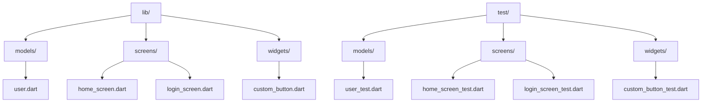

## 10.1.3 Setting Up Testing Environment

Testing is a crucial part of software development, ensuring that your Flutter applications are robust, reliable, and free of bugs. In this section, we'll explore how to set up a testing environment in Flutter, focusing on configuring your project, organizing test files, and using essential testing tools and libraries. By the end of this guide, you'll be equipped to write and manage tests effectively, enhancing the quality of your Flutter applications.

### Configuring the Project for Testing

Flutter projects come preconfigured for testing, making it easy to get started. When you create a new Flutter project, a `test/` directory is automatically generated. This directory is where you'll organize and store all your test files.

#### Organizing Tests within the `test/` Directory

A well-organized test directory mirrors the structure of your `lib/` directory. This approach ensures that each component or module in your application has corresponding tests, making it easier to maintain and navigate your test suite.

- **Example Structure:**

  Suppose your `lib/` directory is structured as follows:

  ```
  lib/
  ├── main.dart
  ├── models/
  │   └── user.dart
  ├── screens/
  │   ├── home_screen.dart
  │   └── login_screen.dart
  └── widgets/
      └── custom_button.dart
  ```

  Your `test/` directory should reflect this structure:

  ```
  test/
  ├── models/
  │   └── user_test.dart
  ├── screens/
  │   ├── home_screen_test.dart
  │   └── login_screen_test.dart
  └── widgets/
      └── custom_button_test.dart
  ```

This organization helps maintain a clear relationship between your application code and its tests, facilitating easier updates and debugging.

### Dependencies

Flutter's testing capabilities are powered by the `flutter_test` package, which is included in the Flutter SDK by default. This package provides a comprehensive set of tools for writing unit, widget, and integration tests.

- **Key Features of `flutter_test`:**
  - Provides functions like `test()`, `testWidgets()`, and `setUp()` for structuring tests.
  - Offers utilities for simulating user interactions and verifying UI behavior.
  - Supports asynchronous testing, allowing you to test code that involves futures and streams.

### Creating a Test File

Creating a new test file in Flutter is straightforward. Follow these steps to set up a basic test file:

1. **Navigate to the `test/` Directory:**

   Open your Flutter project in your preferred IDE (e.g., VS Code, Android Studio) and navigate to the `test/` directory.

2. **Create a New Dart File:**

   Create a new Dart file within the `test/` directory. For example, if you're testing a counter feature, you might name the file `counter_test.dart`.

   ```plaintext
   test/
   └── counter_test.dart
   ```

3. **Import Testing Libraries:**

   At the top of your new test file, import the necessary testing libraries. The `flutter_test` package is essential for writing tests in Flutter.

   ```dart
   import 'package:flutter_test/flutter_test.dart';
   ```

### Using Test Widgets and Functions

Flutter provides several functions to help you write effective tests. Let's explore some of the most commonly used functions:

- **`test()`:** Used for writing unit tests. It defines a single test case.

  ```dart
  test('description of the test', () {
    // Test code goes here.
  });
  ```

- **`testWidgets()`:** Used for writing widget tests. It allows you to test the UI and interactions.

  ```dart
  testWidgets('description of the widget test', (WidgetTester tester) async {
    // Test code goes here.
  });
  ```

- **`setUp()`:** Used to define common setup code that runs before each test.

  ```dart
  setUp(() {
    // Setup code goes here.
  });
  ```

#### Structure of a Test Case

A typical test case in Flutter might look like this:

```dart
import 'package:flutter_test/flutter_test.dart';

void main() {
  setUp(() {
    // Common setup code.
  });

  test('Counter increments', () {
    // Arrange
    int counter = 0;

    // Act
    counter++;

    // Assert
    expect(counter, 1);
  });

  testWidgets('Counter increments in the UI', (WidgetTester tester) async {
    // Build the widget.
    await tester.pumpWidget(MyApp());

    // Verify initial state.
    expect(find.text('0'), findsOneWidget);

    // Tap the '+' icon and trigger a frame.
    await tester.tap(find.byIcon(Icons.add));
    await tester.pump();

    // Verify the counter has incremented.
    expect(find.text('1'), findsOneWidget);
  });
}
```

In this example, we have two tests: one unit test for a simple counter increment and one widget test for verifying the UI behavior of a counter widget.

### Visual Aids

To better understand the setup, let's visualize the project structure and a sample test file.

#### Project Structure Diagram



#### Sample Test File with Annotations

```dart
import 'package:flutter_test/flutter_test.dart';

void main() {
  // This setup function runs before each test.
  setUp(() {
    // Initialize variables or state here.
  });

  // A simple unit test for incrementing a counter.
  test('Counter increments', () {
    // Arrange: Set up initial conditions.
    int counter = 0;

    // Act: Perform the action to be tested.
    counter++;

    // Assert: Verify the result.
    expect(counter, 1);
  });

  // A widget test for verifying UI behavior.
  testWidgets('Counter increments in the UI', (WidgetTester tester) async {
    // Build the widget tree.
    await tester.pumpWidget(MyApp());

    // Verify the initial state of the widget.
    expect(find.text('0'), findsOneWidget);

    // Simulate a user interaction.
    await tester.tap(find.byIcon(Icons.add));
    await tester.pump();

    // Verify the updated state of the widget.
    expect(find.text('1'), findsOneWidget);
  });
}
```

### Best Practices

To ensure your tests are effective and maintainable, consider the following best practices:

- **Mirror the `lib/` Structure:**

  Organize your test files to reflect the structure of your `lib/` directory. This approach makes it easier to locate and manage tests related to specific components.

- **Consistent Naming:**

  Name your test files with the `_test.dart` suffix. This convention helps identify test files quickly and ensures compatibility with testing tools.

- **Write Descriptive Test Names:**

  Use descriptive names for your test cases to clearly convey their purpose. This practice improves readability and helps others understand the intent of each test.

- **Isolate Tests:**

  Ensure that each test is independent and does not rely on the state or results of other tests. This isolation prevents tests from affecting each other and makes debugging easier.

- **Use `setUp()` for Common Code:**

  Utilize the `setUp()` function to define common setup code that runs before each test. This approach reduces redundancy and keeps your tests clean.

### Conclusion

Setting up a testing environment in Flutter is a straightforward process, thanks to the built-in support provided by the Flutter SDK. By organizing your tests effectively, using the right tools and functions, and following best practices, you can create a robust test suite that ensures the quality and reliability of your Flutter applications.

Testing is not just about finding bugs; it's about building confidence in your code and delivering a seamless user experience. As you continue to develop your Flutter skills, remember that testing is an integral part of the development process, and investing time in setting up a solid testing environment will pay off in the long run.

## Quiz Time!



### What is the default directory for storing test files in a Flutter project?

- [x] `test/`
- [ ] `lib/`
- [ ] `src/`
- [ ] `assets/`

> **Explanation:** Flutter projects automatically create a `test/` directory for storing test files, making it easy to organize and manage tests.

### Which package provides the necessary tools for testing in Flutter?

- [x] `flutter_test`
- [ ] `flutter_tools`
- [ ] `flutter_dev`
- [ ] `flutter_sdk`

> **Explanation:** The `flutter_test` package, included in the Flutter SDK, provides essential tools for writing unit, widget, and integration tests.

### How should test files be named for consistency?

- [x] With the `_test.dart` suffix
- [ ] With the `_spec.dart` suffix
- [ ] With the `_check.dart` suffix
- [ ] With the `_verify.dart` suffix

> **Explanation:** Naming test files with the `_test.dart` suffix is a convention that helps identify test files and ensures compatibility with testing tools.

### What function is used to define a single test case in Flutter?

- [x] `test()`
- [ ] `runTest()`
- [ ] `executeTest()`
- [ ] `performTest()`

> **Explanation:** The `test()` function is used to define a single test case in Flutter, allowing you to specify the test's description and code.

### What is the purpose of the `setUp()` function in testing?

- [x] To define common setup code that runs before each test
- [ ] To execute tests in parallel
- [ ] To clean up resources after each test
- [ ] To generate test reports

> **Explanation:** The `setUp()` function is used to define common setup code that runs before each test, reducing redundancy and keeping tests clean.

### Which function is used for writing widget tests in Flutter?

- [x] `testWidgets()`
- [ ] `widgetTest()`
- [ ] `uiTest()`
- [ ] `screenTest()`

> **Explanation:** The `testWidgets()` function is used for writing widget tests, allowing you to test UI components and interactions.

### What should the `test/` directory structure mirror?

- [x] The `lib/` directory structure
- [ ] The `assets/` directory structure
- [ ] The `build/` directory structure
- [ ] The `config/` directory structure

> **Explanation:** Organizing the `test/` directory to mirror the `lib/` directory structure helps maintain a clear relationship between application code and tests.

### Why is it important to isolate tests?

- [x] To prevent tests from affecting each other
- [ ] To reduce test execution time
- [ ] To increase test coverage
- [ ] To simplify test naming

> **Explanation:** Isolating tests ensures that each test is independent and does not rely on the state or results of other tests, making debugging easier.

### What is the benefit of using descriptive test names?

- [x] Improves readability and understanding of test intent
- [ ] Reduces test execution time
- [ ] Increases test coverage
- [ ] Simplifies test setup

> **Explanation:** Descriptive test names clearly convey the purpose of each test, improving readability and helping others understand the test's intent.

### True or False: The `flutter_test` package must be manually added to a Flutter project.

- [ ] True
- [x] False

> **Explanation:** The `flutter_test` package is included in the Flutter SDK by default, so it does not need to be manually added to a Flutter project.


