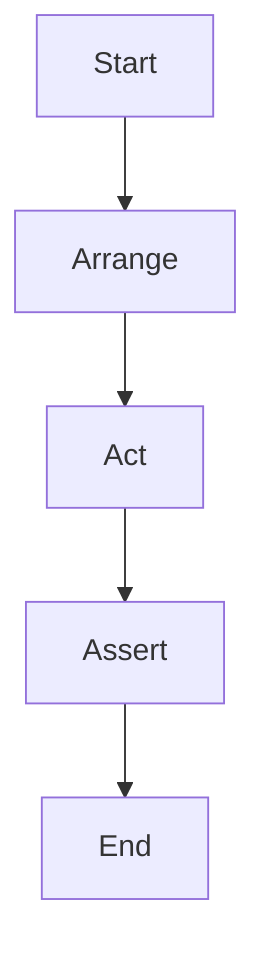

## 10.1.4 Best Practices for Writing Tests

In the realm of software development, testing is a critical component that ensures the reliability, functionality, and quality of applications. For Flutter developers, writing effective tests is paramount to delivering robust applications. This section delves into the best practices for writing tests in Flutter, focusing on clarity, isolation, structure, and stability.

### Writing Clear and Concise Tests

Clear and concise tests are the cornerstone of maintainable codebases. Tests should be easy to read and understand, serving as documentation for the expected behavior of your code. Here are some key strategies:

- **Descriptive Test Names:** Use descriptive names for your test cases that clearly convey what the test is verifying. A good test name should describe the scenario being tested and the expected outcome. For example, `test('should increment the counter value')` succinctly describes the behavior being tested.

- **Readable Code:** Write tests that are easy to follow. Avoid complex logic within tests; instead, focus on straightforward assertions that verify the expected outcomes.

- **Comments and Documentation:** While tests should be self-explanatory, adding comments can help clarify the purpose of complex test cases or setup procedures.

### Isolation

Testing units in isolation is crucial to pinpoint specific issues when tests fail. This practice ensures that tests are reliable and not affected by external factors. Here’s how you can achieve isolation:

- **Mocking and Stubbing:** Use mocking and stubbing to replace real dependencies with controlled, predictable substitutes. This allows you to test a unit without relying on external systems or data. For instance, when testing a network service, you can mock the HTTP client to return predefined responses.

- **Independent Tests:** Ensure that each test is independent and does not rely on the state or outcome of other tests. This independence prevents cascading failures and makes it easier to identify the root cause of issues.

### Consistent Structure

A consistent structure in your tests enhances readability and maintainability. The Arrange-Act-Assert (AAA) pattern is a widely adopted structure that organizes tests into three distinct phases:

- **Arrange:** Set up the testing objects and prepare the prerequisites for the test. This phase involves initializing objects, setting up mock responses, and configuring the environment.

- **Act:** Execute the behavior or function that you want to test. This is the core action that triggers the functionality under test.

- **Assert:** Verify that the expected outcomes occur. Use assertions to check that the actual results match the expected results.

Here’s an example of a well-structured test using the AAA pattern:

```dart
void main() {
  group('Counter', () {
    test('should increment the counter value', () {
      // Arrange
      final counter = Counter();

      // Act
      counter.increment();

      // Assert
      expect(counter.value, 1);
    });
  });
}
```

### Utilizing Test Lifecycle Methods

Flutter’s testing framework provides lifecycle methods such as `setUp()` and `tearDown()` to manage initialization and cleanup tasks before and after tests. These methods help maintain a clean test environment and reduce redundancy:

- **setUp():** Use this method to initialize common objects or state needed for multiple tests. It runs before each test in the group.

- **tearDown():** Use this method to clean up resources or reset states after each test. It ensures that tests do not leave residual effects that could impact subsequent tests.

### Avoiding Flaky Tests

Flaky tests are unreliable and can lead to false positives or negatives, undermining the confidence in your test suite. To avoid flaky tests, consider the following practices:

- **Stable and Predictable Data:** Use fixed data sets and mock responses to ensure consistent test results. Avoid relying on dynamic data that can change between test runs.

- **Avoid Timing Dependencies:** Tests that rely on specific timing or external systems (e.g., network calls) are prone to flakiness. Use mocking to simulate these dependencies and control their behavior.

- **Isolate External Systems:** When testing features that interact with external systems, such as databases or APIs, use stubs or mocks to isolate these interactions.

### Visual Aids

Visual aids can enhance understanding and provide a clear overview of the testing process. Here’s a flowchart illustrating the Arrange-Act-Assert pattern:



### Best Practices Summary

To summarize, here are the best practices for writing effective tests in Flutter:

- Write clear and concise tests with descriptive names.
- Test units in isolation using mocking and stubbing.
- Follow a consistent structure: Arrange, Act, Assert.
- Utilize `setUp()` and `tearDown()` for test lifecycle management.
- Avoid flaky tests by using stable data and isolating external dependencies.

By adhering to these best practices, you can create a robust and reliable test suite that enhances the quality and maintainability of your Flutter applications.

### Additional Resources

For further exploration of testing in Flutter, consider the following resources:

- [Flutter Testing Documentation](https://flutter.dev/docs/testing)
- [Effective Dart: Testing](https://dart.dev/guides/language/effective-dart/testing)
- [Mockito Package](https://pub.dev/packages/mockito) for mocking in Dart
- [Test Package](https://pub.dev/packages/test) for writing tests in Dart

These resources provide deeper insights and practical guidance for mastering testing in Flutter.

## Quiz Time!



### What is the primary benefit of writing clear and concise tests?

- [x] They are easier to understand and maintain.
- [ ] They execute faster.
- [ ] They require less code.
- [ ] They eliminate the need for documentation.

> **Explanation:** Clear and concise tests are easier to understand and maintain, which is crucial for long-term project sustainability.

### Why is isolation important in testing?

- [x] It ensures that failures pinpoint specific issues.
- [ ] It speeds up the test execution.
- [ ] It reduces the number of tests needed.
- [ ] It eliminates the need for assertions.

> **Explanation:** Isolation helps identify specific issues by ensuring that tests do not interfere with each other.

### What is the purpose of the Arrange phase in the AAA pattern?

- [x] To set up the testing objects and prepare prerequisites.
- [ ] To execute the behavior being tested.
- [ ] To verify the expected outcomes.
- [ ] To clean up after the test.

> **Explanation:** The Arrange phase involves setting up the necessary objects and conditions for the test.

### How can you avoid flaky tests?

- [x] Use stable and predictable data.
- [ ] Increase the number of assertions.
- [ ] Write longer test cases.
- [ ] Use dynamic data sources.

> **Explanation:** Using stable and predictable data helps ensure consistent test results, reducing flakiness.

### What is the role of the `setUp()` function in testing?

- [x] To initialize common objects or state before each test.
- [ ] To clean up resources after each test.
- [ ] To execute the main test logic.
- [ ] To verify the test results.

> **Explanation:** `setUp()` is used to initialize objects or state needed for multiple tests, running before each test.

### Which of the following is a benefit of using mocking in tests?

- [x] It allows testing units in isolation.
- [ ] It speeds up the test execution.
- [ ] It reduces the need for assertions.
- [ ] It eliminates the need for test data.

> **Explanation:** Mocking allows you to replace real dependencies with controlled substitutes, enabling isolated testing.

### What should you avoid to prevent flaky tests?

- [x] Relying on timing or external systems.
- [ ] Using fixed data sets.
- [ ] Writing short test cases.
- [ ] Using descriptive test names.

> **Explanation:** Relying on timing or external systems can lead to non-deterministic test results, causing flakiness.

### What is the purpose of the Assert phase in the AAA pattern?

- [x] To verify that the expected outcomes occur.
- [ ] To set up the testing objects.
- [ ] To execute the behavior being tested.
- [ ] To clean up after the test.

> **Explanation:** The Assert phase involves verifying that the actual results match the expected outcomes.

### How does the `tearDown()` function help in testing?

- [x] It cleans up resources or resets states after each test.
- [ ] It initializes common objects before each test.
- [ ] It executes the main test logic.
- [ ] It verifies the test results.

> **Explanation:** `tearDown()` is used to clean up resources or reset states after each test, ensuring a clean test environment.

### True or False: Descriptive test names are unnecessary if the test code is well-commented.

- [ ] True
- [x] False

> **Explanation:** Descriptive test names are essential for understanding the purpose of the test at a glance, even if the code is well-commented.


