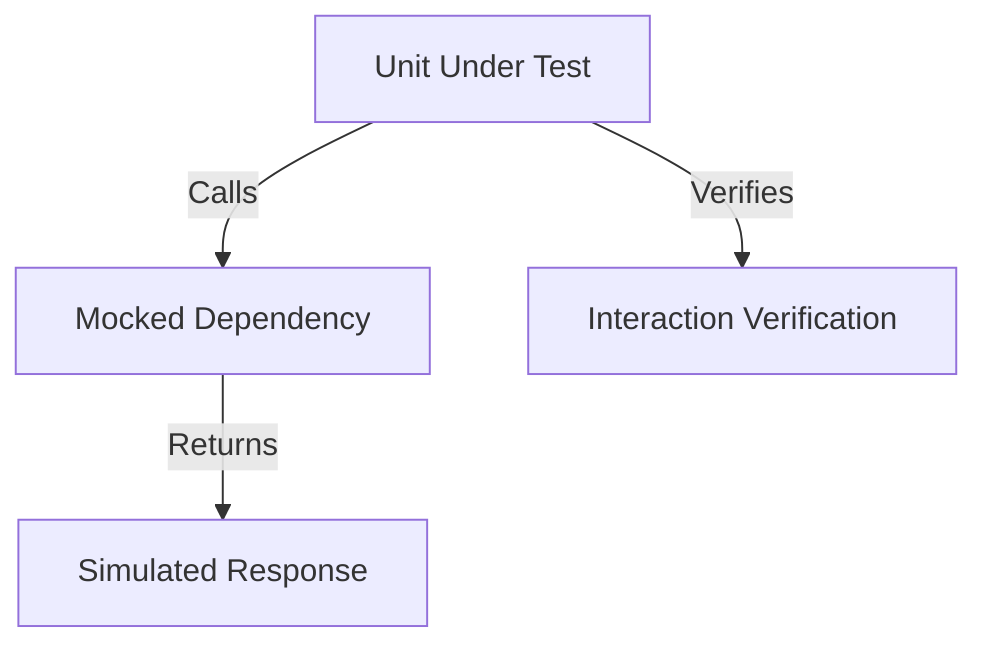

## 10.2.2 Mocking Dependencies

In the world of software development, unit testing is a crucial practice that ensures the reliability and correctness of individual components. However, testing a unit in isolation can be challenging when it depends on external systems or complex interactions. This is where mocking comes into play. Mocking allows developers to simulate external dependencies, enabling the testing of a unit in isolation without the need for the actual implementation of those dependencies. In this section, we will explore the purpose of mocking, how to use the `mockito` package in Flutter, and best practices for effective mocking.

### Purpose of Mocking

Mocking is a technique used in unit testing to replace real objects with mock objects that simulate the behavior of real objects. This approach is particularly useful in the following scenarios:

- **Time-Consuming Dependencies:** Some dependencies, such as network calls or database operations, can be time-consuming. Mocking allows you to simulate these operations quickly, making your tests faster and more efficient.
  
- **Side Effects:** Certain dependencies may have side effects that are undesirable during testing, such as modifying a database or sending emails. Mocking helps avoid these side effects by simulating the behavior without executing the actual code.

- **Difficult to Reproduce:** Some conditions or states may be difficult to reproduce consistently in a test environment. Mocking allows you to create specific scenarios by controlling the behavior of dependencies.

By using mocks, you can focus on testing the logic of the unit under test without worrying about the complexities of its dependencies.

### Using the `mockito` Package

The `mockito` package is a popular Dart library that provides a simple API for creating mock objects. It is widely used in Flutter applications for unit testing. To get started with `mockito`, you need to add it to your project's `pubspec.yaml` file under `dev_dependencies`:

```yaml
dev_dependencies:
  mockito: ^5.0.0
```

After adding the dependency, run `flutter pub get` to install the package.

### Creating a Mock Class

To create a mock class using `mockito`, you need to extend the `Mock` class and implement the interface or class you want to mock. Here's an example of creating a mock class for an `ApiService`:

```dart
import 'package:mockito/mockito.dart';

class MockApiService extends Mock implements ApiService {}
```

In this example, `MockApiService` is a mock implementation of the `ApiService` class. You can now use `MockApiService` in your tests to simulate the behavior of `ApiService`.

### Using Mocks in Tests

Once you have created a mock class, you can use it in your tests to simulate the behavior of the real object. Here's an example of using a mock in a test:

```dart
test('fetches user data successfully', () async {
  // Arrange
  final apiService = MockApiService();
  when(apiService.fetchUserData()).thenAnswer((_) async => UserData(...));

  // Act
  final result = await getUserProfile(apiService);

  // Assert
  expect(result, isA<UserProfile>());
});
```

In this test, we are testing the `getUserProfile` function, which depends on `ApiService`. We use `MockApiService` to simulate the behavior of `ApiService`. The `when` function is used to specify the behavior of the mock object. In this case, we simulate a successful fetch of user data by returning a `UserData` object.

### Verifying Interactions

In addition to simulating behavior, you can also verify that certain methods were called on the mock object. This is useful for ensuring that the unit under test interacts with its dependencies as expected. Here's how you can verify interactions:

```dart
verify(apiService.fetchUserData()).called(1);
```

This line of code verifies that the `fetchUserData` method was called exactly once on the `apiService` mock object. Verification helps ensure that your code is interacting with dependencies correctly.

### Visual Aids

To better understand how mocking works, let's visualize the interaction between the unit under test and its mocked dependencies. Consider the following diagram:



In this diagram, the unit under test interacts with the mocked dependency, which returns a simulated response. The unit then verifies the interaction to ensure correct behavior.

### Best Practices

While mocking is a powerful tool for unit testing, it should be used judiciously. Here are some best practices to keep in mind:

- **Avoid Overusing Mocks:** Use mocks only when necessary. Overusing mocks can lead to brittle tests that are tightly coupled to the implementation details of the code.

- **Keep Mock Setups Simple:** Focus on the specific behavior you want to test. Avoid setting up complex mock behaviors that are not relevant to the test case.

- **Test Real Interactions When Possible:** Whenever possible, test real interactions instead of using mocks. This provides more confidence in the correctness of your code.

- **Document Mock Behavior:** Clearly document the behavior of your mocks to ensure that other developers understand the purpose and limitations of the mock setup.

By following these best practices, you can create effective and maintainable unit tests that leverage mocking to isolate and test units in your Flutter applications.

### Conclusion

Mocking is an essential technique for unit testing in Flutter applications. By simulating external dependencies, you can test units in isolation, ensuring that your code behaves correctly under various conditions. The `mockito` package provides a simple and powerful API for creating mock objects, making it a valuable tool for any Flutter developer. By understanding the purpose of mocking, using `mockito` effectively, and following best practices, you can enhance the reliability and maintainability of your tests.

For further exploration, consider reading the official [Mockito documentation](https://pub.dev/packages/mockito) and exploring open-source projects that use mocking extensively. Additionally, books like "The Art of Unit Testing" by Roy Osherove provide deeper insights into unit testing techniques and best practices.

## Quiz Time!



### What is the primary purpose of mocking in unit testing?

- [x] To simulate external dependencies and test units in isolation
- [ ] To replace all real objects with mock objects in production
- [ ] To increase the complexity of test cases
- [ ] To ensure tests run slower

> **Explanation:** Mocking allows developers to simulate external dependencies, enabling the testing of a unit in isolation without the need for the actual implementation of those dependencies.

### Which package is commonly used in Flutter for creating mock objects?

- [x] mockito
- [ ] provider
- [ ] bloc
- [ ] redux

> **Explanation:** The `mockito` package is a popular Dart library used for creating mock objects in Flutter applications.

### How do you add the `mockito` package to your Flutter project?

- [x] Add `mockito: ^5.0.0` to `dev_dependencies` in `pubspec.yaml`
- [ ] Add `mockito: ^5.0.0` to `dependencies` in `pubspec.yaml`
- [ ] Install it via `flutter install mockito`
- [ ] Download it manually and add it to the project

> **Explanation:** To use `mockito`, you need to add it to `dev_dependencies` in your project's `pubspec.yaml` file.

### What is the purpose of the `when` function in `mockito`?

- [x] To specify the behavior of the mock object
- [ ] To verify interactions with the mock object
- [ ] To create a new mock object
- [ ] To delete a mock object

> **Explanation:** The `when` function is used to specify the behavior of the mock object, such as what it should return when a method is called.

### How can you verify that a method was called on a mock object?

- [x] Using the `verify` function
- [ ] Using the `when` function
- [ ] Using the `mock` function
- [ ] Using the `assert` function

> **Explanation:** The `verify` function is used to check that a method was called on a mock object, ensuring correct interaction.

### What is a common pitfall when using mocks in unit tests?

- [x] Overusing mocks, leading to brittle tests
- [ ] Underusing mocks, leading to incomplete tests
- [ ] Using mocks only for UI components
- [ ] Avoiding mocks for network calls

> **Explanation:** Overusing mocks can lead to brittle tests that are tightly coupled to the implementation details of the code.

### What should you focus on when setting up mocks?

- [x] The specific behavior you want to test
- [ ] All possible behaviors of the mock object
- [ ] The internal implementation of the mock object
- [ ] The performance of the mock object

> **Explanation:** Focus on the specific behavior you want to test, keeping mock setups simple and relevant to the test case.

### Why is it important to document mock behavior?

- [x] To ensure other developers understand the purpose and limitations of the mock setup
- [ ] To increase the complexity of the test cases
- [ ] To replace real objects with mock objects in production
- [ ] To ensure tests run slower

> **Explanation:** Documenting mock behavior helps other developers understand the purpose and limitations of the mock setup, improving maintainability.

### What is a benefit of testing real interactions instead of using mocks?

- [x] It provides more confidence in the correctness of your code
- [ ] It makes tests run faster
- [ ] It simplifies the test setup
- [ ] It reduces the need for test documentation

> **Explanation:** Testing real interactions provides more confidence in the correctness of your code, as it tests the actual behavior rather than a simulated one.

### True or False: Mocking should be used in all unit tests to ensure isolation.

- [ ] True
- [x] False

> **Explanation:** Mocking should be used judiciously and only when necessary. Overusing mocks can lead to brittle tests and may not always be the best approach.


