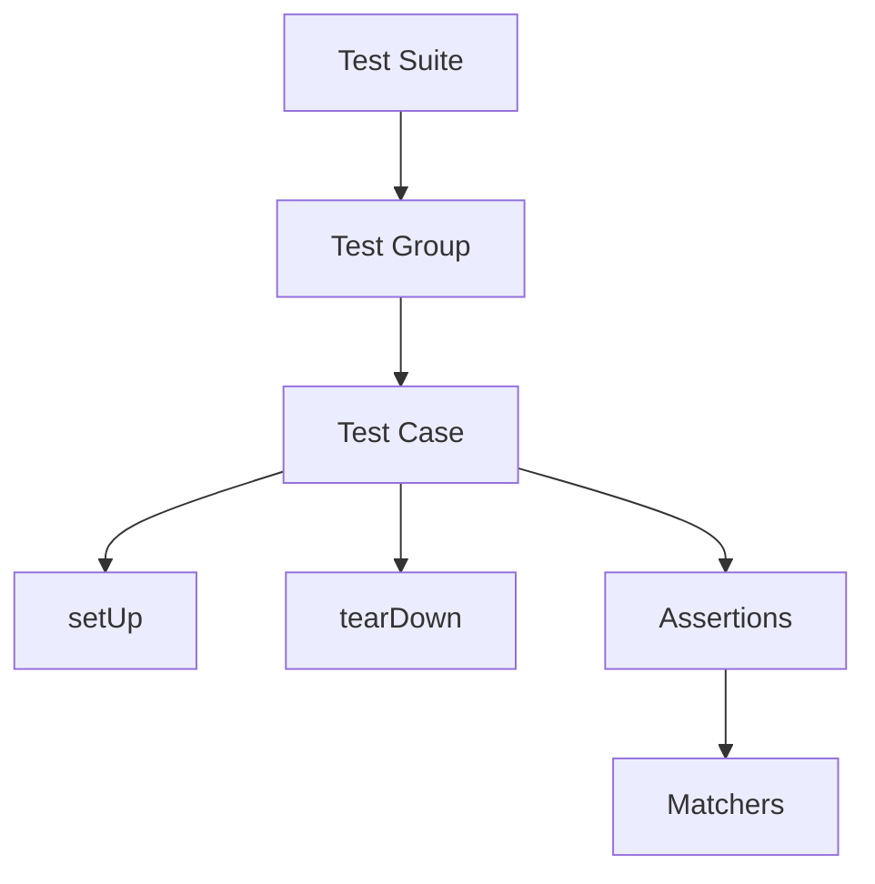

## 10.2.3 Using the `test` Package

In the realm of software development, testing is a critical component that ensures the reliability and quality of your code. For Flutter developers, understanding how to effectively utilize the `test` package in Dart is essential for writing robust unit tests. This section delves into the `test` package, exploring its features, usage, and best practices to help you master unit testing in your Flutter projects.

### Overview of the `test` Package

The `test` package is the foundational testing library in Dart, designed to facilitate the writing and execution of tests. It provides a simple yet powerful framework for creating unit tests, making it an indispensable tool for developers aiming to maintain high code quality.

- **Foundation for Testing:** The `test` package serves as the core testing library in Dart, offering essential functionalities for writing and running tests. It is lightweight and flexible, allowing developers to test Dart code efficiently.
- **Integration with Flutter:** While the `test` package is primarily for Dart, Flutter developers often use `flutter_test`, which builds on top of `test` and provides additional utilities specific to Flutter applications. This integration allows for seamless testing of both Dart logic and Flutter widgets.

### Key Features of the `test` Package

The `test` package offers a variety of features that streamline the testing process:

- **Grouping Tests:** Organize related tests using the `group()` function, which helps in structuring your test suite and improving readability.
- **Shared Context Setup:** Use `setUp()` and `tearDown()` functions to initialize and clean up shared resources before and after each test, ensuring a consistent testing environment.
- **Asynchronous Testing Support:** The package supports testing asynchronous code, allowing you to test functions that involve futures, streams, or other asynchronous operations.

### Writing Tests with the `test` Package

Writing tests with the `test` package involves using several key functions and concepts. Let's explore these with practical examples.

#### Basic Test Structure

The `test()` function is the core of the `test` package, used to define individual test cases. Here's a simple example:

```dart
import 'package:test/test.dart';

void main() {
  test('String split test', () {
    var string = 'Hello, World';
    var result = string.split(', ');
    expect(result, equals(['Hello', 'World']));
  });
}
```

In this example, we define a test case that checks if the `split` method on a string works as expected. The `expect()` function is used to assert that the result matches the expected value.

#### Grouping Tests

Grouping related tests can improve the organization and readability of your test suite. Use the `group()` function to achieve this:

```dart
import 'package:test/test.dart';

void main() {
  group('String tests', () {
    test('String split test', () {
      var string = 'Hello, World';
      var result = string.split(', ');
      expect(result, equals(['Hello', 'World']));
    });

    test('String contains test', () {
      var string = 'Hello, World';
      expect(string.contains('Hello'), isTrue);
    });
  });
}
```

Here, we group two tests under the "String tests" label, making it clear that these tests are related to string operations.

#### Setup and Teardown

The `setUp()` and `tearDown()` functions are used to prepare and clean up resources before and after each test. This is particularly useful when tests share a common setup:

```dart
import 'package:test/test.dart';

String globalString;

void main() {
  setUp(() {
    globalString = 'Hello, World';
  });

  tearDown(() {
    globalString = null;
  });

  test('String split test', () {
    var result = globalString.split(', ');
    expect(result, equals(['Hello', 'World']));
  });

  test('String contains test', () {
    expect(globalString.contains('Hello'), isTrue);
  });
}
```

In this example, `setUp()` initializes a global string before each test, and `tearDown()` cleans it up afterward, ensuring no side effects between tests.

### Matchers in the `test` Package

Matchers are a powerful feature of the `test` package, providing a way to make expressive assertions in your tests. Here are some commonly used matchers:

- **`equals()`**: Checks if two values are equal.
- **`isA<Type>()`**: Asserts that a value is of a specific type.
- **`throwsException`**: Verifies that a function throws an exception.

#### Using Matchers

Let's see how matchers are used in practice:

```dart
import 'package:test/test.dart';

void main() {
  test('List equality test', () {
    var list = [1, 2, 3];
    expect(list, equals([1, 2, 3]));
  });

  test('Type check test', () {
    var number = 42;
    expect(number, isA<int>());
  });

  test('Exception test', () {
    expect(() => throw Exception('Error'), throwsException);
  });
}
```

In these examples, we use `equals()` to check list equality, `isA<int>()` to verify the type of a variable, and `throwsException` to ensure that a function throws an exception.

### Asynchronous Testing

Testing asynchronous code is crucial in modern applications, where operations like network requests and file I/O are common. The `test` package supports asynchronous testing using `async` and `await`.

#### Asynchronous Test Example

Here's how you can test an asynchronous function:

```dart
import 'package:test/test.dart';

Future<String> fetchData() async {
  // Simulate a network request
  await Future.delayed(Duration(seconds: 1));
  return 'Data';
}

void main() {
  test('async test example', () async {
    final result = await fetchData();
    expect(result, equals('Data'));
  });
}
```

In this example, `fetchData()` simulates a network request using `Future.delayed()`. The test waits for the function to complete using `await` and then asserts the result.

### Visual Aids

To better understand the structure and flow of tests using the `test` package, consider the following diagram illustrating the relationship between different components:



This diagram shows how a test suite can contain multiple test groups, each with its own test cases. The `setUp` and `tearDown` functions are used to manage shared context, while assertions are made using matchers.

### Best Practices for Using the `test` Package

To ensure your tests are effective and maintainable, consider the following best practices:

- **Descriptive Test Names:** Use clear and descriptive names for your tests to convey their purpose and expected behavior.
- **Independence:** Keep tests independent to avoid side effects. Each test should be able to run in isolation without relying on the state set by other tests.
- **Consistent Structure:** Follow a consistent structure for your tests, using `group()`, `setUp()`, and `tearDown()` where appropriate.
- **Comprehensive Coverage:** Aim for comprehensive test coverage, including edge cases and error conditions.

### Conclusion

The `test` package is a powerful tool for Dart developers, providing a robust framework for writing and running unit tests. By leveraging its features, such as grouping, matchers, and asynchronous support, you can ensure your code is reliable and maintainable. Remember to follow best practices to maximize the effectiveness of your tests, and don't hesitate to explore further resources to deepen your understanding.

## Quiz Time!



### What is the primary purpose of the `test` package in Dart?

- [x] To provide a framework for writing and running unit tests
- [ ] To compile Dart code into native applications
- [ ] To manage dependencies in Dart projects
- [ ] To build user interfaces in Flutter

> **Explanation:** The `test` package is designed to facilitate the writing and execution of unit tests in Dart, ensuring code reliability and quality.

### Which function is used to group related tests in the `test` package?

- [ ] `test()`
- [x] `group()`
- [ ] `setUp()`
- [ ] `tearDown()`

> **Explanation:** The `group()` function is used to organize related tests, improving the structure and readability of the test suite.

### What is the purpose of the `setUp()` function in the `test` package?

- [x] To initialize shared resources before each test
- [ ] To clean up resources after each test
- [ ] To define a test case
- [ ] To assert test outcomes

> **Explanation:** `setUp()` is used to prepare shared resources before each test, ensuring a consistent testing environment.

### Which matcher is used to verify that a function throws an exception?

- [ ] `equals()`
- [ ] `isA<Type>()`
- [x] `throwsException`
- [ ] `contains()`

> **Explanation:** The `throwsException` matcher is used to assert that a function throws an exception during execution.

### How do you test asynchronous code using the `test` package?

- [x] By using `async` and `await` in the test function
- [ ] By using `Future.sync()`
- [ ] By using `Stream.fromIterable()`
- [ ] By using `Completer.complete()`

> **Explanation:** Asynchronous code is tested using `async` and `await` to handle futures and ensure the test waits for completion.

### What is the role of the `tearDown()` function in the `test` package?

- [ ] To initialize shared resources before each test
- [x] To clean up resources after each test
- [ ] To define a test case
- [ ] To assert test outcomes

> **Explanation:** `tearDown()` is used to clean up resources after each test, preventing side effects between tests.

### Which of the following is a best practice when writing tests with the `test` package?

- [x] Use descriptive test names
- [ ] Keep tests dependent on each other
- [ ] Avoid using matchers for assertions
- [ ] Write tests without any assertions

> **Explanation:** Descriptive test names help convey the purpose and expected behavior of tests, making them easier to understand.

### What is the benefit of using matchers in the `test` package?

- [x] They provide expressive assertions for test outcomes
- [ ] They compile Dart code into native applications
- [ ] They manage dependencies in Dart projects
- [ ] They build user interfaces in Flutter

> **Explanation:** Matchers offer a way to make expressive assertions, improving the clarity and readability of test outcomes.

### Which function is used to define individual test cases in the `test` package?

- [x] `test()`
- [ ] `group()`
- [ ] `setUp()`
- [ ] `tearDown()`

> **Explanation:** The `test()` function is used to define individual test cases, specifying the code to be tested and the expected outcomes.

### True or False: The `test` package can only be used for testing synchronous code.

- [ ] True
- [x] False

> **Explanation:** The `test` package supports both synchronous and asynchronous testing, allowing developers to test a wide range of code scenarios.


