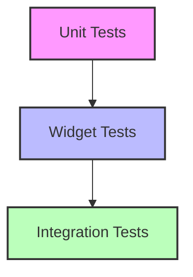

## 10.3.1 Introduction to Widget Tests

In the world of software development, ensuring that your application works as intended is paramount. Testing is a critical part of this process, and in Flutter, widget tests play a crucial role in verifying the correctness of your UI components. This section delves into the purpose of widget tests, how they differ from other types of tests, when to use them, and best practices for implementing them effectively.

### Purpose of Widget Tests

Widget tests, often referred to as component tests, are designed to verify the behavior and appearance of individual widgets in isolation. They ensure that widgets display correctly and respond appropriately to user interactions. Unlike unit tests, which focus on testing the smallest parts of an application (like functions or methods), widget tests focus on the UI components, making sure they render as expected and handle user input correctly.

#### Key Objectives of Widget Tests:

- **UI Verification:** Ensure that the widget's layout, appearance, and behavior meet the design specifications.
- **Interaction Testing:** Validate that user interactions, such as taps and gestures, produce the expected outcomes.
- **State Management:** Check that the widget maintains and updates its state correctly in response to user actions or data changes.

By focusing on these objectives, widget tests help developers catch UI-related bugs early in the development process, reducing the risk of issues in production.

### Differences from Unit Tests and Integration Tests

Understanding the differences between widget tests, unit tests, and integration tests is crucial for implementing a comprehensive testing strategy.

- **Unit Tests:**
  - **Scope:** Test individual functions or methods.
  - **Speed:** Fastest among the three types, as they do not require a UI or a running app.
  - **Purpose:** Verify the correctness of logic and algorithms.

- **Widget Tests:**
  - **Scope:** Test individual widgets in isolation.
  - **Speed:** Slower than unit tests but faster than integration tests.
  - **Purpose:** Ensure UI components render and behave correctly.

- **Integration Tests:**
  - **Scope:** Test the entire application or large parts of it.
  - **Speed:** Slowest, as they require the app to be fully running.
  - **Purpose:** Validate the app's behavior as a whole, including interactions between different parts.

Widget tests strike a balance between speed and comprehensiveness, offering more coverage than unit tests while being faster and more focused than integration tests.

### When to Use Widget Tests

Widget tests are particularly useful in scenarios where you need to verify the UI layout, interactions, and rendering of individual components. Here are some common use cases:

- **Testing UI Layouts:** Ensure that widgets are laid out correctly and adapt to different screen sizes and orientations.
- **Validating User Interactions:** Check that buttons, sliders, and other interactive elements respond correctly to user input.
- **Rendering Verification:** Confirm that widgets display the correct data and update appropriately when the underlying data changes.

By using widget tests in these scenarios, you can catch UI-related issues early and ensure a smooth user experience.

### Visual Aids: The Testing Pyramid

To better understand where widget tests fit in the overall testing strategy, let's look at the testing pyramid:



In the testing pyramid, unit tests form the base, providing a solid foundation by testing individual pieces of logic. Widget tests sit in the middle, offering a balance between speed and coverage by focusing on UI components. Integration tests are at the top, ensuring that the application works as a whole.

### Key Takeaways

- **Balance Between Speed and Coverage:** Widget tests offer a middle ground, providing more coverage than unit tests while being faster than integration tests.
- **Essential for UI Verification:** They are crucial for verifying that UI components render and behave correctly in isolation.
- **Early Bug Detection:** By focusing on individual widgets, these tests help catch UI-related bugs early in the development process.

### Practical Code Example

Let's look at a simple example of a widget test in Flutter. We'll test a basic counter widget that increments a value when a button is pressed.

```dart
import 'package:flutter/material.dart';
import 'package:flutter_test/flutter_test.dart';

void main() {
  testWidgets('Counter increments smoke test', (WidgetTester tester) async {
    // Build our app and trigger a frame.
    await tester.pumpWidget(MyApp());

    // Verify that our counter starts at 0.
    expect(find.text('0'), findsOneWidget);
    expect(find.text('1'), findsNothing);

    // Tap the '+' icon and trigger a frame.
    await tester.tap(find.byIcon(Icons.add));
    await tester.pump();

    // Verify that our counter has incremented.
    expect(find.text('0'), findsNothing);
    expect(find.text('1'), findsOneWidget);
  });
}

class MyApp extends StatelessWidget {
  @override
  Widget build(BuildContext context) {
    return MaterialApp(
      home: Scaffold(
        appBar: AppBar(
          title: Text('Counter App'),
        ),
        body: Center(
          child: Counter(),
        ),
      ),
    );
  }
}

class Counter extends StatefulWidget {
  @override
  _CounterState createState() => _CounterState();
}

class _CounterState extends State<Counter> {
  int _counter = 0;

  void _incrementCounter() {
    setState(() {
      _counter++;
    });
  }

  @override
  Widget build(BuildContext context) {
    return Column(
      mainAxisAlignment: MainAxisAlignment.center,
      children: <Widget>[
        Text(
          'You have pushed the button this many times:',
        ),
        Text(
          '$_counter',
          style: Theme.of(context).textTheme.headline4,
        ),
        FloatingActionButton(
          onPressed: _incrementCounter,
          tooltip: 'Increment',
          child: Icon(Icons.add),
        ),
      ],
    );
  }
}
```

#### Explanation:

- **Setup:** The `testWidgets` function sets up the test environment and builds the widget tree.
- **Initial Verification:** We check that the counter starts at 0.
- **Interaction:** We simulate a tap on the '+' button.
- **Final Verification:** We verify that the counter increments to 1.

This example demonstrates how widget tests can verify both the initial state and the behavior of a widget in response to user interactions.

### Best Practices for Widget Testing

- **Isolate Widgets:** Test widgets in isolation to ensure that tests are focused and reliable.
- **Use Descriptive Names:** Name your tests clearly to indicate what they are verifying.
- **Mock Dependencies:** Use mock objects to isolate the widget under test from external dependencies.
- **Automate Tests:** Integrate widget tests into your CI/CD pipeline to ensure continuous verification.

### Common Pitfalls and Challenges

- **Complex Widgets:** Testing complex widgets with many dependencies can be challenging. Use mocks and stubs to simplify the test environment.
- **Flaky Tests:** Ensure that tests are deterministic and do not rely on external factors that can cause them to fail intermittently.
- **Performance:** While widget tests are faster than integration tests, they can still be slow if not optimized. Focus on testing critical paths and interactions.

### Additional Resources

- **Official Flutter Documentation:** [Flutter Testing](https://flutter.dev/docs/testing)
- **Open-Source Projects:** Explore GitHub repositories with well-documented widget tests.
- **Books and Courses:** Consider reading "Flutter in Action" or taking online courses on Flutter testing.

### Conclusion

Widget tests are an essential part of a comprehensive testing strategy in Flutter. By focusing on individual UI components, they help ensure that your application provides a smooth and reliable user experience. By understanding their purpose, differences from other test types, and best practices, you can effectively implement widget tests in your projects.

## Quiz Time!



### What is the primary purpose of widget tests in Flutter?

- [x] To verify the UI at the widget level
- [ ] To test the entire application
- [ ] To validate backend logic
- [ ] To ensure network connectivity

> **Explanation:** Widget tests focus on verifying the UI components, ensuring they render correctly and respond to user interactions.

### How do widget tests differ from unit tests?

- [x] Widget tests focus on UI components, while unit tests focus on individual functions or methods.
- [ ] Widget tests are faster than unit tests.
- [ ] Widget tests are used for backend testing.
- [ ] Widget tests require a running app.

> **Explanation:** Widget tests verify UI components, whereas unit tests verify the logic of individual functions or methods.

### In the testing pyramid, where do widget tests fit?

- [x] Between unit tests and integration tests
- [ ] At the base of the pyramid
- [ ] At the top of the pyramid
- [ ] Outside the pyramid

> **Explanation:** Widget tests provide a balance between speed and coverage, fitting between unit tests and integration tests in the testing pyramid.

### When is it appropriate to use widget tests?

- [x] When testing UI layouts and interactions
- [ ] When testing database queries
- [ ] When validating API responses
- [ ] When checking server configurations

> **Explanation:** Widget tests are ideal for verifying UI layouts, interactions, and rendering of individual components.

### Which of the following is a key takeaway about widget tests?

- [x] They strike a balance between speed and comprehensiveness.
- [ ] They are the fastest type of test.
- [ ] They provide the most coverage.
- [ ] They are used for testing network connections.

> **Explanation:** Widget tests offer a balance between speed and comprehensiveness, focusing on UI components.

### What is a common challenge when writing widget tests?

- [x] Testing complex widgets with many dependencies
- [ ] Testing simple functions
- [ ] Ensuring network connectivity
- [ ] Validating server responses

> **Explanation:** Testing complex widgets can be challenging due to dependencies, requiring the use of mocks and stubs.

### How can you ensure that widget tests are reliable?

- [x] By isolating widgets and using mock dependencies
- [ ] By relying on external factors
- [ ] By testing only the backend
- [ ] By avoiding automation

> **Explanation:** Isolating widgets and using mock dependencies help ensure that widget tests are reliable and focused.

### What is a best practice for naming widget tests?

- [x] Use descriptive names to indicate what the test is verifying.
- [ ] Use generic names for all tests.
- [ ] Avoid naming tests.
- [ ] Use random names.

> **Explanation:** Descriptive names help indicate the purpose of the test, making it easier to understand and maintain.

### Why is it important to automate widget tests?

- [x] To ensure continuous verification in a CI/CD pipeline
- [ ] To avoid writing tests manually
- [ ] To reduce test coverage
- [ ] To increase test complexity

> **Explanation:** Automating widget tests ensures continuous verification, integrating them into the CI/CD pipeline for ongoing quality assurance.

### True or False: Widget tests are slower than integration tests.

- [ ] True
- [x] False

> **Explanation:** Widget tests are faster than integration tests, as they focus on individual UI components rather than the entire application.


