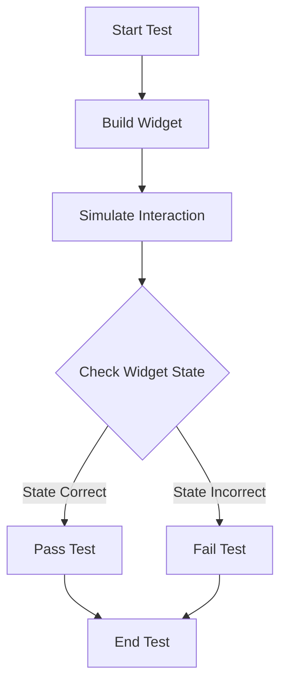

## 10.3.3 Interacting with Widgets in Tests

In the world of Flutter development, ensuring that your app's user interface behaves as expected is crucial. Widget testing allows developers to simulate user interactions and verify that the UI responds correctly. This section delves into the intricacies of interacting with widgets in tests, providing detailed insights and practical examples to help you master this essential skill.

### Simulating User Input

Simulating user input is a cornerstone of widget testing. It allows you to mimic real-world interactions, such as tapping buttons, entering text, and scrolling through lists, to ensure your app responds appropriately. Let's explore how to simulate various types of user interactions in Flutter tests.

#### Taps and Gestures

Tapping buttons and performing gestures are common user actions. In Flutter, you can simulate these interactions using the `WidgetTester` class. Here's how you can simulate a tap on a button:

```dart
await tester.tap(find.byKey(Key('incrementButton')));
await tester.pump(); // Rebuild the widget after the state has changed
```

In this example, the `tap` method is used to simulate a tap on a widget identified by a key. The `pump` method is then called to rebuild the widget tree and reflect any state changes.

##### Example: Increment Counter

Consider a simple counter app where tapping a button increments a counter displayed on the screen. Here's how you might test this interaction:

```dart
testWidgets('increments counter when tapped', (WidgetTester tester) async {
  // Build the widget
  await tester.pumpWidget(MyApp());

  // Verify initial counter value
  expect(find.text('0'), findsOneWidget);

  // Tap the increment button
  await tester.tap(find.byKey(Key('incrementButton')));
  await tester.pump();

  // Verify counter has incremented
  expect(find.text('1'), findsOneWidget);
});
```

This test verifies that the counter starts at zero, increments to one after a tap, and updates the UI accordingly.

#### Scrolling

Scrolling is another common interaction, especially in list-based UIs. You can simulate scrolling using the `fling` method:

```dart
await tester.fling(find.byType(ListView), Offset(0, -300), 1000);
await tester.pumpAndSettle();
```

The `fling` method scrolls a `ListView` by a specified offset at a given velocity. The `pumpAndSettle` method waits for all animations to complete, ensuring the UI is stable before proceeding.

##### Example: Scroll to Load More

Imagine a list that loads more items as you scroll. Here's how you could test this behavior:

```dart
testWidgets('loads more items on scroll', (WidgetTester tester) async {
  // Build the widget
  await tester.pumpWidget(MyApp());

  // Verify initial item count
  expect(find.byType(ListTile), findsNWidgets(10));

  // Scroll to load more items
  await tester.fling(find.byType(ListView), Offset(0, -300), 1000);
  await tester.pumpAndSettle();

  // Verify more items are loaded
  expect(find.byType(ListTile), findsNWidgets(20));
});
```

This test ensures that scrolling down the list triggers the loading of additional items.

#### Text Input

Simulating text input is essential for testing forms and search fields. The `enterText` method allows you to input text into a `TextField`:

```dart
await tester.enterText(find.byType(TextField), 'Sample Text');
await tester.pump(); // Rebuild the widget after text input
```

##### Example: Search Functionality

Consider a search feature where entering text filters a list of items. Here's how you might test this:

```dart
testWidgets('filters items based on search input', (WidgetTester tester) async {
  // Build the widget
  await tester.pumpWidget(MyApp());

  // Enter search text
  await tester.enterText(find.byType(TextField), 'query');
  await tester.pump();

  // Verify filtered results
  expect(find.text('query result 1'), findsOneWidget);
  expect(find.text('query result 2'), findsOneWidget);
});
```

This test checks that entering a search query filters the list to show only relevant results.

### Asserting Widget States

After simulating user interactions, it's crucial to verify that the UI behaves as expected. This involves asserting the state of widgets to ensure they reflect the correct changes.

#### Verifying Widget Visibility

You can check if a widget appears or disappears after an interaction using assertions like `findsOneWidget` or `findsNothing`:

```dart
expect(find.byKey(Key('loadingIndicator')), findsNothing);
```

This assertion verifies that a widget with the specified key is not present in the widget tree.

#### Checking Widget State

To verify the state of a widget after an interaction, you can use assertions to check its properties or displayed text:

```dart
expect(find.text('Success'), findsOneWidget);
```

This assertion ensures that a widget displaying the text "Success" is present, indicating a successful operation.

### Handling Async Operations

Many interactions in Flutter involve asynchronous operations, such as network requests or animations. To handle these, you can use the `pumpAndSettle` method, which waits for all animations and microtasks to complete:

```dart
await tester.pumpAndSettle();
```

This method is particularly useful when testing interactions that trigger animations or asynchronous state changes.

### Visual Aids

To better understand the sequence of actions and assertions in a widget test, let's use a flowchart to illustrate the process:



This flowchart outlines the typical flow of a widget test, from building the widget to simulating interactions and verifying the resulting state.

### Best Practices

When interacting with widgets in tests, consider the following best practices:

- **Focus on Specific Interactions:** Keep tests focused on individual interactions to isolate issues and simplify debugging.
- **Use Keys and Semantic Labels:** Assign keys and semantic labels to widgets to make them easier to find and interact with in tests.
- **Avoid Hardcoding Delays:** Instead of using `Future.delayed`, rely on `pumpAndSettle` to wait for animations and async operations.
- **Test Edge Cases:** Consider edge cases, such as empty inputs or maximum scroll, to ensure robust UI behavior.

### Conclusion

Interacting with widgets in tests is a powerful way to ensure your Flutter app's UI behaves as expected. By simulating user inputs, asserting widget states, and handling asynchronous operations, you can create comprehensive tests that cover a wide range of scenarios. Remember to follow best practices to maintain clean, focused, and effective tests.

## Quiz Time!



### What method is used to simulate a tap on a widget in Flutter tests?

- [x] `tester.tap`
- [ ] `tester.click`
- [ ] `tester.press`
- [ ] `tester.touch`

> **Explanation:** The `tester.tap` method is used to simulate a tap on a widget in Flutter tests.

### How do you simulate scrolling in a Flutter test?

- [ ] `tester.scroll`
- [x] `tester.fling`
- [ ] `tester.drag`
- [ ] `tester.swipe`

> **Explanation:** The `tester.fling` method is used to simulate scrolling by flinging a widget, such as a `ListView`.

### Which method is used to enter text into a `TextField` during a test?

- [ ] `tester.typeText`
- [x] `tester.enterText`
- [ ] `tester.inputText`
- [ ] `tester.writeText`

> **Explanation:** The `tester.enterText` method is used to simulate text input into a `TextField`.

### What is the purpose of the `pumpAndSettle` method in Flutter tests?

- [ ] To delay the test execution
- [x] To wait for animations and microtasks to complete
- [ ] To rebuild the widget tree
- [ ] To simulate a user interaction

> **Explanation:** The `pumpAndSettle` method waits for all animations and microtasks to complete, ensuring the UI is stable before proceeding.

### How can you verify that a widget is not present in the widget tree?

- [x] `findsNothing`
- [ ] `findsNoWidget`
- [ ] `findsZeroWidgets`
- [ ] `findsNull`

> **Explanation:** The `findsNothing` assertion checks that a widget is not present in the widget tree.

### What is a best practice for making widgets easier to find in tests?

- [x] Use keys and semantic labels
- [ ] Use random identifiers
- [ ] Use hardcoded indices
- [ ] Use widget names

> **Explanation:** Using keys and semantic labels makes widgets easier to find and interact with in tests.

### Which method rebuilds the widget tree after a state change?

- [ ] `tester.rebuild`
- [x] `tester.pump`
- [ ] `tester.refresh`
- [ ] `tester.update`

> **Explanation:** The `tester.pump` method rebuilds the widget tree after a state change.

### What should you avoid using to wait for async operations in tests?

- [ ] `pumpAndSettle`
- [ ] `await`
- [x] `Future.delayed`
- [ ] `async`

> **Explanation:** Avoid using `Future.delayed` to wait for async operations; instead, use `pumpAndSettle`.

### What is the benefit of keeping tests focused on specific interactions?

- [x] Simplifies debugging and isolates issues
- [ ] Increases test execution time
- [ ] Makes tests more complex
- [ ] Reduces test coverage

> **Explanation:** Keeping tests focused on specific interactions simplifies debugging and isolates issues.

### True or False: The `pumpAndSettle` method is used to simulate user interactions.

- [ ] True
- [x] False

> **Explanation:** The `pumpAndSettle` method is not used to simulate user interactions; it waits for animations and microtasks to complete.


