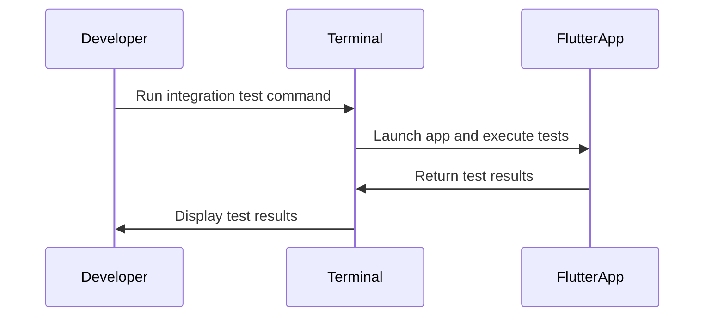

## 10.4.1 Setting Up Integration Tests

Integration testing is a crucial aspect of software development, especially in mobile app development with Flutter. It allows developers to validate the complete application or significant parts of it in a manner that closely resembles real user scenarios. This comprehensive guide will walk you through the process of setting up integration tests in Flutter, from creating the necessary directories to writing and executing tests effectively.

### Understanding Integration Tests

Integration tests are designed to test the interactions between different parts of an application. Unlike unit tests, which focus on individual components, integration tests validate the behavior of the app as a whole or large sections of it. This type of testing is essential for ensuring that the app functions correctly in real-world scenarios, where multiple components interact with each other.

#### Key Benefits of Integration Testing

- **Comprehensive Coverage:** Integration tests provide a broader coverage of the application's functionality, ensuring that different parts work together seamlessly.
- **User-Centric Testing:** These tests simulate real user interactions, making them invaluable for identifying issues that might not be apparent in isolated unit tests.
- **Regression Prevention:** By running integration tests regularly, developers can catch regressions early, preventing new changes from breaking existing functionality.

### Creating an Integration Test Directory

To begin setting up integration tests in your Flutter project, you need to create a dedicated directory for your test files. This directory will house all your integration test scripts and related resources.

#### Step-by-Step Guide

1. **Navigate to the Root of Your Project:**
   Open your terminal or command prompt and navigate to the root directory of your Flutter project.

2. **Create the Integration Test Directory:**
   Use the following command to create a new directory named `integration_test`:

   ```bash
   mkdir integration_test
   ```

   This directory will serve as the central location for all your integration test files.

### Adding Dependencies

Before writing your first integration test, you need to ensure that your project is set up with the necessary dependencies. This involves updating the `pubspec.yaml` file to include the `integration_test` package.

#### Updating `pubspec.yaml`

Open your `pubspec.yaml` file and add the following under `dev_dependencies`:

```yaml
dev_dependencies:
  integration_test:
    sdk: flutter
```

This configuration tells Flutter to include the `integration_test` package, which provides the necessary tools for writing and executing integration tests.

### Writing an Integration Test

With the setup complete, you can now write your first integration test. The following example demonstrates a basic structure for an integration test in Flutter.

#### Basic Structure of an Integration Test

Create a new Dart file in the `integration_test` directory, for example, `app_test.dart`, and add the following code:

```dart
import 'package:integration_test/integration_test.dart';
import 'package:flutter_test/flutter_test.dart';
import 'package:my_app/main.dart' as app;

void main() {
  IntegrationTestWidgetsFlutterBinding.ensureInitialized();

  testWidgets('end-to-end test', (WidgetTester tester) async {
    app.main();
    await tester.pumpAndSettle();

    // Interactions and assertions go here
  });
}
```

#### Explanation of the Code

- **Import Statements:** The test imports the `integration_test` and `flutter_test` packages, as well as the main entry point of your app.
- **Initialization:** `IntegrationTestWidgetsFlutterBinding.ensureInitialized()` is called to set up the integration test environment.
- **Test Definition:** The `testWidgets` function defines an end-to-end test, where you can simulate user interactions and verify the app's behavior.
- **App Launch:** `app.main()` launches the app, and `await tester.pumpAndSettle()` waits for all animations and frames to complete before proceeding with the test.

### Running Integration Tests

Once your test is written, you can execute it using the Flutter command line tools. Running integration tests requires a slightly different approach compared to unit tests.

#### Command Line Execution

Use the following command to run your integration test:

```bash
flutter drive --driver=test_driver/integration_test.dart --target=integration_test/app_test.dart
```

- **Driver File:** The `--driver` flag specifies the test driver file, which is typically located in the `test_driver` directory. This file initializes the test environment.
- **Target File:** The `--target` flag points to the integration test file you want to execute.

### Visual Aids

To enhance your understanding, let's include some visual aids that illustrate the process of running integration tests and the app under test.



This sequence diagram outlines the flow of executing an integration test, from the developer initiating the test to the terminal displaying the results.

### Best Practices for Integration Testing

To ensure your integration tests are effective and maintainable, consider the following best practices:

- **Run on Real Devices or Emulators:** Integration tests should be executed on actual devices or emulators to accurately simulate user interactions and environment conditions.
- **Keep Tests Stable:** Avoid flaky tests by ensuring that your tests are deterministic and do not rely on external factors such as network conditions.
- **Maintainability:** Write clear and concise tests that are easy to understand and maintain. Use descriptive names for test cases and variables.
- **Regular Execution:** Integrate your tests into a continuous integration (CI) pipeline to run them automatically with every code change, ensuring that regressions are caught early.

### Conclusion

Setting up integration tests in Flutter is a vital step in ensuring the quality and reliability of your application. By following this guide, you can create a robust testing environment that simulates real user scenarios, providing confidence that your app will perform well in the hands of users. Remember to adhere to best practices and continuously refine your tests to keep them effective and relevant.

For further exploration, consider diving into the official Flutter documentation on [integration testing](https://flutter.dev/docs/testing/integration-tests) and exploring additional resources such as online courses or community forums.

## Quiz Time!



### What is the primary purpose of integration tests in Flutter?

- [x] To validate the complete app or large parts of it in a way that closely resembles real user scenarios.
- [ ] To test individual functions and methods in isolation.
- [ ] To check the app's performance under load.
- [ ] To ensure the app's UI is visually appealing.

> **Explanation:** Integration tests are designed to validate the app's behavior as a whole or in large sections, simulating real user interactions.

### Where should you create the directory for integration tests in a Flutter project?

- [x] At the root of the project.
- [ ] Inside the `lib` directory.
- [ ] Inside the `test` directory.
- [ ] Inside the `assets` directory.

> **Explanation:** The `integration_test` directory should be created at the root of the project to organize all integration test files.

### Which dependency must be added to `pubspec.yaml` for integration testing?

- [x] integration_test
- [ ] flutter_test
- [ ] test
- [ ] mockito

> **Explanation:** The `integration_test` package provides the necessary tools for writing and executing integration tests in Flutter.

### What is the purpose of `IntegrationTestWidgetsFlutterBinding.ensureInitialized()` in an integration test?

- [x] To set up the integration test environment.
- [ ] To initialize the app's main function.
- [ ] To start the Flutter engine.
- [ ] To configure the test runner.

> **Explanation:** `IntegrationTestWidgetsFlutterBinding.ensureInitialized()` is called to set up the integration test environment.

### How do you execute an integration test from the command line?

- [x] flutter drive --driver=test_driver/integration_test.dart --target=integration_test/app_test.dart
- [ ] flutter test integration_test/app_test.dart
- [ ] flutter run integration_test/app_test.dart
- [ ] flutter build integration_test/app_test.dart

> **Explanation:** The `flutter drive` command is used to execute integration tests, specifying the driver and target files.

### Why is it recommended to run integration tests on real devices or emulators?

- [x] To accurately simulate user interactions and environment conditions.
- [ ] To speed up the testing process.
- [ ] To reduce the cost of testing.
- [ ] To avoid writing test scripts.

> **Explanation:** Running tests on real devices or emulators ensures that the tests accurately simulate real-world conditions and interactions.

### What is a common pitfall to avoid when writing integration tests?

- [x] Creating flaky tests that rely on external factors.
- [ ] Writing too many tests.
- [ ] Using descriptive names for test cases.
- [ ] Running tests too frequently.

> **Explanation:** Flaky tests can lead to unreliable results, so it's important to ensure tests are deterministic and independent of external factors.

### What is the benefit of integrating tests into a continuous integration (CI) pipeline?

- [x] To automatically run tests with every code change and catch regressions early.
- [ ] To reduce the number of tests needed.
- [ ] To eliminate the need for manual testing.
- [ ] To increase the app's performance.

> **Explanation:** Integrating tests into a CI pipeline ensures that they are run automatically, helping to catch regressions early and maintain code quality.

### What should you do to keep integration tests maintainable?

- [x] Write clear and concise tests with descriptive names.
- [ ] Avoid running tests frequently.
- [ ] Use complex logic in test scripts.
- [ ] Write tests only for critical features.

> **Explanation:** Clear and concise tests with descriptive names are easier to understand and maintain, ensuring long-term test effectiveness.

### True or False: Integration tests are only necessary for large applications.

- [ ] True
- [x] False

> **Explanation:** Integration tests are beneficial for applications of all sizes as they help ensure that different parts of the app work together correctly.


