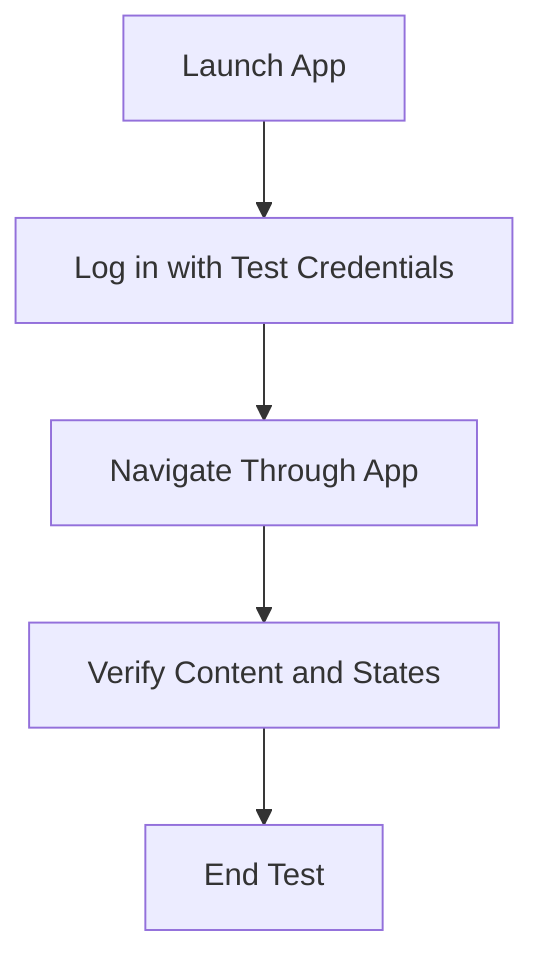

## 10.4.2 Writing Integration Tests

Integration testing in Flutter is a crucial step in ensuring that your application behaves as expected in real-world scenarios. By simulating user interactions, you can verify that the app's components work together seamlessly. This section will guide you through writing effective integration tests, handling delays and animations, and using tools like `flutter_driver` and `integration_test` to enhance your testing strategy.

### Simulating User Scenarios

Integration tests are designed to mimic real user flows, providing a comprehensive check of your app's functionality. Here's how you can simulate user scenarios in Flutter:

1. **Launch the App:**
   - Begin by launching the app in a test environment. This sets the stage for simulating user interactions.

2. **Log in with Test Credentials:**
   - Use predefined test credentials to log into the app. This step is crucial for testing authentication flows and ensuring that login mechanisms work correctly.

3. **Navigate Through the App:**
   - Simulate user navigation by interacting with various UI elements. This includes tapping buttons, scrolling through lists, and switching between screens.

4. **Verify Content and States:**
   - After performing actions, verify that the app displays the correct content and that the UI components are in the expected state. This involves checking text, images, and other elements to ensure they match the expected outcomes.

#### Example Code

Here's a simple example of an integration test that simulates a user logging in and navigating through the app:

```dart
import 'package:flutter_test/flutter_test.dart';
import 'package:integration_test/integration_test.dart';
import 'package:my_app/main.dart' as app;

void main() {
  IntegrationTestWidgetsFlutterBinding.ensureInitialized();

  testWidgets('User login and navigation test', (WidgetTester tester) async {
    app.main();
    await tester.pumpAndSettle();

    // Simulate user entering credentials
    await tester.enterText(find.byKey(Key('usernameField')), 'testuser');
    await tester.enterText(find.byKey(Key('passwordField')), 'password123');
    await tester.tap(find.byKey(Key('loginButton')));
    await tester.pumpAndSettle();

    // Verify login success
    expect(find.text('Welcome, testuser!'), findsOneWidget);

    // Navigate to another screen
    await tester.tap(find.byKey(Key('nextScreenButton')));
    await tester.pumpAndSettle();

    // Verify navigation success
    expect(find.text('Next Screen'), findsOneWidget);
  });
}
```

### Handling Delays and Animations

In Flutter, animations and asynchronous operations can introduce delays that affect test execution. To handle these, use the `await tester.pumpAndSettle()` method. This function waits for all animations and async operations to complete before proceeding, ensuring that your tests are not prematurely executed.

#### Practical Example

```dart
await tester.tap(find.byKey(Key('submitButton')));
await tester.pumpAndSettle(); // Wait for any animations to complete
expect(find.text('Submission Successful'), findsOneWidget);
```

### Using `flutter_driver`

For older versions of Flutter or more advanced use cases, `flutter_driver` can be used to write integration tests. However, for newer projects, the `integration_test` package is recommended due to its simplicity and better integration with the Flutter testing ecosystem.

#### Setting Up `flutter_driver`

1. **Add Dependencies:**
   - Add `flutter_driver` and `test` to your `dev_dependencies` in `pubspec.yaml`.

2. **Create a Driver Test:**
   - Write a test script using `flutter_driver` to automate user interactions.

3. **Run the Test:**
   - Use the `flutter drive` command to execute your driver tests.

### Visual Aids

To better understand the flow of user interactions being tested, consider the following flowchart:



This flowchart illustrates the sequence of actions performed during an integration test, providing a clear visual representation of the testing process.

### Best Practices

- **Use Isolated Test Data:**
  - Ensure that your tests use data that is separate from production data to prevent accidental data corruption.

- **Clean Up After Tests:**
  - Reset the app state after each test to ensure that subsequent tests run in a clean environment. This can be achieved by resetting databases, clearing caches, and resetting user sessions.

- **Automate Test Execution:**
  - Integrate your tests into a continuous integration (CI) pipeline to automate test execution and catch issues early in the development cycle.

- **Document Test Scenarios:**
  - Maintain clear documentation of test scenarios to facilitate understanding and maintenance of tests over time.

### Conclusion

Writing integration tests in Flutter is an essential practice for ensuring the reliability and quality of your applications. By simulating real user scenarios, handling delays, and using tools like `flutter_driver` and `integration_test`, you can create robust tests that provide confidence in your app's functionality. Remember to follow best practices, such as using isolated test data and cleaning up after tests, to maintain a healthy testing environment.

For further exploration, consider diving into the official Flutter documentation on [integration testing](https://flutter.dev/docs/testing/integration-tests) and exploring community resources and tutorials to deepen your understanding.

## Quiz Time!



### What is the primary purpose of integration testing in Flutter?

- [x] To simulate real user scenarios and verify app functionality
- [ ] To test individual functions in isolation
- [ ] To check for syntax errors in the code
- [ ] To measure app performance

> **Explanation:** Integration testing focuses on simulating real user scenarios to ensure that different parts of the app work together as expected.

### Which method is used to wait for animations and async operations to complete in a Flutter test?

- [ ] tester.pump()
- [x] tester.pumpAndSettle()
- [ ] tester.runAsync()
- [ ] tester.waitFor()

> **Explanation:** `tester.pumpAndSettle()` is used to wait for all animations and asynchronous operations to complete before proceeding with the test.

### What package is recommended for writing integration tests in newer Flutter projects?

- [ ] flutter_test
- [x] integration_test
- [ ] flutter_driver
- [ ] test

> **Explanation:** The `integration_test` package is recommended for newer projects due to its simplicity and better integration with the Flutter testing ecosystem.

### In the provided example, what is the purpose of `await tester.pumpAndSettle()` after tapping a button?

- [ ] To execute the next line of code immediately
- [ ] To simulate a user tap
- [x] To wait for any animations to complete
- [ ] To reset the app state

> **Explanation:** `await tester.pumpAndSettle()` is used to wait for animations and async operations to complete, ensuring the test proceeds only when the UI is stable.

### What is a best practice when using test data in integration tests?

- [x] Use data isolated from production
- [ ] Use live production data
- [ ] Use random data each time
- [ ] Use outdated data for consistency

> **Explanation:** Using isolated test data prevents accidental data corruption and ensures tests do not interfere with production data.

### What is the role of `flutter_driver` in Flutter testing?

- [ ] To write unit tests
- [x] To automate user interactions for integration tests
- [ ] To measure app performance
- [ ] To debug syntax errors

> **Explanation:** `flutter_driver` is used to automate user interactions in integration tests, especially for older versions of Flutter or advanced use cases.

### Why is it important to clean up after tests?

- [ ] To save memory
- [x] To reset the app state for subsequent tests
- [ ] To improve test speed
- [ ] To reduce code complexity

> **Explanation:** Cleaning up after tests ensures that each test runs in a clean environment, preventing interference from previous tests.

### What command is used to run `flutter_driver` tests?

- [ ] flutter test
- [x] flutter drive
- [ ] flutter run
- [ ] flutter analyze

> **Explanation:** The `flutter drive` command is used to execute `flutter_driver` tests.

### What should be documented in integration tests?

- [ ] Only the code
- [ ] Only the expected outcomes
- [x] Test scenarios and expected outcomes
- [ ] Only the test data

> **Explanation:** Documenting test scenarios and expected outcomes helps in understanding and maintaining tests over time.

### True or False: Integration tests should be part of a continuous integration (CI) pipeline.

- [x] True
- [ ] False

> **Explanation:** Integrating tests into a CI pipeline automates test execution and helps catch issues early in the development cycle.


