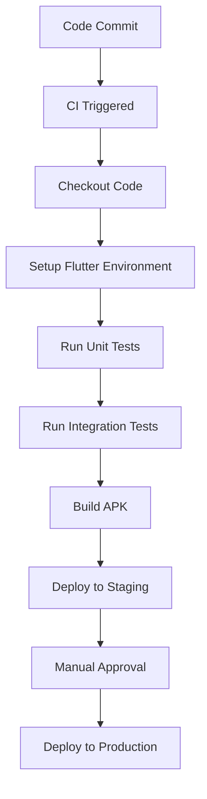

## 10.4.3 Automating Test Runs

In the fast-paced world of software development, ensuring the reliability and quality of your Flutter applications is paramount. Automating test runs within a Continuous Integration/Continuous Deployment (CI/CD) pipeline is a powerful strategy to achieve this. This section will guide you through the process of setting up automated test runs for your Flutter projects, integrating them into a CI/CD pipeline, and following best practices to maintain efficiency and security.

### Continuous Integration (CI)

Continuous Integration is a development practice where developers frequently integrate code into a shared repository, preferably several times a day. Each integration can then be verified by an automated build and automated tests. The primary benefits of automating tests in a CI/CD pipeline include:

- **Early Detection of Bugs:** Automated tests run on every code change, allowing developers to catch and fix bugs early in the development cycle.
- **Consistent Testing Environment:** CI ensures that tests are run in a consistent environment, reducing the "it works on my machine" problem.
- **Faster Feedback Loops:** Developers receive immediate feedback on the quality of their code, enabling quicker iterations and improvements.
- **Improved Code Quality:** Regular testing encourages developers to write cleaner, more maintainable code.

#### Common CI Services

Several CI services can be integrated with your Flutter projects to automate test runs. Some popular options include:

- **GitHub Actions:** A flexible CI/CD service integrated with GitHub repositories, allowing you to automate workflows directly from your repository.
- **Travis CI:** A continuous integration service used to build and test software projects hosted on GitHub.
- **Jenkins:** An open-source automation server that provides hundreds of plugins to support building, deploying, and automating any project.
- **CircleCI:** A CI/CD service that automates the software development process using continuous integration and delivery.

### Setting Up CI for Flutter

To automate test runs for your Flutter application, you'll need to configure a CI service. Let's explore how to set up GitHub Actions for this purpose.

#### Example CI Configuration for GitHub Actions

GitHub Actions allows you to define workflows in YAML files, which are stored in your repository. Below is an example configuration file for running tests on a Flutter project:

```yaml
name: Flutter CI

on: [push]

jobs:
  build:
    runs-on: ubuntu-latest
    steps:
      - uses: actions/checkout@v2
      - uses: subosito/flutter-action@v1
        with:
          flutter-version: '2.5.0'
      - run: flutter pub get
      - run: flutter test
      - run: flutter build apk --release
```

**Explanation:**

- **name:** Specifies the name of the workflow.
- **on:** Defines the events that trigger the workflow. In this case, it's triggered on every push to the repository.
- **jobs:** Contains the steps to be executed. Here, the job runs on the latest Ubuntu environment.
- **steps:** Lists the actions to perform:
  - **actions/checkout@v2:** Checks out the repository code.
  - **subosito/flutter-action@v1:** Sets up the Flutter environment with the specified version.
  - **flutter pub get:** Fetches the dependencies.
  - **flutter test:** Runs the unit and widget tests.
  - **flutter build apk --release:** Builds the release version of the APK.

### Integrating Integration Tests

Integration tests are crucial for verifying that different parts of your application work together as expected. To include integration tests in your CI pipeline, follow these steps:

1. **Set Up Emulators or Headless Testing Environments:**
   - Use Android emulators or iOS simulators to run integration tests. For headless testing, consider using tools like Firebase Test Lab or AWS Device Farm.

2. **Modify the CI Configuration:**
   - Update your CI configuration to include steps for setting up and tearing down emulators.

```yaml
- name: Start Android Emulator
  run: |
    sudo apt-get update
    sudo apt-get install -y libgl1-mesa-dev
    wget https://dl.google.com/android/repository/sdk-tools-linux-4333796.zip
    unzip sdk-tools-linux-4333796.zip -d $HOME/android-sdk
    echo "y" | $HOME/android-sdk/tools/bin/sdkmanager "platforms;android-29" "system-images;android-29;default;x86"
    echo "no" | $HOME/android-sdk/tools/bin/avdmanager create avd -n test -k "system-images;android-29;default;x86" --force
    $HOME/android-sdk/emulator/emulator -avd test -no-skin -no-audio -no-window &
    adb wait-for-device
- run: flutter drive --target=test_driver/app.dart
```

**Explanation:**

- **Start Android Emulator:** Installs necessary packages and starts an Android emulator.
- **flutter drive:** Executes the integration tests defined in `test_driver/app.dart`.

### Visual Aids

To better understand the CI/CD workflow, consider the following diagram illustrating the process:



**Diagram Explanation:**

- **Code Commit:** Developers commit code changes to the repository.
- **CI Triggered:** The CI pipeline is triggered by the commit.
- **Checkout Code:** The code is checked out from the repository.
- **Setup Flutter Environment:** The Flutter environment is set up.
- **Run Unit Tests:** Unit tests are executed.
- **Run Integration Tests:** Integration tests are run on emulators.
- **Build APK:** The APK is built for deployment.
- **Deploy to Staging:** The APK is deployed to a staging environment for further testing.
- **Manual Approval:** A manual approval step before production deployment.
- **Deploy to Production:** The final deployment to the production environment.

### Best Practices

When automating test runs, consider the following best practices:

- **Keep Test Execution Time Reasonable:** Ensure that tests run quickly to maintain fast feedback loops. This might involve parallelizing tests or optimizing slow tests.
- **Secure Sensitive Data:** Use environment variables or secret management tools to handle sensitive data like API keys, ensuring they are not exposed in your CI configuration files.
- **Monitor Test Results:** Regularly review test results and logs to identify flaky tests or recurring issues.
- **Maintain Test Coverage:** Aim for high test coverage to ensure that most of your code is tested, but focus on meaningful tests rather than achieving 100% coverage.

### Conclusion

Automating test runs in a CI/CD pipeline is an essential practice for maintaining the quality and reliability of your Flutter applications. By integrating automated tests into your development workflow, you can catch bugs early, ensure consistent testing environments, and receive faster feedback on code changes. With tools like GitHub Actions, setting up a CI pipeline for your Flutter projects is straightforward and highly beneficial.

### Further Reading and Resources

- [Flutter Official Documentation](https://flutter.dev/docs)
- [GitHub Actions Documentation](https://docs.github.com/en/actions)
- [Travis CI Documentation](https://docs.travis-ci.com/)
- [Jenkins Documentation](https://www.jenkins.io/doc/)
- [CircleCI Documentation](https://circleci.com/docs/)

## Quiz Time!



### What is the primary benefit of automating test runs in a CI/CD pipeline?

- [x] Early detection of bugs
- [ ] Reduced code complexity
- [ ] Increased application size
- [ ] Manual testing elimination

> **Explanation:** Automating test runs allows for early detection of bugs by running tests on every code change, ensuring issues are caught and addressed promptly.

### Which CI service is integrated directly with GitHub repositories?

- [x] GitHub Actions
- [ ] Jenkins
- [ ] Travis CI
- [ ] CircleCI

> **Explanation:** GitHub Actions is a CI/CD service that is directly integrated with GitHub repositories, allowing for seamless automation of workflows.

### In the provided GitHub Actions YAML file, what does the `flutter pub get` command do?

- [x] Fetches the project's dependencies
- [ ] Runs the project's tests
- [ ] Builds the APK
- [ ] Deploys the application

> **Explanation:** The `flutter pub get` command is used to fetch the project's dependencies as specified in the `pubspec.yaml` file.

### What is the purpose of using emulators in integration testing?

- [x] To simulate real device environments for testing
- [ ] To increase test execution speed
- [ ] To reduce code complexity
- [ ] To eliminate the need for unit tests

> **Explanation:** Emulators simulate real device environments, allowing integration tests to verify that different parts of the application work together as expected.

### Which command is used to run integration tests in the provided CI configuration?

- [x] flutter drive
- [ ] flutter test
- [ ] flutter build apk
- [ ] flutter pub get

> **Explanation:** The `flutter drive` command is used to run integration tests, typically defined in the `test_driver` directory.

### What is a key consideration when handling sensitive data in CI pipelines?

- [x] Use environment variables or secret management tools
- [ ] Store them in plain text in configuration files
- [ ] Share them publicly for transparency
- [ ] Ignore them during testing

> **Explanation:** Sensitive data should be handled securely using environment variables or secret management tools to prevent exposure.

### What is the role of the `actions/checkout@v2` step in the GitHub Actions workflow?

- [x] It checks out the repository code
- [ ] It sets up the Flutter environment
- [ ] It runs the unit tests
- [ ] It builds the APK

> **Explanation:** The `actions/checkout@v2` step is responsible for checking out the repository code so that subsequent steps can access it.

### Why is it important to keep test execution time reasonable in a CI pipeline?

- [x] To maintain fast feedback loops
- [ ] To reduce code complexity
- [ ] To increase application size
- [ ] To eliminate the need for manual testing

> **Explanation:** Keeping test execution time reasonable ensures that developers receive quick feedback on their code changes, facilitating faster iterations.

### What is the purpose of the `flutter build apk --release` command in the CI workflow?

- [x] To build the release version of the APK
- [ ] To run the project's tests
- [ ] To fetch the project's dependencies
- [ ] To deploy the application

> **Explanation:** The `flutter build apk --release` command is used to build the release version of the APK, preparing it for deployment.

### True or False: Continuous Integration eliminates the need for manual testing.

- [ ] True
- [x] False

> **Explanation:** Continuous Integration automates many testing processes but does not eliminate the need for manual testing, which is still important for exploratory testing and verifying user experiences.


