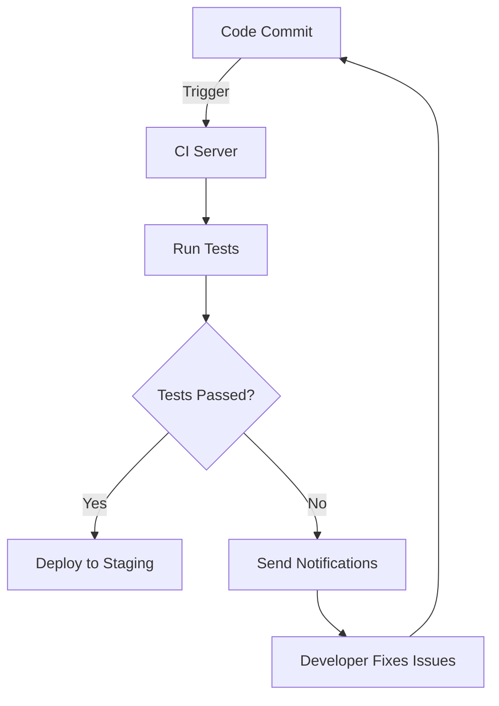

## 10.4.4 Continuous Integration for Testing

In the fast-paced world of software development, ensuring that your code is reliable and maintainable is crucial. Continuous Integration (CI) is a practice that has become a cornerstone of modern development workflows, particularly in the context of testing. This section will delve into the intricacies of CI, its benefits for testing, and how to effectively implement it in your Flutter projects.

### Defining Continuous Integration

Continuous Integration is a development practice where developers frequently merge their code changes into a central repository, typically multiple times a day. Each integration is verified by an automated build and test process, allowing teams to detect problems early.

- **Key Concept:** CI aims to improve software quality and reduce the time it takes to deliver features by integrating work frequently and testing it automatically.
- **Workflow:** Developers commit code to a shared repository. A CI server monitors the repository and automatically runs tests whenever changes are detected.

### Benefits for Testing

CI offers numerous advantages, particularly in the realm of testing:

- **Early Detection of Integration Issues:** By integrating code frequently, CI helps catch integration issues early, reducing the risk of conflicts and bugs that can arise when changes are merged at the end of a development cycle.
- **Automated Testing:** CI systems automatically run a suite of tests on each integration, ensuring that new code does not break existing functionality. This automation helps maintain code quality and reliability.
- **Consistent Testing Environment:** CI provides a consistent environment for testing, reducing the "it works on my machine" problem by ensuring that tests run in a controlled, repeatable environment.

### Setting Up Notifications

Effective CI setups include notifications to alert developers of test failures or other issues. Notifications can be configured to keep the team informed and responsive:

- **Email Alerts:** Configure your CI tool to send email notifications to developers when a build fails. This ensures that issues are addressed promptly.
- **Slack Messages:** Integrate your CI system with communication tools like Slack to send real-time alerts to development channels, facilitating quick responses and collaboration.
- **Dashboard Alerts:** Use CI dashboards to display the status of builds and tests, providing a visual overview of the project's health.

### Monitoring Test Results

Monitoring and interpreting test results is a critical aspect of CI. Understanding these results helps teams maintain high code quality:

- **Accessing Test Reports:** Most CI tools generate detailed test reports that can be accessed through their dashboards. These reports provide insights into which tests passed or failed and why.
- **Interpreting Results:** Analyze test reports to identify patterns in failures, such as flaky tests or recurring issues, and take corrective actions.
- **Visualizing Trends:** Use CI dashboards to visualize test results over time, helping teams track improvements or regressions in code quality.



### Best Practices

To maximize the effectiveness of CI in testing, consider the following best practices:

- **Maintain a Green Build:** Strive to keep the build green by fixing broken tests promptly. A green build indicates that the code is stable and ready for deployment.
- **Regularly Update Test Suites:** As the codebase evolves, regularly review and update test suites to ensure they remain relevant and effective.
- **Optimize Test Execution:** Prioritize and parallelize tests to reduce execution time, ensuring that feedback is delivered quickly.
- **Encourage Team Collaboration:** Foster a culture of collaboration where developers work together to resolve issues highlighted by CI.

### Practical Example: Setting Up CI for a Flutter Project

Let's walk through a practical example of setting up CI for a Flutter project using GitHub Actions, a popular CI/CD tool.

1. **Create a GitHub Repository:** Start by creating a repository for your Flutter project on GitHub.

2. **Add a Workflow File:** In your repository, create a `.github/workflows` directory and add a YAML file for your CI workflow. Here's a basic example:

   ```yaml
   name: Flutter CI

   on:
     push:
       branches:
         - main
     pull_request:
       branches:
         - main

   jobs:
     build:
       runs-on: ubuntu-latest

       steps:
       - uses: actions/checkout@v2

       - name: Set up Flutter
         uses: subosito/flutter-action@v1
         with:
           flutter-version: '2.5.0'

       - name: Install dependencies
         run: flutter pub get

       - name: Run tests
         run: flutter test
   ```

3. **Configure Notifications:** Set up notifications for test failures using GitHub's built-in notification system or integrate with Slack for real-time alerts.

4. **Monitor Test Results:** Use GitHub Actions' dashboard to monitor test results and ensure that your code remains stable.

### Conclusion

Continuous Integration is an invaluable practice for maintaining code quality and reliability in Flutter projects. By integrating frequently, automating tests, and setting up effective notifications and monitoring, teams can catch issues early and ensure that their applications are robust and ready for deployment. Embrace CI as a fundamental part of your development workflow to enhance your project's success.

## Quiz Time!



### What is Continuous Integration (CI)?

- [x] A practice of merging code changes frequently and automatically testing them.
- [ ] A method of deploying applications to production.
- [ ] A tool for managing code repositories.
- [ ] A technique for writing unit tests.

> **Explanation:** Continuous Integration involves frequently merging code changes into a central repository and automatically testing them to catch issues early.

### How does CI benefit testing?

- [x] It helps catch integration issues early.
- [x] It ensures code quality before deployment.
- [ ] It replaces the need for manual testing.
- [ ] It slows down the development process.

> **Explanation:** CI benefits testing by catching integration issues early and ensuring code quality through automated tests before deployment.

### What is a common method for receiving CI notifications?

- [x] Email alerts
- [x] Slack messages
- [ ] Phone calls
- [ ] Text messages

> **Explanation:** Email alerts and Slack messages are common methods for receiving CI notifications about test failures or other issues.

### What should you do if a test fails in CI?

- [x] Fix the broken test promptly.
- [ ] Ignore the failure and continue development.
- [ ] Disable the test.
- [ ] Revert all recent code changes.

> **Explanation:** Fixing broken tests promptly is crucial to maintaining a green build and ensuring code stability.

### How can you visualize test results over time in CI?

- [x] Use CI dashboards to display trends.
- [ ] Print test results on paper.
- [ ] Use a spreadsheet to track results.
- [ ] Rely on memory to recall past results.

> **Explanation:** CI dashboards provide a visual representation of test results over time, helping teams track improvements or regressions.

### What is a best practice for maintaining a green build?

- [x] Fix broken tests promptly.
- [ ] Run tests only once a week.
- [ ] Ignore test failures.
- [ ] Disable notifications.

> **Explanation:** Maintaining a green build involves fixing broken tests promptly to ensure code stability and readiness for deployment.

### What should you regularly do with your test suites?

- [x] Review and update them to adapt to code changes.
- [ ] Delete old tests.
- [ ] Ignore them once they are set up.
- [ ] Run them only on major releases.

> **Explanation:** Regularly reviewing and updating test suites ensures they remain relevant and effective as the codebase evolves.

### What is the role of a CI server?

- [x] To monitor the repository and run tests automatically.
- [ ] To deploy applications to production.
- [ ] To write code for developers.
- [ ] To manage user accounts.

> **Explanation:** A CI server monitors the repository for changes and automatically runs tests to verify code integrations.

### What is the purpose of automated testing in CI?

- [x] To ensure new code does not break existing functionality.
- [ ] To replace manual testing entirely.
- [ ] To slow down the development process.
- [ ] To increase the complexity of the codebase.

> **Explanation:** Automated testing in CI ensures that new code changes do not break existing functionality, maintaining code quality.

### True or False: CI eliminates the need for manual testing.

- [ ] True
- [x] False

> **Explanation:** While CI automates many testing processes, it does not eliminate the need for manual testing, which is still important for certain scenarios.


