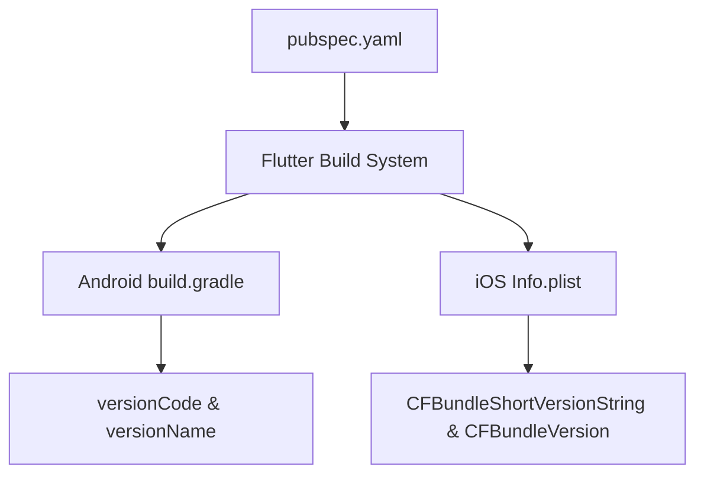

## 11.1.1 App Versioning and Build Numbers

In the world of software development, app versioning and build numbers play a crucial role in the lifecycle of an application. They are not just arbitrary numbers but serve as a communication tool between developers, users, and app stores. In this section, we will delve into the intricacies of app versioning and build numbers, particularly in the context of Flutter development.

### Understanding App Versioning

App versioning is a systematic method of assigning unique version numbers to different states of a software application. This practice is essential for several reasons:

- **Communicating Updates:** Version numbers inform users about updates, bug fixes, and new features, helping them understand the changes in each release.
- **App Store Management:** App stores rely on version numbers to manage updates and ensure users receive the latest version of an app.
- **Tracking and Troubleshooting:** Developers use version numbers to track releases, identify issues, and troubleshoot problems effectively.

#### Purpose of Versioning

Versioning serves multiple purposes in the software development lifecycle:

- **User Communication:** It provides users with a clear indication of what has changed in the app, whether it's a major overhaul or a minor bug fix.
- **Development Tracking:** Developers can track the evolution of the app, making it easier to manage code changes and collaborate with team members.
- **App Store Compliance:** App stores require version numbers to differentiate between different releases, ensuring users always have access to the latest version.

### Semantic Versioning

Semantic Versioning (SemVer) is a widely adopted versioning scheme that conveys meaning about the underlying code changes. It follows a `major.minor.patch` format:

- **Major Version:** Incremented for incompatible API changes.
- **Minor Version:** Incremented when adding functionality in a backward-compatible manner.
- **Patch Version:** Incremented for backward-compatible bug fixes.

This structured approach helps developers and users understand the nature of changes in each release.

### Versioning in Flutter

Flutter manages versioning through the `pubspec.yaml` file, a central configuration file for Flutter projects. The version is specified in the format `major.minor.patch+build`.

```yaml
version: 1.0.0+1
```

- **`1.0.0`** represents the version number.
- **`+1`** represents the build number.

#### Semantic Versioning Breakdown

- **Major Version (`1`):** Indicates significant changes that may break backward compatibility.
- **Minor Version (`0`):** Represents new features added in a backward-compatible manner.
- **Patch Version (`0`):** Denotes bug fixes that do not affect the app's API.
- **Build Number (`1`):** Used for internal tracking and incremented with each release.

### Setting Version and Build Number

To set and update version numbers in a Flutter project, follow these steps:

1. **Open `pubspec.yaml`:** Locate the `version` line in your project's `pubspec.yaml` file.
2. **Update the Version and Build Number:** Modify the version and build number as needed.

```yaml
version: 1.2.3+4
```

3. **Increment Build Number:** Ensure the build number is incremented for each release to avoid conflicts on app stores.

### Platform-Specific Versioning

Flutter maps versioning to platform-specific configurations for Android and iOS.

#### Android Versioning

In Android, versioning is mapped to `versionCode` and `versionName` in `build.gradle`.

```gradle
defaultConfig {
    versionCode flutterVersionCode.toInteger()
    versionName flutterVersionName
}
```

- **`versionCode`:** A unique integer that represents the version of the app.
- **`versionName`:** A string that represents the version name shown to users.

#### iOS Versioning

For iOS, versioning is linked to `CFBundleShortVersionString` and `CFBundleVersion` in `Info.plist`.

```xml
<key>CFBundleShortVersionString</key>
<string>$(FLUTTER_BUILD_NAME)</string>
<key>CFBundleVersion</key>
<string>$(FLUTTER_BUILD_NUMBER)</string>
```

- **`CFBundleShortVersionString`:** The version number displayed to users.
- **`CFBundleVersion`:** The build number used for internal tracking.

### Automating Versioning

Automation can streamline the versioning process, reducing human error and ensuring consistency. Consider using tools and scripts to automate versioning, especially in CI/CD pipelines.

#### Example Command

Use the `--build-name` and `--build-number` flags to automate versioning during the build process:

```bash
flutter build apk --build-name=1.2.3 --build-number=4
```

### Best Practices

- **Consistency:** Ensure version numbers are consistent across all platforms.
- **Documentation:** Maintain a changelog to record changes made in each version.
- **Automation:** Use scripts or tools to automate the versioning process.

### Visual Aids

#### Version Number Examples

| Version Number | Significance                           |
|----------------|----------------------------------------|
| 1.0.0          | Initial release                         |
| 1.1.0          | New features added                      |
| 1.1.1          | Bug fixes                               |
| 2.0.0          | Major changes, possibly breaking APIs   |

#### Version Propagation Flowchart



### Exercise

To solidify your understanding, update the version and build number in a sample Flutter app. Verify that the changes are reflected correctly in the built app by checking the version information on both Android and iOS platforms.

### Conclusion

App versioning and build numbers are vital components of the software development lifecycle. They facilitate communication between developers, users, and app stores, ensuring a smooth update process and effective troubleshooting. By following best practices and leveraging automation, you can manage versioning efficiently in your Flutter projects.

## Quiz Time!



### What is the primary purpose of app versioning?

- [x] To communicate updates, bug fixes, and new features to users.
- [ ] To increase the app's file size.
- [ ] To make the app more complex.
- [ ] To reduce the app's functionality.

> **Explanation:** App versioning communicates updates, bug fixes, and new features to users, helping them understand changes in each release.

### What does the `+1` represent in the version `1.0.0+1`?

- [ ] Major version
- [ ] Minor version
- [ ] Patch version
- [x] Build number

> **Explanation:** The `+1` represents the build number, used for internal tracking and incremented with each release.

### In Semantic Versioning, what does incrementing the major version indicate?

- [x] Incompatible API changes
- [ ] Backward-compatible bug fixes
- [ ] New features added in a backward-compatible manner
- [ ] Internal code refactoring

> **Explanation:** Incrementing the major version indicates incompatible API changes.

### How does Flutter manage versioning?

- [ ] Through the AndroidManifest.xml file
- [x] Through the `pubspec.yaml` file
- [ ] Through the main.dart file
- [ ] Through the build.gradle file

> **Explanation:** Flutter manages versioning through the `pubspec.yaml` file.

### What is the role of `CFBundleVersion` in iOS versioning?

- [ ] It represents the version name shown to users.
- [x] It is used for internal tracking of the build number.
- [ ] It is the same as `CFBundleShortVersionString`.
- [ ] It is not used in iOS versioning.

> **Explanation:** `CFBundleVersion` is used for internal tracking of the build number in iOS.

### Which command can automate versioning during the build process in Flutter?

- [x] `flutter build apk --build-name=1.2.3 --build-number=4`
- [ ] `flutter run --version=1.2.3`
- [ ] `flutter deploy --build=4`
- [ ] `flutter init --version=1.2.3`

> **Explanation:** The command `flutter build apk --build-name=1.2.3 --build-number=4` automates versioning during the build process.

### What is the significance of maintaining a changelog?

- [x] To record changes made in each version
- [ ] To increase the app's complexity
- [ ] To reduce the app's functionality
- [ ] To make the app more expensive

> **Explanation:** Maintaining a changelog helps record changes made in each version, aiding in tracking and communication.

### What is the purpose of `versionCode` in Android versioning?

- [x] It is a unique integer representing the version of the app.
- [ ] It is a string shown to users.
- [ ] It is used for internal tracking only.
- [ ] It is not used in Android versioning.

> **Explanation:** `versionCode` is a unique integer representing the version of the app in Android.

### Why is it important to increment the build number for each release?

- [x] To avoid conflicts on app stores
- [ ] To increase the app's size
- [ ] To make the app more complex
- [ ] To reduce the app's functionality

> **Explanation:** Incrementing the build number for each release avoids conflicts on app stores.

### True or False: Semantic Versioning follows a `major.minor.patch` format.

- [x] True
- [ ] False

> **Explanation:** Semantic Versioning indeed follows a `major.minor.patch` format, conveying meaning about code changes.


