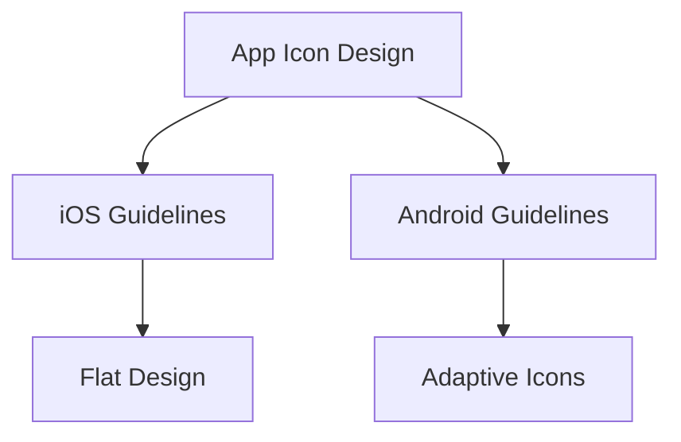

---

linkTitle: "11.1.3 Configuring App Icons and Splash Screens"
title: "Configuring App Icons and Splash Screens for Flutter Apps"
description: "Learn how to configure app icons and splash screens in Flutter for a professional and branded user experience."
categories:
- Flutter Development
- Mobile App Deployment
- UI/UX Design
tags:
- Flutter
- App Icons
- Splash Screens
- Mobile Development
- UI Design
date: 2024-10-25
type: docs
nav_weight: 1113000
---

## 11.1.3 Configuring App Icons and Splash Screens

In the world of mobile applications, first impressions are crucial. App icons and splash screens are often the first elements users encounter, setting the tone for their experience with your app. This section will guide you through the process of configuring these elements in your Flutter application, ensuring they are visually appealing and consistent with your brand identity.

### Role of App Icons and Splash Screens

**App Icons** are the visual representations of your app on a device's home screen or app drawer. They are not just mere images but are integral to your app's identity, helping users recognize and differentiate your app from others. A well-designed app icon can significantly impact user engagement and retention.

**Splash Screens** serve as a branded loading screen that appears while your app is initializing. They provide a seamless transition from launching the app to displaying the main content, offering an opportunity to reinforce your brand identity and enhance the user experience.

### Creating App Icons

#### Design Guidelines

When designing app icons, it's essential to adhere to platform-specific guidelines to ensure they look great on all devices:

- **iOS Guidelines**: Apple recommends a flat design with no transparency. Icons should be simple, recognizable, and should not include text.
- **Android Guidelines**: Google suggests using adaptive icons that can be displayed in different shapes. The design should be scalable and work well at various sizes.

**High-Resolution Images**: Always use high-resolution images to cater to different screen densities. This ensures that your icons look sharp and professional on all devices.

#### Icon Sizes

Different platforms require different icon sizes. Here is a table outlining the necessary sizes for both Android and iOS:

| Platform | Icon Size (px) | Purpose                  |
|----------|----------------|--------------------------|
| iOS      | 1024x1024      | App Store                |
| iOS      | 180x180        | iPhone App Icon          |
| iOS      | 167x167        | iPad Pro App Icon        |
| iOS      | 152x152        | iPad App Icon            |
| iOS      | 120x120        | iPhone Spotlight Icon    |
| iOS      | 80x80          | iPad Spotlight Icon      |
| Android  | 48x48          | MDPI                     |
| Android  | 72x72          | HDPI                     |
| Android  | 96x96          | XHDPI                    |
| Android  | 144x144        | XXHDPI                   |
| Android  | 192x192        | XXXHDPI                  |

### Using `flutter_launcher_icons`

To simplify the process of generating app icons, you can use the `flutter_launcher_icons` package.

#### Installation

Add the following configuration to your `pubspec.yaml` file:

```yaml
dev_dependencies:
  flutter_launcher_icons: "^0.9.0"
flutter_icons:
  android: true
  ios: true
  image_path: "assets/icon/icon.png"
```

#### Execution

After configuring your `pubspec.yaml`, run the following commands to generate the icons:

```bash
flutter pub get
flutter pub run flutter_launcher_icons:main
```

#### Customization

If you need different icons for Android and iOS, you can specify separate paths:

```yaml
flutter_icons:
  android: true
  ios: true
  image_path_android: "assets/icon/android_icon.png"
  image_path_ios: "assets/icon/ios_icon.png"
```

### Setting Up Splash Screens

Splash screens can be configured using the `flutter_native_splash` package, which automates the process for both Android and iOS.

#### Using `flutter_native_splash`

##### Installation

Add the following configuration to your `pubspec.yaml` file:

```yaml
dev_dependencies:
  flutter_native_splash: "^2.0.0"
flutter_native_splash:
  color: "#ffffff"
  image: assets/images/splash.png
```

##### Execution

Run the following commands to create the splash screens:

```bash
flutter pub get
flutter pub run flutter_native_splash:create
```

### Manual Configuration (Advanced)

For those who prefer more control over the splash screen appearance, manual configuration is possible.

#### Android

Edit the `launch_background.xml` file located in `android/app/src/main/res/drawable` to customize the splash screen's appearance. You can define a background color, image, or even animations.

#### iOS

Modify the `LaunchScreen.storyboard` file in Xcode. This allows for advanced customization, such as adding multiple images or animations.

### Testing Icons and Splash Screens

#### On Emulators and Devices

It's crucial to test your app on various devices to ensure that the icons and splash screens appear as expected. This includes checking different screen sizes and resolutions.

#### Visual Consistency

Ensure that branding elements are consistent across platforms. This includes using the same color schemes, logos, and design elements.

### Best Practices

- **Keep Splash Screens Simple**: A simple design reduces loading times and provides a better user experience.
- **Clear and Recognizable Icons**: Ensure that icons are easily recognizable, even at small sizes.
- **Avoid Text in Icons**: Text can be difficult to read at small sizes and may not translate well for localization.

### Visual Aids

Below are visual examples of correctly sized app icons and splash screens:



### Exercise

Now it's your turn! Create custom app icons and splash screens for a sample app. Verify your changes by running the app on multiple platforms and ensure that everything looks consistent and professional.

## Quiz Time!



### What is the primary purpose of an app icon?

- [x] To visually represent the app on a device
- [ ] To display the app's loading screen
- [ ] To provide app functionality
- [ ] To store app data

> **Explanation:** App icons are the visual representations of the app on devices, helping users recognize and differentiate the app.

### What is a splash screen used for?

- [x] To provide a branded loading screen while the app initializes
- [ ] To replace the app icon
- [ ] To display app notifications
- [ ] To enhance app security

> **Explanation:** Splash screens serve as a branded loading screen that appears while the app is initializing.

### Which package is used to generate app icons in Flutter?

- [x] flutter_launcher_icons
- [ ] flutter_native_splash
- [ ] flutter_icons
- [ ] flutter_app_icons

> **Explanation:** The `flutter_launcher_icons` package is used to generate app icons in Flutter.

### What is the recommended design style for iOS app icons?

- [x] Flat design with no transparency
- [ ] 3D design with shadows
- [ ] Text-based design
- [ ] Animated design

> **Explanation:** iOS app icons should follow a flat design with no transparency, as per Apple's guidelines.

### How can you specify different icons for Android and iOS using `flutter_launcher_icons`?

- [x] By using `image_path_android` and `image_path_ios` in `pubspec.yaml`
- [ ] By creating separate projects for Android and iOS
- [ ] By using different image formats
- [ ] By editing the main.dart file

> **Explanation:** You can specify different icons for Android and iOS by using `image_path_android` and `image_path_ios` in the `pubspec.yaml` file.

### Which package is used to configure splash screens in Flutter?

- [x] flutter_native_splash
- [ ] flutter_launcher_icons
- [ ] splash_screen_creator
- [ ] flutter_splash

> **Explanation:** The `flutter_native_splash` package is used to configure splash screens in Flutter.

### What is the purpose of the `LaunchScreen.storyboard` file in iOS?

- [x] To customize the splash screen's appearance
- [ ] To configure app icons
- [ ] To manage app permissions
- [ ] To store app data

> **Explanation:** The `LaunchScreen.storyboard` file in iOS is used to customize the splash screen's appearance.

### Why should text be avoided in app icons?

- [x] Because it can be difficult to read at small sizes and may not translate well for localization
- [ ] Because it increases the app size
- [ ] Because it is not supported by Android
- [ ] Because it is not supported by iOS

> **Explanation:** Text should be avoided in app icons because it can be difficult to read at small sizes and may not translate well for localization.

### What is the benefit of using high-resolution images for app icons?

- [x] To ensure icons look sharp and professional on all devices
- [ ] To reduce app loading time
- [ ] To increase app security
- [ ] To enhance app functionality

> **Explanation:** High-resolution images ensure that icons look sharp and professional on all devices, catering to different screen densities.

### True or False: Splash screens should be complex to showcase app features.

- [ ] True
- [x] False

> **Explanation:** Splash screens should be simple to reduce loading times and provide a better user experience.


