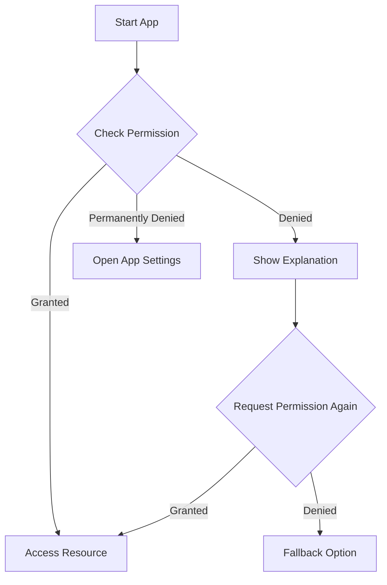

## 11.1.4 Managing App Permissions

In the world of mobile applications, managing permissions is crucial for both user privacy and app functionality. Permissions allow your app to access restricted data and resources on a user's device, such as the camera, location, or contacts. However, it's essential to handle these permissions responsibly to maintain user trust and comply with platform guidelines. This section will guide you through the process of managing app permissions in Flutter for both Android and iOS, using best practices and practical examples.

### Understanding Permissions

Permissions are a way for mobile operating systems to control access to sensitive data and device features. When an app requests a permission, it is essentially asking the user for access to a particular resource. For example, a photo editing app might request access to the camera and photo gallery, while a navigation app might need location access.

- **Importance of Permissions:**
  - Permissions protect user privacy by ensuring that apps cannot access sensitive data without explicit user consent.
  - Requesting only the necessary permissions minimizes the risk of privacy breaches and enhances user trust.

- **Types of Permissions:**
  - **Normal Permissions:** These are automatically granted by the system and do not require user approval (e.g., internet access).
  - **Dangerous Permissions:** These require explicit user consent as they provide access to sensitive data (e.g., camera, location).

### Configuring Permissions for Android

Android permissions are declared in the `AndroidManifest.xml` file, and from Android 6.0 (API level 23), dangerous permissions must also be requested at runtime.

#### Adding Permissions

To declare permissions in your Flutter app for Android, you need to edit the `AndroidManifest.xml` file located in the `android/app/src/main` directory. Here’s how you can add permissions for accessing the camera and fine location:

```xml
<manifest xmlns:android="http://schemas.android.com/apk/res/android"
    package="com.example.myapp">

    <uses-permission android:name="android.permission.CAMERA" />
    <uses-permission android:name="android.permission.ACCESS_FINE_LOCATION" />

    <application
        android:label="MyApp"
        android:icon="@mipmap/ic_launcher">
        <!-- Other configurations -->
    </application>
</manifest>
```

#### Runtime Permissions

Starting from Android 6.0, dangerous permissions must be requested at runtime. This means that even if you declare them in the manifest, you must also prompt the user to grant these permissions while the app is running.

### Configuring Permissions for iOS

On iOS, permissions are configured in the `Info.plist` file, where you must provide usage descriptions for each permission your app requests. This is crucial as it informs users why your app needs access to certain data or features.

#### Info.plist Entries

To request camera and location permissions, you need to add the following entries to your `ios/Runner/Info.plist` file:

```xml
<key>NSCameraUsageDescription</key>
<string>This app requires camera access to take photos.</string>
<key>NSLocationWhenInUseUsageDescription</key>
<string>This app needs your location to provide personalized content.</string>
```

- **Descriptive Messages:** Always provide clear and concise messages explaining why your app needs each permission. This transparency helps users make informed decisions.

### Requesting Permissions at Runtime

To handle permissions at runtime in a Flutter app, you can use the `permission_handler` package. This package simplifies the process of requesting and checking permissions across both Android and iOS.

#### Using `permission_handler` Package

##### Installation

First, add the `permission_handler` package to your `pubspec.yaml` file:

```yaml
dependencies:
  flutter:
    sdk: flutter
  permission_handler: "^10.0.0"
```

Run `flutter pub get` to install the package.

##### Usage

Import the package and use it to request permissions in your Dart code:

```dart
import 'package:permission_handler/permission_handler.dart';

void requestPermissions() async {
  PermissionStatus status = await Permission.camera.request();
  if (status.isGranted) {
    // Permission granted
    print("Camera permission granted");
  } else if (status.isDenied) {
    // Permission denied
    print("Camera permission denied");
  } else if (status.isPermanentlyDenied) {
    // Permission permanently denied, open app settings
    openAppSettings();
  }
}
```

- **Handling Permission States:** It's important to handle different permission states, such as denied or permanently denied, and provide appropriate feedback or alternatives to users.

### Best Practices

Managing permissions effectively involves more than just requesting them. Here are some best practices to follow:

- **Just-in-Time Permissions:** Request permissions only when they are needed, rather than at app startup. This approach reduces user friction and increases the likelihood of users granting the permission.

- **Clear Explanations:** Before requesting a permission, provide context to users about why the permission is necessary. This can be done through a dialog or an introductory screen.

- **Fallback Mechanisms:** Design your app to handle scenarios where permissions are denied. For example, if camera access is denied, allow users to upload photos from their gallery instead.

### Testing Permissions

Testing how your app handles permissions is crucial to ensure a smooth user experience. Here are some strategies:

- **Simulate Different Scenarios:** Use emulators and physical devices to test how your app behaves when permissions are granted, denied, or permanently denied.

- **Test on Multiple Devices:** Different devices and Android/iOS versions may handle permissions differently, so it's important to test across a range of devices.

### Visual Aids

To help you visualize the permission request process, here are some code examples and screenshots:

- **Code Example:** Implementing permission requests using the `permission_handler` package.
- **Screenshots:** Examples of permission prompts on Android and iOS devices.



### Exercise

To reinforce your understanding, try implementing permission requests for accessing the gallery in your Flutter app. Test the app on a device to observe the permission flow and ensure it handles all possible scenarios gracefully.

By following these guidelines and best practices, you can manage app permissions effectively, ensuring both user privacy and app functionality. Remember to always prioritize user trust by being transparent about why your app needs certain permissions and handling denied permissions gracefully.

## Quiz Time!



### What is the primary purpose of app permissions?

- [x] To control access to sensitive data and resources
- [ ] To enhance app performance
- [ ] To improve app aesthetics
- [ ] To increase app download speed

> **Explanation:** App permissions are primarily used to control access to sensitive data and resources, ensuring user privacy and security.

### Where do you declare permissions for an Android app?

- [x] AndroidManifest.xml
- [ ] Info.plist
- [ ] pubspec.yaml
- [ ] main.dart

> **Explanation:** Permissions for an Android app are declared in the `AndroidManifest.xml` file.

### From which Android version are runtime permissions required?

- [x] Android 6.0 (API level 23)
- [ ] Android 5.0 (API level 21)
- [ ] Android 7.0 (API level 24)
- [ ] Android 8.0 (API level 26)

> **Explanation:** Runtime permissions are required starting from Android 6.0 (API level 23).

### How do you request permissions at runtime in Flutter?

- [x] Using the `permission_handler` package
- [ ] Editing the `pubspec.yaml` file
- [ ] Modifying the `main.dart` file
- [ ] Using the `flutter_permissions` package

> **Explanation:** The `permission_handler` package is used to request permissions at runtime in Flutter.

### What should you include in the `Info.plist` file for iOS permissions?

- [x] Usage descriptions
- [ ] Permission requests
- [ ] API keys
- [ ] App icons

> **Explanation:** Usage descriptions should be included in the `Info.plist` file to inform users why the app needs certain permissions.

### What is a best practice for requesting permissions?

- [x] Request permissions just-in-time
- [ ] Request all permissions at app startup
- [ ] Request permissions without explanation
- [ ] Request permissions only once

> **Explanation:** Requesting permissions just-in-time, when they are needed, is a best practice to reduce user friction.

### How should you handle permanently denied permissions?

- [x] Open app settings
- [ ] Ignore the denial
- [ ] Force the permission
- [ ] Restart the app

> **Explanation:** If a permission is permanently denied, you should guide the user to open app settings to manually grant the permission.

### What is the purpose of providing clear explanations before requesting permissions?

- [x] To help users understand why the permission is needed
- [ ] To increase app download speed
- [ ] To enhance app aesthetics
- [ ] To improve app performance

> **Explanation:** Providing clear explanations helps users understand why the permission is needed, increasing the likelihood of them granting it.

### Why is it important to test permissions on multiple devices?

- [x] Different devices may handle permissions differently
- [ ] To increase app download speed
- [ ] To improve app aesthetics
- [ ] To enhance app performance

> **Explanation:** Testing on multiple devices is important because different devices and OS versions may handle permissions differently.

### True or False: You should request all permissions at app startup.

- [ ] True
- [x] False

> **Explanation:** False. It's best to request permissions just-in-time, when they are needed, to reduce user friction and enhance user experience.


