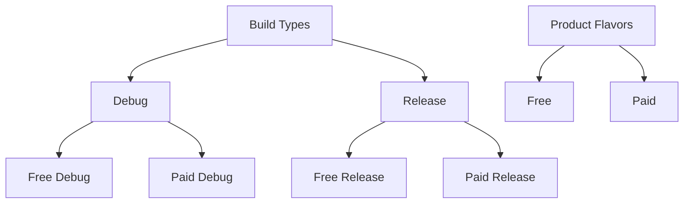

## 11.2.1 Configuring Android Build Settings

Building a Flutter app for Android involves configuring various settings to ensure your application runs smoothly across different devices and environments. This section will guide you through the essential configurations in the `build.gradle` files, which are crucial for defining how your Android app is built and packaged.

### Understanding `build.gradle`

The `build.gradle` files are the backbone of your Android build configuration. They define the build settings, dependencies, and other configurations necessary for compiling your Android app. In a typical Flutter project, you'll find two `build.gradle` files:

- **Project-level `build.gradle`:** Located at the root of the `android` directory, this file configures build settings that apply to all modules in the project.
- **App-level `build.gradle`:** Found in the `android/app` directory, this file contains configurations specific to the app module, such as application ID, SDK versions, and build types.

### Configuring `build.gradle` Settings

Let's dive into the app-level `build.gradle` file and explore the key configurations you need to set up.

#### Application ID

The `applicationId` uniquely identifies your app on the device and in the Google Play Store. It's crucial to set this correctly to avoid conflicts with other apps.

```gradle
defaultConfig {
    applicationId "com.example.myapp"
}
```

- **Tip:** Use a reverse domain name format for the `applicationId` to ensure uniqueness.

#### Min SDK and Target SDK

The `minSdkVersion` specifies the minimum Android version your app supports, while the `targetSdkVersion` indicates the version your app is optimized for.

```gradle
defaultConfig {
    minSdkVersion 21
    targetSdkVersion 30
}
```

- **Min SDK Version:** Choose a version that balances reaching a broad audience and leveraging modern Android features.
- **Target SDK Version:** Always set this to the latest stable version to ensure compatibility with the latest Android features and security updates.

### Build Types and Flavors

Android build types and flavors allow you to create different versions of your app with varying configurations.

#### Build Types

Build types define different build configurations, such as `debug` and `release`. Each build type can have its own settings, such as signing configurations and ProGuard rules.

```gradle
buildTypes {
    debug {
        // Debug settings
    }
    release {
        // Release settings
        signingConfig signingConfigs.release
    }
}
```

- **Debug Build:** Used during development, includes debugging information and is not optimized for performance.
- **Release Build:** Optimized for performance and ready for distribution. Ensure you configure signing and enable code shrinking.

#### Product Flavors

Product flavors allow you to create different versions of your app for various environments, such as free and paid versions.

```gradle
flavorDimensions "version"
productFlavors {
    free {
        dimension "version"
        applicationIdSuffix ".free"
    }
    paid {
        dimension "version"
        applicationIdSuffix ".paid"
    }
}
```

- **Flavor Dimensions:** Define dimensions to categorize flavors. Each flavor must belong to a dimension.
- **Application ID Suffix:** Use suffixes to differentiate flavors, ensuring each version has a unique application ID.

### Enabling ProGuard and R8

ProGuard and R8 are tools for code shrinking and obfuscation, which help reduce the size of your APK and protect your code from reverse engineering.

```gradle
buildTypes {
    release {
        minifyEnabled true
        shrinkResources true
        proguardFiles getDefaultProguardFile('proguard-android-optimize.txt'), 'proguard-rules.pro'
    }
}
```

- **Minify Enabled:** Set to `true` to enable code shrinking.
- **Shrink Resources:** Removes unused resources to reduce APK size.
- **ProGuard Files:** Specify ProGuard configuration files. Customize `proguard-rules.pro` to add or modify rules.

#### Customizing ProGuard Rules

ProGuard rules define how your code is obfuscated and optimized. Customize these rules in `proguard-rules.pro` to ensure critical code paths are preserved.

```proguard
-keep class com.example.myapp.** { *; }
```

- **Keep Rules:** Use `-keep` to prevent specific classes or methods from being obfuscated.

### Adding Google Services

Integrating Google services, such as Firebase, requires additional configurations.

#### Firebase Integration

To use Firebase services, you need to add the `google-services.json` file to your project and apply the Google Services plugin.

1. **Copy `google-services.json`:** Place this file in the `android/app/` directory.
2. **Apply Plugin:**

```gradle
apply plugin: 'com.google.gms.google-services'
```

- **Note:** Ensure the `google-services.json` file is correctly configured with your Firebase project settings.

### Best Practices

- **Consistency:** Keep build configurations consistent with your app's requirements and update them as needed.
- **Documentation:** Use comments in `build.gradle` to explain configuration choices, aiding future maintenance and collaboration.

### Visual Aids

Below is a diagram illustrating the relationship between build types and product flavors:



### Exercise

To solidify your understanding, try setting up different build flavors for staging and production environments. Build the app using each flavor and observe the differences in configuration.

### Conclusion

Configuring Android build settings is a crucial step in preparing your Flutter app for deployment. By understanding and applying these configurations, you can ensure your app is optimized for performance, security, and compatibility across various devices and environments.

For further exploration, refer to the [official Android documentation](https://developer.android.com/studio/build) and [Flutter's build configuration guide](https://flutter.dev/docs/deployment/android).

## Quiz Time!



### What is the purpose of the `applicationId` in the `build.gradle` file?

- [x] It uniquely identifies your app on the device and in the Google Play Store.
- [ ] It specifies the minimum Android version your app supports.
- [ ] It defines the build configurations for different environments.
- [ ] It configures the signing settings for the release build.

> **Explanation:** The `applicationId` is a unique identifier for your app, necessary for installation and distribution.

### Which `build.gradle` file contains configurations specific to the app module?

- [x] `android/app/build.gradle`
- [ ] `android/build.gradle`
- [ ] `android/settings.gradle`
- [ ] `android/gradle.properties`

> **Explanation:** The app-level `build.gradle` file, located in `android/app`, contains configurations specific to the app module.

### What is the role of `minSdkVersion` in the `build.gradle` file?

- [x] It specifies the minimum Android version your app supports.
- [ ] It indicates the version your app is optimized for.
- [ ] It defines the build types for the app.
- [ ] It configures the signing settings for the release build.

> **Explanation:** `minSdkVersion` sets the minimum Android version that your app can run on.

### How do you enable code shrinking and obfuscation in a release build?

- [x] Set `minifyEnabled` to `true` and configure ProGuard files.
- [ ] Set `debuggable` to `false` in the release build type.
- [ ] Use `applicationIdSuffix` to differentiate build types.
- [ ] Apply the Google Services plugin.

> **Explanation:** Enabling `minifyEnabled` and configuring ProGuard files allows for code shrinking and obfuscation.

### What is the purpose of product flavors in Android build configurations?

- [x] To create different versions of your app for various environments.
- [ ] To define the minimum and target SDK versions.
- [ ] To configure signing settings for the release build.
- [ ] To apply the Google Services plugin.

> **Explanation:** Product flavors allow you to create different app versions with unique configurations.

### Which file should you place in the `android/app/` directory for Firebase integration?

- [x] `google-services.json`
- [ ] `firebase-config.xml`
- [ ] `firebase-settings.gradle`
- [ ] `google-services.gradle`

> **Explanation:** The `google-services.json` file is required for Firebase integration in your Android app.

### What is the function of the `apply plugin: 'com.google.gms.google-services'` line in `build.gradle`?

- [x] It applies the Google Services plugin for Firebase integration.
- [ ] It enables code shrinking and obfuscation.
- [ ] It configures the signing settings for the release build.
- [ ] It sets the minimum and target SDK versions.

> **Explanation:** This line applies the Google Services plugin, necessary for Firebase integration.

### How can you differentiate between free and paid versions of your app using product flavors?

- [x] Use `applicationIdSuffix` to append different suffixes for each flavor.
- [ ] Set different `minSdkVersion` for each flavor.
- [ ] Apply different ProGuard rules for each flavor.
- [ ] Use different signing configurations for each flavor.

> **Explanation:** `applicationIdSuffix` allows you to append unique identifiers for different product flavors.

### What is the recommended format for setting the `applicationId`?

- [x] Reverse domain name format (e.g., `com.example.myapp`)
- [ ] A unique alphanumeric string
- [ ] The app's display name
- [ ] The app's version number

> **Explanation:** Using a reverse domain name format ensures the `applicationId` is unique.

### True or False: The `targetSdkVersion` should always be set to the latest stable version.

- [x] True
- [ ] False

> **Explanation:** Setting `targetSdkVersion` to the latest stable version ensures compatibility with the latest Android features and security updates.


