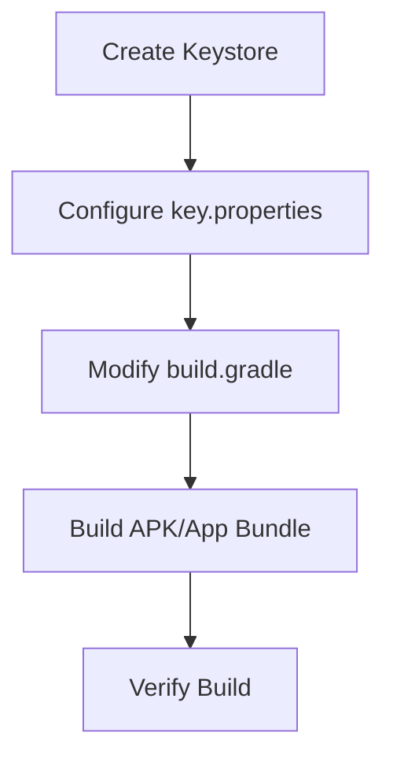

---

linkTitle: "11.2.2 Generating Signed APKs and App Bundles"
title: "Generating Signed APKs and App Bundles for Flutter Apps"
description: "Learn how to generate signed APKs and App Bundles for Flutter applications, ensuring secure and verified app distribution on the Google Play Store."
categories:
- Flutter Development
- Android Deployment
- Mobile App Security
tags:
- Flutter
- Android
- APK
- App Bundle
- Keystore
- App Signing
date: 2024-10-25
type: docs
nav_weight: 11220

---

## 11.2.2 Generating Signed APKs and App Bundles

In the world of mobile app development, ensuring that your application is securely signed is crucial for maintaining the integrity and trustworthiness of your app. This section will guide you through the process of generating signed APKs and App Bundles for your Flutter applications, which is a necessary step for publishing your app on the Google Play Store.

### Understanding the Need for Signing

Before diving into the technical steps, it's important to understand why app signing is necessary:

- **Identity Verification:** Signing an app identifies the author of the app, ensuring that users can trust the source of the application.
- **Update Assurance:** It guarantees that updates to the app come from the same source, preventing malicious updates from unauthorized parties.
- **Security:** Signing adds a layer of security, ensuring that the app has not been tampered with since it was signed.

### Creating a Keystore

A keystore is a binary file that contains private keys and certificates. It is used to sign your app and verify your identity as the developer. Follow these steps to create a keystore:

1. **Open a Terminal or Command Prompt:**

   You will use the `keytool` command, which is part of the Java Development Kit (JDK). Ensure that the JDK is installed and the `keytool` command is accessible from your terminal.

2. **Run the `keytool` Command:**

   Use the following command to generate a new keystore:

   ```bash
   keytool -genkey -v -keystore ~/my-release-key.jks -keyalg RSA -keysize 2048 -validity 10000 -alias my-alias
   ```

   - **`my-release-key.jks`:** This is the name of the keystore file that will be created. You can choose a different name and location if desired.
   - **`-keyalg RSA`:** Specifies the algorithm to use for the key.
   - **`-keysize 2048`:** Sets the size of the key.
   - **`-validity 10000`:** Determines the validity period of the key in days.
   - **`-alias my-alias`:** An alias for the key, which you will use later in the signing process.

3. **Follow the Prompts:**

   The `keytool` command will prompt you for information such as your name, organization, and location. It will also ask you to set a password for the keystore and the key.

### Securing the Keystore

The keystore file and its associated passwords are critical to the security of your app. Here are some best practices for securing them:

- **Keep the Keystore Secure:** Store the keystore file in a secure location, such as a password-protected directory or a secure cloud storage service.
- **Do Not Share the Keystore:** Only trusted individuals should have access to the keystore.
- **Back Up the Keystore:** Create backups of the keystore file and store them in separate secure locations. Losing the keystore means you cannot update your app.

### Configuring Signing in `build.gradle`

Once you have your keystore, you need to configure your Flutter project to use it for signing your app. This involves modifying the `build.gradle` file in your Android project.

1. **Create a `key.properties` File:**

   This file will store the sensitive information required for signing. Create a file named `key.properties` in the `android` directory of your Flutter project with the following structure:

   ```
   storeFile=path/to/your/my-release-key.jks
   storePassword=your-keystore-password
   keyAlias=my-alias
   keyPassword=your-key-password
   ```

   **Note:** Ensure that this file is not checked into version control.

2. **Modify `build.gradle`:**

   Open the `android/app/build.gradle` file and add the following configuration:

   ```gradle
   def keystoreProperties = new Properties()
   def keystorePropertiesFile = rootProject.file('key.properties')
   if (keystorePropertiesFile.exists()) {
       keystoreProperties.load(new FileInputStream(keystorePropertiesFile))
   }

   android {
       signingConfigs {
           release {
               keyAlias keystoreProperties['keyAlias']
               keyPassword keystoreProperties['keyPassword']
               storeFile file(keystoreProperties['storeFile'])
               storePassword keystoreProperties['storePassword']
           }
       }

       buildTypes {
           release {
               signingConfig signingConfigs.release
           }
       }
   }
   ```

   This configuration reads the keystore information from the `key.properties` file and applies it to the release build type.

### Building the APK or App Bundle

With the signing configuration in place, you can now build your app. Flutter provides commands to build both APKs and App Bundles.

- **Building a Signed APK:**

  Use the following command to build a signed APK:

  ```bash
  flutter build apk --release
  ```

  This command compiles your Flutter app into a signed APK ready for distribution.

- **Building an App Bundle:**

  To build an App Bundle, which is recommended for publishing on the Google Play Store, use:

  ```bash
  flutter build appbundle --release
  ```

  App Bundles allow Google Play to optimize the APK for each device, reducing the download size for users.

### Verifying the Build

After building your app, it's important to verify that it works as expected:

- **Install the APK on a Device:**

  Transfer the APK to an Android device and install it to ensure it runs correctly. This step helps catch any issues that might not appear in the emulator.

- **Test the App Bundle:**

  If you built an App Bundle, upload it to the Google Play Console's internal testing track to verify its functionality.

### Best Practices

- **Do Not Check Sensitive Files into Version Control:**

  Ensure that the `key.properties` file and the keystore are excluded from version control systems like Git.

- **Keep Backups of the Keystore:**

  Losing your keystore means you cannot update your app. Always keep secure backups.

- **Regularly Update Your Keystore Passwords:**

  Change your keystore and key passwords periodically to enhance security.

### Visual Aids

To better understand the signing process, consider the following diagram illustrating the flow from keystore creation to app signing:



### Exercise

To solidify your understanding, follow these steps to generate a keystore and build a signed APK and App Bundle:

1. **Generate a Keystore:**

   Use the `keytool` command to create your keystore.

2. **Configure Signing:**

   Set up the `key.properties` file and modify `build.gradle` as described.

3. **Build and Verify:**

   Build both a signed APK and an App Bundle. Test them on a device or through the Google Play Console.

By following these steps, you ensure that your Flutter app is securely signed and ready for distribution on the Google Play Store. This process not only protects your app but also builds trust with your users.

## Quiz Time!



### Why is app signing important?

- [x] It verifies the identity of the app's author.
- [x] It ensures updates are from the same source.
- [ ] It increases the app's download speed.
- [ ] It reduces the app's file size.

> **Explanation:** App signing is crucial for verifying the author's identity and ensuring that updates come from the same source, maintaining the app's integrity and security.

### What command is used to generate a keystore?

- [x] `keytool -genkey -v -keystore ~/my-release-key.jks -keyalg RSA -keysize 2048 -validity 10000 -alias my-alias`
- [ ] `flutter create keystore`
- [ ] `gradle generateKeystore`
- [ ] `jarsigner -keystore`

> **Explanation:** The `keytool` command is used to generate a keystore, which is essential for signing your app.

### What is the purpose of the `key.properties` file?

- [x] To store sensitive information required for signing.
- [ ] To configure the app's build settings.
- [ ] To manage app dependencies.
- [ ] To store user data.

> **Explanation:** The `key.properties` file securely stores sensitive information like passwords and file paths needed for signing the app.

### Which command builds a signed APK?

- [x] `flutter build apk --release`
- [ ] `flutter build appbundle --release`
- [ ] `flutter build ios --release`
- [ ] `flutter build web --release`

> **Explanation:** The `flutter build apk --release` command compiles your Flutter app into a signed APK ready for distribution.

### What is the advantage of using an App Bundle over an APK?

- [x] It allows Google Play to optimize the APK for each device.
- [ ] It reduces the app's file size by half.
- [ ] It increases the app's performance.
- [ ] It simplifies the app's codebase.

> **Explanation:** App Bundles enable Google Play to optimize the APK for each device, reducing the download size for users.

### What should you do with the keystore file?

- [x] Keep it secure and create backups.
- [ ] Share it with your development team.
- [ ] Upload it to version control.
- [ ] Delete it after signing the app.

> **Explanation:** The keystore file should be kept secure, and backups should be created to prevent loss, as it is essential for app updates.

### What is the role of the `build.gradle` file in app signing?

- [x] It configures the signing process for the app.
- [ ] It manages the app's dependencies.
- [ ] It defines the app's UI layout.
- [ ] It stores user preferences.

> **Explanation:** The `build.gradle` file is used to configure the signing process, specifying how the app should be signed with the keystore.

### How can you verify the build of your app?

- [x] Install the APK on a device.
- [x] Upload the App Bundle to Google Play Console's internal testing track.
- [ ] Run the app in a web browser.
- [ ] Check the app's file size.

> **Explanation:** Verifying the build involves installing the APK on a device and testing the App Bundle through Google Play Console.

### What should you avoid doing with the `key.properties` file?

- [x] Checking it into version control.
- [ ] Storing it in a secure location.
- [ ] Using it for signing configuration.
- [ ] Backing it up regularly.

> **Explanation:** The `key.properties` file contains sensitive information and should not be checked into version control.

### True or False: Losing your keystore means you cannot update your app.

- [x] True
- [ ] False

> **Explanation:** True. Losing your keystore means you cannot sign updates for your app, preventing you from publishing updates.


