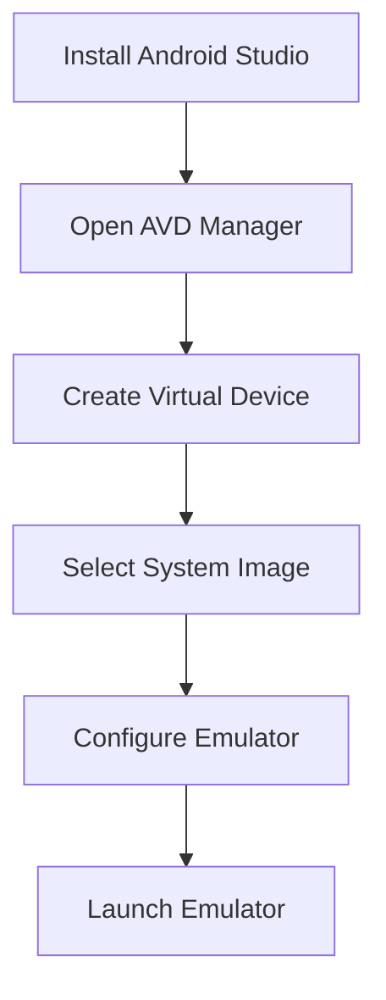

## 11.2.3 Testing on Android Devices

Testing your Flutter application on Android devices is a crucial step in the development process. It ensures that your app functions correctly across different devices and Android versions, providing a seamless user experience. This section will guide you through setting up an Android emulator, testing on physical devices, deploying your app, and conducting various testing scenarios. We will also cover logging and debugging techniques and best practices to ensure your app performs optimally.

### Setting Up an Emulator

An Android emulator is a virtual device that mimics the hardware and software of a real Android device. It allows you to test your app on different screen sizes and API levels without needing physical devices. Here's how to set up an emulator using Android Studio:

1. **Install Android Studio:**
   - Download and install Android Studio from the [official website](https://developer.android.com/studio).
   - Ensure you have the latest version to access the newest features and improvements.

2. **Open the AVD Manager:**
   - Launch Android Studio and open the AVD (Android Virtual Device) Manager by clicking on the "AVD Manager" icon in the toolbar or navigating to `Tools > AVD Manager`.

3. **Create a New Virtual Device:**
   - Click on "Create Virtual Device."
   - Choose a device definition that matches the screen size and resolution you want to test. Popular choices include Pixel devices due to their standard configurations.

4. **Select a System Image:**
   - Choose a system image that corresponds to the Android version you wish to test. It's important to test on multiple API levels to ensure compatibility across different Android versions.
   - Download the system image if it's not already available.

5. **Configure the Emulator:**
   - Customize the emulator settings, such as RAM and storage, to match the specifications of the target device.
   - Click "Finish" to create the emulator.

6. **Launch the Emulator:**
   - Start the emulator by clicking the "Play" button next to the virtual device in the AVD Manager.

> **Tip:** Testing on different API levels is crucial as it helps identify compatibility issues that may arise due to changes in the Android operating system.

### Testing on Physical Devices

While emulators are useful, testing on physical devices provides a more accurate representation of how your app will perform in real-world scenarios. Here's how to set up and test on a physical Android device:

#### Enable Developer Options

1. **Access Developer Options:**
   - Go to `Settings > About Phone`.
   - Tap on the "Build Number" seven times until you see a message indicating that Developer Options are enabled.

#### Enable USB Debugging

1. **Activate USB Debugging:**
   - Navigate to `Settings > Developer Options`.
   - Toggle "USB Debugging" to the "On" position.

#### Connect the Device

1. **Connect via USB:**
   - Use a USB cable to connect your Android device to your computer.

2. **Verify the Connection:**
   - Open a terminal or command prompt.
   - Run the following command to ensure your device is recognized:
     ```bash
     adb devices
     ```
   - You should see your device listed. If prompted, authorize the connection on your device.

### Deploying the App

Once your device is connected, you can deploy your Flutter app to it:

1. **Run the App:**
   - Open your Flutter project in your preferred IDE.
   - Use the following command to deploy the app to the connected device:
     ```bash
     flutter run
     ```
   - This command compiles the app and installs it on the device, allowing you to interact with it as a user would.

### Testing Scenarios

Testing involves more than just running the app. You need to ensure that it functions correctly under various conditions:

#### Functional Testing

- **Interact with the App:**
  - Navigate through the app and use its features to ensure they work as expected.
  - Test all user flows, such as login, data entry, and navigation.

#### UI/UX Testing

- **Observe Layout and Design:**
  - Check the app's layout, fonts, and images on different screen sizes and orientations.
  - Ensure that the UI is intuitive and visually appealing.

#### Performance Testing

- **Monitor Responsiveness:**
  - Assess how quickly the app responds to user inputs.
  - Use profiling tools to monitor CPU, memory, and network usage.

### Logging and Debugging

Effective logging and debugging are essential for identifying and fixing issues:

- **Use Logcat:**
  - Access Logcat in Android Studio to view real-time logs from your device.
  - Filter logs to focus on specific tags or messages related to your app.

- **Flutter Logs Command:**
  - Use the `flutter logs` command to view logs directly from the terminal:
    ```bash
    flutter logs
    ```
  - This command provides a stream of logs that can help diagnose issues.

### Best Practices

To ensure comprehensive testing, consider the following best practices:

- **Test on a Range of Devices:**
  - Use both high-end and low-end devices to understand performance across the spectrum.
  - This helps identify device-specific issues and optimize the app for all users.

- **Check for Device-Specific Issues:**
  - Some features may behave differently on certain devices due to hardware or software variations.
  - Pay attention to these discrepancies and address them accordingly.

### Visual Aids

To assist with the setup process, here are some visual aids:



### Exercise

To reinforce your learning, try the following exercise:

- **Deploy Your App:**
  - Connect a physical device and deploy your app using the steps outlined above.
  - Run through critical user flows, such as registration, login, and data submission.
  - Note any issues or areas for improvement and address them in your code.

By following these steps and best practices, you can ensure that your Flutter app is thoroughly tested and ready for deployment on Android devices. Testing on both emulators and physical devices provides a comprehensive understanding of how your app performs, allowing you to deliver a high-quality user experience.

## Quiz Time!



### What is the primary purpose of setting up an Android emulator?

- [x] To test apps on different screen sizes and API levels without physical devices.
- [ ] To replace physical devices entirely.
- [ ] To debug only network-related issues.
- [ ] To simulate user interactions automatically.

> **Explanation:** An Android emulator allows developers to test their apps on various screen sizes and API levels, providing a virtual environment that mimics real devices.

### How do you enable Developer Options on an Android device?

- [x] Go to Settings > About Phone > Build Number and tap seven times.
- [ ] Go to Settings > Developer Options and toggle the switch.
- [ ] Connect the device to a computer and run a command.
- [ ] Install a third-party app to unlock Developer Options.

> **Explanation:** Developer Options are enabled by tapping the Build Number seven times in the About Phone section of the device settings.

### What command is used to verify that a physical device is connected for testing?

- [x] adb devices
- [ ] flutter devices
- [ ] adb connect
- [ ] flutter connect

> **Explanation:** The `adb devices` command lists all connected Android devices, verifying that the device is ready for testing.

### Which command is used to deploy a Flutter app to a connected device?

- [x] flutter run
- [ ] flutter deploy
- [ ] adb install
- [ ] flutter build

> **Explanation:** The `flutter run` command compiles and installs the app on a connected device, allowing for testing and interaction.

### What is the purpose of functional testing?

- [x] To ensure app features work as expected.
- [ ] To test the app's performance under load.
- [ ] To check the app's compatibility with different devices.
- [ ] To validate the app's UI design.

> **Explanation:** Functional testing involves interacting with the app to ensure that all features and user flows work as intended.

### How can you view real-time logs from an Android device?

- [x] Use Logcat in Android Studio.
- [ ] Use the flutter logs command.
- [ ] Use the adb logcat command.
- [ ] All of the above.

> **Explanation:** Real-time logs can be viewed using Logcat in Android Studio, the `flutter logs` command, or `adb logcat`.

### Why is it important to test on both high-end and low-end devices?

- [x] To understand performance across different device capabilities.
- [ ] To ensure the app looks the same on all devices.
- [ ] To reduce the number of bugs in the app.
- [ ] To increase the app's download size.

> **Explanation:** Testing on a range of devices helps identify performance issues and ensures the app runs smoothly on both high-end and low-end devices.

### What is the benefit of using the `flutter logs` command?

- [x] It provides a stream of logs directly from the terminal.
- [ ] It automatically fixes bugs in the app.
- [ ] It deploys the app to a connected device.
- [ ] It compiles the app for release.

> **Explanation:** The `flutter logs` command allows developers to view logs directly from the terminal, aiding in debugging and issue resolution.

### What should you do if you encounter device-specific issues during testing?

- [x] Investigate and address the discrepancies in your code.
- [ ] Ignore them as they are rare.
- [ ] Only test on emulators to avoid such issues.
- [ ] Use third-party libraries to fix them automatically.

> **Explanation:** Device-specific issues should be investigated and addressed to ensure the app functions correctly across all devices.

### True or False: Testing on emulators is sufficient for all app testing needs.

- [ ] True
- [x] False

> **Explanation:** While emulators are useful, testing on physical devices is essential to understand real-world performance and behavior.


