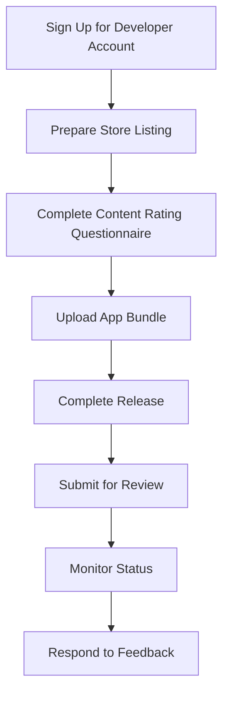

---

linkTitle: "11.2.4 Submitting to Google Play Store"
title: "Submitting Your Flutter App to Google Play Store: A Comprehensive Guide"
description: "Learn how to submit your Flutter app to the Google Play Store with detailed step-by-step instructions, best practices, and visual aids."
categories:
- Flutter Development
- Mobile App Deployment
- Android Development
tags:
- Flutter
- Google Play Store
- App Deployment
- Android
- Mobile Development
date: 2024-10-25
type: docs
nav_weight: 11240

---

## 11.2.4 Submitting Your Flutter App to Google Play Store: A Comprehensive Guide

Publishing your Flutter app on the Google Play Store is a significant milestone in your app development journey. This guide will walk you through the entire process, from creating a developer account to submitting your app for review. We'll cover essential steps, best practices, and provide visual aids to ensure a smooth submission process.

### Creating a Developer Account

Before you can publish your app on the Google Play Store, you need to create a Google Play Developer account. This account allows you to manage your apps, track their performance, and engage with users.

1. **Sign Up for a Developer Account:**
   - Visit the [Google Play Console](https://play.google.com/console).
   - Sign in with your Google account or create a new one if necessary.
   - Follow the prompts to set up your developer account. This includes accepting the Developer Distribution Agreement and paying a one-time registration fee.

2. **Complete Your Profile:**
   - Fill in your developer profile with accurate information. This includes your developer name, email address, and website (if applicable).
   - Ensure that your contact information is up-to-date, as Google may use it to communicate important updates or issues.

### Preparing Store Listing

A well-prepared store listing is crucial for attracting users to your app. It provides potential users with essential information about your app and influences their decision to download it.

#### App Details

- **Title:** Choose a concise and descriptive title for your app. It should reflect the app's purpose and be easy to remember.
- **Short Description:** Write a brief summary of your app's key features and benefits. This appears in search results and should entice users to learn more.
- **Full Description:** Provide a detailed description of your app, highlighting its unique features, functionality, and value proposition. Use bullet points for readability and include relevant keywords for better discoverability.

#### Graphics

- **App Icon:** Design a high-quality app icon (512x512 px) that represents your app's brand and functionality.
- **Feature Graphic:** Create a feature graphic (1024x500 px) that visually communicates your app's theme and purpose. This appears at the top of your store listing.
- **Screenshots:** Capture screenshots of your app on various device sizes. Include images that showcase your app's main features and user interface.

### Content Rating Questionnaire

Completing the content rating questionnaire is a mandatory step to ensure your app complies with regional regulations. Accurate responses help Google assign an appropriate content rating to your app.

- **Access the Questionnaire:**
  - Navigate to the "Content rating" section in the Google Play Console.
  - Answer questions about your app's content, such as violence, sexual content, and user interaction.

- **Importance of Accuracy:**
  - Providing accurate information is crucial to avoid misclassification and potential removal from the store.
  - Review the questions carefully and consult the [Google Play Content Rating Guidelines](https://support.google.com/googleplay/android-developer/answer/188189) if needed.

### Uploading the App Bundle

The Android App Bundle (.aab) is the preferred format for publishing apps on the Google Play Store. It allows Google to optimize your app for different device configurations.

1. **Navigate to Release Management:**
   - In the Google Play Console, go to the "Release management" section.
   - Select "App releases" and choose the appropriate track (e.g., production, beta, or alpha).

2. **Create a New Release:**
   - Click on "Create release" and follow the prompts to upload your `.aab` file.
   - Ensure that your app meets all technical requirements and passes the pre-launch report.

### Completing the Release

Once your app bundle is uploaded, you need to finalize the release by adding release notes and reviewing any warnings or errors.

- **Add Release Notes:**
  - Write clear and concise release notes that inform users about new features, improvements, and bug fixes.
  - Use bullet points for readability and highlight major changes.

- **Review Warnings and Errors:**
  - The Google Play Console may flag warnings or errors related to your app's compatibility, performance, or security.
  - Address these issues promptly to ensure a successful release.

### Submitting for Review

After completing all sections of your store listing and release, you can submit your app for review.

- **Final Review:**
  - Double-check all information and assets to ensure accuracy and completeness.
  - Click "Submit" to send your app for review by the Google Play team.

- **Review Process:**
  - The review process can take several days. Google will notify you via email once the review is complete.
  - If your app is approved, it will be published on the Google Play Store. If not, you'll receive feedback on necessary changes.

### Post-Submission

After submitting your app, it's important to monitor its status and respond to any feedback from the review team.

#### Monitoring Status

- **Track Review Status:**
  - Regularly check the Google Play Console for updates on your app's review status.
  - Address any issues or requests from the review team promptly to avoid delays.

#### Responding to Feedback

- **Review Feedback:**
  - If your app is rejected, carefully review the feedback provided by the Google Play team.
  - Make the necessary changes and resubmit your app for review.

### Best Practices

To increase the chances of a successful submission, follow these best practices:

- **Compliance with Policies:**
  - Ensure that your app complies with all [Google Play policies](https://play.google.com/about/developer-content-policy/).
  - Regularly review policy updates to stay informed of any changes.

- **High-Quality Assets:**
  - Provide high-quality screenshots and a compelling app description to attract users.
  - Use professional graphics and clear, concise language.

### Visual Aids

To help you navigate the submission process, we've included screenshots of key steps in the Google Play Console.

### Exercise

To become familiar with the Google Play Console interface, we recommend simulating the submission process:

- **Create a Test App:**
  - Use a sample Flutter app to practice the submission process.
  - Follow the steps outlined in this guide to prepare and submit your test app.

- **Explore the Console:**
  - Navigate through different sections of the Google Play Console to understand its features and functionality.

By following this comprehensive guide, you'll be well-prepared to submit your Flutter app to the Google Play Store. Remember to adhere to best practices and continuously improve your app based on user feedback and performance data.

## Quiz Time!



### What is the first step in submitting your app to the Google Play Store?

- [x] Creating a Google Play Developer account
- [ ] Preparing the store listing
- [ ] Uploading the app bundle
- [ ] Completing the content rating questionnaire

> **Explanation:** The first step is to create a Google Play Developer account, which allows you to manage and publish apps on the Google Play Store.

### Which graphic is required for the Google Play Store listing?

- [x] App icon (512x512 px)
- [ ] App banner (800x400 px)
- [ ] App logo (256x256 px)
- [ ] App thumbnail (128x128 px)

> **Explanation:** The app icon (512x512 px) is a required graphic for the Google Play Store listing.

### Why is it important to complete the content rating questionnaire accurately?

- [x] To comply with regional regulations
- [ ] To increase app visibility
- [ ] To improve app performance
- [ ] To reduce app size

> **Explanation:** Completing the content rating questionnaire accurately ensures compliance with regional regulations and helps Google assign an appropriate content rating to your app.

### What file format is preferred for uploading apps to the Google Play Store?

- [x] Android App Bundle (.aab)
- [ ] APK (.apk)
- [ ] ZIP (.zip)
- [ ] TAR (.tar)

> **Explanation:** The Android App Bundle (.aab) is the preferred format for uploading apps to the Google Play Store as it allows for optimization for different device configurations.

### What should you include in the release notes?

- [x] New features and improvements
- [ ] App size and version number
- [ ] Developer contact information
- [ ] App permissions

> **Explanation:** Release notes should include information about new features, improvements, and bug fixes to inform users about changes in the app.

### How can you track the review status of your app?

- [x] By checking the Google Play Console
- [ ] By contacting Google support
- [ ] By visiting the Google Play Store
- [ ] By checking your email

> **Explanation:** You can track the review status of your app by regularly checking the Google Play Console for updates.

### What should you do if your app is rejected?

- [x] Review the feedback and make necessary changes
- [ ] Submit the app to a different store
- [ ] Delete the app and start over
- [ ] Ignore the feedback

> **Explanation:** If your app is rejected, you should review the feedback provided by the Google Play team, make the necessary changes, and resubmit your app for review.

### Which of the following is a best practice for submitting your app?

- [x] Ensure compliance with Google Play policies
- [ ] Use low-quality screenshots
- [ ] Skip the content rating questionnaire
- [ ] Provide minimal app description

> **Explanation:** Ensuring compliance with Google Play policies is a best practice for submitting your app to avoid rejection and potential removal from the store.

### What is the purpose of the feature graphic in the store listing?

- [x] To visually communicate the app's theme and purpose
- [ ] To display the app's version number
- [ ] To provide developer contact information
- [ ] To list the app's permissions

> **Explanation:** The feature graphic visually communicates the app's theme and purpose and appears at the top of your store listing.

### True or False: The review process for app submission can take several days.

- [x] True
- [ ] False

> **Explanation:** The review process for app submission can take several days, and Google will notify you via email once the review is complete.


