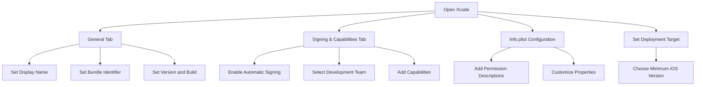

## 11.3.1 Configuring iOS Build Settings

Deploying your Flutter app to iOS devices requires careful configuration of build settings in Xcode. This process ensures that your app is correctly set up for distribution on the Apple App Store and functions smoothly on iOS devices. In this section, we'll guide you through the essential steps to configure your iOS build settings, from opening your project in Xcode to setting up signing and capabilities.

### Opening the Project in Xcode

To begin configuring your iOS build settings, you'll need to open your Flutter project in Xcode. This is where you'll make the necessary adjustments to ensure your app is ready for iOS deployment.

- **Navigate to the `ios` Directory:**
  - Open your Flutter project in your preferred file explorer.
  - Locate the `ios` directory within your project structure.

- **Open `Runner.xcworkspace` in Xcode:**
  - Double-click on `Runner.xcworkspace` to open it in Xcode. This workspace file is crucial because it includes all the necessary dependencies and configurations for your Flutter app.

### Setting App Information

Configuring your app's identity and versioning information is a critical step in preparing it for deployment. This information is used by the App Store and helps users identify your app.

- **Display Name:**
  - In Xcode, navigate to the "General" tab under the "Identity" section.
  - Set the "Display Name" to the name you want users to see on their devices.

- **Bundle Identifier:**
  - Ensure the "Bundle Identifier" matches the App ID you configured in the Apple Developer portal. This identifier is unique to your app and is used to identify it across Apple's ecosystem.

- **Version and Build:**
  - Update the "Version" and "Build" numbers to match those specified in your `pubspec.yaml` file. Consistency between these numbers ensures that updates are correctly recognized by the App Store.

### Signing & Capabilities

Properly managing signing and capabilities is essential for deploying your app on iOS devices. This process involves setting up your development team and enabling necessary capabilities.

- **Enable "Automatically manage signing":**
  - In the "Signing & Capabilities" tab, check the box for "Automatically manage signing". This allows Xcode to handle the creation and management of provisioning profiles and certificates.

- **Select a Development Team:**
  - Choose your development team from the dropdown menu. This team should be associated with your Apple Developer account.

### Adding Capabilities

Depending on your app's functionality, you may need to add specific capabilities, such as Push Notifications or Sign In with Apple.

- **Add Required Capabilities:**
  - In the "Signing & Capabilities" tab, click the "+" button to add capabilities.
  - Select the capabilities your app requires, ensuring they align with the features you've implemented.

### Configuring Info.plist

The `Info.plist` file contains key-value pairs that define app behavior and permissions. Configuring this file correctly is crucial for app functionality and compliance with App Store guidelines.

- **Add Required Permission Descriptions:**
  - Open `Info.plist` and add descriptions for any permissions your app requests, such as camera or location access. These descriptions inform users why your app needs certain permissions.

- **Customize Other Properties:**
  - Modify other properties in `Info.plist` as needed to suit your app's requirements. This might include setting the app's supported interface orientations or configuring URL schemes.

### Setting Deployment Target

The deployment target specifies the minimum iOS version your app supports. Setting this correctly ensures compatibility with the devices you intend to support.

- **Set the Minimum iOS Version:**
  - In the "General" tab, under "Deployment Info", set the "iOS Deployment Target" to the minimum version your app supports. Consider your target audience and the features you use when choosing this version.

### Best Practices

Adhering to best practices when configuring your iOS build settings can save time and prevent issues during deployment.

- **Keep Xcode Configurations in Sync with Flutter Configurations:**
  - Regularly check that your Xcode settings align with your Flutter configurations to avoid inconsistencies that could lead to build errors.

- **Regularly Test the App on iOS Simulators and Devices:**
  - Testing on both simulators and physical devices helps identify platform-specific issues and ensures a smooth user experience.

### Visual Aids

Annotated screenshots of Xcode settings can be incredibly helpful for visual learners. Below are some examples of how your Xcode configuration should look:

### Exercise

To reinforce your understanding, configure the basic settings for your app in Xcode. Follow these steps:

1. Open your Flutter project in Xcode.
2. Set the display name, bundle identifier, and version/build numbers.
3. Enable automatic signing and select your development team.
4. Add any necessary capabilities.
5. Configure `Info.plist` with required permissions and properties.
6. Set the deployment target to the desired iOS version.

By completing this exercise, you'll gain hands-on experience with configuring iOS build settings, preparing you for successful app deployment.

## Quiz Time!



### What file do you open in Xcode to configure iOS build settings for a Flutter app?

- [x] Runner.xcworkspace
- [ ] Runner.xcodeproj
- [ ] Info.plist
- [ ] pubspec.yaml

> **Explanation:** You open `Runner.xcworkspace` in Xcode to configure iOS build settings for a Flutter app because it includes all necessary dependencies and configurations.

### Where do you set the display name for your app in Xcode?

- [x] General > Identity
- [ ] Signing & Capabilities
- [ ] Info.plist
- [ ] Build Settings

> **Explanation:** The display name is set under "General" > "Identity" in Xcode.

### What must the bundle identifier match?

- [x] The App ID configured in the Apple Developer portal
- [ ] The display name of the app
- [ ] The version number in pubspec.yaml
- [ ] The deployment target

> **Explanation:** The bundle identifier must match the App ID configured in the Apple Developer portal to ensure proper identification across Apple's ecosystem.

### What does enabling "Automatically manage signing" do?

- [x] Allows Xcode to handle provisioning profiles and certificates
- [ ] Automatically updates the app version
- [ ] Manages app capabilities
- [ ] Configures Info.plist permissions

> **Explanation:** Enabling "Automatically manage signing" allows Xcode to handle the creation and management of provisioning profiles and certificates.

### Which file contains key-value pairs that define app behavior and permissions?

- [x] Info.plist
- [ ] Runner.xcworkspace
- [ ] pubspec.yaml
- [ ] Build Settings

> **Explanation:** `Info.plist` contains key-value pairs that define app behavior and permissions.

### What should you consider when setting the minimum iOS version for your app?

- [x] Target audience and features used
- [ ] App display name
- [ ] Bundle identifier
- [ ] Signing capabilities

> **Explanation:** When setting the minimum iOS version, consider your target audience and the features used in your app to ensure compatibility.

### Why is it important to keep Xcode configurations in sync with Flutter configurations?

- [x] To avoid inconsistencies that could lead to build errors
- [ ] To automatically update the app version
- [ ] To manage app capabilities
- [ ] To configure Info.plist permissions

> **Explanation:** Keeping Xcode configurations in sync with Flutter configurations helps avoid inconsistencies that could lead to build errors.

### What is the purpose of testing your app on both simulators and physical devices?

- [x] To identify platform-specific issues and ensure a smooth user experience
- [ ] To automatically manage signing
- [ ] To configure Info.plist permissions
- [ ] To set the deployment target

> **Explanation:** Testing on both simulators and physical devices helps identify platform-specific issues and ensures a smooth user experience.

### Which tab in Xcode allows you to add capabilities like Push Notifications?

- [x] Signing & Capabilities
- [ ] General
- [ ] Info.plist
- [ ] Build Settings

> **Explanation:** The "Signing & Capabilities" tab in Xcode allows you to add capabilities like Push Notifications.

### True or False: The version and build numbers in Xcode must match those in pubspec.yaml.

- [x] True
- [ ] False

> **Explanation:** The version and build numbers in Xcode must match those in `pubspec.yaml` to ensure that updates are correctly recognized by the App Store.


