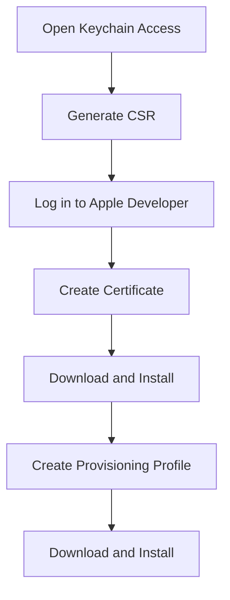

## 11.3.2 Managing Certificates and Provisioning Profiles

Deploying your Flutter app to iOS devices involves a crucial step: managing certificates and provisioning profiles. This process is essential for ensuring that your app is securely signed and authorized to run on Apple devices. In this section, we'll explore the Apple signing process, how to use Xcode for automatic signing, and delve into manual provisioning for advanced users. We'll also cover troubleshooting tips, best practices, and provide a practical exercise to solidify your understanding.

### Understanding the Apple Signing Process

The Apple signing process is a security measure that ensures only authorized apps can run on iOS devices. This involves two main types of certificates:

- **Development Certificates:** These are used for testing your app on physical devices during the development phase. They allow you to install and run your app on devices that you own or have registered with your Apple Developer account.

- **Distribution Certificates:** These are required for submitting your app to the App Store. They ensure that the app is signed and verified by Apple, allowing it to be distributed to users worldwide.

#### Development Certificates

Development certificates are essential for testing your app on real devices. They are tied to your Apple Developer account and allow you to install your app on devices that you have registered. This is crucial for testing features that require hardware access, such as camera or GPS functionality.

#### Distribution Certificates

Distribution certificates are used when you're ready to submit your app to the App Store. They ensure that your app is signed with a unique identifier, verifying its authenticity and integrity. This step is mandatory for app distribution through the App Store.

### Using Xcode Automatic Signing

Xcode provides a feature called automatic signing, which simplifies the process of managing certificates and provisioning profiles. This is particularly useful for beginners or those who prefer a streamlined approach.

- **Automatic Signing:** Xcode can automatically manage your certificates and provisioning profiles. It handles the creation, renewal, and installation of these components, allowing you to focus on development.

To enable automatic signing in Xcode:

1. Open your Flutter project in Xcode.
2. Select your project in the Project Navigator.
3. Go to the "Signing & Capabilities" tab.
4. Check the "Automatically manage signing" option.
5. Select your team from the dropdown menu.

Xcode will now handle the creation and management of certificates and provisioning profiles for you.

### Manual Provisioning (Advanced Users)

For developers who prefer more control over the signing process, manual provisioning is an option. This involves generating a Certificate Signing Request (CSR), creating certificates, and setting up provisioning profiles manually.

#### Generating a CSR

A Certificate Signing Request (CSR) is required to create a new certificate. Here's how to generate one using Keychain Access:

1. Open **Keychain Access** on your Mac.
2. From the menu bar, select **Keychain Access > Certificate Assistant > Request a Certificate from a Certificate Authority**.
3. Enter your email address and common name.
4. Select "Saved to disk" and click "Continue".
5. Save the CSR file to your desired location.

#### Creating Certificates

Once you have your CSR, you can create a certificate through the Apple Developer portal:

1. Log in to your [Apple Developer account](https://developer.apple.com/account/).
2. Navigate to **Certificates, Identifiers & Profiles**.
3. Select **Certificates** from the sidebar.
4. Click the **+** button to create a new certificate.
5. Choose the type of certificate you need (Development or Distribution).
6. Upload your CSR file and follow the prompts to generate your certificate.
7. Download the certificate and double-click it to install it in Keychain Access.

#### Creating Provisioning Profiles

Provisioning profiles link your certificates with your app's bundle identifier and registered devices. Here's how to create one:

1. In the Apple Developer portal, go to **Certificates, Identifiers & Profiles**.
2. Select **Provisioning Profiles** from the sidebar.
3. Click the **+** button to create a new profile.
4. Choose the type of profile you need (Development or Distribution).
5. Select your app's bundle identifier.
6. Choose the certificate you created earlier.
7. Select the devices you want to include (for development profiles).
8. Name your profile and click "Generate".
9. Download the profile and double-click it to install it in Xcode.

### Installing Certificates and Profiles

Once you've downloaded your certificates and provisioning profiles, installing them is straightforward:

- **Certificates:** Double-click the downloaded certificate file to install it in Keychain Access.
- **Provisioning Profiles:** Double-click the downloaded profile file to install it in Xcode.

### Troubleshooting

Managing certificates and provisioning profiles can sometimes lead to issues. Here are some common problems and their solutions:

- **Mismatched Bundle Identifiers:** Ensure that the bundle identifier in your Xcode project matches the one used in your provisioning profile.
- **Expired Certificates:** Regularly check the expiration dates of your certificates and renew them as needed.
- **Device Not Registered:** If you're unable to install your app on a device, ensure that the device is registered in your Apple Developer account.

### Best Practices

To streamline the management of certificates and provisioning profiles, consider these best practices:

- **Track Expiration Dates:** Keep a calendar or reminder system to track when your certificates and profiles expire.
- **Consistent Naming Conventions:** Use clear and consistent naming conventions for your bundle identifiers and profiles to avoid confusion.
- **Regularly Update Devices:** Ensure that all devices used for testing are registered and up-to-date in your Apple Developer account.

### Visual Aids

To assist with understanding, here are step-by-step screenshots of the certificate creation process:

### Exercise

To reinforce your understanding, follow these steps to set up certificates and provisioning profiles for your app:

1. Generate a CSR using Keychain Access.
2. Create a development certificate in the Apple Developer portal.
3. Set up a provisioning profile for your app.
4. Install the certificate and profile in Xcode.
5. Test your app on a registered device.

By completing this exercise, you'll gain hands-on experience with the Apple signing process, preparing you for successful app deployment.

### Conclusion

Managing certificates and provisioning profiles is a critical step in deploying your Flutter app to iOS devices. Whether you choose automatic signing for simplicity or manual provisioning for greater control, understanding this process ensures that your app is securely signed and ready for distribution. By following best practices and troubleshooting common issues, you can streamline your deployment workflow and focus on delivering a great app experience.

## Quiz Time!



### What is the primary purpose of a development certificate?

- [x] To test your app on physical devices during development
- [ ] To submit your app to the App Store
- [ ] To manage app permissions
- [ ] To create app icons

> **Explanation:** Development certificates are used to test your app on physical devices during the development phase, allowing you to install and run your app on registered devices.

### What does Xcode's automatic signing feature do?

- [x] Manages certificates and provisioning profiles automatically
- [ ] Submits your app to the App Store
- [ ] Generates app icons and splash screens
- [ ] Optimizes app performance

> **Explanation:** Xcode's automatic signing feature simplifies the process by managing certificates and provisioning profiles automatically, allowing developers to focus on development.

### What is a CSR used for in the Apple signing process?

- [x] To request a new certificate from Apple
- [ ] To submit your app to the App Store
- [ ] To manage app permissions
- [ ] To create app icons

> **Explanation:** A Certificate Signing Request (CSR) is used to request a new certificate from Apple, which is necessary for creating development or distribution certificates.

### How can you install a downloaded certificate on your Mac?

- [x] Double-click the certificate file
- [ ] Drag the file to the Applications folder
- [ ] Open it with TextEdit
- [ ] Email it to yourself

> **Explanation:** To install a downloaded certificate on your Mac, simply double-click the certificate file, and it will be installed in Keychain Access.

### What should you do if your app's bundle identifier does not match the one in your provisioning profile?

- [x] Update the bundle identifier in your Xcode project
- [ ] Delete the provisioning profile
- [ ] Create a new Apple ID
- [ ] Change the app's name

> **Explanation:** If your app's bundle identifier does not match the one in your provisioning profile, you should update the bundle identifier in your Xcode project to ensure they match.

### What is a common issue that can occur if a certificate expires?

- [x] You cannot install or run the app on devices
- [ ] The app's icon disappears
- [ ] The app's name changes
- [ ] The app's performance improves

> **Explanation:** If a certificate expires, you cannot install or run the app on devices, as the certificate is no longer valid for signing the app.

### Why is it important to use consistent naming conventions for identifiers?

- [x] To avoid confusion and ensure clarity
- [ ] To increase app performance
- [ ] To reduce app size
- [ ] To enhance app security

> **Explanation:** Using consistent naming conventions for identifiers helps avoid confusion and ensures clarity when managing multiple certificates and provisioning profiles.

### What is the role of a provisioning profile?

- [x] To link certificates with app bundle identifiers and registered devices
- [ ] To create app icons and splash screens
- [ ] To optimize app performance
- [ ] To submit your app to the App Store

> **Explanation:** A provisioning profile links certificates with app bundle identifiers and registered devices, allowing the app to be installed and run on those devices.

### What is the benefit of tracking expiration dates for certificates and profiles?

- [x] To renew them before they expire and avoid disruptions
- [ ] To increase app performance
- [ ] To reduce app size
- [ ] To enhance app security

> **Explanation:** Tracking expiration dates for certificates and profiles allows you to renew them before they expire, avoiding disruptions in app development and deployment.

### True or False: Manual provisioning is recommended for beginners.

- [ ] True
- [x] False

> **Explanation:** False. Manual provisioning is more suited for advanced users who require greater control over the signing process. Beginners are encouraged to use Xcode's automatic signing feature for simplicity.


