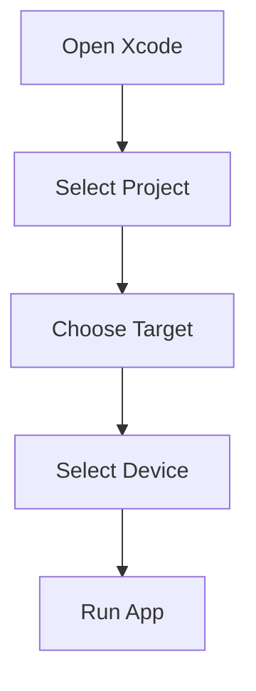

---

linkTitle: "11.3.3 Testing on iOS Devices"
title: "Testing Flutter Apps on iOS Devices: A Comprehensive Guide"
description: "Explore detailed instructions for testing Flutter apps on iOS devices, including setup, debugging, performance testing, and best practices."
categories:
- Flutter Development
- iOS Testing
- Mobile App Deployment
tags:
- Flutter
- iOS
- Testing
- Debugging
- TestFlight
date: 2024-10-25
type: docs
nav_weight: 11330

---

## 11.3.3 Testing on iOS Devices

Testing your Flutter app on iOS devices is a crucial step in the development process, ensuring that your application performs well and provides a seamless user experience across different devices and iOS versions. This section will guide you through the process of preparing your iOS device for testing, deploying your app, debugging, and conducting various testing scenarios. We will also explore the use of TestFlight for beta testing and discuss best practices to follow during the testing phase.

### Preparing the Device

Before you can test your Flutter app on an iOS device, you need to prepare the device and your development environment. Here's how to get started:

- **Connect the iOS Device to the Mac:**
  - Use a USB cable to connect your iOS device to your Mac. Ensure that your device is recognized by the system.

- **Trust the Mac on the Device:**
  - When you connect your device for the first time, you will be prompted to trust the computer. On your iOS device, tap "Trust" to allow the Mac to access the device.

### Running the App

Once your device is connected and trusted, you can deploy your Flutter app to the device using either Xcode or the Flutter CLI.

- **Using Xcode:**
  - Open your Flutter project in Xcode by navigating to the `ios` folder and opening the `.xcworkspace` file.
  - Select your connected device from the device list in Xcode.
  - Click the "Run" button to build and deploy the app to your device.

- **Using Flutter CLI:**
  - Open a terminal and navigate to your Flutter project directory.
  - Run the following command to deploy the app to your connected device:
    ```bash
    flutter run
    ```
  - This command will build the app and install it on the connected iOS device.

### Debugging

Debugging is an essential part of testing your app on iOS devices. Xcode provides powerful tools for debugging, including a debugger and a console for viewing logs.

- **Using Xcode's Debugger:**
  - Set breakpoints in your code by clicking on the line number in Xcode.
  - Run your app in debug mode to pause execution at breakpoints and inspect variables.

- **Using the Console for Logs:**
  - View logs and output from your app in the Xcode console. This is useful for tracking down issues and understanding app behavior.

### Testing Scenarios

Testing your app under various scenarios ensures that it performs well in different conditions. Here are some key testing scenarios to consider:

- **Performance Testing:**
  - Monitor CPU and memory usage to ensure your app is efficient. Use Xcode's Instruments tool to profile your app and identify performance bottlenecks.

- **Compatibility Testing:**
  - Test your app on devices with different screen sizes and iOS versions to ensure compatibility. This helps identify UI issues and functionality problems on different devices.

- **UI Testing:**
  - Verify that your app's UI adapts correctly to different device orientations and sizes. Ensure that all UI elements are accessible and function as expected.

### Using TestFlight

TestFlight is a platform provided by Apple for beta testing apps with external users. It allows you to distribute pre-release versions of your app to testers and gather feedback.

- **Setting Up TestFlight:**
  - Create a build of your app in Xcode and upload it to App Store Connect.
  - Invite testers via email to download and test your app using the TestFlight app.

- **Gathering Feedback:**
  - Use TestFlight to collect feedback from testers and identify issues before releasing your app to the public.

### Best Practices

Following best practices during testing can help you identify and resolve issues more effectively.

- **Test Under Various Network Conditions:**
  - Simulate different network conditions, such as slow or unstable connections, to ensure your app handles them gracefully.

- **Test App Behavior with Interruptions:**
  - Test how your app behaves when interrupted by incoming calls or notifications. Ensure that the app resumes correctly after the interruption.

### Visual Aids

To assist you in selecting a device in Xcode, here is a visual representation of the process:



### Exercise

To reinforce your understanding, try the following exercise:

- **Exercise:**
  - Deploy your Flutter app to an iOS device and explore the debugging tools available in Xcode. Set breakpoints, inspect variables, and view logs to gain insights into your app's behavior.

By following these steps and best practices, you can ensure that your Flutter app is thoroughly tested on iOS devices, providing a smooth and reliable experience for your users.

## Quiz Time!



### What is the first step in preparing an iOS device for testing?

- [x] Connect the iOS device to the Mac.
- [ ] Install Xcode on the Mac.
- [ ] Download the Flutter SDK.
- [ ] Set up a TestFlight account.

> **Explanation:** The first step is to connect the iOS device to the Mac using a USB cable.

### How can you deploy a Flutter app to an iOS device using the Flutter CLI?

- [x] Run the `flutter run` command.
- [ ] Use the `flutter deploy` command.
- [ ] Open the project in Xcode and click "Run."
- [ ] Use the `flutter install` command.

> **Explanation:** The `flutter run` command is used to build and deploy the app to a connected iOS device.

### What tool does Xcode provide for monitoring CPU and memory usage?

- [x] Instruments
- [ ] Console
- [ ] Debugger
- [ ] TestFlight

> **Explanation:** Xcode's Instruments tool is used for profiling apps and monitoring CPU and memory usage.

### Which platform allows you to distribute pre-release versions of your app to testers?

- [x] TestFlight
- [ ] App Store Connect
- [ ] Xcode
- [ ] Flutter CLI

> **Explanation:** TestFlight is a platform for beta testing apps with external users.

### What should you test to ensure your app's UI adapts correctly?

- [x] Different device orientations and sizes
- [ ] Only the latest iOS version
- [ ] Only on iPhone devices
- [ ] Only on iPad devices

> **Explanation:** Testing on different device orientations and sizes ensures the UI adapts correctly.

### What is a best practice for testing app behavior with interruptions?

- [x] Test app behavior when incoming calls or notifications occur.
- [ ] Only test when the app is in full-screen mode.
- [ ] Disable all notifications during testing.
- [ ] Test only with silent mode enabled.

> **Explanation:** Testing app behavior with interruptions like calls or notifications ensures the app resumes correctly.

### How can you simulate different network conditions during testing?

- [x] Use network simulation tools or settings.
- [ ] Disconnect the device from the internet.
- [ ] Only test on Wi-Fi networks.
- [ ] Only test on cellular networks.

> **Explanation:** Network simulation tools or settings can simulate various network conditions for testing.

### What is the purpose of setting breakpoints in Xcode?

- [x] To pause execution and inspect variables.
- [ ] To speed up the app's performance.
- [ ] To automatically fix bugs.
- [ ] To deploy the app to the App Store.

> **Explanation:** Breakpoints allow you to pause execution and inspect variables for debugging purposes.

### What should you do if your app crashes during testing?

- [x] Use the debugger to identify the issue.
- [ ] Immediately submit the app to the App Store.
- [ ] Ignore the crash and continue testing.
- [ ] Uninstall and reinstall the app.

> **Explanation:** Using the debugger helps identify and resolve the issue causing the crash.

### True or False: TestFlight is only available for testing apps on iOS devices.

- [x] True
- [ ] False

> **Explanation:** TestFlight is specifically designed for testing apps on iOS devices.


