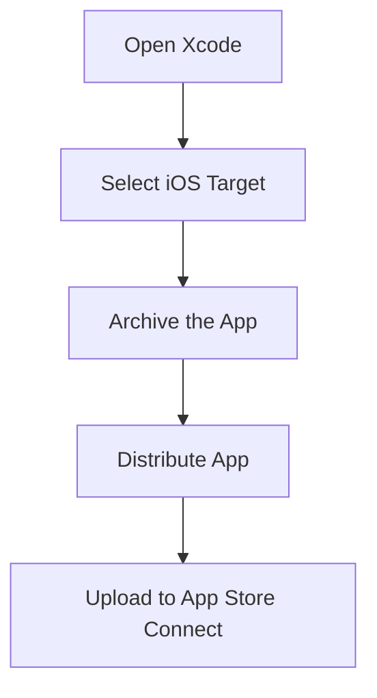

## 11.3.4 Submitting Your Flutter App to the Apple App Store

Submitting your Flutter app to the Apple App Store is a crucial step in reaching a vast audience of iOS users. This process involves several steps, from creating an App Store Connect listing to responding to potential rejections. In this guide, we'll walk you through each step, providing detailed insights and practical examples to ensure a smooth submission process.

### Creating an App Store Connect Listing

Before you can submit your app, you need to create a listing on App Store Connect. This listing provides essential information about your app to potential users and the App Store review team.

#### Filling Out App Information

1. **App Name:** Choose a unique and descriptive name for your app. This is the name users will see on the App Store.
2. **Description:** Write a compelling description that highlights the key features and benefits of your app. Use clear and concise language to engage potential users.
3. **Keywords:** Select relevant keywords to improve your app's discoverability. Consider what terms users might search for when looking for an app like yours.
4. **Support URL:** Provide a URL where users can find support for your app. This could be a dedicated support page or a contact form on your website.

### Uploading the App

Once your app listing is ready, the next step is to upload your app using Xcode. This process involves archiving your app and sending it to App Store Connect.

#### Using Xcode's Archive and Upload Tools

1. **Open Xcode:** Launch Xcode and open your Flutter project.
2. **Select the iOS Target:** In the project navigator, select the iOS target for your app.
3. **Archive the App:** Go to `Product > Archive` to create an archive of your app. This process may take a few minutes.
4. **Upload to App Store Connect:** Once the archive is complete, click `Distribute App` and select `App Store Connect`. Follow the prompts to upload your app.

### App Store Assets

Your app needs to include specific assets to meet Apple's requirements. These assets help users identify and understand your app.

#### App Icon

- **Specifications:** Your app icon must be 1024x1024 pixels and should not include an alpha channel. This icon will be displayed on the App Store and should be visually appealing and representative of your app.

#### Screenshots

- **Device Sizes:** Provide screenshots for all required device sizes, including iPhone and iPad. These screenshots should showcase your app's main features and user interface.

### App Review Submission

After uploading your app and assets, you need to submit your app for review. This step involves addressing privacy, compliance, and other requirements.

#### App Privacy

- **Privacy Questionnaire:** Fill out the privacy questionnaire accurately. This includes information about data collection, usage, and sharing practices. Be transparent about how your app handles user data.

#### Compliance

- **Export Compliance:** Address any export compliance issues, such as encryption usage. Ensure your app complies with all relevant laws and regulations.
- **Content Rights:** Confirm that you have the rights to all content included in your app, such as images, music, and videos.

### Waiting for Review

Once your app is submitted, it enters the review queue. The review process can take anywhere from a few days to a couple of weeks.

#### Review Timeline and Potential Outcomes

- **Timeline:** The review timeline varies depending on the complexity of your app and the current volume of submissions. Check App Store Connect regularly for updates.
- **Outcomes:** Your app may be approved, rejected, or require additional information. Be prepared to respond promptly to any requests from the review team.

### Responding to Rejections

If your app is rejected, don't be discouraged. Use the feedback provided to address any issues and resubmit your app.

#### Tips for Addressing Issues

- **Understand the Feedback:** Carefully read the rejection notice to understand the reasons for rejection.
- **Make Necessary Changes:** Implement the required changes to comply with Apple's guidelines.
- **Communicate with the Review Team:** If needed, use the Resolution Center in App Store Connect to communicate with the review team and seek clarification.

### Best Practices

To increase the chances of a successful submission, follow these best practices:

- **Compliance with Guidelines:** Ensure your app complies with all of Apple's guidelines, including design, functionality, and content standards.
- **Preemptive Testing:** Test your app thoroughly to identify and fix common issues that could lead to rejection.

### Visual Aids

Below are annotated screenshots of the submission process to help you navigate App Store Connect.

### Exercise

To reinforce your understanding, go through the steps of setting up an app in App Store Connect. Create a mock listing with sample information and assets to familiarize yourself with the process.

### Conclusion

Submitting your Flutter app to the Apple App Store is a detailed process that requires careful attention to detail. By following the steps outlined in this guide, you can navigate the submission process with confidence and increase your chances of a successful launch.

## Quiz Time!



### What is the first step in submitting your app to the Apple App Store?

- [x] Creating an App Store Connect listing
- [ ] Uploading the app using Xcode
- [ ] Filling out the privacy questionnaire
- [ ] Providing screenshots for all device sizes

> **Explanation:** The first step is to create an App Store Connect listing, which involves filling out app information such as name, description, and keywords.

### What tool is used to upload your app to App Store Connect?

- [ ] Android Studio
- [x] Xcode
- [ ] Visual Studio Code
- [ ] IntelliJ IDEA

> **Explanation:** Xcode is the tool used to archive and upload your app to App Store Connect.

### What size should the app icon be for the Apple App Store?

- [ ] 512x512 px
- [ ] 2048x2048 px
- [x] 1024x1024 px
- [ ] 800x800 px

> **Explanation:** The app icon must be 1024x1024 pixels and should not include an alpha channel.

### What should you do if your app is rejected by the Apple App Store?

- [ ] Ignore the feedback and resubmit
- [x] Understand the feedback and make necessary changes
- [ ] Submit a new app listing
- [ ] Contact Apple support immediately

> **Explanation:** If your app is rejected, you should understand the feedback, make the necessary changes, and resubmit your app.

### Which of the following is NOT part of the App Review Submission process?

- [ ] Filling out the privacy questionnaire
- [ ] Addressing export compliance
- [ ] Providing app screenshots
- [x] Setting up a Google Play Developer account

> **Explanation:** Setting up a Google Play Developer account is not part of the App Review Submission process for the Apple App Store.

### What is the purpose of the privacy questionnaire in the App Review Submission process?

- [x] To provide information about data collection and usage
- [ ] To verify the app's functionality
- [ ] To check for compliance with export laws
- [ ] To ensure the app icon meets specifications

> **Explanation:** The privacy questionnaire provides information about data collection, usage, and sharing practices.

### How can you communicate with the App Store review team if your app is rejected?

- [ ] Through email
- [ ] By phone
- [x] Using the Resolution Center in App Store Connect
- [ ] By submitting a new app version

> **Explanation:** You can communicate with the review team using the Resolution Center in App Store Connect.

### What is a common reason for app rejection on the Apple App Store?

- [ ] Incorrect app icon size
- [x] Non-compliance with Apple's guidelines
- [ ] Lack of screenshots
- [ ] Missing support URL

> **Explanation:** Non-compliance with Apple's guidelines is a common reason for app rejection.

### What should you include in your app's description on App Store Connect?

- [ ] A list of all app features
- [x] Key features and benefits of the app
- [ ] Detailed technical specifications
- [ ] A summary of the app's development process

> **Explanation:** The app's description should highlight the key features and benefits to engage potential users.

### True or False: You can submit your app to the Apple App Store without providing screenshots for all required device sizes.

- [ ] True
- [x] False

> **Explanation:** False. You must provide screenshots for all required device sizes as part of the submission process.


