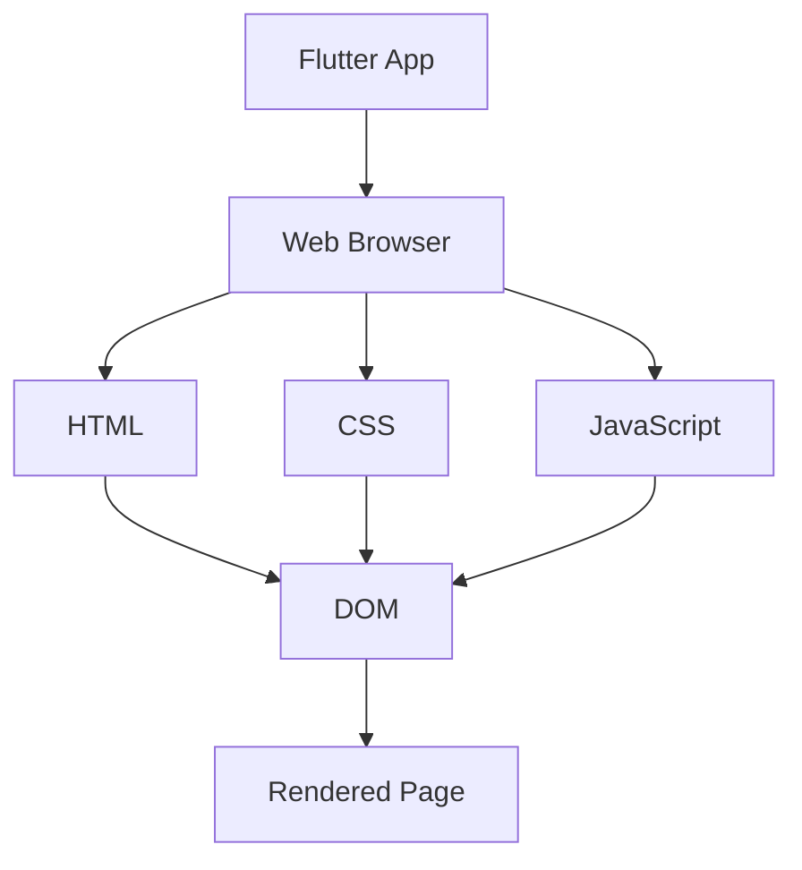

## 11.4.1 Building Flutter Web Apps

Flutter, originally designed for mobile app development, has expanded its capabilities to include web applications. This section will guide you through the process of building Flutter web apps, from setting up your development environment to deploying a production-ready application. We'll explore key considerations such as browser compatibility, responsive design, and performance optimization, ensuring your web app is robust and user-friendly.

### Setting Up for Web Development

Before diving into web development with Flutter, it's crucial to ensure your environment is correctly configured. Flutter's web support must be enabled and up-to-date to leverage its full potential.

#### Enabling Flutter Web Support

To begin, verify that Flutter's web support is enabled in your development environment. This can be done by running the following command in your terminal:

```bash
flutter channel
```

Ensure you are on the `stable` channel, which includes web support. If not, switch to the stable channel:

```bash
flutter channel stable
flutter upgrade
```

Next, enable web support:

```bash
flutter config --enable-web
```

This command configures Flutter to include web as a target platform. Confirm the setup by running:

```bash
flutter devices
```

You should see `Chrome` listed as one of the available devices, indicating that web support is active.

### Running the App

With web support enabled, you can now run your Flutter app in a web browser. This is a straightforward process using the `flutter run` command:

```bash
flutter run -d chrome
```

This command launches your app in the Chrome browser, allowing you to test and debug directly in a web environment. During development, you can utilize Flutter's hot reload feature to see changes in real-time, enhancing productivity and efficiency.

### Building for Production

Once your app is ready for deployment, it's time to build a production-ready version. This involves compiling the app into a format optimized for web browsers, focusing on performance and load times.

#### Building the Web Release Version

To build the release version of your web app, use the following command:

```bash
flutter build web --release
```

This command generates a `build/web` directory containing all the necessary files for deployment, including HTML, JavaScript, and CSS files. These files are optimized for performance, ensuring fast load times and efficient resource usage.

### Handling Web-Specific Considerations

Developing for the web introduces unique challenges and considerations. It's essential to address these to ensure your app functions correctly across different environments.

#### Browser Compatibility

Web apps must be compatible with various browsers to reach the widest audience. Test your app across popular browsers such as Chrome, Firefox, Safari, and Edge to identify and resolve any compatibility issues. Tools like BrowserStack or Sauce Labs can facilitate cross-browser testing, providing insights into how your app performs on different platforms.

#### Responsive Design

Responsive design is crucial for web apps, ensuring they adapt to different screen sizes and orientations. Utilize media queries and flexible layouts to create a seamless user experience across devices.

**Example: Using Media Queries**

```css
@media (max-width: 600px) {
  .container {
    flex-direction: column;
  }
}
```

In Flutter, you can use the `MediaQuery` widget to access device information and adjust layouts accordingly. Here's a simple example:

```dart
Widget build(BuildContext context) {
  var screenWidth = MediaQuery.of(context).size.width;

  return Container(
    padding: EdgeInsets.all(16.0),
    child: screenWidth < 600
        ? Column(
            children: [/* Widgets for small screens */],
          )
        : Row(
            children: [/* Widgets for larger screens */],
          ),
  );
}
```

### Best Practices

Adhering to best practices is essential for creating high-quality web apps. Here are some key considerations:

#### Optimize for Performance and Load Times

- **Minimize Asset Sizes:** Compress images and other assets to reduce load times.
- **Lazy Loading:** Load resources only when needed to improve initial load performance.
- **Code Splitting:** Break your app into smaller chunks to load only necessary code initially.

#### Consider Using a Service Worker for Offline Capabilities

Service workers can enhance your app by enabling offline capabilities and caching resources. This ensures your app remains functional even without an internet connection.

**Example: Registering a Service Worker**

```javascript
if ('serviceWorker' in navigator) {
  window.addEventListener('load', () => {
    navigator.serviceWorker.register('/service-worker.js').then((registration) => {
      console.log('ServiceWorker registration successful with scope: ', registration.scope);
    }, (error) => {
      console.log('ServiceWorker registration failed: ', error);
    });
  });
}
```

### Visual Aids

To provide a clearer understanding, let's include a visual representation of a Flutter web app running in a browser. This diagram illustrates the typical layout and components of a Flutter web app.



### Exercise

Now that you've learned the basics of building Flutter web apps, it's time to put your knowledge into practice. Follow these steps to build and run your app for the web:

- Ensure your Flutter environment is set up for web development.
- Run your app in the browser using `flutter run -d chrome`.
- Build the release version with `flutter build web --release`.
- Test your app across multiple browsers and devices.
- Implement responsive design techniques to ensure a seamless user experience.

By completing this exercise, you'll gain hands-on experience with Flutter web development, reinforcing the concepts covered in this section.

### Conclusion

Building web apps with Flutter opens up new possibilities for cross-platform development, allowing you to reach users across mobile and web platforms with a single codebase. By following the steps outlined in this guide, you'll be well-equipped to create responsive, high-performance web applications that meet the needs of your users. Remember to test thoroughly, optimize for performance, and adhere to best practices to ensure your app is robust and user-friendly.

## Quiz Time!



### What command enables web support in Flutter?

- [x] `flutter config --enable-web`
- [ ] `flutter enable web`
- [ ] `flutter web enable`
- [ ] `flutter setup web`

> **Explanation:** The correct command to enable web support in Flutter is `flutter config --enable-web`.

### Which command is used to run a Flutter app in a web browser?

- [x] `flutter run -d chrome`
- [ ] `flutter run web`
- [ ] `flutter start web`
- [ ] `flutter launch web`

> **Explanation:** `flutter run -d chrome` is used to run a Flutter app in the Chrome web browser.

### What is the purpose of the `flutter build web --release` command?

- [x] To build a production-ready web version of the app
- [ ] To run the app in debug mode
- [ ] To test the app on different devices
- [ ] To enable web support

> **Explanation:** The `flutter build web --release` command compiles the app into a production-ready format optimized for web deployment.

### Why is browser compatibility important for web apps?

- [x] To ensure the app functions correctly across different browsers
- [ ] To increase the app's download speed
- [ ] To reduce the app's file size
- [ ] To improve the app's security

> **Explanation:** Browser compatibility ensures that the app functions correctly and provides a consistent user experience across different web browsers.

### What is a service worker used for in web development?

- [x] To enable offline capabilities and caching
- [ ] To improve app security
- [ ] To enhance user interface design
- [ ] To manage user authentication

> **Explanation:** Service workers are used to enable offline capabilities and caching, allowing web apps to function without an internet connection.

### Which widget in Flutter helps with responsive design by accessing device information?

- [x] `MediaQuery`
- [ ] `ResponsiveWidget`
- [ ] `DeviceInfo`
- [ ] `LayoutBuilder`

> **Explanation:** `MediaQuery` provides information about the device's screen size and orientation, aiding in responsive design.

### What is the benefit of lazy loading in web apps?

- [x] It improves initial load performance by loading resources only when needed
- [ ] It enhances the app's security
- [ ] It reduces the app's file size
- [ ] It simplifies the app's codebase

> **Explanation:** Lazy loading improves initial load performance by deferring the loading of resources until they are needed.

### How can you test your Flutter web app across multiple browsers?

- [x] Use tools like BrowserStack or Sauce Labs
- [ ] Use the `flutter test web` command
- [ ] Manually test on each browser
- [ ] Use the `flutter browser test` command

> **Explanation:** Tools like BrowserStack or Sauce Labs allow you to test your web app across multiple browsers and platforms.

### What is the role of `MediaQuery` in Flutter web apps?

- [x] To provide information about the device's screen size and orientation
- [ ] To manage user authentication
- [ ] To enhance app security
- [ ] To improve app performance

> **Explanation:** `MediaQuery` is used to obtain information about the device's screen size and orientation, which is crucial for responsive design.

### True or False: Code splitting in web apps helps reduce the initial load time by breaking the app into smaller chunks.

- [x] True
- [ ] False

> **Explanation:** Code splitting reduces the initial load time by dividing the app into smaller chunks, loading only the necessary code initially.


