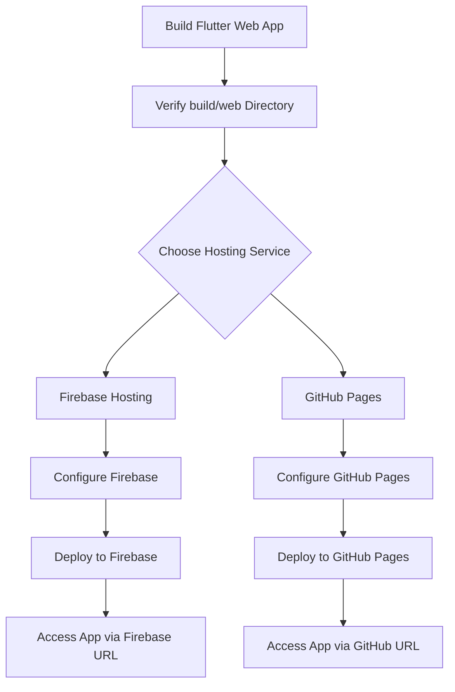

---

linkTitle: "11.4.2 Deploying to Web Servers"
title: "Deploying Flutter Web Apps to Web Servers: A Comprehensive Guide"
description: "Learn how to deploy your Flutter web applications to various web servers, including Firebase Hosting and GitHub Pages, with detailed instructions and best practices."
categories:
- Flutter
- Web Development
- Deployment
tags:
- Flutter Web
- Deployment
- Firebase Hosting
- GitHub Pages
- Web Servers
date: 2024-10-25
type: docs
nav_weight: 11420

---

## 11.4.2 Deploying to Web Servers

Deploying your Flutter web application to a web server is a crucial step in making your app accessible to users worldwide. This section will guide you through the process of preparing your Flutter web app for deployment, using popular hosting services like Firebase Hosting and GitHub Pages, and configuring your web server for optimal performance and security. By the end of this guide, you'll be equipped with the knowledge to deploy your Flutter web app confidently.

### Preparing for Deployment

Before deploying your Flutter web app, ensure that your project is ready for production. This involves building your app and verifying that all necessary files are present in the `build/web` directory.

#### Building Your Flutter Web App

To build your Flutter web app, use the following command in your terminal:

```bash
flutter build web
```

This command compiles your Flutter project into static web assets, which are stored in the `build/web` directory. This directory contains all the files needed to deploy your app, including HTML, CSS, JavaScript, and any assets like images or fonts.

#### Verifying the Build

After building your app, navigate to the `build/web` directory and confirm that it contains the following essential files:

- `index.html`: The main HTML file that serves as the entry point for your app.
- `main.dart.js`: The compiled JavaScript code of your Flutter app.
- `flutter_service_worker.js`: A service worker for caching and offline support.
- Any additional assets or files your app requires.

### Using Hosting Services

There are several hosting services available for deploying Flutter web apps. This guide will focus on Firebase Hosting and GitHub Pages, two popular and accessible options.

#### Firebase Hosting

Firebase Hosting is a fast and secure hosting service for web apps. It provides a global content delivery network (CDN) and integrates seamlessly with other Firebase services.

##### Step-by-Step Instructions for Firebase Hosting

1. **Install Firebase CLI:**

   Ensure you have the Firebase CLI installed. If not, install it using npm:

   ```bash
   npm install -g firebase-tools
   ```

2. **Login to Firebase:**

   Authenticate your Firebase account:

   ```bash
   firebase login
   ```

3. **Initialize Firebase in Your Project:**

   Navigate to your Flutter project directory and initialize Firebase:

   ```bash
   firebase init
   ```

   - Select "Hosting" from the options.
   - Choose an existing Firebase project or create a new one.
   - Set the public directory to `build/web`.
   - Configure as a single-page app by selecting "Yes" when prompted.

4. **Deploy Your App:**

   Deploy your app to Firebase Hosting:

   ```bash
   firebase deploy
   ```

   Your app will be deployed, and you'll receive a URL where it can be accessed.

#### GitHub Pages

GitHub Pages is a free hosting service provided by GitHub, ideal for hosting static websites directly from a GitHub repository.

##### Guide to Hosting on GitHub Pages

1. **Create a GitHub Repository:**

   If you haven't already, create a new repository on GitHub for your Flutter web app.

2. **Push Your Code to GitHub:**

   Ensure your `build/web` directory is included in your repository. You can do this by copying the contents of `build/web` to the root of your repository or a specific branch (e.g., `gh-pages`).

3. **Configure GitHub Pages:**

   - Go to the "Settings" tab of your repository.
   - Scroll down to the "GitHub Pages" section.
   - Select the branch containing your web app (e.g., `gh-pages`) and the root directory.

4. **Access Your Deployed App:**

   GitHub Pages will provide a URL where your app is hosted, typically in the format `https://<username>.github.io/<repository>/`.

### Configuring the Web Server

For single-page applications (SPAs) like Flutter web apps, it's crucial to configure your web server to handle routing correctly. This involves redirecting all routes to `index.html`.

#### Example Configuration for Apache

```apache
<IfModule mod_rewrite.c>
  RewriteEngine On
  RewriteCond %{REQUEST_FILENAME} !-f
  RewriteCond %{REQUEST_FILENAME} !-d
  RewriteRule ^ index.html [L]
</IfModule>
```

#### Example Configuration for Nginx

```nginx
server {
  listen 80;
  server_name yourdomain.com;

  location / {
    try_files $uri $uri/ /index.html;
  }
}
```

### Best Practices

When deploying your Flutter web app, consider the following best practices to ensure security and performance:

- **Use HTTPS:** Always serve your app over HTTPS to encrypt data and protect user privacy.
- **Set Appropriate Caching Headers:** Configure caching headers to improve load times and reduce server load. For example, you can set a long cache duration for static assets like images and CSS files.

#### Example Caching Configuration

```apache
<IfModule mod_expires.c>
  ExpiresActive On
  ExpiresByType text/html "access plus 1 hour"
  ExpiresByType image/gif "access plus 1 month"
  ExpiresByType image/jpeg "access plus 1 month"
  ExpiresByType image/png "access plus 1 month"
  ExpiresByType text/css "access plus 1 month"
  ExpiresByType application/javascript "access plus 1 month"
</IfModule>
```

### Visual Aids

To help you visualize the deployment process, consider the following diagram that outlines the steps involved in deploying a Flutter web app to a web server:



### Exercise

To reinforce your understanding, deploy your Flutter web app to a hosting service of your choice. Follow the steps outlined in this guide, and experiment with different configurations and settings. Consider the following questions as you work through the exercise:

- How does the deployment process differ between Firebase Hosting and GitHub Pages?
- What challenges did you encounter, and how did you overcome them?
- How can you optimize your app's performance and security on the chosen hosting platform?

### Conclusion

Deploying your Flutter web app to a web server is an essential skill for making your app accessible to users. By following the steps outlined in this guide, you can confidently deploy your app using Firebase Hosting or GitHub Pages, configure your web server for optimal performance, and apply best practices for security and caching. Remember to experiment with different configurations and continue learning to enhance your deployment skills.

## Quiz Time!



### What is the primary purpose of the `build/web` directory in a Flutter web project?

- [x] It contains the compiled static web assets ready for deployment.
- [ ] It stores the source code for the Flutter web app.
- [ ] It holds configuration files for the Flutter project.
- [ ] It is used for testing the Flutter web app locally.

> **Explanation:** The `build/web` directory contains the compiled static web assets, such as HTML, CSS, and JavaScript files, which are ready for deployment to a web server.

### Which command is used to build a Flutter web app?

- [x] `flutter build web`
- [ ] `flutter run web`
- [ ] `flutter deploy web`
- [ ] `flutter compile web`

> **Explanation:** The `flutter build web` command compiles the Flutter project into static web assets, preparing it for deployment.

### What is the role of Firebase CLI in deploying a Flutter web app to Firebase Hosting?

- [x] It provides the tools necessary to initialize, configure, and deploy the app to Firebase Hosting.
- [ ] It is used to build the Flutter web app.
- [ ] It manages the app's database connections.
- [ ] It handles user authentication for the app.

> **Explanation:** The Firebase CLI is used to initialize, configure, and deploy a Flutter web app to Firebase Hosting, providing the necessary tools for these tasks.

### How can you configure GitHub Pages to host a Flutter web app?

- [x] By selecting the branch containing the web app and setting the root directory in the GitHub Pages settings.
- [ ] By uploading the app directly to GitHub Pages without a repository.
- [ ] By using the Firebase CLI to deploy the app to GitHub Pages.
- [ ] By configuring a custom domain in the GitHub Pages settings.

> **Explanation:** To host a Flutter web app on GitHub Pages, you need to select the branch containing the app and set the root directory in the GitHub Pages settings.

### What is a common configuration for handling routing in single-page applications on a web server?

- [x] Redirect all routes to `index.html`.
- [ ] Use separate HTML files for each route.
- [ ] Configure the server to block all routes except the home page.
- [ ] Use server-side rendering for all routes.

> **Explanation:** For single-page applications, it's common to configure the web server to redirect all routes to `index.html` to handle routing correctly.

### Why is it important to use HTTPS when deploying a web app?

- [x] To encrypt data and protect user privacy.
- [ ] To improve the app's loading speed.
- [ ] To reduce server costs.
- [ ] To allow for offline access to the app.

> **Explanation:** Using HTTPS encrypts data transmitted between the server and the client, protecting user privacy and ensuring secure communication.

### What is the benefit of setting appropriate caching headers for a web app?

- [x] It improves load times and reduces server load.
- [ ] It increases the app's security.
- [ ] It allows for real-time updates without refreshing the page.
- [ ] It enables offline access to the app.

> **Explanation:** Setting appropriate caching headers helps improve load times by allowing browsers to cache static assets, reducing server load and improving performance.

### Which of the following is a step in deploying a Flutter web app to Firebase Hosting?

- [x] Initializing Firebase in the project using `firebase init`.
- [ ] Creating a Docker container for the app.
- [ ] Configuring a custom domain in the Firebase console.
- [ ] Writing server-side scripts for the app.

> **Explanation:** Initializing Firebase in the project using `firebase init` is a crucial step in deploying a Flutter web app to Firebase Hosting.

### What is the purpose of the `flutter_service_worker.js` file in a Flutter web app?

- [x] It provides caching and offline support for the app.
- [ ] It contains the main logic of the Flutter app.
- [ ] It manages user authentication.
- [ ] It handles database connections.

> **Explanation:** The `flutter_service_worker.js` file is used to provide caching and offline support for the Flutter web app, enhancing its performance and availability.

### True or False: GitHub Pages can be used to host dynamic server-side applications.

- [ ] True
- [x] False

> **Explanation:** GitHub Pages is designed for hosting static websites and does not support dynamic server-side applications. It is suitable for static web apps like those built with Flutter.


