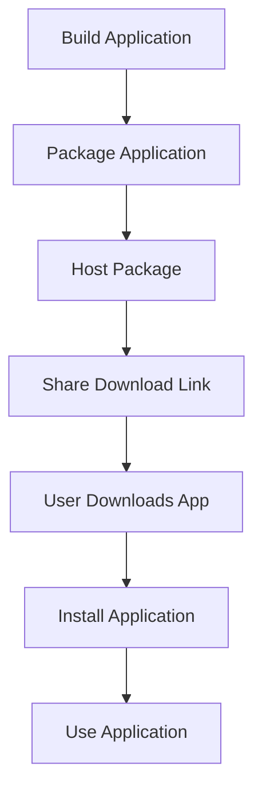

## 11.4.4 Distributing Desktop Apps

As Flutter developers, expanding your app's reach to desktop platforms can significantly enhance its accessibility and user base. This section delves into the intricacies of distributing desktop applications, providing a comprehensive guide to ensure your app reaches users effectively and securely. We'll explore direct distribution methods, app store requirements, update mechanisms, legal considerations, and best practices. By the end of this section, you'll be equipped with the knowledge to distribute your Flutter desktop apps confidently.

### Direct Distribution

Direct distribution involves sharing your application through direct download links, bypassing app stores. This method is straightforward and allows you to maintain control over the distribution process.

#### Steps for Direct Distribution

1. **Build Your Application:**
   - Use Flutter's build tools to compile your app for desktop platforms. For Windows, use `flutter build windows`, and for macOS, use `flutter build macos`.

2. **Package Your Application:**
   - Create an installation package using tools like Inno Setup for Windows or DMG Canvas for macOS. These tools help bundle your app with necessary dependencies and create a user-friendly installer.

3. **Host the Package:**
   - Upload the installation package to a reliable hosting service. This could be your website, a cloud storage service, or a dedicated file hosting platform.

4. **Share the Download Link:**
   - Provide users with a direct download link. Ensure the link is easily accessible and prominently displayed on your website or promotional materials.

5. **Security Considerations:**
   - Sign your application to ensure it hasn't been tampered with. This builds trust with users and prevents security warnings during installation.

#### Advantages and Challenges

- **Advantages:**
  - Complete control over the distribution process.
  - No app store fees or restrictions.
  - Immediate availability of updates.

- **Challenges:**
  - Requires managing hosting and bandwidth.
  - Users may be wary of downloading apps outside of official stores.

### Using App Stores

App stores provide a trusted platform for distributing applications, offering increased visibility and user trust. However, they come with specific requirements and guidelines.

#### Microsoft Store

To distribute your app on the Microsoft Store, follow these steps:

1. **Create a Developer Account:**
   - Sign up for a Microsoft Developer Account. This is necessary to submit apps to the store.

2. **Prepare Your App Package:**
   - Use the Windows Application Packaging Project to create an MSIX package. This package format is required for submission to the Microsoft Store.

3. **Submit Your App:**
   - Log in to the Microsoft Partner Center and submit your app. Provide necessary details such as app description, screenshots, and pricing.

4. **Compliance and Certification:**
   - Ensure your app complies with Microsoft's certification requirements. This includes security, performance, and content guidelines.

#### Mac App Store

For the Mac App Store, the process is slightly different:

1. **Enroll in the Apple Developer Program:**
   - Join the Apple Developer Program to gain access to app submission tools and resources.

2. **Package Your App:**
   - Use Xcode to create a macOS app package. Ensure your app is signed with a valid Apple Developer ID certificate.

3. **Submit Your App:**
   - Use App Store Connect to submit your app. Provide detailed metadata, including app description, keywords, and screenshots.

4. **Notarization:**
   - Apple requires apps to be notarized for distribution outside the Mac App Store. This process involves submitting your app to Apple for security checks.

#### Advantages and Challenges

- **Advantages:**
  - Increased visibility and credibility.
  - Access to a large user base.
  - Simplified update distribution.

- **Challenges:**
  - Compliance with store guidelines.
  - Potential delays in app approval.
  - Revenue sharing with the store.

### Implementing Updates

Keeping your app up-to-date is crucial for maintaining user satisfaction and security. Here are methods for implementing updates:

1. **In-App Update Mechanisms:**
   - Implement an update checker within your app. This can notify users of available updates and guide them through the update process.

2. **Automatic Updates:**
   - For apps distributed through app stores, updates can be managed automatically. Ensure your app's update settings are configured correctly in the store's dashboard.

3. **Manual Updates:**
   - For direct distribution, provide users with clear instructions on how to download and install updates. Consider using a versioning system to track updates.

#### Best Practices for Updates

- **Communicate Changes:**
  - Clearly communicate what changes or improvements are included in each update. This builds trust and encourages users to update promptly.

- **Test Thoroughly:**
  - Before releasing an update, thoroughly test it to ensure it doesn't introduce new issues or regressions.

- **Monitor Feedback:**
  - Pay attention to user feedback after updates. This can help identify any issues that need to be addressed quickly.

### Legal Considerations

Distributing desktop applications involves several legal considerations to ensure compliance and protect your intellectual property.

1. **Licensing:**
   - Decide on a licensing model for your app. This could be a free license, a paid license, or a subscription model. Clearly communicate the terms to users.

2. **End User License Agreement (EULA):**
   - Draft a comprehensive EULA that outlines the terms of use, user rights, and limitations. This protects both you and your users.

3. **Compliance:**
   - Ensure your app complies with relevant laws and regulations, such as data protection and privacy laws. This is especially important if your app collects user data.

4. **Intellectual Property:**
   - Protect your app's intellectual property by registering trademarks or copyrights if necessary. This prevents unauthorized use or distribution of your app.

### Best Practices

To ensure a smooth distribution process, follow these best practices:

1. **Application Signing:**
   - Sign your application with a trusted certificate. This verifies the app's authenticity and prevents tampering.

2. **Notarization:**
   - For macOS apps, notarization is required for distribution outside the Mac App Store. This process involves submitting your app to Apple for security checks.

3. **User Experience:**
   - Ensure the installation process is straightforward and user-friendly. Provide clear instructions and support resources if needed.

4. **Security:**
   - Implement security measures to protect your app and users. This includes encrypting sensitive data and using secure communication protocols.

### Visual Aids

Below is a diagram illustrating the process of packaging and distributing a desktop application:

### Exercise: Preparing Your App for Distribution

Let's walk through the process of preparing your Flutter desktop app for distribution:

1. **Build Your App:**
   - Use Flutter's build tools to compile your app for the desired desktop platform.

2. **Package Your App:**
   - Create an installation package using a suitable tool for your platform.

3. **Sign Your App:**
   - Obtain a code signing certificate and sign your app to ensure its authenticity.

4. **Host Your App:**
   - Choose a reliable hosting service to store your installation package.

5. **Share Your App:**
   - Provide users with a direct download link or submit your app to an app store.

6. **Implement Updates:**
   - Set up an update mechanism to keep your app current and secure.

By following these steps, you'll be well on your way to distributing your Flutter desktop app effectively.

## Quiz Time!



### What is the primary advantage of direct distribution for desktop apps?

- [x] Complete control over the distribution process
- [ ] Access to a large user base
- [ ] Simplified update distribution
- [ ] Revenue sharing with the store

> **Explanation:** Direct distribution allows developers to maintain complete control over how their app is distributed, without the constraints of app store guidelines.

### Which tool is recommended for creating an installation package for Windows?

- [x] Inno Setup
- [ ] DMG Canvas
- [ ] Xcode
- [ ] App Store Connect

> **Explanation:** Inno Setup is a popular tool for creating installation packages for Windows applications.

### What is required for distributing apps on the Microsoft Store?

- [x] MSIX package
- [ ] DMG package
- [ ] APK file
- [ ] IPA file

> **Explanation:** The Microsoft Store requires apps to be submitted in the MSIX package format.

### What is the purpose of notarization for macOS apps?

- [x] To ensure the app is free from malicious software
- [ ] To increase app visibility
- [ ] To simplify the update process
- [ ] To manage app permissions

> **Explanation:** Notarization is a security measure by Apple to ensure that macOS apps are free from malicious software.

### What should be included in an End User License Agreement (EULA)?

- [x] Terms of use
- [x] User rights
- [ ] App pricing
- [ ] Marketing strategies

> **Explanation:** A EULA should outline the terms of use and user rights to protect both the developer and the user.

### Why is application signing important?

- [x] It verifies the app's authenticity
- [ ] It increases app visibility
- [ ] It simplifies the update process
- [ ] It manages app permissions

> **Explanation:** Application signing verifies the app's authenticity and ensures it hasn't been tampered with.

### What is a key benefit of distributing apps through app stores?

- [x] Increased visibility and credibility
- [ ] Complete control over distribution
- [ ] No app store fees
- [ ] Immediate availability of updates

> **Explanation:** App stores provide increased visibility and credibility, making it easier for users to trust and find your app.

### What is a common challenge of direct distribution?

- [x] Managing hosting and bandwidth
- [ ] Compliance with store guidelines
- [ ] Revenue sharing with the store
- [ ] Delays in app approval

> **Explanation:** Direct distribution requires developers to manage hosting and bandwidth, which can be challenging.

### What is a best practice for implementing updates?

- [x] Clearly communicate changes
- [ ] Delay updates as long as possible
- [ ] Avoid testing updates
- [ ] Ignore user feedback

> **Explanation:** Clearly communicating changes helps build trust with users and encourages them to update promptly.

### True or False: Notarization is required for distributing macOS apps outside the Mac App Store.

- [x] True
- [ ] False

> **Explanation:** Apple requires notarization for macOS apps distributed outside the Mac App Store to ensure security.


