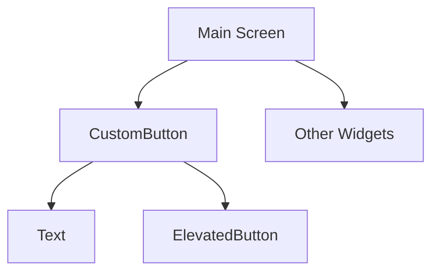

## 12.1.1 Creating Reusable Widgets

### Introduction to Reusable Widgets

In the world of Flutter development, creating reusable widgets is a cornerstone of building efficient, maintainable, and scalable applications. Reusable widgets allow developers to encapsulate UI elements and logic into modular components that can be easily reused across different parts of an application. This practice not only reduces code duplication but also enhances readability and simplifies maintenance.

#### Benefits of Reusability

- **Reduced Code Duplication:** By creating reusable widgets, you eliminate the need to write the same code multiple times. This leads to a cleaner codebase and reduces the risk of introducing errors.
- **Easier Maintenance:** When a change is needed, you only have to update the widget in one place, rather than hunting down every instance of similar code.
- **Enhanced Readability:** Reusable widgets encapsulate complex UI logic, making the main build methods of your screens more readable and easier to understand.
- **Consistent UI:** Using reusable widgets ensures that your UI elements maintain a consistent look and feel throughout the application.

### Identifying Reusable Components

The first step in creating reusable widgets is identifying which parts of your UI can be abstracted. Look for patterns or repeated UI elements throughout your app. Common candidates for reusable widgets include buttons, form fields, cards, and any other UI components that appear multiple times with similar structure or behavior.

#### Tips for Identifying Reusable Components

- **Look for Repetition:** Scan your codebase for repeated UI patterns. If you find yourself copying and pasting code, it's a good candidate for a reusable widget.
- **Consider Functionality:** If multiple parts of your app perform similar functions, consider abstracting the logic into a widget.
- **Think Modularity:** Break down complex UI elements into smaller, manageable pieces that can be reused independently.

### Creating a Reusable Widget

Let's walk through the process of creating a reusable widget in Flutter. We'll use a simple example of a custom button that can be reused across different screens.

#### Step-by-Step Example

1. **Extract Repeated Code:** Identify the repeated code you want to extract. In this case, it's a button with specific styling and behavior.
2. **Define the Widget Class:** Create a new class for your widget. Decide whether it should be a `StatelessWidget` or `StatefulWidget` based on whether it needs to manage state.
3. **Use Constructor Parameters:** Define constructor parameters to accept dynamic data or configuration options. This makes your widget flexible and adaptable to different contexts.

##### Code Example

```dart
class CustomButton extends StatelessWidget {
  final String text;
  final VoidCallback onPressed;

  CustomButton({required this.text, required this.onPressed});

  @override
  Widget build(BuildContext context) {
    return ElevatedButton(
      onPressed: onPressed,
      child: Text(text),
    );
  }
}
```

In this example, `CustomButton` is a `StatelessWidget` that takes two parameters: `text` and `onPressed`. This allows the button to display different text and perform different actions based on where it's used.

### Parameterization and Flexibility

To make your widgets truly reusable, it's important to parameterize them effectively. This involves using default parameters, named parameters, and the `required` keyword to ensure that your widget is flexible yet easy to use.

#### Tips for Parameterization

- **Use Named Parameters:** Named parameters improve readability and make it clear what each parameter represents.
- **Set Default Values:** Provide default values for parameters where appropriate to simplify usage.
- **Require Essential Parameters:** Use the `required` keyword for parameters that are essential for the widget's functionality.

### Best Practices

Creating reusable widgets is not just about writing less code; it's about writing better code. Here are some best practices to keep in mind:

- **Keep the Interface Clean:** Avoid exposing unnecessary details. Only include parameters that are essential for the widget's functionality.
- **Document Your Widgets:** Use comments to explain the purpose and usage of your widget. This is especially helpful for other developers who may use your widget.
- **Use Descriptive Names:** Choose clear and descriptive names for your widget and its parameters to convey their purpose.

### Visual Aids

To better understand how reusable widgets fit into the widget tree, let's look at a simple diagram:



In this diagram, the `CustomButton` is a child of the `Main Screen` and contains a `Text` widget and an `ElevatedButton`. This illustrates how the custom widget integrates into the overall widget tree.

### Before-and-After Code Snippets

**Before Refactoring:**

```dart
ElevatedButton(
  onPressed: () {
    // Perform action
  },
  child: Text('Click Me'),
);
```

**After Refactoring:**

```dart
CustomButton(
  text: 'Click Me',
  onPressed: () {
    // Perform action
  },
);
```

By refactoring the button into a `CustomButton` widget, we've made the code more concise and easier to manage.

### Exercises

To practice creating reusable widgets, try the following exercises:

- **Identify a Complex UI Element:** Look at your current app and identify a complex UI element that appears multiple times. Create a reusable widget from it.
- **Consider Different Contexts:** Think about how your widget might be used in different parts of your app. Can it be parameterized to handle these variations?

### Conclusion

Creating reusable widgets is a powerful technique in Flutter development that leads to cleaner, more maintainable code. By identifying patterns, parameterizing effectively, and following best practices, you can build a library of reusable components that enhance your app's scalability and consistency.

### Additional Resources

- [Flutter Documentation on Widgets](https://flutter.dev/docs/development/ui/widgets)
- [Effective Dart: Style](https://dart.dev/guides/language/effective-dart/style)
- [Flutter Widget of the Week](https://www.youtube.com/playlist?list=PLjxrf2q8roU3ahJVrSgAnPjzkpGmL9Czl)

## Quiz Time!



### What is a key benefit of creating reusable widgets in Flutter?

- [x] Reduced code duplication
- [ ] Increased code complexity
- [ ] Slower application performance
- [ ] More difficult maintenance

> **Explanation:** Reusable widgets reduce code duplication, making the codebase cleaner and easier to maintain.

### Which of the following is a good candidate for a reusable widget?

- [x] A button used in multiple places with similar styling
- [ ] A unique screen layout used only once
- [ ] A specific API call function
- [ ] A hardcoded string value

> **Explanation:** A button used in multiple places with similar styling is a good candidate for a reusable widget because it encapsulates repeated UI logic.

### What is the purpose of using named parameters in a widget's constructor?

- [x] To improve readability and clarify parameter usage
- [ ] To make the widget less flexible
- [ ] To increase the number of parameters
- [ ] To make the widget harder to use

> **Explanation:** Named parameters improve readability and make it clear what each parameter represents, enhancing the usability of the widget.

### In the provided code example, what type of widget is `CustomButton`?

- [x] StatelessWidget
- [ ] StatefulWidget
- [ ] InheritedWidget
- [ ] Provider

> **Explanation:** `CustomButton` is a `StatelessWidget` because it does not manage any state internally.

### What keyword is used to ensure a parameter is provided when creating a widget?

- [x] required
- [ ] optional
- [ ] default
- [ ] final

> **Explanation:** The `required` keyword is used to ensure that a parameter is provided when creating a widget.

### What should you do if you find yourself copying and pasting UI code multiple times?

- [x] Create a reusable widget
- [ ] Ignore it
- [ ] Write a new function
- [ ] Use a global variable

> **Explanation:** If you find yourself copying and pasting UI code, it's a sign that you should create a reusable widget to encapsulate that logic.

### Which of the following is NOT a benefit of using reusable widgets?

- [ ] Easier maintenance
- [ ] Consistent UI
- [x] Increased code duplication
- [ ] Enhanced readability

> **Explanation:** Reusable widgets reduce code duplication, not increase it.

### How can you make a widget flexible and adaptable to different contexts?

- [x] Use constructor parameters to accept dynamic data
- [ ] Hardcode all values
- [ ] Avoid using parameters
- [ ] Use global variables

> **Explanation:** Using constructor parameters to accept dynamic data makes a widget flexible and adaptable to different contexts.

### What is the main advantage of using the `required` keyword in a widget's constructor?

- [x] It ensures essential parameters are provided
- [ ] It makes parameters optional
- [ ] It increases the number of parameters
- [ ] It makes the widget less flexible

> **Explanation:** The `required` keyword ensures that essential parameters are provided, making the widget's usage clear and preventing errors.

### True or False: Reusable widgets can only be created from simple UI elements.

- [ ] True
- [x] False

> **Explanation:** Reusable widgets can be created from both simple and complex UI elements, as long as they encapsulate repeated logic or patterns.


