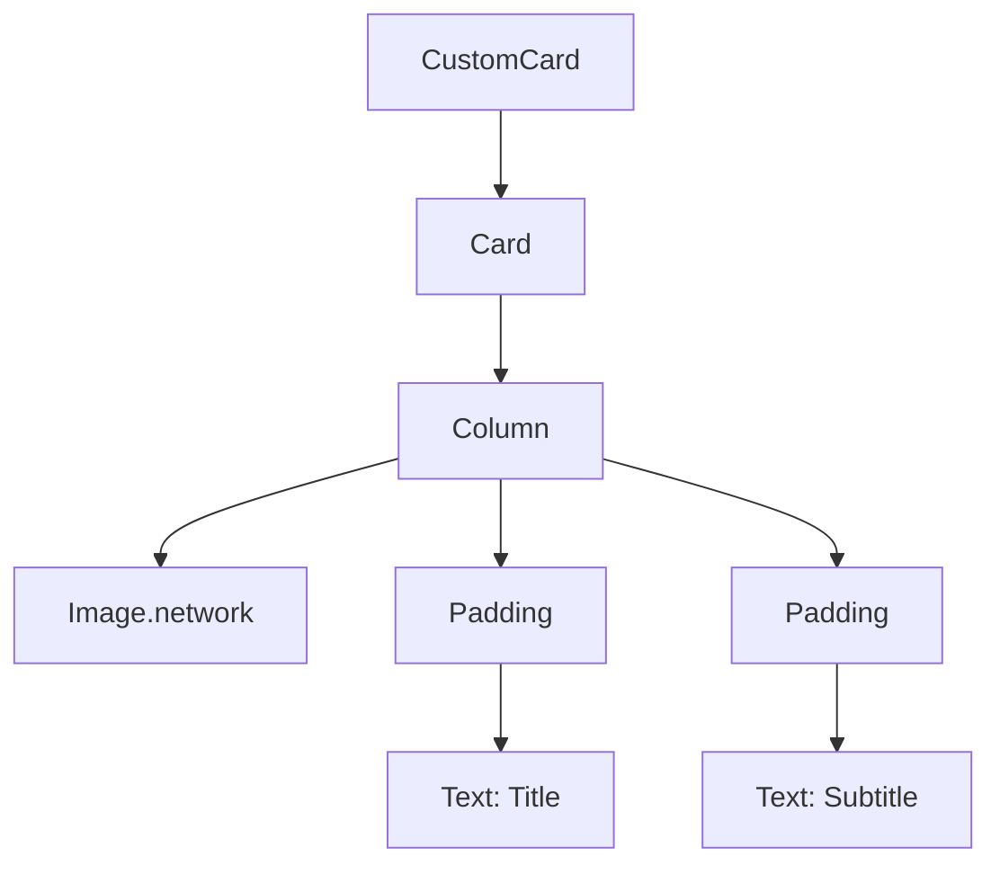

## 12.1.2 Composing Complex Widgets

In the world of Flutter, the power of creating rich and interactive user interfaces lies in the concept of composition. Unlike traditional object-oriented programming paradigms that often rely heavily on inheritance, Flutter encourages developers to build complex widgets by composing simpler ones. This approach not only enhances flexibility and reusability but also aligns with Flutter's declarative UI framework, making it easier to manage and understand your codebase.

### Concept of Composition

Composition in Flutter involves constructing complex widgets by combining multiple simpler widgets. This method allows developers to create intricate UI components without the pitfalls of deep inheritance hierarchies. By leveraging composition, you can build modular and maintainable code that is easier to test and extend.

#### Why Composition Over Inheritance?

- **Flexibility:** Composition allows you to mix and match different widgets to create new functionalities without altering existing code.
- **Reusability:** Smaller, well-defined widgets can be reused across different parts of your application.
- **Maintainability:** By breaking down complex widgets into smaller components, your code becomes more readable and easier to maintain.

### Building a Complex Widget

Let's dive into a practical example to illustrate how you can compose a complex widget in Flutter. We'll create a custom card widget that includes an image, a title, and a subtitle. This example will demonstrate how to use composition to build a sophisticated UI component.

#### Step-by-Step Guide

1. **Start with a Base Widget:**
   Begin by defining a base widget, such as a `Container` or `Card`, which will serve as the foundation for your complex widget.

2. **Add Child Widgets:**
   Use layout widgets like `Column`, `Row`, or `Stack` to arrange the components within your base widget.

3. **Nest Additional Widgets:**
   Incorporate other widgets for styling and layout, such as `Padding`, `Text`, and `Image`.

#### Code Example

Below is a code example of a `CustomCard` widget that illustrates these principles:

```dart
class CustomCard extends StatelessWidget {
  final String imageUrl;
  final String title;
  final String subtitle;

  CustomCard({required this.imageUrl, required this.title, required this.subtitle});

  @override
  Widget build(BuildContext context) {
    return Card(
      child: Column(
        crossAxisAlignment: CrossAxisAlignment.start,
        children: [
          Image.network(imageUrl),
          Padding(
            padding: const EdgeInsets.all(8.0),
            child: Text(title, style: TextStyle(fontSize: 18, fontWeight: FontWeight.bold)),
          ),
          Padding(
            padding: const EdgeInsets.symmetric(horizontal: 8.0),
            child: Text(subtitle),
          ),
        ],
      ),
    );
  }
}
```

### Organizing Code

As your widget complexity grows, it's crucial to keep your code organized. Here are some strategies to achieve this:

- **Extract Smaller Widgets:**
  Break down complex build methods by extracting parts into smaller widgets or methods. This not only improves readability but also enhances reusability.

- **Use Meaningful Names:**
  Assign descriptive names to your variables and widgets to make your code self-explanatory.

### Visual Aids

To better understand how different widgets come together to form a complex widget, let's visualize the widget hierarchy using a diagram.



This diagram illustrates how the `CustomCard` widget is composed of a `Card`, which contains a `Column` that organizes an `Image` and two `Padding` widgets, each wrapping a `Text` widget.

### Best Practices

- **Keep Build Methods Concise:**
  Aim to keep your build methods short and focused. If a method becomes too lengthy, consider breaking it down into smaller components.

- **Avoid Deep Nesting:**
  Excessive nesting can make your code difficult to read and maintain. Extract nested widgets into separate classes or methods when necessary.

- **Leverage Composition:**
  Use composition to create new widgets by combining existing ones, rather than relying on inheritance.

### Exercises

To reinforce your understanding of composing complex widgets, try creating a custom widget for a specific use case in your app. For example, design a profile card that includes an avatar, name, and a short bio. Apply the principles of composition to build this widget.

### Conclusion

Composing complex widgets in Flutter is a powerful technique that enables developers to build sophisticated and maintainable user interfaces. By embracing composition over inheritance, you can create flexible, reusable, and organized code that is easy to extend and adapt. As you continue to explore Flutter, remember to apply these principles to enhance your app's UI and overall architecture.

## Quiz Time!



### What is the primary advantage of using composition over inheritance in Flutter?

- [x] Flexibility and reusability
- [ ] Faster execution
- [ ] Easier debugging
- [ ] Reduced memory usage

> **Explanation:** Composition allows for more flexible and reusable code by combining simpler widgets to create complex ones, avoiding the limitations of inheritance.

### In the provided `CustomCard` example, which widget serves as the base for the complex widget?

- [ ] Container
- [x] Card
- [ ] Column
- [ ] Row

> **Explanation:** The `Card` widget is used as the base widget in the `CustomCard` example, providing a foundation for the other components.

### What is a recommended practice when your build methods become too lengthy?

- [ ] Use more inheritance
- [x] Extract parts into smaller widgets or methods
- [ ] Increase widget nesting
- [ ] Ignore the length

> **Explanation:** Extracting parts into smaller widgets or methods improves readability and maintainability of the code.

### Which layout widget is used in the `CustomCard` example to arrange the components vertically?

- [ ] Row
- [x] Column
- [ ] Stack
- [ ] ListView

> **Explanation:** The `Column` widget is used to arrange the components vertically within the `CustomCard`.

### What is the purpose of the `Padding` widget in the `CustomCard` example?

- [ ] To add a border
- [x] To add spacing around the text
- [ ] To change the text color
- [ ] To align the text

> **Explanation:** The `Padding` widget adds spacing around the text to improve the layout and appearance.

### How can you visualize the structure of a complex widget?

- [ ] By using inheritance diagrams
- [x] By using widget hierarchy diagrams
- [ ] By writing more code
- [ ] By reducing widget usage

> **Explanation:** Widget hierarchy diagrams help visualize how different widgets are composed to form a complex widget.

### What should you do to avoid deep nesting in your widget tree?

- [ ] Use more inheritance
- [ ] Increase widget complexity
- [x] Extract widgets into separate classes or methods
- [ ] Ignore nesting depth

> **Explanation:** Extracting widgets into separate classes or methods helps avoid deep nesting and improves code readability.

### Which widget is used in the `CustomCard` example to display an image?

- [ ] AssetImage
- [x] Image.network
- [ ] Image.asset
- [ ] Image.file

> **Explanation:** The `Image.network` widget is used to display an image from a URL in the `CustomCard` example.

### What is a key benefit of using meaningful names for variables and widgets?

- [ ] Faster execution
- [ ] Reduced memory usage
- [x] Improved code readability
- [ ] Easier debugging

> **Explanation:** Meaningful names make the code self-explanatory and easier to understand, improving readability.

### True or False: Composition in Flutter involves creating new widgets by extending existing ones.

- [ ] True
- [x] False

> **Explanation:** Composition involves creating new widgets by combining existing ones, not by extending them.


