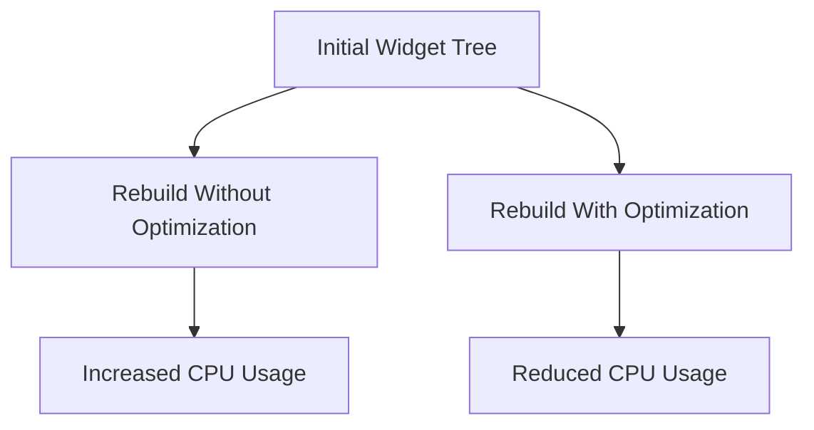

## 12.1.3 Optimizing Custom Widgets

In the world of mobile app development, performance is paramount. Flutter, with its rich set of widgets, allows developers to create beautiful and responsive UIs. However, as your app grows in complexity, so does the need to ensure that your custom widgets are optimized for performance. This section will guide you through various techniques to optimize custom widgets in Flutter, ensuring smooth and efficient app performance.

### Performance Considerations

Flutter's UI is built using a tree of widgets, and each widget can be rebuilt multiple times during the app's lifecycle. While this flexibility is powerful, it can also lead to performance issues if not managed properly. Understanding how widget rebuilding affects performance is crucial.

- **Widget Rebuilding:** Every time a widget's state changes, Flutter rebuilds the widget tree. This process can be resource-intensive, especially if the widget tree is deep or complex. Unnecessary rebuilds can lead to jank, where the UI stutters or lags, degrading the user experience.

- **Minimizing Unnecessary Rebuilds:** To optimize performance, it's essential to minimize unnecessary widget rebuilds. This can be achieved by ensuring that only the widgets that need to be updated are rebuilt, while others remain unchanged.

### Using `const` Widgets

One of the simplest yet most effective ways to optimize widget builds is by using `const` widgets. When a widget's properties are immutable, marking it as `const` allows Flutter to recognize that the widget does not need to be rebuilt.

- **Benefits of `const` Widgets:** By marking widgets as `const`, you enable Flutter to reuse the widget instance across rebuilds, reducing the overhead of creating new widget instances. This is particularly beneficial for static widgets that do not change over time.

- **Example Usage:**

  ```dart
  const Text(
    'Hello, Flutter!',
    style: TextStyle(fontSize: 24),
  )
  ```

  In this example, the `Text` widget is marked as `const`, indicating that its properties will not change, allowing Flutter to optimize its rendering.

### Implementing `shouldRebuild`

For custom `InheritedWidget` classes, overriding the `shouldRebuild` method can prevent unnecessary updates. This method determines whether the widget should be rebuilt when its dependencies change.

- **Example of `shouldRebuild`:**

  ```dart
  class MyInheritedWidget extends InheritedWidget {
    final int data;

    MyInheritedWidget({
      Key? key,
      required this.data,
      required Widget child,
    }) : super(key: key, child: child);

    @override
    bool updateShouldNotify(MyInheritedWidget oldWidget) {
      return oldWidget.data != data;
    }
  }
  ```

  In this example, the widget only rebuilds if the `data` property changes, preventing unnecessary updates when other properties remain the same.

### Keys and Widget Identity

Keys play a crucial role in preserving widget state across rebuilds. They help Flutter identify which widgets have changed and which have not, ensuring that the correct state is maintained.

- **Types of Keys:**
  - **`ValueKey`:** Used when the key is based on a specific value, such as an ID.
  - **`ObjectKey`:** Similar to `ValueKey`, but uses an object as the key.
  - **`UniqueKey`:** Generates a unique key for each widget instance, useful when you want to ensure a widget is always treated as new.

- **Example Usage:**

  ```dart
  ListView.builder(
    itemBuilder: (context, index) {
      return ListTile(
        key: ValueKey(items[index].id),
        title: Text(items[index].name),
      );
    },
  )
  ```

  Here, `ValueKey` is used to preserve the state of each `ListTile` based on the item's ID.

### Avoiding Layout Passes

Minimizing expensive layout operations is another key aspect of optimizing custom widgets. Flutter's layout system can be resource-intensive, especially for complex widget trees.

- **Using `RepaintBoundary`:** This widget isolates parts of the widget tree, preventing unnecessary repaints. It is particularly useful for complex widgets that do not change often.

- **Example Usage:**

  ```dart
  RepaintBoundary(
    child: ComplexWidget(),
  )
  ```

  By wrapping `ComplexWidget` in a `RepaintBoundary`, you ensure that it is only repainted when necessary, improving performance.

### Visual Aids

To better understand the impact of optimizations, consider the following diagrams:



- **Diagram Explanation:** The diagram illustrates how optimizing widget rebuilds can lead to reduced CPU usage, enhancing app performance.

### Best Practices

- **Profile with Flutter DevTools:** Use Flutter DevTools to identify performance bottlenecks in your app. This tool provides insights into widget rebuilds, layout passes, and more.

- **Keep the Widget Tree Shallow:** A shallow widget tree is easier to manage and optimize. Avoid deeply nested widgets when possible.

### Exercises

To solidify your understanding, try optimizing an existing custom widget in your app. Apply the techniques discussed, such as using `const` widgets, implementing `shouldRebuild`, and utilizing keys. Profile the widget before and after optimization to observe the performance improvements.

### Conclusion

Optimizing custom widgets in Flutter is essential for maintaining a smooth and responsive user experience. By minimizing unnecessary rebuilds, using `const` widgets, implementing `shouldRebuild`, and leveraging keys, you can significantly enhance your app's performance. Remember to profile your app regularly and apply best practices to ensure optimal performance.

## Quiz Time!



### How does widget rebuilding affect app performance?

- [x] It can lead to increased CPU usage and potential UI lag.
- [ ] It always improves the app's performance.
- [ ] It has no impact on performance.
- [ ] It only affects the app's memory usage.

> **Explanation:** Widget rebuilding can increase CPU usage, leading to potential UI lag if not managed properly.

### What is the benefit of marking a widget as `const`?

- [x] It allows Flutter to reuse the widget instance across rebuilds.
- [ ] It makes the widget immutable forever.
- [ ] It automatically optimizes the widget's layout.
- [ ] It prevents the widget from being rebuilt.

> **Explanation:** Marking a widget as `const` allows Flutter to reuse the widget instance, reducing the overhead of creating new instances.

### When should you override `shouldRebuild` in a custom `InheritedWidget`?

- [x] When you want to control when the widget should be rebuilt based on specific conditions.
- [ ] When you want the widget to rebuild every time.
- [ ] When you want to prevent the widget from ever rebuilding.
- [ ] When you want to optimize the widget's layout.

> **Explanation:** Overriding `shouldRebuild` allows you to control when the widget should be rebuilt, preventing unnecessary updates.

### What is the role of `Key` in Flutter?

- [x] It helps preserve widget state across rebuilds.
- [ ] It is used to style widgets.
- [ ] It determines the widget's layout.
- [ ] It is only used for debugging purposes.

> **Explanation:** `Key` helps Flutter identify which widgets have changed, preserving their state across rebuilds.

### Which key should you use if you want a unique key for each widget instance?

- [ ] `ValueKey`
- [ ] `ObjectKey`
- [x] `UniqueKey`
- [ ] `GlobalKey`

> **Explanation:** `UniqueKey` generates a unique key for each widget instance, ensuring it is treated as new.

### How can you minimize expensive layout operations?

- [x] By using `RepaintBoundary` to isolate parts of the widget tree.
- [ ] By using more `GlobalKey` instances.
- [ ] By avoiding the use of `const` widgets.
- [ ] By increasing the widget tree depth.

> **Explanation:** `RepaintBoundary` isolates parts of the widget tree, preventing unnecessary repaints and minimizing layout operations.

### What tool can you use to identify performance bottlenecks in your Flutter app?

- [x] Flutter DevTools
- [ ] Android Studio
- [ ] Xcode
- [ ] Visual Studio Code

> **Explanation:** Flutter DevTools provides insights into widget rebuilds, layout passes, and other performance metrics.

### Why is it important to keep the widget tree shallow?

- [x] A shallow widget tree is easier to manage and optimize.
- [ ] It makes the app look better.
- [ ] It increases the app's memory usage.
- [ ] It prevents the use of `const` widgets.

> **Explanation:** A shallow widget tree is easier to manage and optimize, reducing complexity and improving performance.

### What is the purpose of `RepaintBoundary`?

- [x] To isolate parts of the widget tree and prevent unnecessary repaints.
- [ ] To style widgets with borders.
- [ ] To manage widget state.
- [ ] To handle user input.

> **Explanation:** `RepaintBoundary` isolates parts of the widget tree, preventing unnecessary repaints and improving performance.

### True or False: Using `const` widgets can help reduce the number of widget rebuilds.

- [x] True
- [ ] False

> **Explanation:** Using `const` widgets allows Flutter to reuse widget instances, reducing the number of rebuilds.


