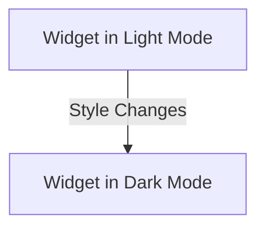

## 12.1.4 Styling Custom Widgets

In the world of Flutter development, creating visually appealing and cohesive user interfaces is paramount. Custom widgets play a crucial role in achieving this goal, allowing developers to encapsulate functionality and design into reusable components. However, styling these widgets to align with the overall app theme and ensuring they are accessible and adaptable to different modes, such as light and dark themes, can be challenging. This section will guide you through the intricacies of styling custom widgets in Flutter, covering theme integration, customization, and best practices.

### Theme Integration

Flutter's theming capabilities allow you to create a consistent look and feel across your application. By integrating your custom widgets with the app's theme, you ensure that they respond dynamically to theme changes, providing a seamless user experience.

#### Accessing Theme Data

To make a custom widget responsive to the app's theme, you can use the `Theme.of(context)` method. This method retrieves the current theme data, which you can then use to style your widget.

```dart
import 'package:flutter/material.dart';

class ThemedButton extends StatelessWidget {
  final String label;

  ThemedButton({required this.label});

  @override
  Widget build(BuildContext context) {
    final theme = Theme.of(context);

    return ElevatedButton(
      style: ElevatedButton.styleFrom(
        primary: theme.primaryColor, // Use the primary color from the theme
        onPrimary: theme.colorScheme.onPrimary, // Text color
      ),
      onPressed: () {},
      child: Text(label),
    );
  }
}
```

In this example, the `ThemedButton` widget uses the primary color and text color from the current theme, ensuring that it adapts to theme changes automatically.

### Customizing Appearance

Custom widgets often require specific styling options to meet design requirements. By passing styling options as parameters, you can create flexible and reusable widgets.

#### Using Styling Classes

Flutter provides several classes for styling, such as `TextStyle` and `BoxDecoration`. These classes allow you to define text styles, backgrounds, borders, and more.

```dart
class CustomCard extends StatelessWidget {
  final String title;
  final TextStyle? titleStyle;
  final BoxDecoration? decoration;

  CustomCard({required this.title, this.titleStyle, this.decoration});

  @override
  Widget build(BuildContext context) {
    return Container(
      decoration: decoration ?? BoxDecoration(
        color: Colors.white,
        borderRadius: BorderRadius.circular(8.0),
        boxShadow: [
          BoxShadow(
            color: Colors.grey.withOpacity(0.5),
            spreadRadius: 2,
            blurRadius: 5,
            offset: Offset(0, 3),
          ),
        ],
      ),
      padding: EdgeInsets.all(16.0),
      child: Text(
        title,
        style: titleStyle ?? Theme.of(context).textTheme.headline6,
      ),
    );
  }
}
```

In the `CustomCard` widget, you can pass a `TextStyle` for the title and a `BoxDecoration` for the container, allowing for extensive customization.

### Supporting Light and Dark Modes

With the increasing popularity of dark mode, it's essential to ensure that your widgets support both light and dark themes. Flutter makes it easy to detect the current theme mode and adjust styles accordingly.

#### Detecting Theme Mode

You can determine the current theme mode using the `ThemeData.brightness` property.

```dart
class AdaptiveText extends StatelessWidget {
  final String text;

  AdaptiveText({required this.text});

  @override
  Widget build(BuildContext context) {
    final brightness = Theme.of(context).brightness;
    final color = brightness == Brightness.dark ? Colors.white : Colors.black;

    return Text(
      text,
      style: TextStyle(color: color),
    );
  }
}
```

In this `AdaptiveText` widget, the text color changes based on the current theme mode, ensuring readability in both light and dark environments.

### Accessibility Considerations

Accessibility is a critical aspect of UI design, ensuring that all users, including those with disabilities, can use your app effectively. When styling custom widgets, consider color contrast and font sizes.

#### Color Contrast and Font Sizes

Ensure that text and background colors have sufficient contrast to be readable. Additionally, test your widgets with different text scaling settings to accommodate users who require larger text.

```dart
class AccessibleButton extends StatelessWidget {
  final String label;

  AccessibleButton({required this.label});

  @override
  Widget build(BuildContext context) {
    return ElevatedButton(
      onPressed: () {},
      child: Text(
        label,
        style: TextStyle(
          fontSize: 18.0, // Ensure a readable font size
          color: Colors.white,
        ),
      ),
    );
  }
}
```

### Visual Aids

Visual aids can help illustrate the impact of different styles on your widgets. Consider the following before-and-after visuals of a custom widget styled for light and dark modes.



In the above diagram, the widget adapts its colors and text styles based on the current theme, providing a consistent user experience.

### Best Practices

When styling custom widgets, adhere to the following best practices:

- **Consistent Styling:** Use consistent styles across your app to maintain a cohesive look and feel.
- **Leverage Theme Properties:** Utilize existing theme properties to ensure your widgets align with the app's overall design.
- **Test for Accessibility:** Regularly test your widgets for accessibility, ensuring they are usable by all users.

### Exercises

To solidify your understanding, try creating a custom widget that adapts its styling based on theme data. Consider implementing a card widget that changes its background and text color according to the current theme.

```dart
class ThemeAwareCard extends StatelessWidget {
  final String content;

  ThemeAwareCard({required this.content});

  @override
  Widget build(BuildContext context) {
    final theme = Theme.of(context);
    final backgroundColor = theme.brightness == Brightness.dark
        ? Colors.grey[800]
        : Colors.white;
    final textColor = theme.brightness == Brightness.dark
        ? Colors.white
        : Colors.black;

    return Card(
      color: backgroundColor,
      child: Padding(
        padding: const EdgeInsets.all(16.0),
        child: Text(
          content,
          style: TextStyle(color: textColor),
        ),
      ),
    );
  }
}
```

### Conclusion

Styling custom widgets in Flutter involves integrating with the app's theme, supporting different modes, and ensuring accessibility. By following best practices and leveraging Flutter's powerful styling capabilities, you can create visually appealing and cohesive user interfaces that enhance the overall user experience.

## Quiz Time!



### How can you access the current theme data in a Flutter widget?

- [x] Using `Theme.of(context)`
- [ ] Using `context.theme`
- [ ] Using `ThemeData.current`
- [ ] Using `ThemeProvider.of(context)`

> **Explanation:** The `Theme.of(context)` method is used to access the current theme data in a Flutter widget.

### What is the purpose of passing styling options as parameters to custom widgets?

- [x] To allow for flexibility and reusability of the widget
- [ ] To make the widget less customizable
- [ ] To enforce a fixed style across all instances
- [ ] To reduce the number of lines of code

> **Explanation:** Passing styling options as parameters allows for flexibility and reusability, enabling the widget to be styled differently in various contexts.

### How can you detect the current theme mode in Flutter?

- [x] By checking `Theme.of(context).brightness`
- [ ] By using `MediaQuery.of(context).platformBrightness`
- [ ] By accessing `ThemeData.mode`
- [ ] By calling `ThemeMode.current`

> **Explanation:** The current theme mode can be detected by checking `Theme.of(context).brightness`, which returns `Brightness.light` or `Brightness.dark`.

### Why is color contrast important in widget styling?

- [x] To ensure text readability against the background
- [ ] To make the widget look more colorful
- [ ] To reduce the number of colors used
- [ ] To make the widget less accessible

> **Explanation:** Color contrast is important to ensure text readability against the background, which is crucial for accessibility.

### What is a best practice when styling custom widgets?

- [x] Use consistent styling across the app
- [ ] Use random colors for each widget
- [ ] Avoid using theme properties
- [ ] Ignore accessibility considerations

> **Explanation:** Using consistent styling across the app helps maintain a cohesive look and feel, which is a best practice in UI design.

### How can you ensure a widget supports both light and dark modes?

- [x] By adjusting styles based on `Theme.of(context).brightness`
- [ ] By hardcoding colors for each mode
- [ ] By using only light colors
- [ ] By ignoring the theme mode

> **Explanation:** Ensuring a widget supports both light and dark modes involves adjusting styles based on `Theme.of(context).brightness`.

### What is the role of `BoxDecoration` in Flutter?

- [x] To style the background, border, and shadow of a widget
- [ ] To style text within a widget
- [ ] To manage widget layout
- [ ] To handle user input

> **Explanation:** `BoxDecoration` is used to style the background, border, and shadow of a widget in Flutter.

### Why should you test widgets with different text scaling settings?

- [x] To ensure accessibility for users who require larger text
- [ ] To make the widget look smaller
- [ ] To reduce the font size
- [ ] To ignore user preferences

> **Explanation:** Testing widgets with different text scaling settings ensures accessibility for users who require larger text.

### What is the benefit of using `TextStyle` in custom widgets?

- [x] To define and customize text appearance
- [ ] To manage widget layout
- [ ] To handle user input
- [ ] To ignore text formatting

> **Explanation:** `TextStyle` is used to define and customize the appearance of text within a widget.

### True or False: Custom widgets should ignore the app's theme to maintain a unique style.

- [ ] True
- [x] False

> **Explanation:** Custom widgets should integrate with the app's theme to maintain a cohesive and consistent style across the application.


