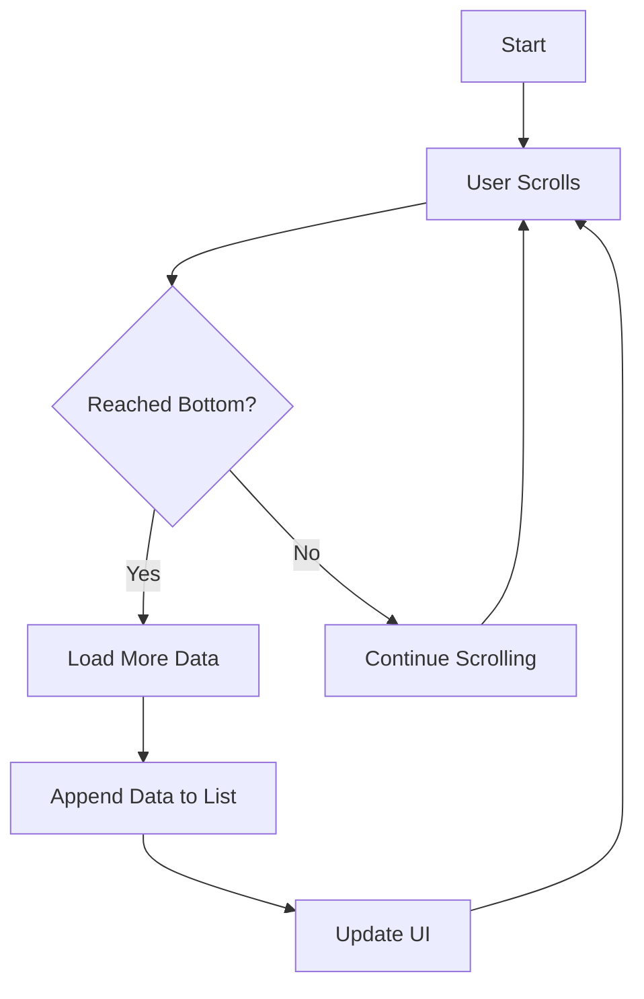

## 12.2.1 Advanced ListView Techniques

In the world of mobile app development, presenting data efficiently and interactively is crucial for a seamless user experience. Flutter's `ListView` widget is a powerful tool for displaying lists of data, but to truly harness its potential, developers must delve into advanced techniques like infinite scrolling, pull-to-refresh, and animated list items. This section will guide you through these techniques, providing detailed insights, practical examples, and best practices to elevate your Flutter applications.

### Infinite Scrolling (Lazy Loading)

#### Introduction

Infinite scrolling, also known as lazy loading, is a technique that allows users to continuously scroll through data that is dynamically loaded as they reach the end of the current list. This approach is particularly beneficial for applications dealing with large datasets or data retrieved from a server, as it enhances performance and user experience by loading data incrementally.

#### Implementation

##### Using `ListView.builder`

The `ListView.builder` constructor is ideal for implementing infinite scrolling because it efficiently creates list items on demand. This means that only the visible items are built, reducing memory usage and improving performance.

```dart
ListView.builder(
  itemCount: items.length + 1,
  itemBuilder: (context, index) {
    if (index == items.length) {
      // Display a loading indicator at the end
      return Center(child: CircularProgressIndicator());
    } else {
      return ListTile(title: Text(items[index]));
    }
  },
);
```

In this example, an additional item is added to the `itemCount` to accommodate a loading indicator at the end of the list. This indicator is displayed when the user reaches the end of the current data set, signaling that more data is being loaded.

##### Detecting Scroll Position

To implement infinite scrolling, you need to detect when the user has scrolled to the bottom of the list. This can be achieved using a `ScrollController`.

```dart
ScrollController _scrollController = ScrollController();

@override
void initState() {
  super.initState();
  _scrollController.addListener(_onScroll);
}

void _onScroll() {
  if (_scrollController.position.atEdge) {
    if (_scrollController.position.pixels != 0) {
      // Reached the bottom, load more data
      _loadMoreData();
    }
  }
}

@override
void dispose() {
  _scrollController.dispose();
  super.dispose();
}
```

The `_onScroll` method checks if the scroll position is at the edge of the list. If the position is not at the top (i.e., `pixels != 0`), it indicates that the bottom has been reached, triggering the `_loadMoreData` method to fetch additional data.

##### Fetching More Data

When loading more data, it's essential to append the new data to the existing list and update the UI accordingly. Handling loading states and potential errors is also crucial to ensure a smooth user experience.

```dart
Future<void> _loadMoreData() async {
  setState(() {
    _isLoading = true;
  });

  try {
    final newData = await fetchDataFromServer();
    setState(() {
      items.addAll(newData);
      _isLoading = false;
    });
  } catch (error) {
    setState(() {
      _isLoading = false;
    });
    // Handle error
  }
}
```

In this example, `_isLoading` is a boolean state variable that indicates whether data is currently being loaded. This helps manage the loading indicator's visibility and prevents multiple simultaneous data fetches.

##### Best Practices

- **Debouncing or Throttling:** Implement debouncing or throttling mechanisms to prevent multiple simultaneous data fetches, which can lead to performance issues and increased server load.
- **User Feedback:** Provide visual feedback, such as a loading spinner, to inform users that more data is being loaded.
- **Error Handling:** Gracefully handle errors during data fetching, providing users with appropriate messages or retry options.

#### Visual Aids

To better understand the infinite scrolling mechanism, consider the following flowchart illustrating the process:



This diagram shows the continuous loop of scrolling and data loading, emphasizing the importance of detecting the scroll position and fetching data as needed.

### Pull-to-Refresh Functionality

#### Introduction

Pull-to-refresh is a popular UI pattern that allows users to swipe down at the top of a list to refresh its contents. This gesture is intuitive and provides a quick way for users to update the displayed data.

#### Implementation with `RefreshIndicator`

Flutter provides the `RefreshIndicator` widget, which makes implementing pull-to-refresh functionality straightforward.

```dart
RefreshIndicator(
  onRefresh: _refreshData,
  child: ListView.builder(
    itemCount: items.length,
    itemBuilder: (context, index) {
      return ListTile(title: Text(items[index]));
    },
  ),
);
```

The `_refreshData` function should be an `async` method that fetches new data and updates the state.

```dart
Future<void> _refreshData() async {
  try {
    final refreshedData = await fetchDataFromServer();
    setState(() {
      items = refreshedData;
    });
  } catch (error) {
    // Handle error
  }
}
```

This example demonstrates how to refresh the list's data by fetching new data from a server and updating the state.

#### Best Practices

- **Quick Refresh Action:** Ensure the refresh action is quick to provide responsive feedback to users.
- **GlobalKey Usage:** If multiple `RefreshIndicator` widgets are used in the same context, consider using a `GlobalKey` to manage them effectively.

#### Visual Aids

Visual aids, such as images or animations, can help demonstrate the pull-to-refresh gesture. Consider using a GIF or video to showcase the smooth swipe-down action and the subsequent data refresh.

### Animated List Items

#### Introduction

Adding animations to list items can significantly enhance the user experience by making interactions more engaging and visually appealing. Flutter's `AnimatedList` widget provides a way to animate item insertion and removal.

#### Using `AnimatedList`

The `AnimatedList` widget allows you to animate changes to the list, such as adding or removing items.

```dart
AnimatedList(
  key: _listKey,
  initialItemCount: items.length,
  itemBuilder: (context, index, animation) {
    return _buildAnimatedItem(items[index], animation);
  },
);
```

The `_buildAnimatedItem` method defines how each item should be animated.

```dart
Widget _buildAnimatedItem(String item, Animation<double> animation) {
  return SizeTransition(
    sizeFactor: animation,
    child: ListTile(title: Text(item)),
  );
}
```

This example uses a `SizeTransition` to animate the size of the list item as it is inserted or removed.

To insert or remove items, use the `AnimatedListState`:

```dart
void _insertItem(int index, String item) {
  items.insert(index, item);
  _listKey.currentState?.insertItem(index);
}

void _removeItem(int index) {
  final removedItem = items.removeAt(index);
  _listKey.currentState?.removeItem(
    index,
    (context, animation) => _buildAnimatedItem(removedItem, animation),
  );
}
```

These methods demonstrate how to manage the list's state and trigger animations for item insertion and removal.

#### Best Practices

- **Smooth Animations:** Ensure animations are smooth and not overly distracting to maintain a pleasant user experience.
- **State Management:** Properly handle state changes to avoid inconsistencies and ensure the list remains synchronized with the underlying data.

#### Visual Aids

Including GIFs or videos showcasing animated list items can help illustrate the dynamic nature of these animations. Consider demonstrating both item insertion and removal to highlight the versatility of `AnimatedList`.

### Exercises

To reinforce your understanding of these advanced ListView techniques, try the following exercises:

- **Exercise 1:** Implement an infinite scrolling list that fetches data from a mock API as the user scrolls. Ensure that the list loads additional data when the user reaches the bottom.
- **Exercise 2:** Add pull-to-refresh functionality to an existing list in your app. Ensure that the list updates with new data when the user performs the pull-to-refresh gesture.
- **Exercise 3:** Create an `AnimatedList` where items can be added or removed with animations. Experiment with different types of animations to see how they affect the user experience.

By completing these exercises, you'll gain hands-on experience with advanced ListView techniques, preparing you to implement these features in your own Flutter applications.

## Quiz Time!



### What is the primary benefit of using infinite scrolling in a Flutter app?

- [x] It allows users to continuously scroll through large datasets without loading all data at once.
- [ ] It improves the app's startup time by preloading all data.
- [ ] It simplifies the UI by reducing the number of visible items.
- [ ] It eliminates the need for pagination controls.

> **Explanation:** Infinite scrolling allows users to continuously scroll through data that is loaded dynamically, which is especially useful for large datasets or data retrieved from a server.

### Which Flutter widget is ideal for implementing infinite scrolling?

- [x] ListView.builder
- [ ] ListView
- [ ] GridView
- [ ] CustomScrollView

> **Explanation:** `ListView.builder` is ideal for implementing infinite scrolling because it efficiently creates list items on demand, reducing memory usage.

### How can you detect when a user has scrolled to the bottom of a list in Flutter?

- [x] Use a ScrollController to monitor the scroll position.
- [ ] Check the length of the list in the itemBuilder.
- [ ] Use a Timer to periodically check the scroll position.
- [ ] Implement a custom scroll listener.

> **Explanation:** A `ScrollController` can be used to monitor the scroll position and detect when the user has scrolled to the bottom of the list.

### What is the purpose of the `RefreshIndicator` widget in Flutter?

- [x] To implement pull-to-refresh functionality.
- [ ] To display a loading spinner at the top of the list.
- [ ] To automatically refresh the list every few seconds.
- [ ] To indicate when new data is available.

> **Explanation:** The `RefreshIndicator` widget is used to implement pull-to-refresh functionality, allowing users to swipe down at the top of a list to refresh its contents.

### Which method should be used to animate item insertion in an `AnimatedList`?

- [x] insertItem
- [ ] addItem
- [ ] animateItem
- [ ] pushItem

> **Explanation:** The `insertItem` method of `AnimatedListState` is used to animate the insertion of an item into an `AnimatedList`.

### What is a best practice when implementing infinite scrolling?

- [x] Implement debouncing or throttling to prevent multiple simultaneous data fetches.
- [ ] Load all data at once to avoid network calls.
- [ ] Use a fixed item count for the list.
- [ ] Disable user interactions during data loading.

> **Explanation:** Implementing debouncing or throttling helps prevent multiple simultaneous data fetches, which can lead to performance issues and increased server load.

### How can you ensure smooth animations in an `AnimatedList`?

- [x] Use transitions like `SizeTransition` or `FadeTransition`.
- [ ] Avoid using animations altogether.
- [ ] Use a fixed duration for all animations.
- [ ] Disable animations for large datasets.

> **Explanation:** Using transitions like `SizeTransition` or `FadeTransition` can help ensure smooth animations in an `AnimatedList`.

### What should you do to handle state changes properly in an `AnimatedList`?

- [x] Ensure the list remains synchronized with the underlying data.
- [ ] Use a separate list for animations.
- [ ] Avoid updating the list during animations.
- [ ] Use a static list of items.

> **Explanation:** Properly handling state changes ensures that the `AnimatedList` remains synchronized with the underlying data, preventing inconsistencies.

### Which widget is used to animate the size of a list item in an `AnimatedList`?

- [x] SizeTransition
- [ ] ScaleTransition
- [ ] OpacityTransition
- [ ] SlideTransition

> **Explanation:** `SizeTransition` is used to animate the size of a list item in an `AnimatedList`.

### True or False: Pull-to-refresh functionality is only useful for lists with static data.

- [ ] True
- [x] False

> **Explanation:** False. Pull-to-refresh functionality is useful for lists with dynamic data, allowing users to refresh the list's contents by swiping down.


