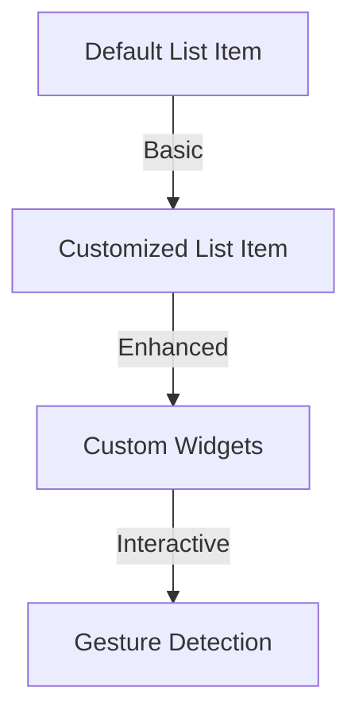

## 12.2.2 Customizing List Items

In the world of mobile app development, the user interface (UI) plays a crucial role in determining the success of an application. One of the most common UI components used in apps is the list view, which displays a scrollable list of items. Flutter, with its rich set of widgets, provides developers with the flexibility to create highly customized list items that can enhance the user experience significantly. In this section, we will explore how to customize list items in Flutter to meet specific design requirements and improve interactivity.

### Designing Custom List Tiles

#### Introduction

Default list items in Flutter, such as those created using the `ListTile` widget, offer a straightforward way to display simple lists. However, to create a unique and engaging user experience, you often need to customize these list items to align with your app's design language. Customizing list items allows you to incorporate branding elements, improve usability, and add interactive features that can make your app stand out.

#### Using `ListTile` and Custom Widgets

The `ListTile` widget in Flutter is a versatile and easy-to-use widget for creating list items. It provides properties for leading and trailing icons, titles, and subtitles, making it a great starting point for customization.

**Basic Customization with `ListTile`:**

Here's a simple example of a `ListTile`:

```dart
ListTile(
  leading: Icon(Icons.person),
  title: Text('John Doe'),
  subtitle: Text('Software Engineer'),
  trailing: Icon(Icons.arrow_forward),
);
```

This code snippet creates a basic list item with an icon, a title, a subtitle, and a trailing icon. While this is functional, it may not be visually appealing or aligned with your app's design.

**Enhancing `ListTile` with Custom Widgets:**

To customize a `ListTile`, you can replace its parts with custom widgets. For example, you might want to use a `CircleAvatar` for the leading icon and an `IconButton` for the trailing icon:

```dart
ListTile(
  leading: CircleAvatar(
    backgroundImage: NetworkImage(profileImageUrl),
  ),
  title: Text('John Doe'),
  subtitle: Text('Software Engineer'),
  trailing: IconButton(
    icon: Icon(Icons.message),
    onPressed: () {
      // Handle message action
    },
  ),
);
```

In this example, the leading icon is replaced with a `CircleAvatar` displaying a network image, and the trailing icon is replaced with an `IconButton` that can trigger an action, such as sending a message.

#### Creating a Completely Custom List Item

For more complex designs, you may need to create a completely custom list item using Flutter's layout widgets like `Container`, `Row`, and `Column`. This approach gives you full control over the layout and styling of the list item.

**Building a Custom Layout:**

```dart
Container(
  padding: EdgeInsets.all(8.0),
  child: Row(
    children: [
      Image.network(item.imageUrl, width: 50, height: 50),
      SizedBox(width: 10),
      Expanded(
        child: Column(
          crossAxisAlignment: CrossAxisAlignment.start,
          children: [
            Text(item.title, style: TextStyle(fontSize: 16, fontWeight: FontWeight.bold)),
            Text(item.subtitle),
          ],
        ),
      ),
      IconButton(
        icon: Icon(Icons.more_vert),
        onPressed: () {
          // Show options menu
        },
      ),
    ],
  ),
);
```

This code snippet demonstrates how to create a custom list item layout using a `Container` with padding, a `Row` to arrange widgets horizontally, and a `Column` to stack text vertically. The `Image.network` widget displays an image, and the `IconButton` provides an interactive element.

#### Making List Items Interactive

Interactivity is a key aspect of modern app design. Making list items interactive can enhance user engagement and provide a more dynamic experience.

**Gesture Detection:**

To handle taps and gestures on list items, you can wrap them with `InkWell` or `GestureDetector`. This allows you to respond to user interactions such as taps, long presses, and swipes.

**Example of Interactive List Item:**

```dart
InkWell(
  onTap: () {
    // Navigate to detail page
  },
  child: CustomListItem(...),
);
```

In this example, an `InkWell` widget wraps a custom list item, allowing it to respond to tap events. You can use this to navigate to a detail page or trigger other actions.

#### Visual Aids

Visual aids can help you understand the impact of customization on list items. Below are mockups and comparisons of default and customized list items.



This diagram illustrates the progression from a default list item to a fully customized and interactive list item.

### Best Practices

- **Consistent Padding and Alignment:** Ensure that list items have consistent padding and alignment to maintain a clean and organized look.
- **Accessible Fonts and Touch Targets:** Use accessible fonts and ensure that touch targets are large enough for easy interaction.

### Exercises

To reinforce your understanding, try the following exercises:

- **Exercise 1:** Customize a list item to include an image, title, subtitle, and a favorite button. Use a `ListTile` or create a custom layout.
- **Exercise 2:** Implement swipe-to-delete functionality on list items using the `Dismissible` widget.

### Conclusion

Customizing list items in Flutter allows you to create visually appealing and interactive list views that enhance the user experience. By leveraging Flutter's rich set of widgets and layout capabilities, you can design list items that align with your app's design language and provide engaging interactions. Remember to follow best practices for accessibility and consistency to ensure a seamless user experience.

## Quiz Time!



### What is the primary widget used for creating simple list items in Flutter?

- [x] ListTile
- [ ] ListView
- [ ] Container
- [ ] Column

> **Explanation:** The `ListTile` widget is commonly used for creating simple list items in Flutter, providing properties for leading and trailing icons, titles, and subtitles.

### How can you make a `ListTile` interactive?

- [x] Wrap it with an `InkWell` or `GestureDetector`
- [ ] Use a `Container`
- [ ] Add a `Column`
- [ ] Use a `Row`

> **Explanation:** Wrapping a `ListTile` with an `InkWell` or `GestureDetector` allows it to respond to user interactions such as taps and gestures.

### Which widget is used to display a circular image in a `ListTile`?

- [x] CircleAvatar
- [ ] Icon
- [ ] Image
- [ ] Container

> **Explanation:** The `CircleAvatar` widget is used to display a circular image, often used as the leading widget in a `ListTile`.

### What layout widgets can be used to create a completely custom list item?

- [x] Container, Row, Column
- [ ] ListTile, Icon, Text
- [ ] ListView, GridView, Stack
- [ ] Scaffold, AppBar, Drawer

> **Explanation:** `Container`, `Row`, and `Column` are layout widgets that can be combined to create a completely custom list item layout.

### What is the purpose of the `Expanded` widget in a custom list item layout?

- [x] To allow a child widget to take up the remaining space
- [ ] To add padding around a widget
- [ ] To display a circular image
- [ ] To handle user interactions

> **Explanation:** The `Expanded` widget allows a child widget to take up the remaining space in a `Row` or `Column`, useful for creating flexible layouts.

### Which widget can be used to implement swipe-to-delete functionality?

- [x] Dismissible
- [ ] GestureDetector
- [ ] InkWell
- [ ] ListTile

> **Explanation:** The `Dismissible` widget is used to implement swipe-to-delete functionality, allowing list items to be dismissed with a swipe gesture.

### What is a common use case for the `IconButton` widget in a list item?

- [x] To provide an interactive element that triggers an action
- [ ] To display a static image
- [ ] To create a vertical layout
- [ ] To wrap other widgets

> **Explanation:** The `IconButton` widget is commonly used to provide an interactive element in a list item, such as a button that triggers an action when pressed.

### How can you ensure consistent padding and alignment in list items?

- [x] By using layout widgets like `Container` and `Padding`
- [ ] By using `ListTile` only
- [ ] By using `GestureDetector`
- [ ] By using `InkWell`

> **Explanation:** Using layout widgets like `Container` and `Padding` helps ensure consistent padding and alignment in list items.

### What is the benefit of using custom widgets in a `ListTile`?

- [x] To enhance the visual appeal and functionality of list items
- [ ] To reduce the number of lines of code
- [ ] To make the app run faster
- [ ] To avoid using `ListTile`

> **Explanation:** Custom widgets in a `ListTile` can enhance the visual appeal and functionality of list items, allowing for more complex and interactive designs.

### True or False: The `ListTile` widget can only be used for static list items.

- [ ] True
- [x] False

> **Explanation:** False. The `ListTile` widget can be customized and made interactive using custom widgets and gesture detection, allowing for dynamic list items.


