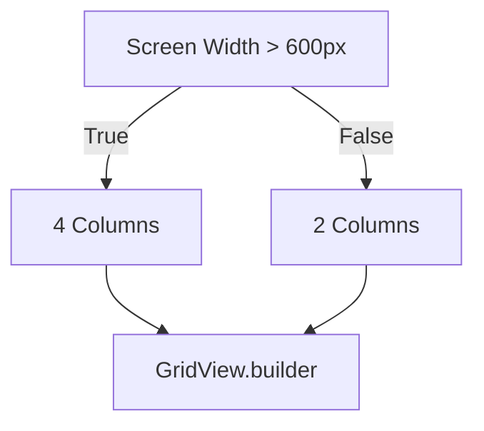

---

linkTitle: "12.2.3 GridView Customizations"
title: "GridView Customizations in Flutter: Creating Responsive and Dynamic Grids"
description: "Explore advanced techniques for customizing GridView in Flutter, including responsive design, dynamic grids, and integrating headers and footers."
categories:
- Flutter Development
- UI Design
- Mobile App Development
tags:
- Flutter
- GridView
- Responsive Design
- UI Customization
- Mobile Development
date: 2024-10-25
type: docs
nav_weight: 12230

---

## 12.2.3 GridView Customizations

In the world of mobile app development, presenting data in a visually appealing and organized manner is crucial. Flutter's `GridView` widget offers a flexible and powerful way to display items in a grid format. This section will delve into advanced customization techniques for `GridView`, enabling you to create responsive, dynamic, and aesthetically pleasing grids tailored to your application's needs.

### Creating Responsive Grids

Responsive design is essential for ensuring that your app looks great on devices of all sizes. Flutter's `GridView` provides several constructors and configurations to help you achieve this.

#### Using `GridView.count`

The `GridView.count` constructor allows you to create a grid with a fixed number of columns. This is useful when you want a consistent grid layout across different screen sizes.

```dart
GridView.count(
  crossAxisCount: 2,
  children: List.generate(items.length, (index) {
    return GridTile(
      child: Image.network(items[index].imageUrl),
    );
  }),
);
```

- **Explanation:** The `crossAxisCount` parameter specifies the number of columns in the grid. In this example, the grid will always have two columns, regardless of the screen size.

#### Using `GridView.extent`

For more flexibility, `GridView.extent` allows you to specify the maximum cross-axis extent for each item. This means the grid will adjust the number of columns based on the available space.

```dart
GridView.extent(
  maxCrossAxisExtent: 150,
  children: List.generate(items.length, (index) {
    return GridTile(
      child: Image.network(items[index].imageUrl),
    );
  }),
);
```

- **Explanation:** The `maxCrossAxisExtent` parameter determines the maximum width of each item. The grid will automatically calculate the number of columns based on the screen width and this extent.

#### Custom Spacing and Aspect Ratios

To achieve precise control over the grid layout, you can use `GridView.builder` with a `SliverGridDelegate`. This approach allows you to define custom spacing and aspect ratios.

```dart
GridView.builder(
  gridDelegate: SliverGridDelegateWithFixedCrossAxisCount(
    crossAxisCount: 3,
    crossAxisSpacing: 4.0,
    mainAxisSpacing: 4.0,
    childAspectRatio: 0.75,
  ),
  itemBuilder: (context, index) {
    return GridTile(
      child: Image.network(items[index].imageUrl),
    );
  },
  itemCount: items.length,
);
```

- **Explanation:** The `SliverGridDelegateWithFixedCrossAxisCount` allows you to specify the number of columns, spacing between items, and the aspect ratio of each item. This provides a high degree of customization for your grid layout.

### Implementing Dynamic Grids

Dynamic grids adapt to changes in screen size and orientation, providing a seamless user experience across devices.

#### Responsive Design

Using `MediaQuery`, you can adjust the number of columns based on the screen width. This ensures that your grid remains responsive and visually appealing.

```dart
int crossAxisCount = MediaQuery.of(context).size.width > 600 ? 4 : 2;
```

- **Explanation:** This code snippet dynamically sets the number of columns based on the screen width. If the width is greater than 600 pixels, the grid will have four columns; otherwise, it will have two.

#### Adaptive Grids with `LayoutBuilder`

`LayoutBuilder` provides a more advanced way to adapt the grid layout dynamically. It allows you to rebuild the grid based on the constraints of the parent widget.

```dart
LayoutBuilder(
  builder: (context, constraints) {
    int crossAxisCount = constraints.maxWidth > 600 ? 4 : 2;
    return GridView.builder(
      gridDelegate: SliverGridDelegateWithFixedCrossAxisCount(
        crossAxisCount: crossAxisCount,
      ),
      itemBuilder: (context, index) {
        return GridTile(
          child: Image.network(items[index].imageUrl),
        );
      },
      itemCount: items.length,
    );
  },
);
```

- **Explanation:** `LayoutBuilder` provides the `constraints` parameter, which contains information about the available space. You can use this to adjust the grid layout dynamically.

### Adding Headers and Footers

Integrating headers and footers into your grid can enhance the user experience by providing context or additional navigation options.

#### Using `SliverGrid`

By combining `GridView` with other slivers in a `CustomScrollView`, you can create complex layouts that include headers, footers, and other scrollable components.

```dart
CustomScrollView(
  slivers: [
    SliverAppBar(title: Text('Gallery')),
    SliverGrid(
      gridDelegate: SliverGridDelegateWithFixedCrossAxisCount(crossAxisCount: 2),
      delegate: SliverChildBuilderDelegate(
        (context, index) {
          return GridTile(child: Image.network(items[index].imageUrl));
        },
        childCount: items.length,
      ),
    ),
  ],
);
```

- **Explanation:** `CustomScrollView` allows you to combine multiple slivers, such as `SliverAppBar` and `SliverGrid`, to create a cohesive scrolling experience. This is particularly useful for creating layouts with headers and footers.

### Visual Aids

To better understand how these grid configurations work, let's visualize the layout changes using diagrams.



- **Diagram Explanation:** This flowchart illustrates how the grid layout adapts based on screen width, using `MediaQuery` to determine the number of columns.

### Best Practices

- **Image Sizing:** Ensure that images and content are properly sized to prevent distortion. Use appropriate aspect ratios and resolutions.
- **Lazy Loading:** Consider lazy loading images to improve performance, especially for large grids with many items.
- **Accessibility:** Ensure that your grid is accessible to all users, including those with disabilities. Use semantic labels and ensure that the grid is navigable via keyboard and screen readers.

### Exercises

- **Exercise 1:** Create a photo gallery app that displays images in a responsive grid. Use `GridView.extent` to ensure that the grid adapts to different screen sizes.
- **Exercise 2:** Implement a product catalog with grid items that show product pictures and prices. Use `SliverGrid` to add a header with the catalog title.

By mastering these `GridView` customization techniques, you'll be well-equipped to create dynamic and responsive grid layouts that enhance the user experience in your Flutter applications. Experiment with different configurations and explore the possibilities to find the best fit for your app's design needs.

## Quiz Time!



### What is the primary purpose of using `GridView.count` in Flutter?

- [x] To create a grid with a fixed number of columns
- [ ] To create a grid with a variable number of columns
- [ ] To create a grid with a fixed item size
- [ ] To create a grid with dynamic spacing

> **Explanation:** `GridView.count` is used to create a grid with a fixed number of columns, specified by the `crossAxisCount` parameter.

### How does `GridView.extent` differ from `GridView.count`?

- [x] `GridView.extent` specifies the maximum cross-axis extent for each item
- [ ] `GridView.extent` specifies the fixed number of columns
- [ ] `GridView.extent` specifies the fixed item size
- [ ] `GridView.extent` specifies dynamic spacing

> **Explanation:** `GridView.extent` allows you to specify the maximum cross-axis extent for each item, which determines the number of columns based on available space.

### What is the role of `SliverGridDelegateWithFixedCrossAxisCount` in a `GridView.builder`?

- [x] It defines the number of columns and spacing between items
- [ ] It defines the maximum cross-axis extent for each item
- [ ] It defines the fixed item size
- [ ] It defines the dynamic spacing

> **Explanation:** `SliverGridDelegateWithFixedCrossAxisCount` is used to specify the number of columns, cross-axis spacing, main-axis spacing, and child aspect ratio for a grid.

### How can you adjust the number of columns in a grid based on screen size?

- [x] Use `MediaQuery` to determine screen width and set `crossAxisCount` accordingly
- [ ] Use `GridView.count` with a fixed number of columns
- [ ] Use `GridView.extent` with a fixed extent
- [ ] Use `SliverGridDelegateWithFixedCrossAxisCount` with a fixed number of columns

> **Explanation:** `MediaQuery` can be used to determine the screen width and adjust the `crossAxisCount` dynamically to create a responsive grid.

### What is the advantage of using `LayoutBuilder` for grid layouts?

- [x] It allows dynamic adaptation of the grid layout based on parent constraints
- [ ] It allows fixed column counts
- [ ] It allows fixed item sizes
- [ ] It allows dynamic spacing

> **Explanation:** `LayoutBuilder` provides the constraints of the parent widget, allowing you to dynamically adapt the grid layout based on available space.

### How can you integrate headers and footers into a grid layout?

- [x] Use `CustomScrollView` with `SliverGrid` and other slivers
- [ ] Use `GridView.count` with a fixed number of columns
- [ ] Use `GridView.extent` with a fixed extent
- [ ] Use `SliverGridDelegateWithFixedCrossAxisCount` with a fixed number of columns

> **Explanation:** `CustomScrollView` allows you to combine multiple slivers, such as `SliverAppBar` and `SliverGrid`, to create layouts with headers and footers.

### What is a best practice for ensuring images in a grid are properly sized?

- [x] Use appropriate aspect ratios and resolutions
- [ ] Use fixed item sizes
- [ ] Use dynamic spacing
- [ ] Use fixed column counts

> **Explanation:** Ensuring images have appropriate aspect ratios and resolutions prevents distortion and maintains visual quality.

### Why is lazy loading important for grid performance?

- [x] It improves performance by loading images only when needed
- [ ] It ensures fixed item sizes
- [ ] It ensures dynamic spacing
- [ ] It ensures fixed column counts

> **Explanation:** Lazy loading improves performance by loading images only when they are needed, reducing memory usage and load times.

### What is the purpose of using `SliverChildBuilderDelegate` in a `SliverGrid`?

- [x] To efficiently build grid items on demand
- [ ] To specify fixed item sizes
- [ ] To specify dynamic spacing
- [ ] To specify fixed column counts

> **Explanation:** `SliverChildBuilderDelegate` efficiently builds grid items on demand, which is useful for grids with a large number of items.

### True or False: `GridView.builder` is always more efficient than `GridView.count`.

- [ ] True
- [x] False

> **Explanation:** `GridView.builder` is more efficient for large grids because it builds items on demand, but `GridView.count` can be more straightforward for smaller, fixed grids.


