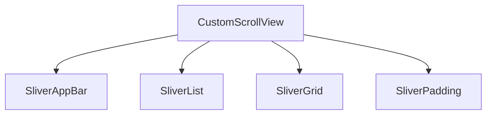

## 12.2.4 Using Slivers for Flexible Lists

In the realm of Flutter development, creating dynamic and flexible user interfaces is a crucial skill. One of the most powerful tools at your disposal for achieving this is the concept of slivers. Slivers allow you to build complex scrollable areas with custom behaviors and effects, enabling you to craft unique and engaging user experiences. This section will delve into the world of slivers, exploring their capabilities and demonstrating how to use them effectively in your Flutter applications.

### Understanding Slivers

#### Introduction

Slivers are a fundamental part of Flutter's scrolling architecture. They are essentially scrollable areas that can change their size and shape based on the scroll position. This flexibility allows developers to create custom scroll effects and layouts that go beyond the capabilities of standard scrolling widgets like `ListView` or `GridView`.

In Flutter, a sliver is a portion of a scrollable area that can be individually controlled and customized. By combining multiple slivers, you can create a `CustomScrollView` that offers a seamless and dynamic scrolling experience.

#### Types of Slivers

Flutter provides several built-in sliver widgets that you can use to construct your scrollable layouts. Here are some of the key sliver widgets:

- **`SliverList`:** This widget is used to create a scrollable list of items. It functions similarly to a `ListView`, but with the added flexibility of being part of a `CustomScrollView`.

- **`SliverGrid`:** Similar to `SliverList`, this widget allows you to create a grid of items that can be scrolled. It provides a way to arrange items in a grid pattern within a sliver.

- **`SliverAppBar`:** A sliver version of the `AppBar` widget, `SliverAppBar` can be used to create app bars that scroll with the content or remain pinned at the top of the screen.

- **`SliverPadding`:** This widget adds padding around other slivers, allowing you to control the spacing and layout of your scrollable content.

### Creating a `CustomScrollView`

#### Implementation

To harness the power of slivers, you need to use a `CustomScrollView`. This widget allows you to combine different slivers into a single scrollable area. Here's a basic example of how to use `CustomScrollView` with a `SliverAppBar` and a `SliverList`:

```dart
CustomScrollView(
  slivers: [
    SliverAppBar(
      floating: true,
      flexibleSpace: FlexibleSpaceBar(
        title: Text('Sliver Example'),
      ),
      expandedHeight: 200,
    ),
    SliverList(
      delegate: SliverChildBuilderDelegate(
        (context, index) => ListTile(title: Text('Item #$index')),
        childCount: 50,
      ),
    ),
  ],
);
```

In this example, the `CustomScrollView` contains a `SliverAppBar` that expands and collapses as you scroll, and a `SliverList` that displays a list of items.

#### Explaining Sliver Constraints

Slivers receive constraints from their parent `CustomScrollView`, which dictate how they should size themselves. These constraints are based on the available space and the scroll position. Understanding these constraints is crucial for designing responsive and adaptive layouts.

Each sliver can decide how much space it wants to occupy based on these constraints, allowing for dynamic and flexible layouts. This capability is what makes slivers so powerful for creating custom scroll effects and layouts.

### Implementing Advanced Scrolling Effects

#### Parallax Scrolling

Parallax scrolling is a popular effect where background elements move at a different speed than foreground elements, creating a sense of depth. In Flutter, you can achieve this effect using `SliverFillViewport` and `SliverPersistentHeader`.

Here's a simple example of creating a parallax effect:

```dart
CustomScrollView(
  slivers: [
    SliverPersistentHeader(
      pinned: true,
      delegate: MySliverAppBarDelegate(
        minHeight: 60.0,
        maxHeight: 200.0,
        child: Container(
          color: Colors.blue,
          child: Center(child: Text('Parallax Header')),
        ),
      ),
    ),
    SliverFillViewport(
      delegate: SliverChildBuilderDelegate(
        (context, index) => Container(
          color: index.isEven ? Colors.white : Colors.grey[300],
          child: Center(child: Text('Item #$index')),
        ),
        childCount: 10,
      ),
    ),
  ],
);
```

In this example, `SliverPersistentHeader` is used to create a header that remains visible while scrolling, and `SliverFillViewport` is used to create a parallax effect with the items.

#### Pinned Headers

Pinned headers are useful for keeping important information visible as the user scrolls through content. You can achieve this using `SliverAppBar` with the `pinned` property set to `true`.

```dart
SliverAppBar(
  pinned: true,
  expandedHeight: 200.0,
  flexibleSpace: FlexibleSpaceBar(
    title: Text('Pinned Header'),
  ),
);
```

This configuration ensures that the header remains visible at the top of the screen, even as the user scrolls through the rest of the content.

### Visual Aids

To better understand the hierarchy and behavior of slivers, let's look at a diagram that illustrates how different slivers can be combined within a `CustomScrollView`.



This diagram shows a `CustomScrollView` containing various slivers, each contributing to the overall scrollable layout.

### Best Practices

- **Use Slivers for Complex Layouts:** Slivers are ideal for creating complex and dynamic scrollable layouts. Use them when you need more control over the scrolling behavior and layout of your content.

- **Be Mindful of Performance:** Custom slivers can be resource-intensive. Ensure that your slivers are optimized for performance, especially when dealing with large datasets or complex layouts.

### Exercises

To reinforce your understanding of slivers, try the following exercises:

- **Exercise 1:** Build a list with a collapsing header using `SliverAppBar`. Experiment with different configurations to see how the header behaves as you scroll.

- **Exercise 2:** Create a custom scrolling effect where images expand and contract as the user scrolls. Use `SliverFillViewport` and `SliverPersistentHeader` to achieve this effect.

By mastering slivers, you can create highly flexible and engaging user interfaces in your Flutter applications. Experiment with different configurations and effects to see what works best for your projects.

## Quiz Time!



### What is a sliver in Flutter?

- [x] A scrollable area that allows for custom scroll effects and flexible layouts.
- [ ] A type of widget that is always pinned at the top of the screen.
- [ ] A method for handling user input in Flutter.
- [ ] A package for managing state in Flutter applications.

> **Explanation:** Slivers are scrollable areas in Flutter that allow for custom scroll effects and flexible layouts, enabling developers to create dynamic and engaging user interfaces.

### Which widget is used to create a scrollable list of items in a sliver?

- [ ] SliverGrid
- [x] SliverList
- [ ] SliverAppBar
- [ ] SliverPadding

> **Explanation:** `SliverList` is used to create a scrollable list of items within a sliver, similar to a `ListView` but with more flexibility.

### How can you achieve a parallax scrolling effect in Flutter?

- [x] By using `SliverFillViewport` and `SliverPersistentHeader`.
- [ ] By using `ListView` and `GridView`.
- [ ] By using `SliverAppBar` with `pinned: true`.
- [ ] By using `SliverPadding` and `SliverGrid`.

> **Explanation:** Parallax scrolling can be achieved using `SliverFillViewport` and `SliverPersistentHeader`, which allow for different scrolling speeds and effects.

### What property of `SliverAppBar` keeps the header visible at the top of the screen?

- [ ] floating
- [ ] flexibleSpace
- [x] pinned
- [ ] expandedHeight

> **Explanation:** The `pinned` property of `SliverAppBar` keeps the header visible at the top of the screen, even as the user scrolls through the content.

### What is the purpose of `SliverPadding`?

- [x] To add padding around other slivers.
- [ ] To create a grid of items within a sliver.
- [ ] To manage state in a Flutter application.
- [ ] To handle user input and gestures.

> **Explanation:** `SliverPadding` is used to add padding around other slivers, allowing for control over the spacing and layout of scrollable content.

### What is a `CustomScrollView` used for?

- [x] To combine different slivers into a single scrollable area.
- [ ] To create a fixed layout with no scrolling.
- [ ] To manage animations in Flutter.
- [ ] To handle network requests and data fetching.

> **Explanation:** `CustomScrollView` is used to combine different slivers into a single scrollable area, allowing for complex and dynamic layouts.

### Which sliver widget is similar to `GridView`?

- [ ] SliverList
- [x] SliverGrid
- [ ] SliverAppBar
- [ ] SliverPadding

> **Explanation:** `SliverGrid` is similar to `GridView`, allowing you to create a grid of items within a sliver.

### What should you be mindful of when using custom slivers?

- [x] Performance, especially with large datasets or complex layouts.
- [ ] The color scheme of the application.
- [ ] The version of Flutter being used.
- [ ] The number of animations in the app.

> **Explanation:** When using custom slivers, it's important to be mindful of performance, particularly with large datasets or complex layouts, to ensure a smooth user experience.

### Which widget can be used to create a header that remains visible while scrolling?

- [ ] SliverList
- [x] SliverPersistentHeader
- [ ] SliverPadding
- [ ] SliverGrid

> **Explanation:** `SliverPersistentHeader` can be used to create a header that remains visible while scrolling, providing a consistent user experience.

### True or False: Slivers can only be used with `ListView` and `GridView`.

- [ ] True
- [x] False

> **Explanation:** False. Slivers are not limited to `ListView` and `GridView`. They can be used with `CustomScrollView` to create a wide range of scrollable layouts and effects.


