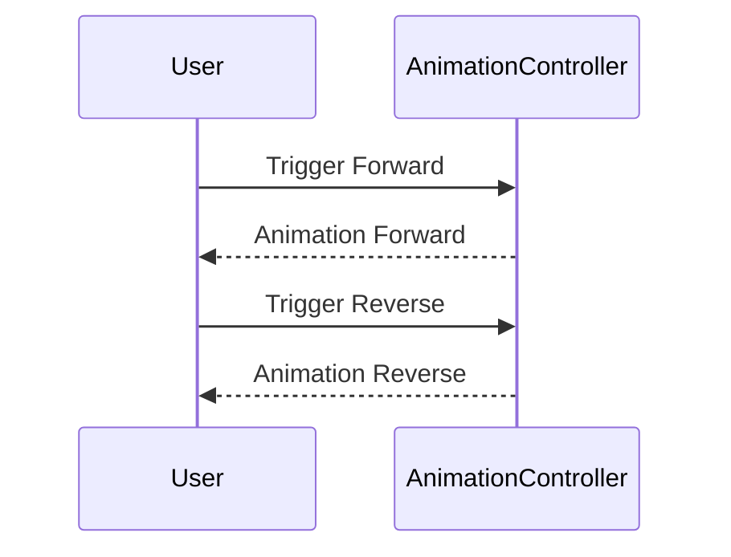

## 12.3.1 Advanced Animation Controllers

Animations are a powerful way to enhance the user experience in mobile applications, providing visual feedback and guiding users through interactions. In Flutter, the `AnimationController` is a fundamental tool for creating complex animations. This section delves into advanced techniques for using animation controllers, including managing multiple animations, synchronizing them, monitoring their status, and implementing reverse logic.

### Controlling Multiple Animations

#### Using Multiple Controllers

In many scenarios, a single animation controller may not suffice, especially when dealing with complex animations that require different timing or sequences. For example, you might want to animate a button's color change while simultaneously moving it across the screen. In such cases, multiple `AnimationController` instances are necessary.

**Scenario:**

Imagine a UI where a button needs to move horizontally while its color changes. These two animations can be controlled separately using two different controllers.

```dart
class MultiAnimationWidget extends StatefulWidget {
  @override
  _MultiAnimationWidgetState createState() => _MultiAnimationWidgetState();
}

class _MultiAnimationWidgetState extends State<MultiAnimationWidget> with TickerProviderStateMixin {
  AnimationController _positionController;
  AnimationController _colorController;
  Animation<Offset> _offsetAnimation;
  Animation<Color> _colorAnimation;

  @override
  void initState() {
    super.initState();
    _positionController = AnimationController(
      duration: const Duration(seconds: 2),
      vsync: this,
    );

    _colorController = AnimationController(
      duration: const Duration(seconds: 2),
      vsync: this,
    );

    _offsetAnimation = Tween<Offset>(
      begin: Offset.zero,
      end: Offset(1.5, 0.0),
    ).animate(CurvedAnimation(
      parent: _positionController,
      curve: Curves.easeInOut,
    ));

    _colorAnimation = ColorTween(
      begin: Colors.blue,
      end: Colors.red,
    ).animate(CurvedAnimation(
      parent: _colorController,
      curve: Curves.easeInOut,
    ));
  }

  @override
  void dispose() {
    _positionController.dispose();
    _colorController.dispose();
    super.dispose();
  }

  @override
  Widget build(BuildContext context) {
    return SlideTransition(
      position: _offsetAnimation,
      child: AnimatedBuilder(
        animation: _colorAnimation,
        builder: (context, child) {
          return Container(
            color: _colorAnimation.value,
            width: 100,
            height: 100,
            child: child,
          );
        },
        child: Center(child: Text('Animate')),
      ),
    );
  }
}
```

**Managing Multiple Controllers:**

- Initialize each `AnimationController` in the `initState` method.
- Dispose of each controller in the `dispose` method to prevent memory leaks.
- Use `AnimatedBuilder` or similar widgets to rebuild parts of the UI when the animation changes.

#### Synchronizing Animations

Sometimes, you need to synchronize multiple animations to create a cohesive effect. This can be achieved by using a single `AnimationController` with multiple `Animation` objects, each having different intervals.

**Example:**

Synchronize a scale and opacity animation using a single controller.

```dart
class SynchronizedAnimationWidget extends StatefulWidget {
  @override
  _SynchronizedAnimationWidgetState createState() => _SynchronizedAnimationWidgetState();
}

class _SynchronizedAnimationWidgetState extends State<SynchronizedAnimationWidget> with SingleTickerProviderStateMixin {
  AnimationController _controller;
  Animation<double> _scaleAnimation;
  Animation<double> _opacityAnimation;

  @override
  void initState() {
    super.initState();
    _controller = AnimationController(
      duration: const Duration(seconds: 3),
      vsync: this,
    );

    _scaleAnimation = Tween<double>(begin: 0.5, end: 1.5).animate(
      CurvedAnimation(
        parent: _controller,
        curve: Interval(0.0, 0.5, curve: Curves.easeIn),
      ),
    );

    _opacityAnimation = Tween<double>(begin: 0.0, end: 1.0).animate(
      CurvedAnimation(
        parent: _controller,
        curve: Interval(0.5, 1.0, curve: Curves.easeOut),
      ),
    );

    _controller.forward();
  }

  @override
  void dispose() {
    _controller.dispose();
    super.dispose();
  }

  @override
  Widget build(BuildContext context) {
    return ScaleTransition(
      scale: _scaleAnimation,
      child: FadeTransition(
        opacity: _opacityAnimation,
        child: Container(
          width: 100,
          height: 100,
          color: Colors.green,
          child: Center(child: Text('Sync')),
        ),
      ),
    );
  }
}
```

**Key Points:**

- Use `Interval` to define when each animation should start and end within the controller's timeline.
- This approach ensures animations are synchronized and follow a specific sequence.

### Animation Status Monitoring

#### Animation Status Listener

Monitoring the status of an animation is crucial for triggering actions at specific points, such as when an animation completes or reverses. The `addStatusListener` method allows you to listen for changes in the animation's status.

**Example:**

```dart
_controller.addStatusListener((status) {
  if (status == AnimationStatus.completed) {
    // Animation completed
    print('Animation completed');
  } else if (status == AnimationStatus.dismissed) {
    // Animation dismissed
    print('Animation dismissed');
  }
});
```

**Practical Use Cases:**

- **Looping Animations:** Restart the animation when it completes.
- **Triggering Events:** Perform actions like navigating to another screen when an animation finishes.

### Reversing Animations

#### Implementing Reverse Logic

Reversing an animation can create a dynamic effect, such as retracting a menu or reversing a transition. This is achieved using the `reverse()` method on the `AnimationController`.

**Example:**

```dart
void _reverseAnimation() {
  _controller.reverse();
}
```

#### Toggling Animations

A common requirement is to toggle an animation between its forward and reverse states. This can be implemented with a simple method.

**Example:**

```dart
void _toggleAnimation() {
  if (_controller.isCompleted) {
    _controller.reverse();
  } else {
    _controller.forward();
  }
}
```

**Visual Aids:**



### Best Practices

- **Dispose of Controllers:** Always dispose of animation controllers in the `dispose` method to prevent memory leaks.
- **Track Controller States:** Keep track of the controller's state to avoid unintended behaviors, especially when toggling animations.

### Exercises

#### Exercise 1: Implement a Sidebar Menu

Create a sidebar menu that slides in and out using an animation controller. Use the `SlideTransition` widget to animate the menu's position.

#### Exercise 2: Create an Animation Sequence

Develop an animation sequence that plays multiple animations in order. Use a single `AnimationController` with different intervals for each animation.

### Conclusion

Advanced animation controllers in Flutter provide the flexibility to create intricate and engaging animations. By mastering the use of multiple controllers, synchronizing animations, monitoring statuses, and implementing reverse logic, you can significantly enhance the interactivity and visual appeal of your applications.

### Further Reading

- [Flutter Animation Documentation](https://flutter.dev/docs/development/ui/animations)
- [AnimationController Class](https://api.flutter.dev/flutter/animation/AnimationController-class.html)
- [CurvedAnimation Class](https://api.flutter.dev/flutter/animation/CurvedAnimation-class.html)

## Quiz Time!



### When is it necessary to use multiple `AnimationController` instances?

- [x] When you need different timing or sequences for animations.
- [ ] When you have a single animation.
- [ ] When you want to use `Tween` animations.
- [ ] When you are using `AnimatedBuilder`.

> **Explanation:** Multiple `AnimationController` instances are necessary when different animations require separate timing or sequences.

### How can you synchronize multiple animations with a single controller?

- [x] By using `Interval` with different `Animation` objects.
- [ ] By using multiple `AnimationController` instances.
- [ ] By using `Tween` animations.
- [ ] By using `AnimatedBuilder`.

> **Explanation:** Synchronization can be achieved by using `Interval` with different `Animation` objects on a single controller.

### What method is used to listen for changes in an animation's status?

- [x] `addStatusListener`
- [ ] `addListener`
- [ ] `removeListener`
- [ ] `dispose`

> **Explanation:** `addStatusListener` is used to listen for changes in an animation's status.

### How do you reverse an animation using `AnimationController`?

- [x] Use the `reverse()` method.
- [ ] Use the `forward()` method.
- [ ] Use the `stop()` method.
- [ ] Use the `reset()` method.

> **Explanation:** The `reverse()` method is used to reverse an animation.

### What is a practical use case for monitoring animation status?

- [x] Looping animations.
- [ ] Creating static widgets.
- [ ] Using `Tween` animations.
- [ ] Using `AnimatedBuilder`.

> **Explanation:** Monitoring animation status is useful for looping animations and triggering events.

### What should you always do with animation controllers to prevent memory leaks?

- [x] Dispose of them in the `dispose` method.
- [ ] Initialize them in the `initState` method.
- [ ] Use them in `build` method.
- [ ] Use `Tween` animations.

> **Explanation:** Always dispose of animation controllers in the `dispose` method to prevent memory leaks.

### How can you toggle an animation between forward and reverse states?

- [x] By checking if the controller is completed and then calling `reverse()` or `forward()`.
- [ ] By using `Tween` animations.
- [ ] By using `AnimatedBuilder`.
- [ ] By using `Interval`.

> **Explanation:** Toggling is done by checking if the controller is completed and then calling `reverse()` or `forward()`.

### What is the purpose of using `Interval` in animations?

- [x] To define when each animation should start and end within the controller's timeline.
- [ ] To create static widgets.
- [ ] To use `Tween` animations.
- [ ] To use `AnimatedBuilder`.

> **Explanation:** `Interval` is used to define when each animation should start and end within the controller's timeline.

### Which widget is used to rebuild parts of the UI when the animation changes?

- [x] `AnimatedBuilder`
- [ ] `Tween`
- [ ] `Interval`
- [ ] `AnimationController`

> **Explanation:** `AnimatedBuilder` is used to rebuild parts of the UI when the animation changes.

### True or False: You should always use multiple controllers for every animation.

- [ ] True
- [x] False

> **Explanation:** False. Multiple controllers are only necessary when different animations require separate timing or sequences.


