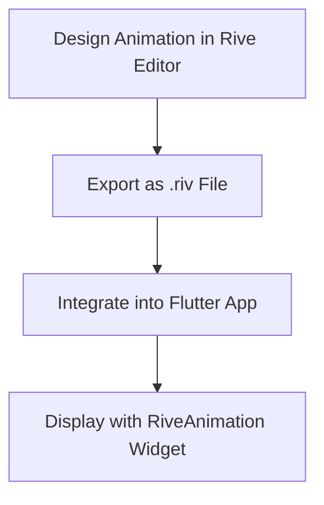

## 12.3.2 Using Animation Libraries

In the world of mobile app development, animations play a crucial role in enhancing user experience by providing visual feedback and making interactions more engaging. Flutter, with its rich set of built-in animation capabilities, allows developers to create complex animations. However, when it comes to crafting intricate animations with ease, third-party animation libraries like `rive`, `flare_flutter`, and `animated_text_kit` come into play. These libraries offer prebuilt animations and tools that simplify the process, allowing developers to focus more on creativity and less on the technical intricacies.

### Introducing Animation Libraries

Animation libraries in Flutter are designed to extend the framework's capabilities, providing developers with tools to create sophisticated animations without delving into complex code. Let's explore some popular animation libraries and their benefits.

#### Popular Libraries

- **Rive**: Formerly known as Flare, Rive is a powerful tool for creating vector animations. It allows designers and developers to collaborate seamlessly, offering a real-time animation editor that integrates directly with Flutter.
- **Flare_Flutter**: Although Rive has largely replaced Flare, Flare_Flutter is still used for integrating Flare animations into Flutter apps. It provides a simple API for rendering animations created in the Flare editor.
- **Animated Text Kit**: This library provides a collection of prebuilt text animations, making it easy to add dynamic text effects to your Flutter applications.

#### Benefits

- **Simplification of Complex Animations**: These libraries abstract the complexity involved in creating animations, offering intuitive interfaces and prebuilt effects.
- **Prebuilt Effects**: Developers can leverage a wide range of prebuilt animations, reducing development time and effort.
- **Enhanced Collaboration**: Tools like Rive facilitate collaboration between designers and developers, allowing animations to be created and modified in real-time.

### Using `rive` for Vector Animations

Rive is a versatile tool that combines design and animation into a single workflow. It allows you to create interactive animations that can be easily integrated into your Flutter applications.

#### Setup

To get started with Rive in your Flutter project, you need to add the `rive` package to your `pubspec.yaml` file:

```yaml
dependencies:
  rive: ^0.7.0
```

After adding the dependency, run `flutter pub get` to install the package.

#### Creating Animations

Rive provides a powerful editor where you can design and animate vector graphics. The editor allows you to create animations with keyframes, bones, and state machines, offering a high degree of control over the animation process.

- **Keyframes**: Define the start and end points of your animations.
- **Bones**: Use bones to create skeletal animations, allowing for more natural movements.
- **State Machines**: Create interactive animations that respond to user inputs or other events.

Once your animation is ready, export it as a `.riv` file, which can be used in your Flutter app.

#### Implementing in Flutter

Integrating Rive animations into your Flutter app is straightforward. Here's a simple example of how to display a Rive animation:

```dart
import 'package:flutter/material.dart';
import 'package:rive/rive.dart';

class RiveAnimationExample extends StatelessWidget {
  @override
  Widget build(BuildContext context) {
    return Scaffold(
      appBar: AppBar(
        title: Text('Rive Animation Example'),
      ),
      body: Center(
        child: RiveAnimation.asset(
          'assets/animation.riv',
          fit: BoxFit.cover,
        ),
      ),
    );
  }
}
```

In this example, the `RiveAnimation.asset` widget is used to load and display the animation. The `fit` property is set to `BoxFit.cover` to ensure the animation scales appropriately within its container.

### Using `animated_text_kit`

The `animated_text_kit` library is perfect for adding animated text effects to your Flutter applications. It offers a variety of text animations, such as typing, fading, and rotating effects.

#### Examples

Here's how you can implement a simple typing animation using `animated_text_kit`:

```dart
import 'package:flutter/material.dart';
import 'package:animated_text_kit/animated_text_kit.dart';

class AnimatedTextExample extends StatelessWidget {
  @override
  Widget build(BuildContext context) {
    return Scaffold(
      appBar: AppBar(
        title: Text('Animated Text Kit Example'),
      ),
      body: Center(
        child: TyperAnimatedTextKit(
          text: ['Hello World', 'Welcome to Flutter'],
          textStyle: TextStyle(fontSize: 32.0, fontWeight: FontWeight.bold),
          speed: Duration(milliseconds: 100),
        ),
      ),
    );
  }
}
```

In this example, `TyperAnimatedTextKit` is used to create a typing effect. The `text` property specifies the strings to animate, while `textStyle` and `speed` control the appearance and speed of the animation.

### Best Practices

When using third-party animation libraries, consider the following best practices:

- **Maintenance and Compatibility**: Ensure that the libraries you choose are actively maintained and compatible with the current version of Flutter. This helps avoid potential issues with deprecated or unsupported features.
- **Performance Considerations**: Be mindful of the performance implications of complex animations. Test your app on various devices to ensure smooth performance.
- **Code Readability**: Keep your code organized and well-documented, especially when integrating multiple animations. This makes it easier to maintain and update your app in the future.

### Visual Aids

To better understand the impact of these animation libraries, let's look at some visual examples:



This diagram illustrates the workflow of creating and integrating a Rive animation into a Flutter application.

### Exercises

To reinforce your understanding of using animation libraries in Flutter, try the following exercises:

- **Exercise 1**: Integrate a Rive animation into your app's splash screen. Use the Rive editor to create a simple logo animation and display it when the app launches.
- **Exercise 2**: Add an animated typing effect to a welcome message using `animated_text_kit`. Experiment with different text styles and speeds to create a unique effect.

### Conclusion

Animation libraries like Rive and Animated Text Kit provide powerful tools for creating dynamic and engaging user interfaces in Flutter. By leveraging these libraries, you can enhance your app's visual appeal and improve user experience. Remember to follow best practices and consider performance implications when integrating animations into your projects.

For further exploration, consider checking out the official documentation for [Rive](https://rive.app/docs/getting-started/flutter/) and [Animated Text Kit](https://pub.dev/packages/animated_text_kit). These resources offer additional insights and examples to help you master animation in Flutter.

## Quiz Time!



### Which of the following is a popular animation library for Flutter?

- [x] Rive
- [ ] Lottie
- [ ] React Native Animations
- [ ] Angular Animations

> **Explanation:** Rive is a popular animation library for Flutter, known for its powerful vector animation capabilities.

### What is the primary benefit of using animation libraries like Rive and Animated Text Kit?

- [x] Simplification of complex animations
- [ ] Increased app size
- [ ] Slower performance
- [ ] Limited animation options

> **Explanation:** Animation libraries simplify the creation of complex animations by providing prebuilt effects and intuitive interfaces.

### How do you add the Rive package to your Flutter project?

- [x] Add `rive: ^0.7.0` to `pubspec.yaml`
- [ ] Install via npm
- [ ] Use the Flutter CLI
- [ ] Download from GitHub

> **Explanation:** To use Rive in your Flutter project, you need to add it as a dependency in your `pubspec.yaml` file.

### What is the purpose of the `RiveAnimation.asset` widget?

- [x] To display Rive animations in a Flutter app
- [ ] To create animations from scratch
- [ ] To edit animations in the app
- [ ] To convert animations to GIFs

> **Explanation:** The `RiveAnimation.asset` widget is used to load and display Rive animations in a Flutter application.

### Which property of `TyperAnimatedTextKit` controls the speed of the typing animation?

- [x] `speed`
- [ ] `duration`
- [ ] `interval`
- [ ] `delay`

> **Explanation:** The `speed` property of `TyperAnimatedTextKit` controls how fast the typing animation occurs.

### What should you consider when using third-party animation libraries?

- [x] Maintenance and compatibility
- [ ] Only the visual effects
- [ ] The number of animations
- [ ] The color scheme

> **Explanation:** It's important to ensure that third-party libraries are well-maintained and compatible with the current version of Flutter.

### Which of the following is a best practice when integrating animations?

- [x] Test on various devices for performance
- [ ] Use as many animations as possible
- [ ] Ignore library updates
- [ ] Focus only on desktop performance

> **Explanation:** Testing on various devices ensures that animations perform smoothly across different hardware configurations.

### What is the role of the Rive editor?

- [x] To create and edit vector animations
- [ ] To compile Flutter apps
- [ ] To manage app state
- [ ] To debug animations

> **Explanation:** The Rive editor is used to design and animate vector graphics, which can then be integrated into Flutter apps.

### Which animation library is known for providing animated text effects?

- [x] Animated Text Kit
- [ ] Rive
- [ ] Flare_Flutter
- [ ] Lottie

> **Explanation:** Animated Text Kit is a library specifically designed for adding animated text effects to Flutter applications.

### True or False: Rive animations can only be used for splash screens.

- [ ] True
- [x] False

> **Explanation:** Rive animations can be used in various parts of an app, not just splash screens. They are versatile and can enhance different UI elements.


