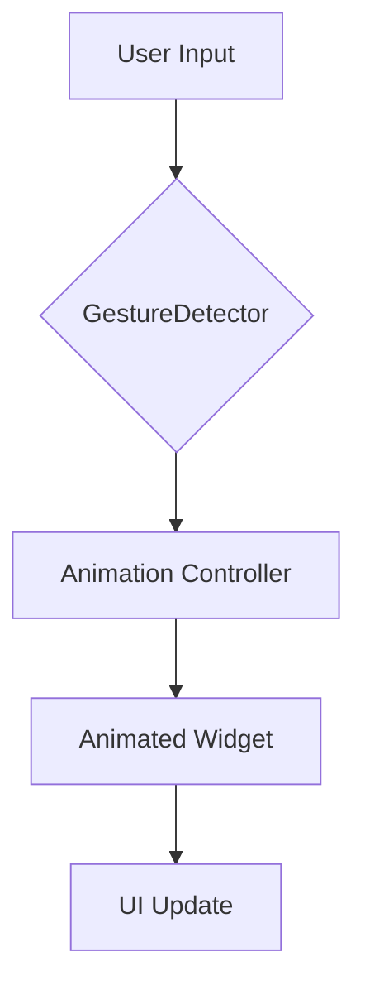

---

linkTitle: "12.3.3 Creating Interactive Animations"
title: "Creating Interactive Animations in Flutter: Linking User Input with Dynamic Motion"
description: "Explore how to create interactive animations in Flutter by linking user input with dynamic motion. Learn about gesture-based animations, scroll-based animations, custom sliders, and best practices for enhancing user experience."
categories:
- Flutter Development
- Mobile App Development
- User Interface Design
tags:
- Flutter
- Animations
- Interactive UI
- GestureDetector
- ScrollController
date: 2024-10-25
type: docs
nav_weight: 12330

---

## 12.3.3 Creating Interactive Animations

Creating interactive animations in Flutter involves linking user input with dynamic motion to enhance user experience and engagement. This section will guide you through the process of implementing gesture-based animations, animating based on scroll position, and creating custom sliders and controls. By the end of this section, you'll be equipped with the knowledge to create fluid, responsive animations that react to user interactions.

### Linking Animations to User Input

Interactive animations are a powerful way to make your app feel more alive and responsive. By linking animations to user input, you can create a more engaging and intuitive user experience.

#### Gesture-based Animations

One of the most common ways to trigger animations is through user gestures. Flutter provides the `GestureDetector` widget, which allows you to detect various gestures and respond to them with animations.

##### Using `GestureDetector` to Trigger Animations

The `GestureDetector` widget can detect gestures such as taps, drags, and swipes. By using this widget, you can trigger animations based on user interactions. Here's an example of how to use `GestureDetector` to create a simple drag animation:

```dart
import 'package:flutter/material.dart';

class GestureAnimationExample extends StatefulWidget {
  @override
  _GestureAnimationExampleState createState() => _GestureAnimationExampleState();
}

class _GestureAnimationExampleState extends State<GestureAnimationExample> with SingleTickerProviderStateMixin {
  late AnimationController _controller;
  final double maxOffset = 200.0;

  @override
  void initState() {
    super.initState();
    _controller = AnimationController(
      vsync: this,
      duration: Duration(seconds: 1),
    );
  }

  @override
  void dispose() {
    _controller.dispose();
    super.dispose();
  }

  @override
  Widget build(BuildContext context) {
    double screenWidth = MediaQuery.of(context).size.width;

    return Scaffold(
      appBar: AppBar(title: Text('Gesture Animation')),
      body: Center(
        child: GestureDetector(
          onPanUpdate: (details) {
            setState(() {
              _controller.value += details.delta.dx / screenWidth;
            });
          },
          child: AnimatedBuilder(
            animation: _controller,
            builder: (context, child) {
              return Transform.translate(
                offset: Offset(_controller.value * maxOffset, 0),
                child: child,
              );
            },
            child: Container(
              width: 100,
              height: 100,
              color: Colors.blue,
            ),
          ),
        ),
      ),
    );
  }
}
```

In this example, the `GestureDetector` listens for horizontal drag updates (`onPanUpdate`) and adjusts the animation controller's value based on the drag distance. The `AnimatedBuilder` widget rebuilds the UI whenever the animation's value changes, moving the widget horizontally.

##### Animation Controllers with Widgets

For more complex interactions, such as drag-and-drop animations, you can use the `Draggable` and `DragTarget` widgets. These widgets allow you to create interactive drag-and-drop interfaces with animations.

Here's a simple example of using `Draggable` and `DragTarget`:

```dart
import 'package:flutter/material.dart';

class DragDropExample extends StatelessWidget {
  @override
  Widget build(BuildContext context) {
    return Scaffold(
      appBar: AppBar(title: Text('Drag and Drop')),
      body: Center(
        child: Column(
          mainAxisAlignment: MainAxisAlignment.center,
          children: <Widget>[
            Draggable<Color>(
              data: Colors.blue,
              child: Container(
                width: 100,
                height: 100,
                color: Colors.blue,
              ),
              feedback: Container(
                width: 100,
                height: 100,
                color: Colors.blue.withOpacity(0.5),
              ),
              childWhenDragging: Container(
                width: 100,
                height: 100,
                color: Colors.grey,
              ),
            ),
            SizedBox(height: 20),
            DragTarget<Color>(
              onAccept: (color) {
                // Handle the accepted data
              },
              builder: (context, candidateData, rejectedData) {
                return Container(
                  width: 100,
                  height: 100,
                  color: candidateData.isEmpty ? Colors.red : Colors.green,
                );
              },
            ),
          ],
        ),
      ),
    );
  }
}
```

In this example, the `Draggable` widget allows a user to drag a colored box, and the `DragTarget` widget changes color when a draggable item is hovered over it, providing visual feedback.

### Animating Based on Scroll Position

Another way to create interactive animations is by responding to scroll events. This technique is particularly useful for creating parallax effects and animating elements as the user scrolls through a list or page.

#### Using `ScrollController`

To animate widgets based on scroll position, you can use a `ScrollController`. This controller provides information about the current scroll position, which you can use to trigger animations.

Here's an example of how to use `ScrollController` to animate a widget's opacity based on scroll position:

```dart
import 'package:flutter/material.dart';

class ScrollAnimationExample extends StatefulWidget {
  @override
  _ScrollAnimationExampleState createState() => _ScrollAnimationExampleState();
}

class _ScrollAnimationExampleState extends State<ScrollAnimationExample> {
  final ScrollController _scrollController = ScrollController();
  double _opacity = 1.0;

  @override
  void initState() {
    super.initState();
    _scrollController.addListener(() {
      setState(() {
        _opacity = 1 - (_scrollController.offset / 200);
        if (_opacity < 0) _opacity = 0;
      });
    });
  }

  @override
  Widget build(BuildContext context) {
    return Scaffold(
      appBar: AppBar(title: Text('Scroll Animation')),
      body: ListView.builder(
        controller: _scrollController,
        itemCount: 50,
        itemBuilder: (context, index) {
          return Opacity(
            opacity: _opacity,
            child: ListTile(
              title: Text('Item $index'),
            ),
          );
        },
      ),
    );
  }
}
```

In this example, the opacity of the list items decreases as the user scrolls down. The `ScrollController` listens for scroll events and updates the opacity based on the scroll offset.

### Implementing Custom Sliders and Controls

Custom sliders and controls can provide a unique way for users to interact with your app. By animating changes in other widgets based on slider input, you can create dynamic and engaging user interfaces.

#### Creating Interactive Sliders

Let's create a custom slider that adjusts the brightness of an overlay. This example demonstrates how to link a slider's value to an animation:

```dart
import 'package:flutter/material.dart';

class BrightnessSliderExample extends StatefulWidget {
  @override
  _BrightnessSliderExampleState createState() => _BrightnessSliderExampleState();
}

class _BrightnessSliderExampleState extends State<BrightnessSliderExample> {
  double _brightness = 0.5;

  @override
  Widget build(BuildContext context) {
    return Scaffold(
      appBar: AppBar(title: Text('Brightness Slider')),
      body: Stack(
        children: <Widget>[
          Image.network(
            'https://example.com/your-image.jpg',
            fit: BoxFit.cover,
            width: double.infinity,
            height: double.infinity,
          ),
          Opacity(
            opacity: _brightness,
            child: Container(
              color: Colors.black,
            ),
          ),
          Positioned(
            bottom: 50,
            left: 20,
            right: 20,
            child: Slider(
              value: _brightness,
              onChanged: (value) {
                setState(() {
                  _brightness = value;
                });
              },
              min: 0.0,
              max: 1.0,
            ),
          ),
        ],
      ),
    );
  }
}
```

In this example, a slider is used to adjust the opacity of a black overlay on top of an image, simulating a brightness control. As the slider is moved, the opacity changes, providing immediate visual feedback.

### Visual Aids

To better understand how user input affects animations, let's visualize the process using a diagram. The following Mermaid.js diagram illustrates the flow of user input through gesture detection to animation updates:



In this diagram:
- **User Input** is captured by the `GestureDetector`.
- The `GestureDetector` updates the **Animation Controller** based on the input.
- The **Animated Widget** listens to the controller and updates its state.
- Finally, the **UI Update** reflects the changes on the screen.

### Best Practices

When creating interactive animations, consider the following best practices to enhance user experience:

- **Provide Immediate Feedback:** Ensure that animations respond instantly to user input to create a seamless experience.
- **Keep Interactions Intuitive:** Design animations that are easy to understand and use, avoiding complex gestures that might confuse users.
- **Ensure Accessibility:** Make sure that animations are accessible to all users, including those with disabilities. Consider providing alternative ways to interact with your app.

### Exercises

To reinforce your understanding of interactive animations, try the following exercises:

- **Exercise 1:** Create an interactive rating widget where stars fill up as the user slides a finger across the screen. Use `GestureDetector` to detect the sliding motion and animate the stars.
- **Exercise 2:** Implement a parallax scrolling effect on a background image. Use a `ScrollController` to adjust the position of the background image based on the scroll offset.

### Conclusion

Interactive animations can significantly enhance the user experience by making your app more engaging and responsive. By linking animations to user input, you can create dynamic interfaces that respond to gestures, scroll events, and custom controls. Remember to follow best practices to ensure that your animations are intuitive and accessible to all users.

For further exploration, consider diving into the official Flutter documentation on animations and gestures, or explore open-source projects that showcase advanced animation techniques.

## Quiz Time!



### What widget is commonly used to detect user gestures in Flutter?

- [x] GestureDetector
- [ ] GestureListener
- [ ] TouchHandler
- [ ] InputDetector

> **Explanation:** The `GestureDetector` widget is used in Flutter to detect various user gestures such as taps, drags, and swipes.

### Which widget can be used to create drag-and-drop interfaces in Flutter?

- [x] Draggable
- [ ] DragWidget
- [ ] DropHandler
- [ ] DragListener

> **Explanation:** The `Draggable` widget is used to create drag-and-drop interfaces in Flutter, allowing users to drag items across the screen.

### How can you animate a widget based on scroll position?

- [x] Use a ScrollController to listen for scroll events and update the widget's properties.
- [ ] Use a GestureDetector to detect scroll gestures.
- [ ] Use a Timer to periodically update the widget's properties.
- [ ] Use a Stream to listen for scroll events.

> **Explanation:** A `ScrollController` can be used to listen for scroll events and update a widget's properties based on the scroll position.

### What is the purpose of the AnimatedBuilder widget?

- [x] To rebuild a widget tree whenever an animation changes.
- [ ] To detect user gestures and trigger animations.
- [ ] To manage the state of animations.
- [ ] To create custom animations without controllers.

> **Explanation:** The `AnimatedBuilder` widget is used to rebuild a widget tree whenever an animation changes, allowing for efficient updates.

### What is a best practice when designing interactive animations?

- [x] Provide immediate feedback to user input.
- [ ] Use complex gestures to trigger animations.
- [ ] Avoid animations for accessibility reasons.
- [ ] Use animations sparingly to conserve resources.

> **Explanation:** Providing immediate feedback to user input is a best practice when designing interactive animations, as it enhances the user experience.

### Which widget is used to create a custom slider in Flutter?

- [x] Slider
- [ ] RangeSlider
- [ ] ProgressBar
- [ ] ScrollBar

> **Explanation:** The `Slider` widget is used to create custom sliders in Flutter, allowing users to select a value from a range.

### How can you ensure that animations are accessible to all users?

- [x] Provide alternative ways to interact with the app.
- [ ] Use only visual cues for animations.
- [ ] Avoid using animations altogether.
- [ ] Use complex gestures for animations.

> **Explanation:** Providing alternative ways to interact with the app ensures that animations are accessible to all users, including those with disabilities.

### What is a common use case for linking animations to scroll position?

- [x] Creating parallax scrolling effects.
- [ ] Detecting user taps.
- [ ] Managing app state.
- [ ] Handling network requests.

> **Explanation:** Linking animations to scroll position is commonly used to create parallax scrolling effects, where background elements move at different speeds.

### Which widget allows you to animate the position of a widget within a layout?

- [x] AnimatedPositioned
- [ ] Positioned
- [ ] AnimatedContainer
- [ ] Transform

> **Explanation:** The `AnimatedPositioned` widget allows you to animate the position of a widget within a layout, providing smooth transitions.

### True or False: The GestureDetector widget can only detect tap gestures.

- [ ] True
- [x] False

> **Explanation:** False. The `GestureDetector` widget can detect a variety of gestures, including taps, drags, swipes, and more.


