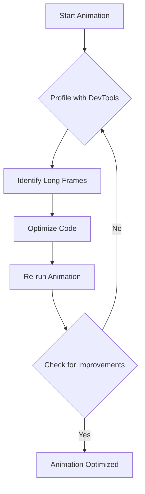
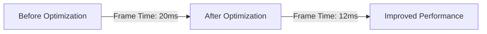

---

linkTitle: "12.3.4 Performance Optimization for Animations"
title: "Performance Optimization for Animations in Flutter"
description: "Learn how to optimize animations in Flutter to avoid jank, enhance performance, and ensure smooth user experiences."
categories:
- Flutter Development
- Mobile App Optimization
- UI/UX Design
tags:
- Flutter
- Animations
- Performance Optimization
- Mobile Development
- UI Design
date: 2024-10-25
type: docs
nav_weight: 1234000
---

## 12.3.4 Performance Optimization for Animations

Animations are a powerful tool in Flutter that can significantly enhance the user experience by making interactions feel smooth and engaging. However, poorly optimized animations can lead to jank, which detracts from the overall quality of your app. In this section, we will explore strategies to optimize animations in Flutter, ensuring they run smoothly across all devices.

### Avoiding Jank in Animations

#### Understanding Jank

Jank refers to the stuttering or lag that occurs when animations do not run smoothly. This can happen when the frame rate drops below the target of 60 frames per second (fps), causing noticeable pauses or skips in the animation. Jank is often caused by heavy computations or inefficient rendering during the animation lifecycle.

#### Profiling Animations

To effectively optimize animations, it's crucial to identify where the performance bottlenecks are occurring. Flutter DevTools provides a performance tab that allows you to profile your animations and identify frame rendering issues.

- **Using Flutter DevTools:**
  - Open your Flutter project and run it in debug mode.
  - Launch Flutter DevTools and navigate to the Performance tab.
  - Start recording a session and interact with your app to trigger animations.
  - Analyze the frame rendering timeline to identify frames that take longer than 16ms to render.



### Optimizing Animation Code

#### Limiting Rebuilds

One of the key strategies for optimizing animations is to limit unnecessary widget rebuilds. The `AnimatedBuilder` widget is particularly useful for this purpose. By passing a `child` to `AnimatedBuilder`, you can ensure that only the parts of the widget tree that need to change are rebuilt.

- **Using `AnimatedBuilder`:**

```dart
class MyAnimatedWidget extends StatelessWidget {
  final Animation<double> animation;
  final Widget child;

  MyAnimatedWidget({required this.animation, required this.child});

  @override
  Widget build(BuildContext context) {
    return AnimatedBuilder(
      animation: animation,
      builder: (context, child) {
        return Transform.scale(
          scale: animation.value,
          child: child,
        );
      },
      child: child, // Pass the child here to avoid rebuilding it
    );
  }
}
```

#### Efficient Rendering

Avoid performing complex computations or heavy widget builds during animations. Instead, pre-compute values where possible and keep the animation logic lightweight.

- **Example: Pre-computing Values**

```dart
// Instead of computing inside the animation
double computeHeavyValue(double input) {
  // Complex computation
  return input * 2; // Simplified example
}

// Pre-compute and store the result
final preComputedValue = computeHeavyValue(initialValue);
```

### Using Hardware Acceleration

#### Transform Widgets

Flutter's `Transform` widgets leverage the GPU, making them efficient for animations that involve scaling, rotating, or translating widgets. This can offload work from the CPU, reducing jank.

- **Example: Using `Transform`**

```dart
Transform.rotate(
  angle: animation.value,
  child: MyWidget(),
);
```

#### Avoiding Opacity Animations on Large Widgets

Animating the `Opacity` of large or complex widgets can be expensive because it requires the widget to be composited offscreen. Instead, consider using `FadeTransition`, which is more efficient.

- **Example: Using `FadeTransition`**

```dart
FadeTransition(
  opacity: animation,
  child: MyWidget(),
);
```

### Reducing Widget Layering

#### Minimize Overdraw

Overdraw occurs when multiple widgets are layered on top of each other, requiring the GPU to render them multiple times. To minimize overdraw, limit the number of overlapping widgets and use `ClipRect` or `ClipPath` judiciously.

- **Example: Reducing Overdraw**

```dart
Stack(
  children: [
    Positioned.fill(
      child: Container(color: Colors.blue),
    ),
    Positioned.fill(
      child: Opacity(
        opacity: 0.5,
        child: Container(color: Colors.red),
      ),
    ),
  ],
);
```

### Best Practices

- **Keep Animation Durations Appropriate:** Animations that are too long can feel sluggish, while those that are too short may appear abrupt. Aim for a balance that feels natural.
- **Test on Lower-End Devices:** Always test your animations on devices with lower specifications to ensure they perform well across all hardware.

### Visual Aids

Below is a chart from Flutter DevTools showing frame times before and after optimization. Notice the reduction in frame rendering time after applying the optimization techniques discussed.



### Exercises

#### Exercise 1: Profile an Animation-Heavy Screen

1. Select a screen in your app with heavy animations.
2. Use Flutter DevTools to profile the animations and identify performance bottlenecks.
3. Apply the optimization techniques discussed and re-profile to measure improvements.

#### Exercise 2: Refactor an Animation to Use `AnimatedBuilder`

1. Identify an animation in your app that rebuilds unnecessary widgets.
2. Refactor the animation to use `AnimatedBuilder` and pass a `child` to limit rebuilds.
3. Test the animation to ensure it performs efficiently.

### Conclusion

Optimizing animations in Flutter is crucial for delivering a smooth and engaging user experience. By understanding the causes of jank and applying the techniques outlined in this section, you can ensure that your animations run efficiently across all devices. Remember to profile your animations regularly and test on a variety of hardware to maintain optimal performance.

For further reading, consider exploring the following resources:
- [Flutter Performance Best Practices](https://flutter.dev/docs/perf)
- [Flutter DevTools Documentation](https://flutter.dev/docs/development/tools/devtools/overview)
- [Animations in Flutter](https://flutter.dev/docs/development/ui/animations)

## Quiz Time!



### What is jank in animations?

- [x] Stuttering or lag in animations
- [ ] Smooth transitions between frames
- [ ] High frame rate rendering
- [ ] Efficient use of GPU resources

> **Explanation:** Jank refers to the stuttering or lag that occurs when animations do not run smoothly, often due to frame rate drops.

### Which tool can be used to profile animations in Flutter?

- [x] Flutter DevTools
- [ ] Android Studio
- [ ] Xcode
- [ ] Visual Studio Code

> **Explanation:** Flutter DevTools provides a performance tab that allows you to profile animations and identify frame rendering issues.

### How can you limit unnecessary widget rebuilds during animations?

- [x] Use `AnimatedBuilder` and pass a `child`
- [ ] Use `StatefulWidget` for all animations
- [ ] Avoid using any animation widgets
- [ ] Use `StatelessWidget` for animations

> **Explanation:** `AnimatedBuilder` allows you to pass a `child` that does not rebuild, limiting unnecessary widget rebuilds.

### What is a recommended alternative to animating `Opacity` on large widgets?

- [x] Use `FadeTransition`
- [ ] Use `ScaleTransition`
- [ ] Use `SlideTransition`
- [ ] Use `RotationTransition`

> **Explanation:** `FadeTransition` is more efficient than animating `Opacity` directly, especially for large or complex widgets.

### Which widget leverages the GPU for efficient animations?

- [x] `Transform`
- [ ] `Container`
- [ ] `Column`
- [ ] `Row`

> **Explanation:** `Transform` widgets leverage the GPU, making them efficient for animations involving scaling, rotating, or translating.

### What is overdraw in the context of animations?

- [x] Rendering multiple overlapping widgets
- [ ] Drawing widgets outside the screen bounds
- [ ] Using too many colors in a widget
- [ ] Animating widgets too quickly

> **Explanation:** Overdraw occurs when multiple widgets are layered on top of each other, requiring the GPU to render them multiple times.

### Why is it important to test animations on lower-end devices?

- [x] To ensure performance across all hardware
- [ ] To reduce the app's file size
- [ ] To increase the app's download speed
- [ ] To improve the app's security

> **Explanation:** Testing on lower-end devices ensures that animations perform well across all hardware, not just high-end devices.

### What is the target frame rate for smooth animations in Flutter?

- [x] 60 frames per second
- [ ] 30 frames per second
- [ ] 120 frames per second
- [ ] 24 frames per second

> **Explanation:** The target frame rate for smooth animations in Flutter is 60 frames per second.

### Which of the following is a best practice for animation durations?

- [x] Keep durations appropriate to avoid sluggishness
- [ ] Always use the shortest duration possible
- [ ] Use the longest duration for dramatic effect
- [ ] Avoid setting durations altogether

> **Explanation:** Keeping animation durations appropriate ensures they feel natural and not sluggish or abrupt.

### True or False: `AnimatedBuilder` can help optimize animations by reducing unnecessary rebuilds.

- [x] True
- [ ] False

> **Explanation:** `AnimatedBuilder` helps optimize animations by allowing you to pass a `child` that does not rebuild, reducing unnecessary rebuilds.


