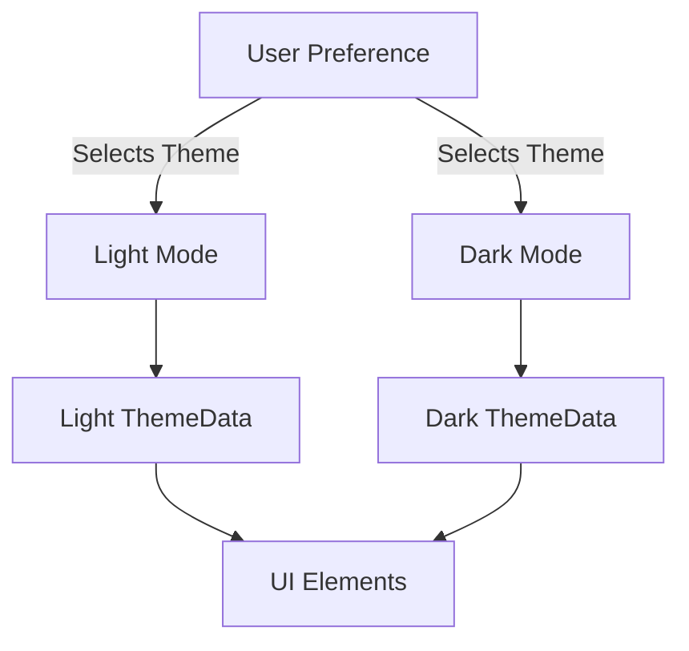

## 12.4.2 Dark and Light Modes

In today's digital landscape, providing users with the option to switch between dark and light modes is not just a trend but a necessity. This feature enhances user experience by allowing them to choose a theme that suits their preferences or environmental lighting conditions. In this section, we will delve into the implementation of dark and light modes in Flutter applications, covering everything from detecting system themes to defining custom themes and best practices for UI design.

### Implementing Theme Switching

Flutter makes it relatively straightforward to implement theme switching, thanks to its robust theming capabilities. Let's explore how to detect system themes and use `ThemeMode` to switch between dark and light modes.

#### Detecting System Theme

To provide a seamless user experience, it's essential to detect the system's current theme setting. This can be achieved using `MediaQuery` to access the platform's brightness setting. Here's how you can do it:

```dart
Brightness brightness = MediaQuery.of(context).platformBrightness;
```

This line of code retrieves the current brightness setting of the device, which can be either `Brightness.light` or `Brightness.dark`. By detecting the system theme, you can automatically adjust your app's theme to match the user's preference.

#### Using `ThemeMode`

Flutter's `MaterialApp` widget provides a `themeMode` property that allows you to specify which theme to use. You can set it to `ThemeMode.system`, `ThemeMode.light`, or `ThemeMode.dark`. Here's an example of how to configure `MaterialApp` to support theme switching:

```dart
MaterialApp(
  themeMode: ThemeMode.system, // Automatically switches based on system settings
  theme: lightThemeData,
  darkTheme: darkThemeData,
  home: HomePage(),
);
```

In this setup, `ThemeMode.system` ensures that the app's theme aligns with the system's current theme setting. You can also allow users to manually toggle between themes by providing a UI control, such as a switch or button.

### Defining Dark and Light Themes

To effectively implement theme switching, you need to define separate `ThemeData` instances for both dark and light themes. This involves specifying colors, typography, and other UI elements that differ between the two modes.

#### Creating ThemeData for Both Modes

Flutter's `ThemeData` class provides a comprehensive way to define the look and feel of your app. You can create custom themes by extending the default light and dark themes. Here's an example:

```dart
final ThemeData lightThemeData = ThemeData.light().copyWith(
  primaryColor: Colors.blue,
  accentColor: Colors.blueAccent,
  backgroundColor: Colors.white,
  textTheme: TextTheme(
    bodyText1: TextStyle(color: Colors.black),
  ),
);

final ThemeData darkThemeData = ThemeData.dark().copyWith(
  primaryColor: Colors.blueGrey,
  accentColor: Colors.tealAccent,
  backgroundColor: Colors.black,
  textTheme: TextTheme(
    bodyText1: TextStyle(color: Colors.white),
  ),
);
```

In this example, we define two themes: `lightThemeData` and `darkThemeData`. Each theme specifies different primary colors, accent colors, background colors, and text colors to ensure a cohesive look in both modes.

### Best Practices

When implementing dark and light modes, it's crucial to adhere to best practices to ensure a high-quality user experience.

#### Color Contrast

Ensure that there is sufficient contrast between text and background colors. This is particularly important in dark mode, where low contrast can make text difficult to read. Use tools like the Web Content Accessibility Guidelines (WCAG) to verify contrast ratios.

#### Asset Variations

Consider providing alternative images or icons for dark mode. For example, if your app uses a logo with dark colors, it may not be visible against a dark background. Providing a lighter version of the logo can enhance visibility.

### Visual Aids

To illustrate the impact of dark and light modes, consider including screenshots of your app in both modes. This can help users understand the visual differences and appreciate the flexibility of theme switching.



### Exercises

To reinforce your understanding of dark and light modes, try the following exercises:

- **Exercise 1:** Implement dark mode support in your app. Use `ThemeMode` to automatically switch themes based on system settings.
- **Exercise 2:** Allow users to toggle between themes within the app. Add a switch or button to the app's settings page that lets users manually select their preferred theme.

### Conclusion

Implementing dark and light modes in your Flutter app can significantly enhance user experience by providing flexibility and personalization. By detecting system themes, defining custom themes, and adhering to best practices, you can create a visually appealing and accessible app. Remember to test your app in both modes to ensure a consistent and high-quality experience for all users.

For further exploration, consider reviewing Flutter's official documentation on theming and experimenting with more advanced theming techniques, such as dynamic theming and theme animations.

## Quiz Time!



### What is the purpose of using `MediaQuery` in theme switching?

- [x] To detect the system's current brightness setting
- [ ] To change the app's color scheme
- [ ] To manage app navigation
- [ ] To handle user input

> **Explanation:** `MediaQuery` is used to detect the system's current brightness setting, which helps in automatically adjusting the app's theme to match the user's preference.

### How do you specify the theme mode in a Flutter app?

- [x] By setting the `themeMode` property in `MaterialApp`
- [ ] By using a global variable
- [ ] By modifying the main function
- [ ] By changing the app's manifest file

> **Explanation:** The `themeMode` property in `MaterialApp` allows you to specify which theme to use, such as `ThemeMode.system`, `ThemeMode.light`, or `ThemeMode.dark`.

### What is the role of `ThemeData` in Flutter?

- [x] To define the look and feel of the app
- [ ] To manage app state
- [ ] To handle network requests
- [ ] To control app navigation

> **Explanation:** `ThemeData` is used to define the look and feel of the app, including colors, typography, and other UI elements.

### Why is color contrast important in dark mode?

- [x] To ensure text is readable against the background
- [ ] To make the app look more colorful
- [ ] To improve app performance
- [ ] To reduce battery usage

> **Explanation:** Color contrast is crucial in dark mode to ensure that text is readable against the background, enhancing accessibility and user experience.

### What should you consider when providing asset variations for dark mode?

- [x] Alternative images or icons for better visibility
- [ ] Using the same assets for both modes
- [ ] Reducing the number of assets
- [ ] Increasing the size of assets

> **Explanation:** Providing alternative images or icons for dark mode can enhance visibility and ensure that all elements are clearly visible against a dark background.

### How can users manually toggle between themes in a Flutter app?

- [x] By adding a switch or button in the app's settings
- [ ] By changing the system settings
- [ ] By restarting the app
- [ ] By updating the app

> **Explanation:** Users can manually toggle between themes by using a switch or button in the app's settings, allowing them to select their preferred theme.

### What is a common pitfall when implementing dark mode?

- [x] Insufficient color contrast
- [ ] Overusing animations
- [ ] Not using enough colors
- [ ] Ignoring system settings

> **Explanation:** A common pitfall when implementing dark mode is insufficient color contrast, which can make text difficult to read and negatively impact user experience.

### What is the benefit of using `ThemeMode.system`?

- [x] It automatically switches themes based on system settings
- [ ] It locks the app to a single theme
- [ ] It improves app performance
- [ ] It reduces app size

> **Explanation:** Using `ThemeMode.system` automatically switches themes based on the system's current settings, providing a seamless user experience.

### What is the purpose of the `copyWith` method in `ThemeData`?

- [x] To customize existing theme properties
- [ ] To create a new theme from scratch
- [ ] To delete theme properties
- [ ] To reset theme settings

> **Explanation:** The `copyWith` method in `ThemeData` allows you to customize existing theme properties, making it easy to create variations of a theme.

### True or False: Dark mode can help reduce battery usage on OLED screens.

- [x] True
- [ ] False

> **Explanation:** True. Dark mode can help reduce battery usage on OLED screens because black pixels are turned off, consuming less power.


